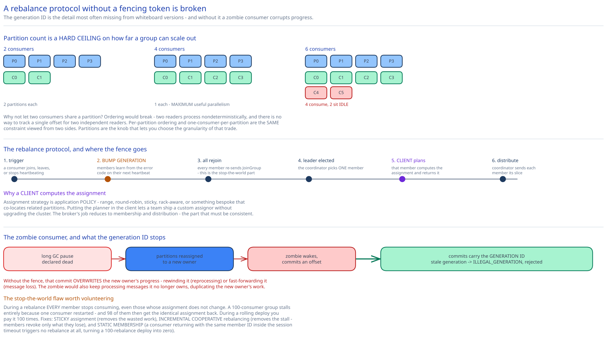

# Module 04 — Consumers, Rebalancing & Delivery Semantics



## Pull, not push

The broker never pushes messages to a consumer. Consumers call `Fetch`. This is the opposite of what most people design first, and the reasons are worth having ready.

| | Push (broker-driven) | Pull (consumer-driven) |
|---|---|---|
| Who sets the rate | The broker | **The consumer** |
| Slow consumer | **Overwhelmed** — broker keeps sending | Falls behind harmlessly; catches up later |
| Heterogeneous consumers | Broker must model each one's capacity | Each fetches what it can handle |
| Batch sizing | Broker guesses | **Consumer asks for exactly `max_bytes`** |
| Replay from an old offset | Needs a separate mechanism | Just fetch from that offset — same call |
| Latency when idle | Lower (immediate) | Higher, unless long-polled |
| Wasted calls when idle | None | Empty responses — fixed by `max_wait_ms` |

The decisive argument is the second row: **the broker cannot know a consumer's processing capacity, and it changes constantly.** A consumer doing database writes per message handles 1,000/sec; one doing an ML inference handles 10/sec; both may subscribe to the same topic, and either may slow down under its own downstream pressure. Under push, the broker either overwhelms the slow one (dropping messages or blocking) or throttles to the slowest, penalising everyone. Under pull, each consumer's rate is self-regulating and **backpressure is automatic** — a slow consumer simply has a growing offset lag, which is a metric rather than an incident.

The two real costs of pull are both fixable. **Empty fetches** when there's nothing new would mean busy-polling, so `Fetch` carries `max_wait_ms`: the broker holds the request open until data arrives or the timeout expires — long polling (cross-ref [Long Polling, WebSockets & SSE](../../scalability-resilience/long-polling-websockets-sse.md)). **Higher idle latency** is the residual cost, bounded by how long the broker holds the request, and it's why a latency-sensitive deployment uses a small `max_wait_ms`.

And pull makes replay fall out for free: reading from two weeks ago is the *same* `Fetch` call with a different offset. Under push you'd need a distinct "replay" mechanism, because the broker's notion of "what to send next" is server-side state.

## Consumer groups

A **consumer group** is a set of consumers cooperating to consume a topic. The rules:

- Each partition is assigned to **exactly one** consumer in the group.
- Each group maintains **its own offsets**, independently of every other group.
- Adding a group costs no storage and no extra writes — it's just another cursor over the same bytes.

That gives both messaging models from [Module 00](./00-overview.md#messaging-models-and-why-this-design-serves-both) with one mechanism: **one group = point-to-point** (work divided among members), **many groups = publish-subscribe** (each group sees everything).

### Why partitions cap consumer parallelism

Since a partition goes to exactly one consumer per group, **a group can never have more useful consumers than the topic has partitions.**

```
Topic with 4 partitions:
   2 consumers → 2 partitions each
   4 consumers → 1 partition each         ← maximum useful parallelism
   6 consumers → 4 consume, 2 IDLE        ← the extra two do nothing at all
```

This is the most consequential operational fact about the system, and it explains why [Module 00](./00-overview.md#capacity-estimation) recommends over-provisioning partitions: partition count sets a **hard ceiling on how far a consumer group can ever scale out**, and raising it later is disruptive (below).

Why not just let two consumers share a partition? Because ordering would break. Two consumers reading one partition concurrently process messages in nondeterministic order, and there's no way to track a single offset for two independent readers. **Ordering within a partition and one-consumer-per-partition are the same constraint viewed from two sides.** You can have unlimited parallelism *or* per-partition ordering; partitions are the knob that lets you choose the granularity at which you trade one for the other.

## The rebalance protocol

A rebalance redistributes partitions among group members. It triggers when a consumer joins, leaves, crashes (heartbeat timeout), or the partition count changes.

```
1. Trigger: consumer B sends JoinGroup, or consumer A's heartbeat times out.

2. The coordinator (the broker at hash(group_id)) marks the group as rebalancing
   and bumps the GENERATION ID.  All existing members learn this from the error
   code on their next heartbeat — the coordinator never has to reach out.

3. Every member re-sends JoinGroup, declaring the topics it wants.

4. The coordinator picks one member as GROUP LEADER — typically the first to rejoin.

5. The group leader (a CLIENT, not the broker) computes the assignment plan
   and sends it to the coordinator in SyncGroup.

6. The coordinator distributes each member's slice in its SyncGroup response.

7. Members begin fetching their new partitions from the committed offsets.
```

**Why a client computes the assignment**, rather than the broker. It looks like a strange inversion, and it's deliberate: assignment strategy is **application policy**, not broker mechanics. Range, round-robin, sticky, rack-aware, or a bespoke strategy that co-locates related partitions on one consumer — these are choices the application should own. Putting the planner in the client means a team can ship a custom assignor without touching or upgrading the cluster. The broker's job reduces to membership and distribution, which is the part that genuinely needs to be consistent.

**Why the generation ID matters.** It's a fencing token (cross-ref [Distributed Locks](../../scalability-resilience/distributed-locks.md)). Consider a consumer that experiences a long GC pause, gets declared dead, has its partitions reassigned, then wakes up and commits an offset:

> Without fencing, that commit would overwrite the *new* owner's progress — rewinding it (causing reprocessing) or fast-forwarding it (causing message loss). The stale consumer might also keep processing messages it no longer owns, duplicating the new owner's work.

Commits and heartbeats carry the generation ID, and the coordinator rejects any from a stale generation with `ILLEGAL_GENERATION`. The zombie consumer is forced to rejoin before it can affect anything. **A rebalance protocol without a fencing token is broken**, and this is the single detail most often missing from whiteboard versions.

### The stop-the-world problem

The protocol above has a serious flaw worth naming: during a rebalance, **every member stops consuming**, even those whose assignments don't change. All members must rejoin before the plan is computed, so the slowest member gates the whole group.

```
100-consumer group, one consumer restarts:
   → all 100 stop consuming
   → all 100 rejoin (bounded by the slowest, or by session.timeout.ms)
   → plan computed and distributed
   → all 100 resume, 98 of them with the exact same partitions they had before
```

With a large group and a conservative session timeout this is seconds of total consumption stall for what should be a change affecting two members. During a rolling deploy of 100 consumers you pay it 100 times.

Two fixes, both real:

- **Sticky assignment** minimizes *partition movement* across generations, so members keep their partitions and don't have to discard prefetched data or reset local state. It doesn't remove the stall, but it removes the wasted work after it.
- **Incremental cooperative rebalancing** removes the stall itself: instead of everyone revoking everything, members revoke only the partitions they're actually losing, in two rounds. Members keep consuming partitions they retain throughout. This is strictly better and is what modern implementations default to.

There's also a cheap operational fix for the common case: **static group membership.** A consumer that restarts with the same configured member ID doesn't trigger a rebalance at all, provided it returns within the session timeout — which turns a rolling deploy from 100 rebalances into zero.

## Delivery semantics

This is where the `Fetch`/`CommitOffset` split from [Module 00](./00-overview.md#api-surface) earns its place: the semantics are determined by **where you commit relative to where you process.**

### At-most-once — commit before processing

```
messages = fetch(offset)
commit(offset + len(messages))      ← commit FIRST
process(messages)                   ← crash here = messages never processed, never retried
```

Messages may be lost, never duplicated. Correct for metrics and sampled telemetry, where a gap is invisible and a double-count is a wrong number.

### At-least-once — commit after processing

```
messages = fetch(offset)
process(messages)
commit(offset + len(messages))      ← commit LAST
                                    ← crash between the two = reprocess on restart
```

Messages may be duplicated, never lost. **This is the right default**, because duplication is a problem you can solve at the consumer with an idempotent handler, whereas loss is not solvable at all. Cross-ref [Idempotency Keys](../../scalability-resilience/idempotency-keys.md).

### Exactly-once: what it actually means

The honest framing first: **exactly-once delivery is impossible.** Any network can lose the acknowledgement of a delivery, so the sender cannot distinguish "message lost" from "ack lost" and must choose between retrying (risking duplication) and not retrying (risking loss). No protocol escapes this.

What *is* achievable is **exactly-once processing** — at-least-once delivery plus deduplication, so the observable *effect* happens once. Three mechanisms, and they solve three different duplication sources:

**1. Idempotent producer** — fixes duplication on the *write* side.

```
Each producer gets a producer_id; each message carries a per-partition sequence number.
The broker tracks the highest sequence seen per (producer_id, partition).
A retried batch arrives with an already-seen sequence → silently discarded, ack returned.
```

Without this, a producer that sends a batch, has the ack lost in flight, and retries writes the batch **twice** to the log. This is cheap (a few bytes per batch, a small in-memory map per broker) and should always be on.

**2. Transactions** — fixes atomicity across *multiple partitions*.

```
producer.beginTransaction()
producer.send(topic_A, msg1)          # different partitions, maybe different topics
producer.send(topic_B, msg2)
producer.sendOffsetsToTransaction(consumed_offsets)   ← the offset commit joins the transaction
producer.commitTransaction()
```

Messages are written to the log immediately but marked uncommitted; a **transaction marker** is appended on commit or abort. Consumers configured `isolation.level=read_committed` skip messages belonging to aborted or in-flight transactions. So a consume-transform-produce pipeline becomes atomic: either the output messages *and* the input offset commit are visible, or neither is.

The critical detail is `sendOffsetsToTransaction` — **the offset commit is part of the transaction.** That's what closes the gap in at-least-once: there is no longer a window where output was written but the input offset wasn't committed.

**3. Idempotent consumers** — fixes duplication on the *effect* side, and it's the one that actually matters most.

Broker transactions only cover effects *inside the log*. The moment a consumer writes to an external system — a database, a payment API, an email provider — the log's transaction cannot include it. So:

```
process(message):
    if db.exists(message.id): return              # dedup on a business key
    db.insert(record, idempotency_key=message.id) # or: rely on a UNIQUE constraint
```

**In practice this is where exactly-once genuinely comes from.** Broker-level exactly-once is a real feature with a real cost (transaction markers, `read_committed` buffering, coordinator overhead — meaningful throughput reduction), and it only covers Kafka-to-Kafka pipelines. For anything touching an external system, an idempotent consumer is both necessary and usually sufficient — at which point at-least-once delivery plus an idempotent handler gets you the same guarantee for less machinery.

The recommendation: **turn on the idempotent producer always** (nearly free, removes a real duplication source), **use transactions for Kafka-to-Kafka stream processing**, and **make consumers idempotent regardless**, because the third one is the only mechanism that covers the external effects that actually matter.

## Changing partition count

**Increasing** is mechanically easy — add partitions, notify producers, trigger a rebalance — and semantically disruptive:

```
Before: 4 partitions.  hash("user-42") % 4 = 2  → all of user-42's messages in partition 2
After:  8 partitions.  hash("user-42") % 8 = 6  → new messages go to partition 6

user-42's history is now split across partitions 2 and 6, consumed by
different consumers, in NO GUARANTEED RELATIVE ORDER.
```

**Per-key ordering is broken for every key**, permanently, across the boundary. For a topic where ordering doesn't matter this is fine. For a CDC stream or an event-sourced aggregate it's a correctness break, and the only safe migration is to create a new topic with the desired partition count and migrate consumers — the same conclusion the [URL shortener](../url-shortener/02-short-code-generation.md#practice-extend-it-yourself) reaches about widening its code space.

**Decreasing** is worse, because a partition's data cannot simply be deleted (it's still within retention and consumers may need it) and cannot be merged (merging two ordered logs produces an arbitrary interleaving). The best available approach is a graceful decommission:

```
1. Producers stop writing to the doomed partition; it keeps serving reads.
2. Consumers continue reading from all partitions, including the doomed one.
3. Once the retention period elapses, its data expires naturally.
4. Only then is the partition removed and consumers rebalanced.
```

That's a **two-week wind-down** at this design's retention setting. Which is the real reason [Module 00](./00-overview.md#capacity-estimation) says to over-provision partitions up front: the number is effectively one-way.

## Practice: extend it yourself

1. **Design a retry topic with backoff.** A consumer hits a message it can't process yet (a downstream service is down). Blocking the partition head stalls everything behind it. Design the retry mechanism: how many retry topics, what delay each represents, how the original offset gets committed so the partition advances, how you preserve per-key ordering for keys that *didn't* fail — and state what ordering guarantee you've had to give up.
2. **Work out what breaks with 10,000 consumers in one group.** Take the rebalance protocol above and find the bottlenecks: coordinator request rate, the group leader computing a 10,000-member plan, `SyncGroup` response fan-out, rebalance duration. Then propose a change to the protocol (not just to configuration) that makes it viable, and say what it costs.
