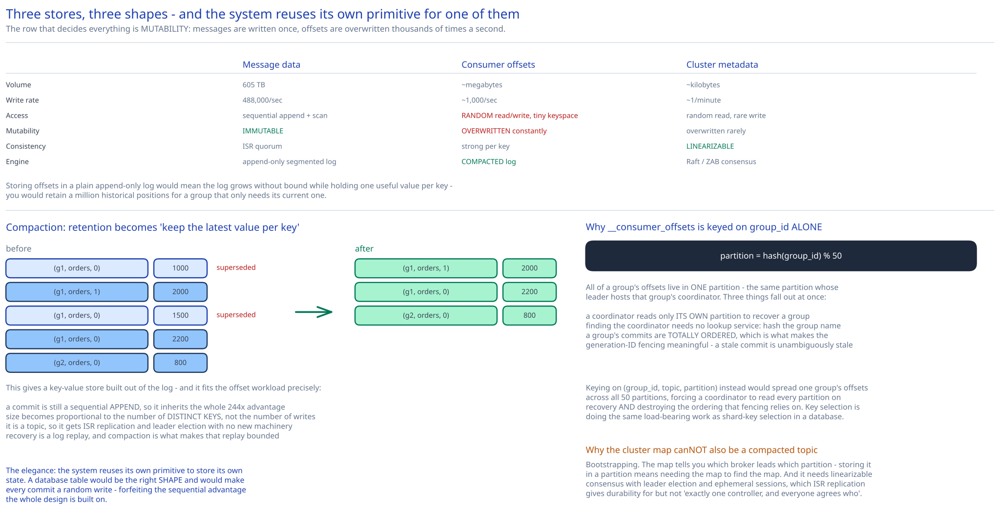

# Module 05 — State & Metadata Storage



This design has **three** stores with genuinely different access patterns, and the interesting result is that only one of them is the log. Recognising that the other two need different engines — and that one of them can nonetheless reuse the log with a twist — is most of the value in this module.

## Three stores, three shapes

| | Message data | Consumer offsets | Cluster metadata |
|---|---|---|---|
| **What** | The messages themselves | Per (group, partition) position | Broker list, partition→replica map, leaders, ISR |
| **Volume** | 605 TB | ~megabytes | ~kilobytes |
| **Write rate** | 488k/sec | ~1k/sec | ~1/minute |
| **Access pattern** | Sequential append, sequential read | **Random read/write of a tiny keyspace** | Random read, very rare write |
| **Mutability** | Immutable | **Overwritten constantly** | Overwritten rarely |
| **Consistency need** | ISR quorum | Strong per key | **Linearizable** |
| **Engine** | Append-only segmented log | **Compacted log** | Raft / ZAB consensus |

The row that decides everything is **mutability**. Message data is written once and never changed, which is what licenses the append-only design in [Module 02](./02-storage-engine.md). Offsets are the exact opposite: a small set of keys overwritten thousands of times per second. Storing them in a plain append-only log would mean the log grows without bound while holding one useful value per key — you'd retain a million historical positions for a group that only needs its current one.

## Consumer offsets: the compacted log

The naive answer is a database table:

```sql
CREATE TABLE consumer_offsets (
    group_id   VARCHAR(255),
    topic      VARCHAR(255),
    partition  INT,
    offset     BIGINT,
    committed_at TIMESTAMP,
    PRIMARY KEY (group_id, topic, partition)
);
```

That's the right *shape*, and it introduces an external database as a dependency of the message queue's hot path — a second system to operate, replicate, back up, and fail over, whose availability now bounds the queue's. Since a broker cluster already provides a replicated, durable, highly-available storage primitive, using something else is a poor trade.

**So offsets are stored in a topic — with log compaction.**

```
Topic: __consumer_offsets, 50 partitions, replication factor 3, cleanup.policy=compact
Key:   (group_id, topic, partition)
Value: (offset, metadata, commit_timestamp)
```

**Log compaction** changes the retention rule from "delete old segments" to "keep the latest value per key":

```
Before compaction (append-only history):
  (grp1, orders, 0) → 1000
  (grp1, orders, 1) → 2000
  (grp1, orders, 0) → 1500      ← same key again
  (grp1, orders, 0) → 2200      ← and again
  (grp2, orders, 0) → 800

After compaction:
  (grp1, orders, 1) → 2000
  (grp1, orders, 0) → 2200      ← only the latest survives
  (grp2, orders, 0) → 800
```

This gives a **key-value store built out of the log**, and it fits the offset workload precisely:

- **Writes are still sequential appends** — a commit is an append, so it inherits the whole 244× sequential-I/O advantage from [Module 02](./02-storage-engine.md#the-measurement-everything-follows-from). A database table would make each commit a random write.
- **Bounded size** — the log's size becomes proportional to the *number of distinct keys*, not the number of writes. Thousands of groups × partitions is megabytes, forever.
- **Free replication and durability** — it's a topic, so it gets ISR replication, `min.insync.replicas`, and leader election with no new machinery ([Module 03](./03-replication-isr.md)).
- **Recovery is a log replay** — a coordinator that takes over a group reads its partition of `__consumer_offsets` from the start and builds an in-memory map. Compaction is what makes that startup bounded rather than a two-week replay.

The elegance is that **the system reuses its own primitive to store its own state.** The mechanism generalises well beyond offsets — a compacted log is the standard way to hold any changelog-shaped state (cross-ref [The Transactional Outbox & CDC](../../hld-building-blocks/transactional-outbox-cdc.md), where a compacted topic is exactly how a CDC stream materialises a table).

### How the partition is chosen, and why it matters

```
partition = hash(group_id) % 50
```

Keying on `group_id` alone means **all of a group's offsets live in one partition** — the same partition whose leader hosts that group's coordinator ([Module 01](./01-architecture-hld.md#monolith-vs-microservices)). Three consequences fall out at once:

- A coordinator reads only *its own* partition to recover a group's state, not all 50.
- Finding the coordinator needs no lookup service: `hash(group_id)` gives the partition, and the cluster map gives its leader.
- A group's commits are ordered with respect to each other, which is what makes the generation-ID fencing from [Module 04](./04-consumers-delivery.md#the-rebalance-protocol) meaningful — two commits for one group are totally ordered, so a stale one is unambiguously identifiable as stale.

Keying on `(group_id, topic, partition)` instead would spread one group's offsets across all 50 partitions, forcing a coordinator to read every partition on recovery and destroying the ordering that fencing relies on. Key selection here is doing the same load-bearing work as shard-key selection in a database.

### Tombstones

Deleting a group's offsets (a group that no longer exists) writes a **tombstone**: the same key with a `null` value. Compaction retains the tombstone for a grace period so every consumer of the compacted topic sees the deletion, then removes both. Same mechanism as [object storage](../object-storage-s3/04-db-design.md#why-a-delete-marker-instead-of-deleting-the-row)'s delete markers, and for the same reason: in an append-only structure, deletion has to be a record.

## Cluster metadata: the consensus store

```
/brokers/ids/{broker_id}          → { host, port, rack, endpoints }        (ephemeral)
/brokers/topics/{topic}           → { partitions: { 0: [1,4,7], 1: [5,2,8] } }
/brokers/topics/{topic}/partitions/{p}/state
                                  → { leader: 1, leader_epoch: 12, isr: [1,4], version }
/controller                       → { broker_id: 3, epoch: 7 }             (ephemeral)
/config/topics/{topic}            → { retention_ms, cleanup_policy, min_insync_replicas }
```

**Why this can't be a compacted topic too**, given how well that worked for offsets. It's a genuine bootstrapping problem: the cluster map tells you which broker leads which partition. Storing it in a partition means you'd need the map to find the map. Beyond the circularity, this data needs **linearizable consensus** with leader election and ephemeral sessions — a topic's ISR replication gives durability but not the "exactly one controller, and everyone agrees who" property.

**What consensus is actually buying**, stated as the failure it prevents: if two brokers could simultaneously believe they lead partition 3, both would accept appends and assign overlapping offsets. The partition's log would fork, and since offsets are the only identity a message has, there'd be no way to reconcile — two different messages at offset 1,500, both acknowledged. That destroys the ordering guarantee the entire system is built on, and unlike lost data it's not detectable after the fact.

So: 3–5 nodes running Raft or ZAB (cross-ref [Replication & Consensus](../../hld-building-blocks/replication-consensus.md), and the [distributed coordination service](../distributed-coordination-service/00-overview.md) case study for how one is built).

**Ephemeral nodes are the failure-detection mechanism.** `/brokers/ids/{id}` exists only while the broker's session is alive; a broker that dies or partitions has its session expire, the node vanishes, and the controller is notified — a **push-based** failure signal rather than the controller polling thousands of brokers.

**The `leader_epoch` is the fencing token.** Every leadership change increments it. Followers and clients reject requests carrying a stale epoch, so a deposed leader that hasn't yet learned it was deposed (a long GC pause, a healed partition) gets `STALE_EPOCH` and steps down. This is the same fencing pattern as the generation ID for consumer groups, and both exist for the same reason: **in a distributed system, "I am the leader" is a claim that expires, and a monotonic epoch is how you make expiry checkable by the recipient.**

### Why the controller is a single broker

One elected broker is the **controller**: it watches broker membership and drives leader election and reassignment. Not a separate service, and not every broker.

Not every broker, because concurrent leader election by multiple brokers would need coordination on every decision — you'd be running consensus per partition failover instead of per controller election.

Not a separate service, because the controller's work is bursty (idle in steady state, busy during a failure) and needs the cluster map it already caches. Electing one from the existing fleet avoids provisioning machines that do nothing most of the time.

The cost is that controller failover is a **cluster-wide event**: the new controller must load full state from the consensus store before it can act, so failover time scales with partition count. At tens of thousands of partitions this becomes minutes, which is the known scaling wall of this architecture and the reason newer designs move metadata into a self-managed Raft log rather than an external service.

## Consistency summary

| Data | Model | Why |
|---|---|---|
| Messages ≤ high watermark | **Committed, immutable** | Replicated to the full ISR; can never disappear or change ([Module 03](./03-replication-isr.md#the-high-watermark)). |
| Messages > high watermark | **Uncommitted, invisible** | May be lost on leader failure, so consumers must not see them. |
| Consumer offsets | **Strong per key**, ISR-replicated | A stale offset read after coordinator failover would reprocess or skip messages. Ordering per group comes free from single-partition keying. |
| Cluster metadata | **Linearizable** | A forked cluster map forks a partition's log irrecoverably. The one place consensus is non-negotiable. |
| Consumer group membership | **Strong within a generation** | Fenced by generation ID; stale-generation operations are rejected outright. |
| Topic configuration | **Eventually consistent** (seconds) | Brokers cache config and refresh on change notification. A retention setting applying a few seconds late is harmless — the one place here where eventual is genuinely fine. |

## Connecting it back

**"500 MB/sec sustained"** (Module 00) → sequential I/O is 244× faster than random, so the store must be an append-only log with batching and zero-copy reads (Module 02) → which requires the broker to never touch message payloads, so compression is end-to-end and the broker is semantically ignorant → surfacing here as the reason **offsets couldn't just be a database table**: a random-write store on the commit path would forfeit the sequential advantage the whole design is built on, so offsets become a *compacted* log instead.

**"Messages retained and repeatedly consumable"** (Module 00) → per-message delivery state is replaced by one integer per group per partition (Module 02) → so consumer groups each hold an independent cursor and partitions cap parallelism (Module 04) → surfacing here as `__consumer_offsets` keyed on `group_id`, which co-locates a group's state with its coordinator and gives commit ordering for free.

**"An acknowledged message is never lost"** (Module 00) → ISR replication with producer-controlled `acks` and a high watermark bounding reads (Module 03) → which requires a single unambiguous leader per partition → surfacing here as the consensus store holding `leader_epoch`, and as the argument for why cluster metadata is the one thing that cannot live in a topic.

## What you'd revisit as this grows

- **Controller failover time scales with partition count.** Loading full metadata from an external consensus service takes minutes at tens of thousands of partitions — a cluster-wide stall for change operations. The modern answer is to move metadata into a self-managed Raft log (an internal, compacted metadata topic that the controller *is* the leader of), removing the external dependency and making failover incremental. That's a substantial redesign this module doesn't take on.
- **`__consumer_offsets` has a fixed 50 partitions.** Chosen by convention, not derived, and it can't be changed after creation without breaking `hash(group_id) % 50` for every existing group — the same one-way-door problem as [topic partition count](./04-consumers-delivery.md#changing-partition-count), applied to the system's own internal state.
- **Compaction lag is unbounded in the worst case.** A group committing very frequently generates a lot of superseded records, and if the compactor falls behind, coordinator recovery has to replay them all. Compaction throughput is therefore a *recovery-time* parameter, and it isn't monitored as one here.
- **No quota or multi-tenancy model.** Nothing stops one producer from consuming all of a broker's disk bandwidth, or one consumer group's replay from evicting everyone's page cache ([Module 01](./01-architecture-hld.md#load-handling)). Per-client byte-rate quotas enforced at the broker are the standard answer and are absent.
- **Topic configuration being eventually consistent has one sharp edge**: a `min.insync.replicas` change that hasn't propagated means a broker briefly enforces the old durability guarantee. Rare and small, but it's a consistency gap on a *safety* setting, which deserves better than the "harmless" label the rest of the config gets.
