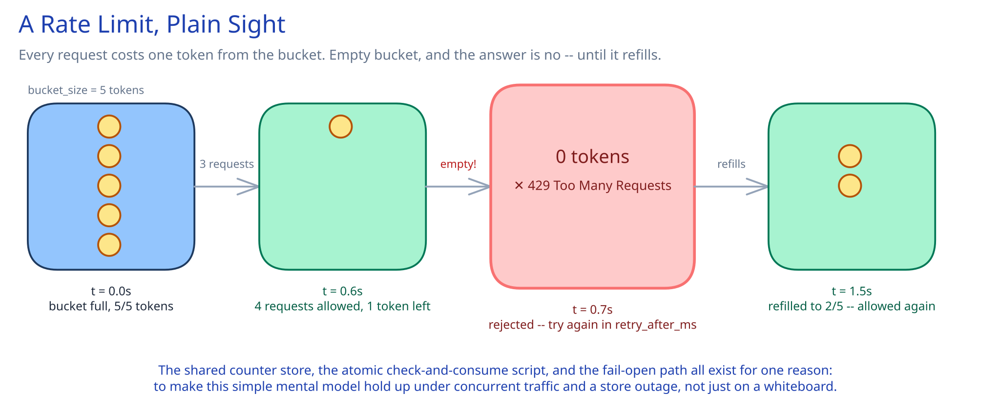

# Module 00 — Overview

## Requirements

**Functional:**
- Rate-limit API requests per client (an API key), with configurable limits per client tier (e.g. free vs. paid).
- Return a clear rejection with retry guidance, not just a bare failure.

**Non-functional** (stated as assumptions, interview-style):
- Serving rate-limit decisions for 500K requests/sec, aggregated across every protected service combined.
- Decision latency budget under 5ms p99 — this sits on every protected request's critical path, so it can't become the slow part.
- The limiter must not become a bigger single point of failure than the services it protects. A rate-limiter outage should degrade gracefully, not take down everything behind it.

## Capacity Estimation

Using this guide's [back-of-envelope method](../../foundations/back-of-envelope-estimation.md):

- **Decisions/sec:** 500K/sec average (given), assume a 1.5x peak factor for this kind of steady API traffic → **~750K/sec peak**.
- **Memory per tracked client:** a token-bucket state is small — a token count and a last-refill timestamp, ~16 bytes of actual data, ~80 bytes once wrapped in a Redis key + hash overhead. At 10M distinct active clients tracked at once: 10M × 80B ≈ **800MB** — comfortably fits in memory across a modest cluster, not a storage problem.
- **Store throughput needed:** a single Redis node comfortably does ~80K–100K simple atomic ops/sec (a Lua script costs a bit more than a plain `GET`/`SET`). At 750K/sec peak, that's **~10 shards** with headroom, not hundreds — this is a latency and availability problem more than a raw-throughput one.

## Approach Walkthrough

Before any boxes: this is a service that sits in front of — or is called by — every other service's request path, and it makes exactly *one* decision per call: allow or reject. It doesn't own the business meaning of what it's protecting; it owns a count and a rule. Everything below exists to make that one decision correctly, in under 5ms, 750,000 times a second, without becoming the reason the rest of the system goes down.

## API Surface

Deployed as an internal service every other service calls (a sidecar or a direct network call both work; assume a direct gRPC call here for concreteness):

- `POST /v1/check` — `{ client_id, cost: 1 }` → `{ allowed: bool, remaining: int, retry_after_ms: int }`. `cost` lets one call count for more than one token (a heavy endpoint can charge more than a light one against the same budget).

That's the whole surface. A second endpoint for "peek at remaining quota without consuming" is a reasonable addition but not required for the core design — resist adding it until a real caller needs it.
