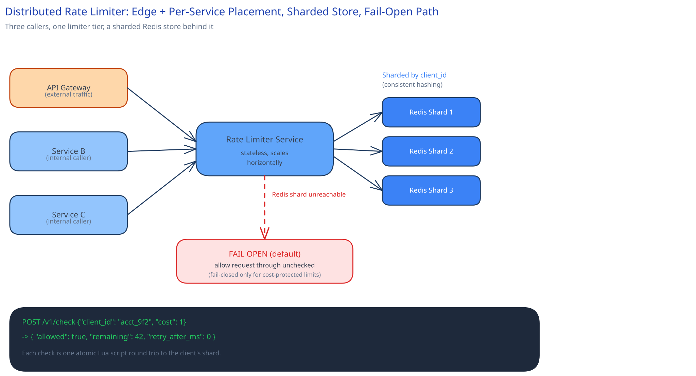

# Module 01 — Architecture & High-Level Design

**Placement — both, not either:** at the [API gateway](../../hld-building-blocks/api-gateway.md) for external-client abuse protection, and per-service internally for one internal caller overwhelming another — exactly the "real systems commonly need both" point [Rate Limiting](../../hld-building-blocks/rate-limiting.md) already makes. This case study is that same limiter, deployed as its own scaled-out service both call into, rather than logic duplicated in each place.

**The shared counter store:** Redis, sharded across nodes by `client_id` via [consistent hashing](../../hld-building-blocks/consistent-hashing.md) — so adding a shard as the client count grows only reshuffles one slice of clients, not all of them. Each shard is itself replicated (cross-ref [Replication & Consensus](../../hld-building-blocks/replication-consensus.md)) so one node dying doesn't erase that shard's counters.

**Avoiding being the bigger SPOF:** what happens if the counter store is unreachable is a deliberate choice, not a default. Fail-open (allow the request through unchecked) protects the availability of everything downstream at the cost of temporarily losing the limit — an AP-leaning choice in [this guide's CAP framing](../../foundations/latency-throughput-cap.md). Fail-closed (reject everything) protects against a flood at the cost of a full outage for every legitimate client too. **Default to fail-open** for most traffic, since an unthrottled few minutes is almost always cheaper than a total outage of the thing being protected — and fail-closed only for the specific limits that exist purely for cost/abuse protection (e.g. a paid third-party API you're billed per-call for), where an unbounded burst has a real dollar cost attached.

**Load Handling.** This service's load isn't its own — it's the *aggregate* of every protected service's combined traffic, which means it has to scale ahead of any single service's growth, not alongside it. The limiter-service tier (stateless, holds no data itself) scales horizontally behind its own load balancer; the Redis shard count scales independently, driven by tracked-client count and ops/sec rather than by request volume alone. A concrete load-test target: sustain 1M decisions/sec for 10 minutes with p99 latency still under 5ms and zero shard exceeding 70% of its provisioned ops/sec.

**Concurrent-User Handling.** The exact race [Rate Limiting](../../hld-building-blocks/rate-limiting.md) names — two requests for the same client arriving at two different limiter-service instances at the same instant — is resolved the same way [the LLD page](../../low-level-design/lld-rate-limiter.md) already specifies: both instances call the same Redis shard's atomic Lua script (a `GET` + refill computation + `SET`, executed as one uninterruptible unit by Redis's single-threaded script execution), so the race is settled *at the store*, not by either calling instance. Whichever script invocation runs first sees the true token count and wins the last token; the second sees the post-decrement state and is correctly rejected — never both.
