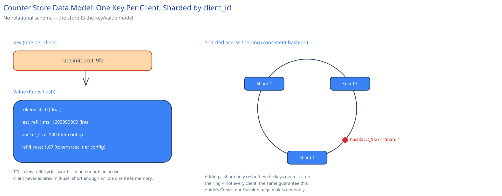

# Module 03 — Database Design & Scaling

There's no relational schema here — the "database" *is* the counter store, and its access pattern is pure high-throughput key-value: read state, compute, write state, no joins, no multi-row queries. That's exactly the query-pattern argument [SQL vs NoSQL](../../database-design/sql-vs-nosql.md) already makes for reaching past a relational store: a relational DB would add transaction overhead and query-planning cost this workload never uses.

**Key:** `ratelimit:{client_id}` — one key per client (not per client-per-window; the token-bucket state is continuous, not bucketed by wall-clock window, which is the entire point of using token bucket over fixed window).
**Value:** a Redis hash — `{ tokens: float, last_refill_ms: int, bucket_size: int, refill_rate: float }`. `bucket_size` and `refill_rate` are looked up from the client's tier config (free/paid) at first write and stored alongside so every subsequent check is a single key read, not a join against a separate config store.
**TTL:** set to a few multiples of the time it'd take an empty bucket to fully refill — long enough that an active client's state never expires mid-use, short enough that a client who stops calling entirely doesn't hold memory forever.

## Indexes

None — worth stating explicitly rather than leaving unaddressed. Every access to this store is a single-key point lookup by `client_id`, known in advance at call time; there is no query pattern here that would ever scan, filter, or join across keys. A traditional secondary index has nothing to serve in this design, which is itself a useful thing to notice out loud in an interview: not every layer in a system needs the same toolkit, and a design that reaches for indexing here anyway would be solving a problem this workload doesn't have.

## Consistency

- **Per-key:** must be strongly consistent — the whole point of routing every check for a given `client_id` to the same Redis shard and executing the read-refill-write as one atomic script is that two concurrent checks for the *same* client can never both see a stale token count. This is a hard requirement, not a tunable trade-off; a rate limiter that occasionally lets a client's count drift wrong in an uncontrolled way isn't enforcing a limit at all.
- **Cross-key:** no consistency guarantee needed or wanted — two different clients' counters have no relationship to each other, so there's nothing to keep consistent across them, and sharding by `client_id` never has to reason about cross-shard coordination.
- **Local-cache staleness:** the one place this design *does* accept looser consistency, and by explicit choice (Module 02) — a cached decision can lag the store's true state by up to the cache TTL (~100ms), bounded and acceptable because a rate limiter is one of the few components in this guide where being briefly wrong in the client's favor is genuinely cheap.

## Scaling

As tracked-client count grows into the millions, [consistent hashing](../../hld-building-blocks/consistent-hashing.md) across more Redis shards is the same lever [Data Partitioning & Sharding](../../hld-building-blocks/data-partitioning-sharding.md) describes generally — here specifically by `client_id`, since every access is single-key and there's no cross-client query that sharding would break. Growth in this system is almost entirely a function of tracked-client count and ops/sec, not data volume — a single client's state is a fixed ~80 bytes regardless of how many requests it makes, which is why Capacity Estimation's back-of-envelope math treats this as a shard-count problem rather than a storage-growth problem the way this guide's higher-volume case studies treat their primary tables.

## Connecting it back

Look at the whole chain together: Module 00's 5ms latency budget is why the store has to be a single-key point lookup with no joins; that same budget, combined with the "aggregate load from every protected service" framing in Module 01, is why the key is sharded by `client_id` rather than kept on one node; and the choice to store `bucket_size`/`refill_rate` alongside the token state — rather than in a separate config table — is what makes a tier change take effect on the very next check instead of requiring a second lookup on every request. Nothing in this data model is arbitrary: every field earns its place against the 5ms budget stated in Module 00.
