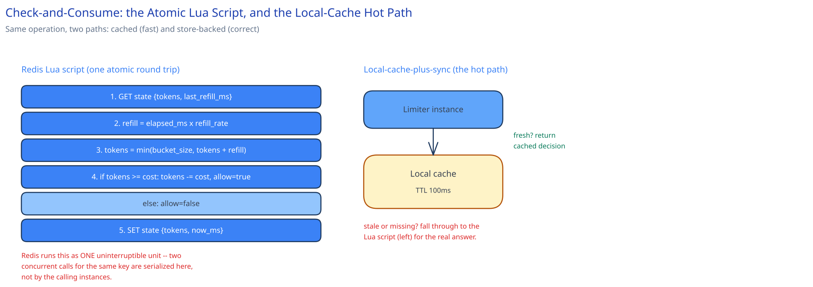

# Design a Distributed Rate Limiter

## Requirements

**Functional:**
- Rate-limit API requests per client (an API key), with configurable limits per client tier (e.g. free vs. paid).
- Return a clear rejection with retry guidance, not just a bare failure.

**Non-functional** (stated as assumptions, interview-style):
- Serving rate-limit decisions for 500K requests/sec, aggregated across every protected service combined.
- Decision latency budget under 5ms p99 — this sits on every protected request's critical path, so it can't become the slow part.
- The limiter must not become a bigger single point of failure than the services it protects. A rate-limiter outage should degrade gracefully, not take down everything behind it.

## Capacity Estimation

Using this guide's [back-of-envelope method](../../foundations/back-of-envelope-estimation.md):

- **Decisions/sec:** 500K/sec average (given), assume a 1.5x peak factor for this kind of steady API traffic → **~750K/sec peak**.
- **Memory per tracked client:** a token-bucket state is small — a token count and a last-refill timestamp, ~16 bytes of actual data, ~80 bytes once wrapped in a Redis key + hash overhead. At 10M distinct active clients tracked at once: 10M × 80B ≈ **800MB** — comfortably fits in memory across a modest cluster, not a storage problem.
- **Store throughput needed:** a single Redis node comfortably does ~80K–100K simple atomic ops/sec (a Lua script costs a bit more than a plain `GET`/`SET`). At 750K/sec peak, that's **~10 shards** with headroom, not hundreds — this is a latency and availability problem more than a raw-throughput one.

## Approach Walkthrough

Before any boxes: this is a service that sits in front of — or is called by — every other service's request path, and it makes exactly *one* decision per call: allow or reject. It doesn't own the business meaning of what it's protecting; it owns a count and a rule. Everything below exists to make that one decision correctly, in under 5ms, 750,000 times a second, without becoming the reason the rest of the system goes down.

## API Surface

Deployed as an internal service every other service calls (a sidecar or a direct network call both work; assume a direct gRPC call here for concreteness):

- `POST /v1/check` — `{ client_id, cost: 1 }` → `{ allowed: bool, remaining: int, retry_after_ms: int }`. `cost` lets one call count for more than one token (a heavy endpoint can charge more than a light one against the same budget).

That's the whole surface. A second endpoint for "peek at remaining quota without consuming" is a reasonable addition but not required for the core design — resist adding it until a real caller needs it.

## High-Level Design


**Placement — both, not either:** at the [API gateway](../../hld-building-blocks/api-gateway.md) for external-client abuse protection, and per-service internally for one internal caller overwhelming another — exactly the "real systems commonly need both" point [Rate Limiting](../../hld-building-blocks/rate-limiting.md) already makes. This case study is that same limiter, deployed as its own scaled-out service both call into, rather than logic duplicated in each place.

**The shared counter store:** Redis, sharded across nodes by `client_id` via [consistent hashing](../../hld-building-blocks/consistent-hashing.md) — so adding a shard as the client count grows only reshuffles one slice of clients, not all of them. Each shard is itself replicated (cross-ref [Replication & Consensus](../../hld-building-blocks/replication-consensus.md)) so one node dying doesn't erase that shard's counters.

**Avoiding being the bigger SPOF:** what happens if the counter store is unreachable is a deliberate choice, not a default. Fail-open (allow the request through unchecked) protects the availability of everything downstream at the cost of temporarily losing the limit — an AP-leaning choice in [this guide's CAP framing](../../foundations/latency-throughput-cap.md). Fail-closed (reject everything) protects against a flood at the cost of a full outage for every legitimate client too. **Default to fail-open** for most traffic, since an unthrottled few minutes is almost always cheaper than a total outage of the thing being protected — and fail-closed only for the specific limits that exist purely for cost/abuse protection (e.g. a paid third-party API you're billed per-call for), where an unbounded burst has a real dollar cost attached.

**Load Handling.** This service's load isn't its own — it's the *aggregate* of every protected service's combined traffic, which means it has to scale ahead of any single service's growth, not alongside it. The limiter-service tier (stateless, holds no data itself) scales horizontally behind its own load balancer; the Redis shard count scales independently, driven by tracked-client count and ops/sec rather than by request volume alone. A concrete load-test target: sustain 1M decisions/sec for 10 minutes with p99 latency still under 5ms and zero shard exceeding 70% of its provisioned ops/sec.

**Concurrent-User Handling.** The exact race [Rate Limiting](../../hld-building-blocks/rate-limiting.md) names — two requests for the same client arriving at two different limiter-service instances at the same instant — is resolved the same way [the LLD page](../../low-level-design/lld-rate-limiter.md) already specifies: both instances call the same Redis shard's atomic Lua script (a `GET` + refill computation + `SET`, executed as one uninterruptible unit by Redis's single-threaded script execution), so the race is settled *at the store*, not by either calling instance. Whichever script invocation runs first sees the true token count and wins the last token; the second sees the post-decrement state and is correctly rejected — never both.

## Low-Level Design



The service wraps the `RateLimiter` / `CounterStore` interfaces [the LLD page](../../low-level-design/lld-rate-limiter.md) already defines — this section is about how the *service* uses them, not a new interface.

```
RateLimiterService.check(client_id, cost):
    localState = LocalCache.get(client_id)
    if localState is not None and localState.freshEnough():
        return localState.decide(cost)          # hot path: no network round trip

    result = CounterStore.checkAndConsume(client_id, cost)   # atomic Lua script in Redis
    LocalCache.set(client_id, result, ttl=100ms)
    return result
```

**The local-cache-plus-sync optimization**, named explicitly as a trade-off: most of this guide's other pages push for correctness over speed by default, but a rate limiter is one of the few components where being *slightly* wrong in the client's favor is genuinely cheap — a client that occasionally gets 101 requests through on a 100-request budget hasn't broken anything downstream can't absorb. Caching the decision locally for ~100ms and only re-checking Redis periodically shaves the network round trip off most requests, at the cost of the limit being enforced against a slightly stale count during that window. This is a deliberate precision-for-speed trade, not an accident — and it's why a rate limiter can hit a sub-5ms p99 even with a shared store in the loop.

## Database Design & Scaling


There's no relational schema here — the "database" *is* the counter store, and its access pattern is pure high-throughput key-value: read state, compute, write state, no joins, no multi-row queries. That's exactly the query-pattern argument [SQL vs NoSQL](../../database-design/sql-vs-nosql.md) already makes for reaching past a relational store: a relational DB would add transaction overhead and query-planning cost this workload never uses.

**Key:** `ratelimit:{client_id}` — one key per client (not per client-per-window; the token-bucket state is continuous, not bucketed by wall-clock window, which is the entire point of using token bucket over fixed window).
**Value:** a Redis hash — `{ tokens: float, last_refill_ms: int, bucket_size: int, refill_rate: float }`. `bucket_size` and `refill_rate` are looked up from the client's tier config (free/paid) at first write and stored alongside so every subsequent check is a single key read, not a join against a separate config store.
**TTL:** set to a few multiples of the time it'd take an empty bucket to fully refill — long enough that an active client's state never expires mid-use, short enough that a client who stops calling entirely doesn't hold memory forever.

**Scaling:** as tracked-client count grows into the millions, [consistent hashing](../../hld-building-blocks/consistent-hashing.md) across more Redis shards is the same lever [Data Partitioning & Sharding](../../hld-building-blocks/data-partitioning-sharding.md) describes generally — here specifically by `client_id`, since every access is single-key and there's no cross-client query that sharding would break.

## Interviewer Q&A

**What happens when two requests for the same client hit the same resource at the same instant?**
Both calls resolve to the same Redis shard and the same key; Redis's single-threaded script execution makes the Lua check-and-consume atomic, so the two requests are serialized *at the store* regardless of which limiter-service instance received them — one sees the token available, the other sees it already spent. No lock, distributed or otherwise, is needed on the calling side.

**What happens when traffic spikes 10x for an hour?**
The limiter-service tier is stateless and scales out immediately behind its load balancer. The real question is whether the Redis shards can absorb 10x the ops/sec — they're provisioned with headroom (the load-test target above), and if a shard still saturates, the local-cache-plus-sync layer absorbs more of the read traffic by extending its TTL slightly, trading a bit more staleness for taking load off Redis exactly when it's most needed.

**Why is the rate limiter's own availability treated as a bigger design concern than a normal service's?**
Because unlike most services, this one sits in the critical path of *every other service*, so its failure mode doesn't just take down one feature — a naive fail-closed default would turn a Redis blip into a full-platform outage. That's why the fail-open default above is a deliberate, load-bearing decision, not an afterthought.

**Could you avoid the shared store entirely and rate-limit per-instance instead?**
Only by accepting a limit that's actually `N × intended_limit` for N instances, since each instance would see only its own slice of a client's traffic — this is exactly [the distributed rate limiter problem](../../hld-building-blocks/rate-limiting.md#the-distributed-rate-limiter-problem) the concept page names, and it's why a shared store is unavoidable once there's more than one instance.

**How would you handle a "noisy neighbor" client whose traffic pattern is so bursty it keeps forcing cache invalidation for everyone else?**
It wouldn't — the local cache and Redis key are both scoped per `client_id`, so one client's bursty pattern only churns *its own* cache entry and Redis key; there's no shared state between different clients' rate limits to invalidate.

**Would you rate-limit by client tier config changes taking effect immediately, or only for new buckets?**
A tier upgrade (free → paid) should take effect on the next read of that client's config, not require the bucket to fully drain first — store `bucket_size`/`refill_rate` alongside the token state (as in the schema above) so a config change is just an overwrite of those two fields, applied on the very next check.

**What's the actual cost of the local-cache-plus-sync optimization going wrong — could a client abuse the 100ms staleness window?**
A client could in principle time requests to land inside the stale window and get slightly more throughput than its exact budget — but the ceiling on that abuse is bounded by the cache TTL (100ms of extra budget, not unbounded), which is why the TTL is chosen deliberately short: enough to cut most round trips, not enough to meaningfully widen the limit.

**Would you ever return `allowed: true` with a warning instead of `false`, rather than a hard reject?**
Only for internal, trusted callers under the fail-open default already described — the response shape (`allowed`, `remaining`, `retry_after_ms`) already gives a caller everything it needs to self-throttle proactively before ever being hard-rejected, which is the softer signal a well-behaved internal client should be watching for.
