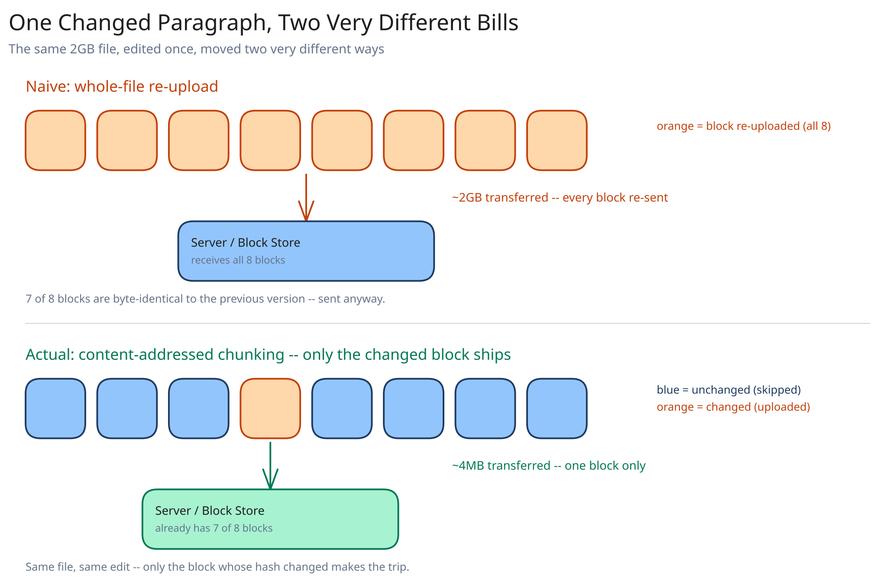

# Module 00 — Overview

## The feature, with no infrastructure in it yet

A user edits one paragraph in a 2GB video-editing project file, saved locally by their editing tool. Somewhere between that save and the copy sitting in the user's other three devices, the system has to notice that ~4MB actually changed out of 2GB and move only that — not because bandwidth is free and re-uploading 2GB "would still work eventually," but because it wouldn't: at 500M users with multi-GB libraries, re-transferring whole files on every edit multiplies this system's total data movement by orders of magnitude for no reason. **The one hard constraint that makes this an interesting design problem: detect the smallest correct unit of change, and move only that unit — across an arbitrary number of a user's own devices, and without a central authority ever reading the file's actual content to figure out what changed.**

That last clause matters as much as the first. The client is the only party that ever has both the old and new versions of a file open at once — the server only ever sees whichever blocks get uploaded to it. So the diffing decision has to happen client-side, and the server's whole job is to be a dumb, content-addressed, deduplicating store that a diffing client can talk to.

## Requirements

**Functional:**
- Upload and download files and folders; preserve a folder hierarchy, not just flat file storage.
- Automatically sync a change across every device signed into the same account.
- Share a file or folder with another user, read-only or read-write.
- Retain version history and allow reverting to a prior version.
- Reconcile edits made on two devices while one was offline.

**Non-functional** (stated as assumptions, interview-style):
- 500M users, ~10GB average stored library per user → **5EB** of logical file data before any dedup.
- Sync latency for a small edit (a few changed blocks): under a few seconds from save to "visible on the other device," not the tens of minutes a nightly-batch design would produce.
- File sizes span from a few KB (a text file) to tens of GB (a video project) — the design can't assume "small enough to diff naively."
- Block-level deduplication is expected to meaningfully reduce stored bytes, not just theoretically possible — see Capacity Estimation.

## Capacity Estimation

Using this guide's [back-of-envelope method](../../foundations/back-of-envelope-estimation.md):

- **Total logical storage:** 500M users × 10GB = 5EB. Real-world dedup (shared installers, common libraries, identical email attachments re-saved by multiple users) typically recovers 20-30% of that — call it **~3.5-4EB physically stored**, the gap being *why* content-addressable blocks matter at this scale even before considering sync efficiency.
- **Blocks, assuming a ~4MB average block size:** 5EB / 4MB ≈ **1.25 trillion block references**, though far fewer *distinct* blocks once dedup collapses identical content across users.
- **Sync events:** assume each active user saves an edit ~10 times/day on average → 5B edit-events/day ≈ **~58,000/sec average**, each touching a small number of blocks (usually 1-3, since most saves change a small region of a file), not the whole file.
- **Metadata QPS:** every block upload and every folder listing hits the metadata service — call it 5-10x the edit-event rate for listings, polling, and version lookups → **~300,000-600,000 metadata ops/sec** at peak, which is squarely why this tier is architected separately from block storage (see Architecture & HLD).

## Approach Walkthrough

Before any boxes: every file is split into content-hash-addressed blocks (target ~4MB each), and a file's identity at any point in time is just an ordered list of block hashes — its **manifest**. Each client keeps a local manifest for every file it's synced. When a file changes, the client re-chunks only the portion around the edit, compares the new block hashes against its last-known manifest, and uploads only the blocks whose hash isn't already known to the server — then commits a new manifest (the new ordered hash list) as the file's next version. Every other device polls or gets pushed a "new version available" notification, diffs the new manifest against its own last-synced one, and downloads only the blocks it's missing.

Notice what this buys for free: **deduplication isn't a separate feature — it's a side effect of content-hash addressing.** If two users, or two versions of the same file, happen to contain an identical 4MB region, its hash is identical, so the block is already present and never re-uploaded. The manifest — not the file's bytes — is the unit the system treats as the source of truth for "what does this file currently look like."

## API Surface

- `POST /files/{path}/versions {based_on_version, manifest: [block_hash, ...]}` → `{version_id, missing_blocks: [hash, ...]}` — client commits a new manifest; server replies with exactly which referenced blocks it doesn't already have, so the client only uploads those.
- `PUT /blocks/{hash}` (body: raw block bytes, usually via a presigned direct-to-object-storage URL — cross-ref [Object/Blob Storage](../../scalability-resilience/object-blob-storage.md)) → `204`, or `409` if the uploaded bytes don't actually hash to `{hash}`.
- `GET /files/{path}/changes?since_cursor={cursor}` → the sync poll/long-poll endpoint: manifests changed since the client's last-seen cursor, for every file the client has access to.
- `GET /blocks/{hash}` → raw block bytes, for any block a client's local manifest is missing.
- `POST /shares {path, target_user_id, permission}` → grants access; propagates into the target user's own `changes` feed.
