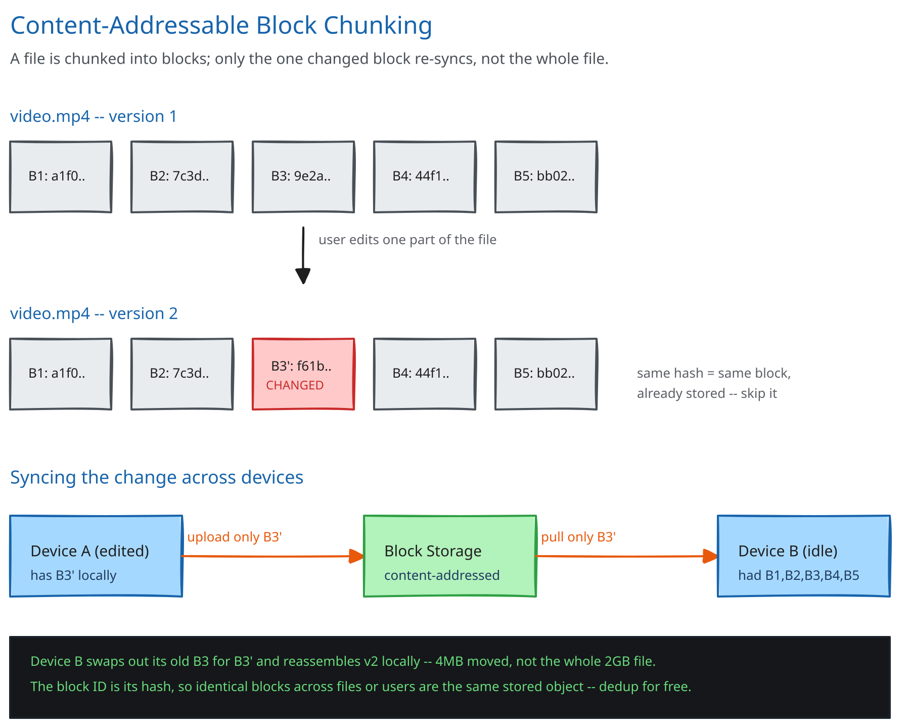

# Module 01 — Architecture & High-Level Design

## Monolith vs. microservices

Three tiers are pulled apart, each for a different concrete reason — not as a default "microservices are best practice" choice:

- **Metadata service** (folder tree, file versions, manifests, shares) is small, hot, relational-shaped data hit hundreds of thousands of times per second (Module 00's estimate). It needs the query patterns and transactional guarantees a relational store gives cheaply — a version commit and a folder-tree update in one file's path should be consistent together.
- **Block store** is enormous, cold, immutable-once-written blob data (cross-ref [Object/Blob Storage](../../scalability-resilience/object-blob-storage.md)). It has nothing in common operationally with the metadata tier — no relational queries, no transactions, just content-addressed key-value storage at petabyte scale — and scaling it (more storage nodes) has nothing to do with scaling metadata (more query capacity).
- **Sync/notification service** holds long-lived, stateful connections (one per online device) and has to fan out "new version" events to potentially many devices per account. That's a fundamentally different capacity model — connection count, not query throughput — from either of the other two tiers.

Folding all three into one service would mean scaling them together even though their bottlenecks are unrelated: a metadata query spike would compete for the same process capacity as an unrelated storage-node rebalance, and a burst of client reconnects (a laptop waking from sleep) would compete with both.

## Building Blocks

| Block | Role |
|---|---|
| Metadata service | Folder tree, file identity, version pointers, manifests (ordered block-hash lists), share/permission records |
| Block store | Content-hash-addressed object storage for raw block bytes; write-once, referenced-counted, never mutated in place |
| Chunking/diff engine (client-side) | Splits a changed file into blocks, compares against the last-known manifest, decides which blocks actually need uploading |
| Sync/notification service | Tracks which devices are online (cross-ref [Long Polling, WebSockets & SSE](../../scalability-resilience/long-polling-websockets-sse.md)); pushes or serves "manifest changed" events per file |
| Version history store | Append-only record of every committed manifest per file, separate from the "current" pointer |
| Share/permission service | Grants and permission checks for folders/files shared across accounts |

## Per-path walkthrough

**Upload/edit path (write)** — `Client (detects local file changed) → Chunking engine (re-chunk changed region, hash new blocks) → Metadata Service (POST new manifest, based_on_version=X) → Metadata Service replies missing_blocks → Client (PUT only those blocks to Block Store, via presigned URL) → Metadata Service (commit new version once all blocks confirmed present) → Sync Service (notify other devices on this account)`.

**Download/sync path (read)** — `Other device (long-poll GET /changes?since_cursor) → Sync Service (blocks until a change exists, or returns immediately if one is queued) → Client (diffs new manifest against its own last-synced manifest) → Client (GET only the blocks it's missing from Block Store) → Client (reassembles file locally)`.

**Share path** — `Owner (POST /shares) → Share Service (permission record written) → target account's Metadata Service view (the shared file/folder now appears in their tree) → Sync Service (pushes a "new item" event to the target's online devices)`.

## Trade-offs to make explicit

| Decision | Chosen | Alternative | Why |
|---|---|---|---|
| Chunking method | Content-defined chunking (rolling hash finds block boundaries based on content, e.g. Rabin fingerprinting) | Fixed-offset chunking (every 4MB, regardless of content) | Inserting a single byte near the start of a file shifts every subsequent fixed-offset boundary, turning a 1-byte edit into a whole-file re-diff; content-defined boundaries "re-sync" after the inserted byte and only the block actually containing it changes |
| Dedup granularity | Block-level (content-hash per ~4MB chunk) | Whole-file-level (hash the entire file) | Whole-file hashing only dedups byte-identical files; block-level dedup also catches the far more common case of two *versions* of the same file, or two files sharing large common regions |
| Sync delivery | Push notification when online, fallback to long-poll | Client polls on a fixed interval (e.g. every 30s) | Fixed polling either wastes requests when nothing changed or adds up to the full interval's latency when something did; push gets close to the few-seconds target from Module 00 without either cost |
| Conflict handling | Optimistic concurrency on the manifest pointer (`based_on_version` check) + conflicted-copy on mismatch | Operational Transform / CRDT merge, like [Google Docs](../google-docs-collab-editing/01-architecture-hld.md) | OT/CRDT needs structural knowledge of the *content* (text, characters) to merge concurrent edits automatically; this system is content-agnostic by design (a video file, a zip, a binary) — it has no way to "merge" two binary versions, so it surfaces the conflict instead of guessing |
| Direct-to-storage upload | Client uploads blocks straight to the block store via a presigned URL | All bytes routed through the metadata service | Routing multi-GB of block traffic through the same tier that serves 300K+ metadata QPS would make metadata capacity planning depend on how much data users happen to be uploading that hour — presigned URLs let the two scale independently |

## Load Handling

- **Peak-vs-average tolerance:** the real spike isn't steady edit traffic (58K/sec average from Module 00) — it's a **reconnect burst**: a laptop waking from sleep, or a mobile client regaining connectivity after a flight, triggers a full manifest diff against everything that changed while it was offline. Thousands of devices reconnecting in the same few minutes (a Monday-morning pattern) is the load this design actually has to survive.
- **Where backpressure kicks in first:** at the sync/notification service's fan-out — a reconnecting client's `/changes` request is served from the version-history store with a bounded page size, never "every change since last month" in one response; large gaps page through multiple bounded responses instead of one unbounded one.
- **What gets shed under overload:** nothing is dropped — a device that can't get a timely push notification simply falls back to polling at a wider interval, trading immediacy for the sync service's stability under fan-out load; the change itself is never lost, since it's durably recorded in the version history regardless of when a given device asks for it.
- **Autoscaling lag:** the block store scales by adding storage nodes on the same horizon as any object store; the metadata service, being the query-hot tier, is the one that needs the fastest autoscaling response (1-3 minutes) since it's what a reconnect burst hits first.
- **Load-test target:** simulate 100,000 devices reconnecting within a 5-minute window after a multi-hour outage, each with an average of 20 pending manifest changes, and confirm p99 time-to-fully-synced stays under 60 seconds with zero dropped change events.

## Concurrent-User Handling

| Race | Mechanism | What the "loser" sees |
|---|---|---|
| Same file edited on two devices while one was offline, both reconnect and commit a new version | Optimistic concurrency: `POST /files/{path}/versions` includes `based_on_version`; the metadata service only commits if that still matches the file's current version, same as a compare-and-swap | The second committer's `based_on_version` no longer matches (the first commit already moved it) — the server rejects the commit and the client creates a **conflicted copy** (`file (conflicted copy from Device B).ext`) rather than silently overwriting |
| Two devices upload the exact same block content (e.g. both re-derive an identical unchanged region) at the same time | The block store keys by content hash — `PUT /blocks/{hash}` from either device lands on the same key; whichever write completes first "wins" and the second is a no-op against an already-present key | Both devices see success — there's no real loser, since the block's content is identical either way; this is the one race in the whole system where two winners is the correct outcome, not a bug |
| Two users with write access to a shared folder both add a new file with the same name at the same time | The metadata service's folder-tree write for a given path is a single row update, so the second write is rejected on a uniqueness constraint the same way a normal filesystem rejects two processes creating the same path | The losing writer's client sees a name-conflict error and appends a disambiguating suffix, the same UX as any local filesystem handling the identical race |

## Scaling & Reliability

- **Horizontal scaling:** the block store shards naturally by hash prefix (cross-ref [Consistent Hashing](../../hld-building-blocks/consistent-hashing.md)) — content-hash keys are already uniformly distributed, so no hot-key rebalancing work is needed the way a user-ID-sharded store would require.
- **Circuit breaker:** block uploads to the object store are wrapped in a circuit breaker (cross-ref [Circuit Breakers & Retries](../../scalability-resilience/circuit-breakers-retries.md)); if the block store is degraded, the metadata service still accepts and durably queues the manifest commit, but withholds "fully synced" status until the blocks actually land.
- **Retries:** a client retries an individual block upload independently — never the whole file — since each `PUT /blocks/{hash}` is a self-contained, idempotent operation keyed by content hash.
- **Dead-letter queue:** a sync-notification event that repeatedly fails to deliver to a specific device (a client bug, a malformed payload) is parked rather than blocking that account's queue for every other device.
- **Graceful degradation:** if the sync/notification service is down, clients fall back to slow polling — files stop syncing promptly but nothing is lost, since every committed version already lives durably in the metadata service regardless of whether anyone's been told about it yet.
- **Multi-region:** not built here — named as a real gap below.

## What you'd revisit as this grows

- **Multi-region active-active** — right now this design assumes one region owns a given account's metadata; a genuinely global product needs a story for a user traveling between regions without their sync latency ballooning.
- **Garbage-collecting orphaned blocks** — deleting a file (or a version) should decrement a block's reference count, but this module doesn't design the reaper that actually reclaims a block once its refcount hits zero, only asserts the count exists (see Database Design).
- **Bandwidth-aware chunking for mobile** — this design's ~4MB block size is tuned for desktop-class bandwidth; a real system would consider smaller blocks on metered mobile connections to avoid wasting a retry on a large block that partially failed.
- **Selective sync / partial folder trees** — this module assumes every device syncs a user's whole tree; letting a device opt out of specific folders (a common real feature) changes what the sync service has to track per device-file pair.
