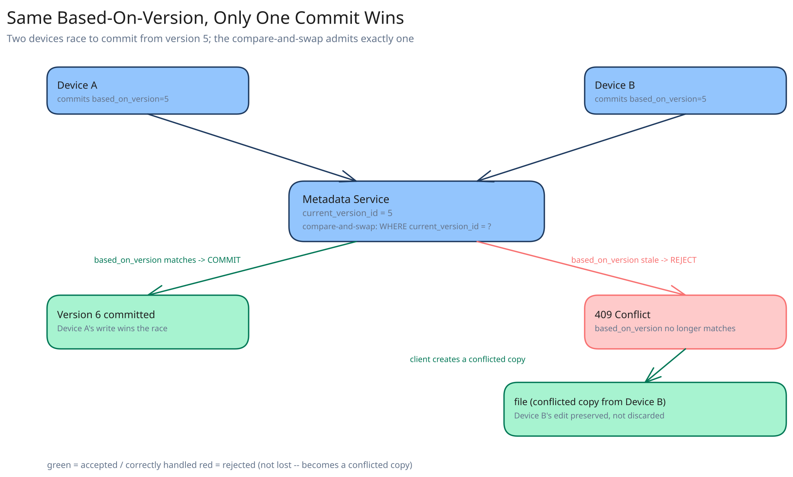

# Module 02 — Low-Level Design



## Interfaces vs. implementations

- **`ChunkingStrategy`** *(interface)* → **`ContentDefinedChunker`** — `chunk(fileBytes) -> [Block(hash, offset, length), ...]`, using a rolling hash to pick content-dependent boundaries rather than fixed offsets.
- **`BlockStore`** *(interface)* → **`ObjectStoreBlockStore`** — `has(hash)`, `put(hash, bytes)`, `get(hash)`, `presignedUploadUrl(hash)`.
- **`ManifestRepository`** *(interface)* → **`SqlManifestRepository`** — `getCurrentVersion(fileId)`, `commitVersion(fileId, basedOnVersion, manifest)` (the compare-and-swap), `getVersionHistory(fileId, sinceCursor)`.
- **`ConflictResolver`** — invoked by the client when `commitVersion` is rejected; produces a conflicted-copy path and re-commits the rejected manifest under the new name rather than discarding it.

## Client sync loop

Pseudocode (runs on each device):
```
onLocalFileChanged(path, newBytes):
    lastManifest = localManifestCache.get(path)
    newBlocks = chunkingStrategy.chunk(newBytes)          # content-defined boundaries
    newManifest = [b.hash for b in newBlocks]

    if newManifest == lastManifest.blockHashes:
        return   # re-chunked to the identical manifest; nothing actually changed

    result = manifestRepo.commitVersion(
        fileId, basedOnVersion=lastManifest.versionId, manifest=newManifest)

    if result.rejected:                                   # someone else committed first
        conflictResolver.handle(path, newBytes, result.currentVersion)
        return

    for hash in result.missingBlocks:                      # server already told us which are new
        block = findBlock(newBlocks, hash)
        blockStore.put(hash, block.bytes)                  # direct to object storage

    localManifestCache.set(path, newManifest, result.versionId)
```
Notice that the server — not the client — decides `missingBlocks`. The client doesn't need to know the global state of every block that's ever been uploaded by any user; it just proposes a manifest and uploads whatever the server says it's missing, which is also what makes cross-user dedup work without the client knowing dedup is even happening.

## Error cases worth designing for deliberately

- **A block upload succeeds but the client crashes before calling `commitVersion`.** No harm — the block sits in the store, unreferenced, until either the client retries the commit on restart or the block is eventually garbage-collected as orphaned (Database Design). The manifest commit, not the block upload, is the operation that makes a version "real."
- **`commitVersion` is rejected because of a genuine conflict, not a transient network retry.** The client must be able to tell these apart — a genuine conflict has a *different* `currentVersion` than what the client already knew about; a client retrying its own timed-out request sees its own prior commit already succeeded and should treat that as success, not a conflict.
- **A block's uploaded bytes don't hash to the key the client claimed.** `PUT /blocks/{hash}` recomputes the hash server-side before accepting — a mismatch is rejected outright, since accepting it would silently corrupt every other file that later references `{hash}` expecting a specific byte sequence.

## Concurrency at the code level

`ManifestRepository.commitVersion()` needs no in-process lock — the compare-and-swap (`WHERE current_version = basedOnVersion`) is enforced by the database itself, the same discipline this guide applies wherever two writers might race for the same row (cross-ref the [distributed job scheduler](../distributed-job-scheduler/02-lld.md)'s identical use of a conditional `UPDATE` for its own claim race). No distributed lock is needed because the row's current state, checked atomically as part of the write, is exactly what "who won" needs to depend on.

`BlockStore.put()` is naturally idempotent and needs no locking at all: two devices writing the identical content to the identical hash-derived key is not a race that needs resolving — both writes produce the same bytes at the same key, so whichever lands "second" is a harmless no-op, not a conflict.

## Design patterns you just used, named

- **Repository pattern** — `ManifestRepository` and `BlockStore` hide their storage engines behind method calls; nothing above them issues SQL or talks to the object store's API directly.
- **Strategy pattern** — `ChunkingStrategy` is swappable (content-defined today, could be fixed-size for a specific file type) without the sync loop knowing which one is in use.
- **Optimistic concurrency control** — `commitVersion`'s `basedOnVersion` check, named explicitly since it's the load-bearing mechanism the entire conflict story depends on.
- **Content-addressable storage** — `BlockStore` keyed by hash rather than by an assigned ID is what makes both dedup and idempotent writes fall out for free, rather than needing to be built as separate features.

## Practice: extend it yourself

Before moving to Database Design, sketch (pseudocode is fine) how you'd add:

1. **Selective sync** — a device wants to sync only `/Projects/2026` instead of the user's whole tree. Which part of the client sync loop changes, and does the server need to know a device's selection, or can the client just ignore changes outside its chosen scope after receiving them?
2. **Resuming an interrupted upload of a single large block** (a 4MB block, but the device is on an unstable connection and the upload keeps failing partway). Does `BlockStore.put()` need to become resumable/chunked itself, and if so, does that change what "content-hash-addressed" means for a block that's only partially uploaded?

Neither has one clean answer — the point is noticing which interface (`ChunkingStrategy`, `BlockStore`, or the sync loop's own orchestration) is the natural home for each piece of new behavior.
