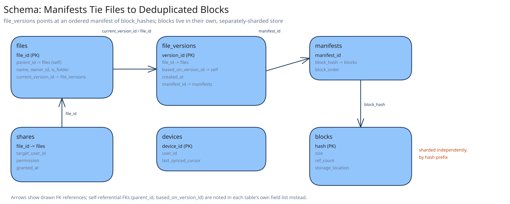

# Module 03 — Database Design & Scaling

## From entities to schema

- **Files/folders:** `(file_id, parent_id, name, owner_id, is_folder, current_version_id)` — a tree via `parent_id`, with `current_version_id` pointing at the row in `file_versions` that represents "what this file looks like right now."
- **File versions:** `(version_id, file_id, based_on_version_id, created_at, manifest_id)` — append-only, one row per committed version; `based_on_version_id` is exactly the value the optimistic-concurrency check in Module 02 compares against.
- **Manifests:** `(manifest_id, block_hash, block_order)` — one row per block per version, ordered, so a file's byte content is `SELECT block_hash FROM manifests WHERE manifest_id = ? ORDER BY block_order`.
- **Blocks:** `(hash, size, ref_count, storage_location)` — the deduplicated store; `hash` is the primary key, and no two rows ever hold identical content by construction.
- **Shares:** `(file_id, target_user_id, permission, granted_at)`.
- **Devices:** `(device_id, user_id, last_synced_cursor)` — tracks each device's sync progress independently, so `/changes?since_cursor` (Module 01) is a per-device query, not a per-account one.

## Why `ref_count` on blocks, not a separate reference table

A block can be referenced by an arbitrary number of manifests across an arbitrary number of users (that's the entire point of dedup). Tracking a full reverse index of "which manifests reference this block" would mean every delete has to touch a potentially unbounded set of rows across every referencing file. A simple counter, incremented on manifest creation and decremented on manifest/version deletion, answers the only question garbage collection actually needs — "is anyone still using this block?" — in O(1), at the cost of not being able to enumerate *who* references a block without a separate audit query, which this design doesn't need on the hot path.

## Why versions are append-only, never mutated

`file_versions` never updates a row in place — a new version is always a new row, and `current_version_id` on the parent file is what moves. This is the same reasoning this guide's [payments case study](../payments-system/03-db-design.md) applies to its ledger: an append-only history means "what did this file look like last Tuesday" is always answerable, without needing a separate audit log bolted on afterward — the version history *is* the audit log.

## Why the folder tree is `parent_id`, not a materialized path

A materialized path (storing the full `/a/b/c` string per row) makes "list this folder's children" a cheap indexed prefix query, but makes a folder *rename* or *move* an update to every descendant's stored path — potentially millions of rows for a deeply nested shared folder. `parent_id` makes a move a single-row update (only that folder's own `parent_id` changes) at the cost of "list all descendants recursively" needing a recursive query instead of a prefix scan — the right trade for a system where moves are common and deep recursive listing is rare.

## Indexes

- `files(parent_id)` — the folder-listing query ("what's in this directory") this system runs constantly.
- `file_versions(file_id, created_at DESC)` — "this file's version history, newest first," and the source of the `based_on_version_id` check.
- `manifests(manifest_id, block_order)` — reconstructing a version's ordered block list, exactly as read at download time.
- `blocks(hash)` — primary key, and the single most frequently hit lookup in the whole schema (every upload checks it before transferring any bytes).
- `devices(user_id, device_id)` — a device's own sync cursor lookup on every `/changes` poll.

## Consistency

- **Files/file_versions:** must be strongly consistent — the `current_version_id` pointer and the compare-and-swap check on `based_on_version_id` are exactly the mechanism Module 02's conflict handling depends on; a stale read here would let two conflicting commits both believe they're building on the current version.
- **Blocks:** the `ref_count` needs strong consistency for correctness (an undercounted ref risks deleting a block still in use; an overcounted one merely delays garbage collection, which is the safer direction to err in) — but the block's own content, once written, never changes, so *reads* of block bytes can be served from any replica or CDN edge without any consistency concern at all.
- **Shares:** eventual consistency is acceptable — a share taking a second or two to propagate to the target user's folder listing is a minor UX delay, not a correctness issue, since no one is racing to read a share the instant it's granted.
- **Devices' sync cursors:** effectively single-writer (only that device advances its own cursor), so there's no cross-device race to resolve here at all.

## Scaling the schema

- **Blocks shard by hash prefix** — content hashes are already uniformly distributed, so sharding by the first N bits of the hash spreads load evenly with no hot-key rebalancing, unlike sharding by an assigned sequential ID would require (cross-ref [Data Partitioning & Sharding](../../hld-building-blocks/data-partitioning-sharding.md)).
- **Files/versions/manifests shard by owner's account ID** — nearly every query in this system ("my folder tree," "this file's history") is scoped to one account, so co-locating an account's own metadata avoids cross-shard joins for the common case; a shared folder's cross-account access becomes the one query pattern that legitimately crosses shards, and is rare enough to accept the extra hop.
- **Read replicas vs. sharding**, kept distinct: read replicas add capacity for the *same* data (useful for the folder-listing read load); sharding by account ID is what lets total account count grow past what any single database's write capacity could hold, regardless of replica count.

## Connecting it back

Trace the requirement through: Module 00's "move only the changed block, not the whole file" constraint is why `manifests` exists as its own table rather than files storing a single blob reference — a file's identity is genuinely an ordered *list* of blocks, not one opaque object. That same requirement is why `blocks` is deduplicated by content hash rather than assigned an arbitrary ID — the hash *is* the dedup mechanism, not a separate feature bolted onto storage. And the append-only shape of `file_versions`, together with the compare-and-swap on `based_on_version_id`, is exactly what lets Module 01's conflicted-copy handling detect a genuine concurrent edit without any distributed lock — the database's own atomicity on that one row is the entire mechanism.
