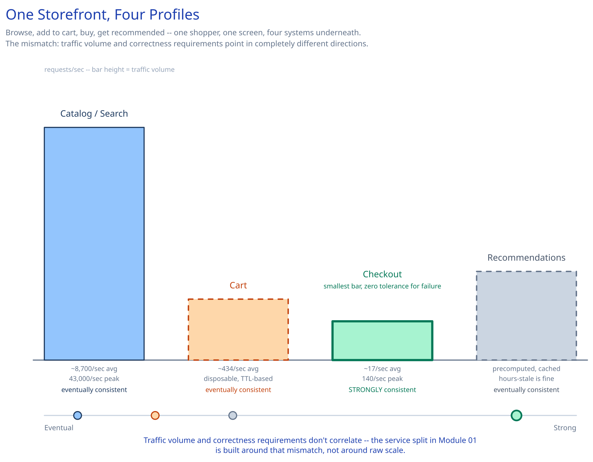

# Module 00 — Overview

## The feature, with no infrastructure in it yet

A shopper browses a catalog, adds a few things to a cart, checks out, and later checks where the package is. Four verbs — browse, add, buy, track — and each one has a completely different tolerance for being wrong. Browsing a stale price for a few seconds is invisible. A cart that forgets an item costs a re-click. An order that's silently dropped or charged twice is a lost customer and a support ticket. **The hard problem in this case study isn't any single one of those four verbs — it's that a real e-commerce platform has to serve all four at once, at wildly different volumes, without letting the easy ones and the hard one share a fate.**

That's a different shape of problem than most single-purpose case studies in this guide. The transactional core — the schema, the inventory-decrement race, the frozen order total — is already worked through in full in [`ecommerce-schema-worked-example.md`](../../database-design/ecommerce-schema-worked-example.md), and this case study doesn't re-derive any of it. This case study is about the **service decomposition around that core**: which parts of the platform are genuinely separate systems with separate scaling and consistency needs, and why collapsing them into one service turns one component's bad day into every component's outage.

## Requirements

**Functional:**
- Browse and search a product catalog.
- Add items to a per-user cart, view it, remove items.
- Check out a cart into an order, charging the customer once.
- Track an order's status after checkout.
- Serve personalized product recommendations.

**Non-functional** (stated as assumptions, interview-style):
- ~10M products, 50M daily active users.
- Catalog browsing must stay fast during a traffic spike that touches none of the transactional path — a homepage feature, a flash sale, a viral product — without that spike degrading checkout.
- Checkout must never silently lose an order and must never process one twice, even during that same spike. This is the one requirement that dominates the order path the way it dominates this guide's [payments case study](../payments-system/00-overview.md) — everything else in this system can degrade; checkout can't.

## Capacity Estimation

Using this guide's [back-of-envelope method](../../foundations/back-of-envelope-estimation.md):

- **Catalog reads:** assume each DAU views ~15 product pages per session (browsing + search results) → 750M page views/day → 750M / 86,400 ≈ **8,700/sec average**. At a 5x peak factor (a flash sale, a homepage feature): **~43,000/sec peak**.
- **Cart operations:** assume 15% of DAU touch a cart (add/remove/view) at ~5 operations per session → 7.5M sessions × 5 ≈ 37.5M ops/day → **~434/sec average**.
- **Checkouts:** assume a 3% conversion of DAU actually complete checkout → 1.5M orders/day → 1.5M / 86,400 ≈ **~17/sec average**. Even at an 8x flash-sale peak, that's **~140/sec** — three orders of magnitude below the catalog read peak.
- **The gap between those last two numbers is the entire argument for this case study.** The path that must never fail (checkout, ~140/sec peak) is the smallest number in this whole estimation. The path that has the least room to be wrong before it costs money is not the path straining the infrastructure — catalog reads are. Any architecture that makes the checkout path pay for the catalog path's scale (shared connection pools, shared instances, shared blast radius) is solving the wrong problem's capacity for the right problem's correctness bar.
- **Catalog storage:** 10M products × ~3KB (denormalized document with attributes, description, images) ≈ **30GB**.
- **Order storage:** 1.5M orders/day × ~500 bytes ≈ 750MB/day → **~270GB/year** before archiving — the same order of magnitude this guide's schema worked example assumes for a single transactional store.

## Approach Walkthrough

Before any boxes: don't build one commerce service — build four, split along where the consistency and scaling requirements actually diverge, and put one gateway in front so a client never has to know that's true. **Catalog/search** is read-heavy and tolerant of staleness, so it's cached hard and served from a search index. **Cart** is per-user, session-scoped, and disposable — losing one occasionally is an inconvenience, not an incident. **Order/checkout** is the one path that needs full ACID rigor: the atomic inventory decrement, the frozen total, the payment call with its own crash-safety discipline. **Recommendations** is a separate, eventually-consistent, ML-driven read path that can be hours stale without threatening a single order. Four services, four storage technologies chosen to fit each one's actual query pattern — not a stylistic preference for microservices, a direct consequence of the numbers above.

## API Surface

- `GET /products?q=&category=&page=` → catalog/search service, paginated results.
- `GET /products/{id}` → catalog service, single product detail.
- `GET /recommendations?user_id=` → recommendation service.
- `POST /cart/items {product_id, quantity}` → cart service → `{cart_id}`.
- `GET /cart` / `DELETE /cart/items/{product_id}` → cart service.
- `POST /checkout {idempotency_key, payment_method}` → order/checkout service → `{order_id, status}`. `idempotency_key` is required, the same non-negotiable discipline this guide's [payments case study](../payments-system/00-overview.md) applies to the charge endpoint itself.
- `GET /orders/{id}` → order status, for tracking.
