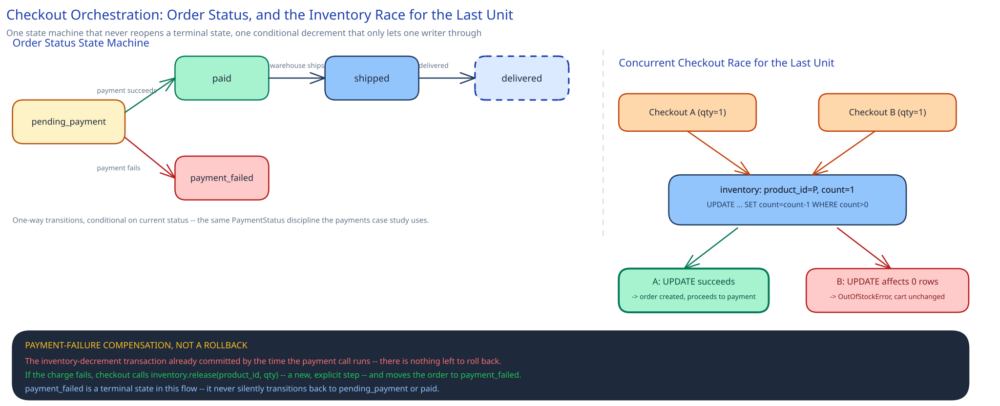

# Module 02 — Low-Level Design



This module focuses on the Order/Checkout service — the one component whose interfaces have to get correctness right, since catalog, cart, and recommendations are all read-mostly services whose interfaces are comparatively simple repository wrappers around their own store.

## Interfaces vs. implementations

- **`CartStore`** *(interface)* → **`RedisCartStore`** — `getCart(userId)`, `addItem(userId, productId, quantity, priceAtAdd)`, `removeItem(...)`, `clear(userId)`. Every write is TTL-bounded; there is no "durable" implementation of this interface anywhere in the system.
- **`InventoryRepository`** *(interface)* → **`SqlInventoryRepository`** — `decrementIfAvailable(productId, quantity)`, a single conditional `UPDATE` returning whether it actually applied, matching [`ecommerce-schema-worked-example.md`](../../database-design/ecommerce-schema-worked-example.md)'s mechanism exactly; `release(productId, quantity)` for the compensating path.
- **`OrderRepository`** *(interface)* → **`SqlOrderRepository`** — `createOrder(userId, items, total, status)`, `updateStatus(orderId, from, to)` — conditional-on-current-status, the same one-way state-machine discipline this guide's [payments case study](../payments-system/02-lld.md) uses for `PaymentStatus`.
- **`PaymentClient`** *(interface)* → a client of this guide's [Payments System](../payments-system/00-overview.md) case study's own `POST /payments` endpoint. Checkout does not reimplement charge idempotency, retries, or reconciliation — it depends on a service that already solved that problem, and forwards its own `idempotency_key` straight through.
- **`CatalogRepository`** *(interface)* → **`DocumentCatalogRepository`** — `findById(productId)`, `search(query, filters)` delegated to a **`SearchIndexClient`** *(interface)* → **`ElasticsearchClient`**, kept as a separate interface because the read path and the search path have genuinely different backends (cross-ref [Search & Inverted Indexes](../../scalability-resilience/search-inverted-indexes.md)).
- **`CheckoutService`** — the orchestrator. Depends on `CartStore`, `InventoryRepository`, `OrderRepository`, and `PaymentClient`; implements none of the storage or network calls itself.

## Pseudocode for the checkout flow

```
CheckoutService.checkout(user_id, idempotency_key, payment_method):
    cart = cartStore.getCart(user_id)
    if cart.isEmpty():
        raise EmptyCartError

    with db.transaction():
        for item in cart.items:
            ok = inventoryRepo.decrementIfAvailable(item.product_id, item.quantity)
            if not ok:
                raise OutOfStockError(item.product_id)   # rolls back the whole transaction

        total = sum(item.price_at_add * item.quantity for item in cart.items)
        order = orderRepo.createOrder(user_id, cart.items, total, status="pending_payment")
                                                            # ^ same transaction as the decrements above

    result = paymentClient.charge(order.total, payment_method, idempotencyKey=idempotency_key)

    if result.ok:
        orderRepo.updateStatus(order.id, from="pending_payment", to="paid")
        cartStore.clear(user_id)
    else:
        orderRepo.updateStatus(order.id, from="pending_payment", to="payment_failed")
        for item in order.items:
            inventoryRepo.release(item.product_id, item.quantity)   # compensating action, not a rollback

    return order
```

The inventory decrement and the order insert are one transaction, matching the boundary [`ecommerce-schema-worked-example.md`](../../database-design/ecommerce-schema-worked-example.md) already establishes. The payment call happens *after* that transaction commits, for the same reason the payments case study keeps its own processor call outside any database transaction: a slow or hung external call must never hold the order database's locks open.

## Error cases worth designing for deliberately

- **Out of stock, discovered inside the transaction:** `decrementIfAvailable` returning `false` is not a bug path — it's the correct, expected outcome of two customers racing for the last unit. The transaction rolls back cleanly and the customer sees an explicit, immediate "out of stock," never a silently created order against inventory that no longer exists.
- **Payment fails after the inventory decrement already committed:** this is not a rollback, because the transaction that decremented inventory has already committed by the time the payment call even happens. It's a compensating action — `inventoryRepo.release(...)` — the same saga-style reasoning this guide's [Sagas](../../hld-building-blocks/distributed-transactions-saga.md) page and the schema worked example both describe: undo what already happened with a new, explicit step, not a database rewind.
- **Cart expired (TTL) between the last add and checkout:** `cartStore.getCart` simply returns empty. This is not a special error state requiring recovery — it's the same `EmptyCartError` path an actually-empty cart takes, because a TTL-expired cart and a never-populated cart are indistinguishable, and correctly so: the cart store never promised to remember longer than its TTL.
- **A cart item's price drifted since it was added:** the order total is computed from `price_at_add`, the price frozen into the cart at add time — never the catalog's current live price. This mirrors [`ecommerce-schema-worked-example.md`](../../database-design/ecommerce-schema-worked-example.md)'s reasoning for `orders.total_amount` one step earlier in the flow: freeze the number the customer actually saw, don't silently recompute it against a value that's since moved.

## Concurrency at the code level

`inventoryRepo.decrementIfAvailable(...)` needs no application-level lock, for the same reason this guide states everywhere two writers might race for the same row: the Order/Checkout service runs on many horizontally-scaled instances, so an in-process mutex would only ever protect against other threads on the *same* instance. Correctness comes entirely from the conditional `UPDATE` being enforced by the database itself — push the atomicity requirement down into the one system that can actually provide it for free.

The one place a genuinely different kind of care is needed is the boundary *between* the two transactions in `checkout()` — the inventory-and-order transaction, and the later payment-status update. Nothing holds a lock across that gap; the order sits in `pending_payment` for however long the payment call takes, visible to anyone reading the order's status, and the state machine's one-way transitions (`pending_payment → paid | payment_failed`, never backwards) are what make it safe for that window to be arbitrarily long without risking a double-apply, exactly the discipline the payments case study's `PaymentStatus` enum enforces for its own intents.

## Design patterns you just used, named

- **Repository pattern** — `CartStore`, `InventoryRepository`, `OrderRepository`, and `CatalogRepository` all hide their storage technology behind method calls; `CheckoutService` never issues a query directly against any of them.
- **Strategy pattern** — `SearchIndexClient` is swappable (Elasticsearch today, Postgres full-text search at smaller scale) without `CatalogRepository`'s callers knowing which; `PaymentClient` is itself a strategy consumer one layer up, per the payments case study's own `ProcessorClient` strategy.
- **Cache-aside / read-through** — the catalog read path, per [Caching Strategies](../../hld-building-blocks/caching-strategies.md): a miss falls through to the document store and search index, then populates the cache for the next reader.
- **Saga (compensating transaction)** — the payment-failure branch of `checkout()` is this pattern by name: a sequence of local transactions (the inventory decrement, the payment attempt) with an explicit compensating step (`release`) for the case where a later step fails after an earlier one already committed, per [Sagas & Distributed Transactions](../../hld-building-blocks/distributed-transactions-saga.md).
- **State pattern (via an explicit enum)** — order status (`pending_payment → paid | payment_failed → shipped → delivered`) follows the same named-states-with-enforced-transitions discipline this guide applies to `PaymentStatus` in the payments case study — never a free-text field, never a boolean.

## Practice: extend it yourself

Before moving to Database Design, sketch (pseudocode is fine) how you'd add:

1. **A time-bounded inventory hold for a small set of designated high-demand SKUs during a flash sale**, without changing the default no-reservation behavior for the other ~9.999M products. Does `InventoryRepository` grow a new method, or does a *different* implementation of the same interface apply only to flagged products? How does `CheckoutService` know which policy applies to a given item without hardcoding product IDs into the orchestrator?
2. **A "you might also like" widget on the checkout confirmation page**, backed by `RecommendationService`. If that service is slow or down, what does `CheckoutService`'s dependency on it look like — and specifically, what has to be true about that dependency so a recommendation-service outage can never delay, block, or fail the checkout transaction itself?

Neither has one clean answer — the point is noticing that the interfaces already drawn (`InventoryRepository`, and `CheckoutService`'s deliberate *lack* of a hard dependency on recommendations) make it obvious which component should own each new piece of behavior, before you've fully worked out what that behavior should do.
