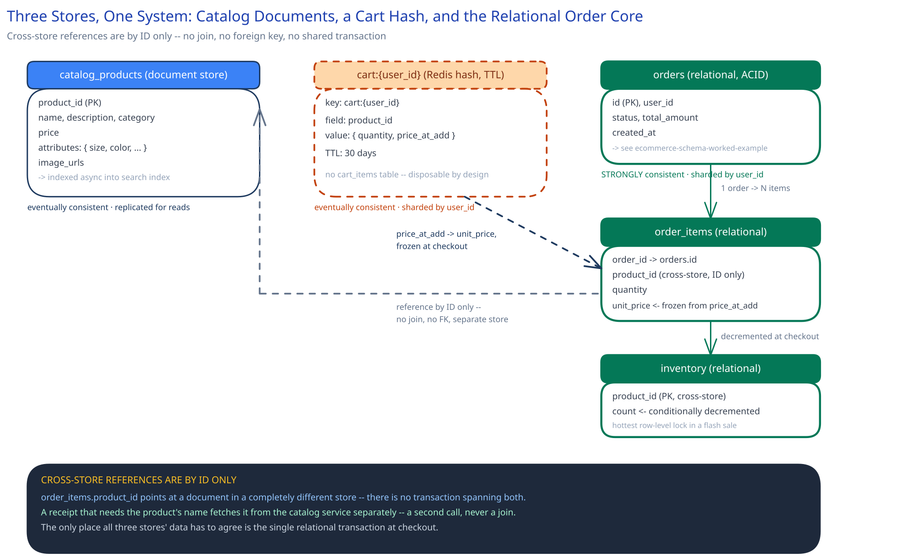

# Module 03 — Database Design & Scaling

The relational core — `orders`, `order_items`, `inventory`, `payments` — is already worked through in full, including the transaction boundary and its indexes, in [`ecommerce-schema-worked-example.md`](../../database-design/ecommerce-schema-worked-example.md). This module doesn't re-derive it. What's genuinely new here is the **multi-store split around that core**: what catalog and cart look like in stores that aren't relational at all, why each gets the technology it gets, and how data that lives in three different systems ever gets referenced consistently.

## From entities to schema

- **Catalog store (document, one per product):** `{ product_id, name, description, price, category, attributes: {...}, image_urls }`. Attributes are embedded directly, not normalized into a side table — the same modeling choice [SQL vs. NoSQL](../../database-design/sql-vs-nosql.md)'s worked catalog comparison walks through, chosen here because catalog's two dominant queries are "fetch by id, render the page" and "search," and neither one benefits from a join a shirt's `size`/`color` and a laptop's `RAM`/`screen size` would otherwise force.
- **Search index (derived, not a source of truth):** an inverted index — `word → [product_ids]` — built from the catalog store and kept in sync asynchronously, per [Search & Inverted Indexes](../../scalability-resilience/search-inverted-indexes.md). A write to the catalog store never blocks on the index being updated.
- **Cart store (key-value, one hash per user):** `cart:{user_id} → { product_id: { quantity, price_at_add } }`, with a TTL (30 days is a reasonable default). There is no `cart_items` table anywhere — a cart's entire design point is to be cheap to read and write and safe to lose, and a durable relational table would be paying for a guarantee this data doesn't need.
- **Order/checkout relational core:** `orders`, `order_items`, `inventory`, `payments` — see [`ecommerce-schema-worked-example.md`](../../database-design/ecommerce-schema-worked-example.md) for the full field list, the transaction boundary, and the `total_amount` denormalization. The one thing worth adding here: `order_items.unit_price` is populated directly from the cart's `price_at_add`, not re-read from the catalog store at checkout time — the price the customer saw is the price that gets frozen, exactly the "freeze the number" reasoning the worked example applies to the order total one level up.

## Why cross-store references are by ID only, never a join

`order_items.product_id` points at a document living in a completely different storage technology than `order_items` itself. There is no foreign key, no join, and no transaction that spans both — the order database only ever stores the ID, and any code path that needs the product's name or image for a receipt fetches it from the catalog service separately, accepting that it's a second call, not a join. This is the direct, structural consequence of the service split in Module 01: two stores that don't share a transaction boundary categorically can't offer a referential-integrity guarantee across each other, and pretending otherwise (a "soft foreign key" nobody enforces) is worse than being explicit that it's an application-level lookup, not a database-level guarantee.

## Why the catalog gets a document store, not the order database's relational store

Catalog's write pattern is almost entirely price and inventory-adjacent metadata changes on existing rows, not new relationships between entities — there's no join query catalog actually needs to run. Its read pattern is "fetch one product" or "search across many," both served well by a document shape that mirrors the API response. Forcing catalog onto the order database's relational schema would mean paying multi-row ACID transaction overhead on a store that never needs cross-row atomicity, for a query pattern relational joins don't actually help with.

## Why the cart gets a cache, not a database at all

A cart's failure mode if lost is a re-add click, not a lost sale — see Module 01's Trade-offs table. That's an ACID-vs-BASE decision in the sense [ACID vs. BASE](../../database-design/acid-vs-base.md) frames it: pick the guarantee the data actually needs, not the strongest one available by default. A cart needs neither durability across a node failure nor cross-user consistency; it needs to be fast and to expire on its own. A key-value store with TTL is the direct match for that requirement, not a compromise version of a "real" database.

## Indexes

- **Catalog store:** the search index (`word → [product_ids]`) does the heavy lifting for search queries — see [Search & Inverted Indexes](../../scalability-resilience/search-inverted-indexes.md) for how it's built and kept in sync; a plain primary-key lookup on `product_id` serves the "click through from a result to the detail page" path directly.
- **Cart store:** none needed beyond the key itself — every access is `cart:{user_id}`, a single key lookup, never a scan or a range query. This is the same "what does *not* get an index" lesson the worked example applies to `orders.shipping_address`, just taken one step further: a store whose only access pattern is a direct key lookup doesn't need a secondary index structure at all.
- **Order relational core:** the full list — `users.email` unique, `orders(user_id, created_at)`, `order_items(order_id, product_id)` — is in [`ecommerce-schema-worked-example.md`](../../database-design/ecommerce-schema-worked-example.md) and isn't repeated here.
- **`inventory(product_id)`**, worth calling out specifically even though the worked example already lists it as the primary key: it's the single row every concurrent checkout for a given product contends on, and during a flash sale on one hot SKU it's the busiest row-level lock in the entire system — a fact that matters for the scaling discussion below in a way it doesn't for an ordinary catalog item.

## Consistency

- **Catalog store + search index:** eventually consistent. A product edit can take seconds to minutes to propagate into search results, and that's an accepted trade, not an oversight — nobody expects a just-saved product to be instantly full-text-searchable, the same expectation [Search & Inverted Indexes](../../scalability-resilience/search-inverted-indexes.md) sets generally.
- **Cart store:** eventually consistent / best-effort. A write acknowledged by one Redis replica before it's propagated to others is an acceptable risk, because the cost of a briefly-inconsistent cart read is a missing item a user re-adds, not money moving incorrectly.
- **Order relational core (`orders`, `order_items`, `inventory`, `payments`):** strongly consistent, non-negotiable — the same bar [`ecommerce-schema-worked-example.md`](../../database-design/ecommerce-schema-worked-example.md) sets for the inventory-decrement-and-order-insert transaction. This is the one store in the whole system where "briefly wrong" is not an acceptable state, matching the CP-leaning choice [ACID vs. BASE](../../database-design/acid-vs-base.md) makes for money-moving operations generally.
- **Recommendation store:** eventually consistent, can be hours stale — the same acceptable-staleness framing [ACID vs. BASE](../../database-design/acid-vs-base.md) uses for a social app's like count: a suboptimal recommendation is invisible and harmless in a way a wrong order total or a wrong inventory count never is.

## Scaling the schema

- **Catalog:** replicated and read-scaled, not sharded for write throughput — the workload is over 99% reads, so the actual lever is read replicas plus the cache layer in front of it, not partitioning writes across shards ([Data Partitioning & Sharding](../../hld-building-blocks/data-partitioning-sharding.md)'s distinction between the two problems).
- **Cart:** sharded by `user_id`, and a hash-based shard key is genuinely fine here — unlike the order database below, a cart has exactly one access pattern (fetch this one user's cart) and zero cross-user queries, so there's no leftmost-prefix or locality concern a hash spread could break.
- **Order relational core:** sharded by `user_id`, exactly as [`ecommerce-schema-worked-example.md`](../../database-design/ecommerce-schema-worked-example.md) already argues — a user's own order history staying on one shard is the query that runs constantly. What's worth adding here: this is the one shard-key decision the whole platform can't get wrong, because the order database is the source of truth every other service's numbers (a dashboard's "units sold," a recommendation model's "what did this user actually buy") ultimately trace back to.
- **Read replicas vs. sharding, once more:** catalog's scaling problem is replicas (read-heavy, write-light); the order database's scaling problem is sharding (constant reads *and* writes against the same rows). Reaching for one when the other is the actual bottleneck — replicating a table that's write-bound, or sharding a table that's purely read-bound — is the mistake every case study in this guide's database design module names, and it applies here across three different stores at once instead of one.

## Connecting it back

Trace this across all three modules: Module 00's observation that catalog reads outnumber checkouts by roughly three orders of magnitude is why Module 01 puts catalog and order behind separate services with separate failure domains in the first place; that same split is why this module has three storage technologies instead of one, each chosen for the query pattern its own service actually runs, not a platform-wide default. And the one place all three stores' data has to agree — the moment `order_items.unit_price` gets frozen from the cart's `price_at_add`, the inventory row gets conditionally decremented, and the order row gets inserted — is exactly the single relational transaction [`ecommerce-schema-worked-example.md`](../../database-design/ecommerce-schema-worked-example.md) already covers in full. Nothing in this split is arbitrary: every store, every index, and every consistency choice traces back to what that specific piece of the platform actually reads and writes, and how expensive it is to be wrong.
