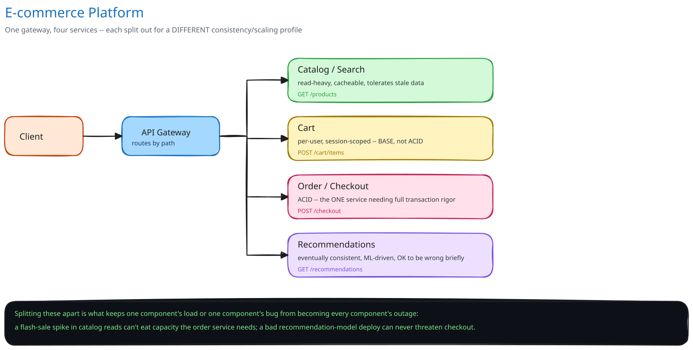

# Design an E-commerce Platform

## Requirements

Browse a product catalog, add items to a cart, check out, track an order. Non-functional, stated as assumptions: roughly 10M products, 50M DAU. Catalog browsing has to stay fast even during a traffic spike (a flash sale, a homepage feature) that touches none of it — checkout has to never lose an order or process one twice, even during that same spike.

## The transactional core lives elsewhere in this guide

The schema, the inventory-decrement race, the denormalized order total — all of it is already worked through in full in this guide's [E-Commerce Schema](../../database-design/ecommerce-schema-worked-example.md) case study. This page doesn't re-derive any of that. This page is about the **service decomposition** around that transactional core: which parts of an e-commerce platform are actually separate services with genuinely different scaling and consistency needs, and why that split is the design decision, not a stylistic preference for microservices.

## Service decomposition, organized around what each part actually needs

- **Catalog / search** — read-heavy, and tolerant of staleness: a product's price and description don't change per-second, so this path can be cached aggressively ([Caching Strategies](../../hld-building-blocks/caching-strategies.md)) and served from a search index ([Search & Inverted Indexes](../../scalability-resilience/search-inverted-indexes.md)) rather than the primary transactional store.
- **Cart** — per-user, needs to survive a session, but doesn't need the order service's durability guarantees. Losing an in-progress cart occasionally is an inconvenience; losing a placed order is a lost sale and a support ticket. That's a real difference in what "correct" means for each ([ACID vs. BASE](../../database-design/acid-vs-base.md)'s framing of picking the guarantee the data actually needs, not the strongest one available by default).
- **Order / checkout** — the one part that needs the full transactional rigor [`ecommerce-schema-worked-example.md`](../../database-design/ecommerce-schema-worked-example.md) already covers: the atomic inventory-decrement-and-insert, the frozen `total_amount`, the payment-failure compensation.
- **Recommendations** — a separate, eventually-consistent, ML-driven read path. It can be a few hours stale, or occasionally just wrong, without threatening a single order.

Splitting these apart is what keeps them from becoming each other's incident: a flash-sale spike in catalog read traffic shouldn't be able to eat capacity the order service needs, and a bad deploy of the recommendation model should never be in a position to take down checkout. Bundling all four into one service means one component's load profile or one component's bug becomes every component's outage.

## The API gateway ties it together

A client shouldn't need to know any of this is four separate systems with four different architectures behind them. One gateway ([API Gateway](../../hld-building-blocks/api-gateway.md)) is the single entry point, routing `GET /products` to catalog, `POST /cart/items` to cart, `POST /checkout` to order, and `GET /recommendations` to the recommendation service — the decomposition is invisible from the outside, which is the point of it.

## Interviewer follow-ups

**Why does the cart service get weaker consistency guarantees than the order service?**
Because the cost of being wrong is completely different. A cart that briefly shows a stale item count costs nothing real; an order that's double-processed or silently dropped costs money and trust. Consistency is a dial you set per component based on what an error there actually costs, not a single guarantee applied uniformly across the whole system.

**How would you handle a product going out of stock while it's sitting in many users' carts?**
Don't reserve inventory at add-to-cart time — a cart is not a hold. Re-check and decrement inventory only at checkout, inside the same transaction that creates the order, exactly as [`ecommerce-schema-worked-example.md`](../../database-design/ecommerce-schema-worked-example.md) describes; a user whose cart item sold out in the meantime finds out at the one moment it actually matters, instead of the system pretending to reserve something it never actually held.

**Would you use the same database technology for catalog search and order processing?**
No, and that's deliberate, not an oversight — [SQL vs. NoSQL](../../database-design/sql-vs-nosql.md)'s point applies directly: the query pattern should drive the choice. Catalog search wants a search-optimized index over mostly-static, denormalized documents; order processing wants multi-row ACID transactions over normalized, frequently-written rows. Forcing one store to do both well is exactly the kind of default-preference choice that guide warns against.
