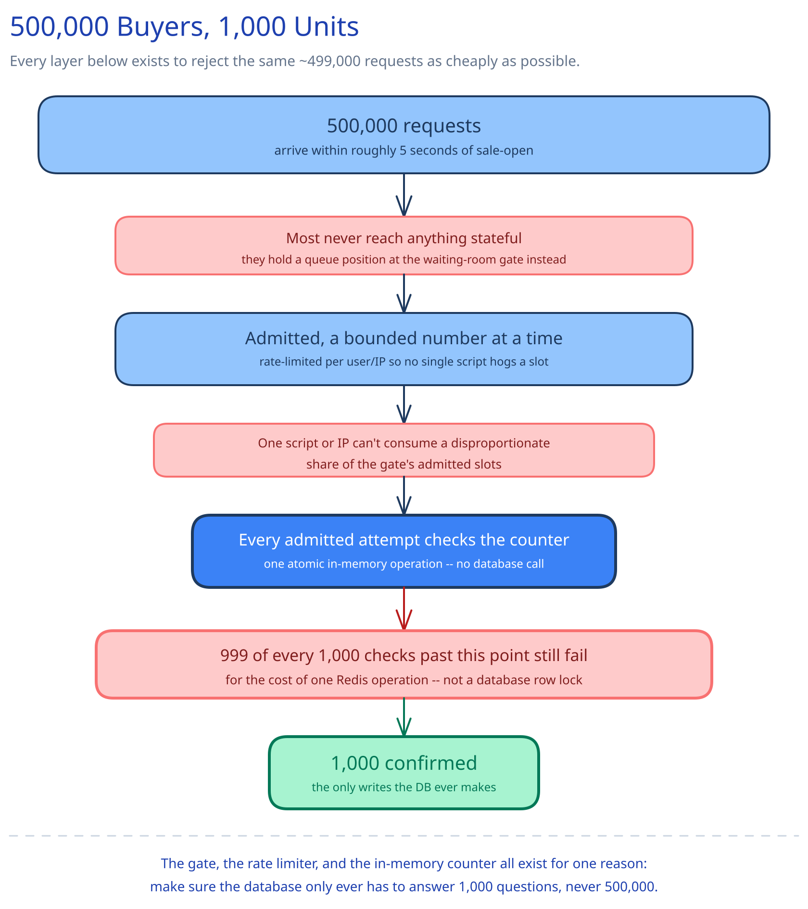

# Module 00 — Overview

## The feature, with no infrastructure in it yet

A product page opens for sale at exactly noon: 1,000 units, first-come-first-served. In the same handful of seconds, roughly 500,000 people tap "buy." Exactly 1,000 of them can walk away with a unit — not 999, not 1,001. Every other requirement in this module exists to make that one sentence true, not just in the quiet case but at a 500-to-1 ratio of demand to supply arriving in the same instant.

That ratio, not the raw request count, is what makes this an interesting design problem. 500,000 requests/sec is a large-but-ordinary number this guide's other systems handle routinely. What's unusual here is that 499,000 of those requests are *guaranteed to fail* the moment the sale opens, and the entire design question is how cheaply the system can tell them so — before the failure costs as much as a success would have.

## Requirements

**Functional:**
- Sell a fixed, small quantity of a product (1,000 units) starting at a precise, announced time.
- Give every purchase attempt a fast, definitive answer — admitted and purchased, or rejected — never a hang or an indefinite wait for a database that's underwater.
- Sell **exactly** 1,000 units. Not 999 (units left unsold that customers were actively trying to buy), and never 1,001 (oversold, meaning a refund and an angry customer downstream).

**Non-functional** (stated as assumptions, interview-style):
- ~500,000 purchase attempts arrive within the first few seconds of the sale opening, against 1,000 units — a ~500:1 contention ratio is the defining number for this system, the same way "never double-charge" is the defining number for [Payments System](../payments-system/00-overview.md).
- No single component — gate, rate limiter, cache, or database — may become the bottleneck for the ~499,000 requests that were always going to fail. Correctness alone (every request eventually gets the right answer) is not sufficient; the design has to fail cheaply at scale, not just correctly.
- p99 latency for an *admitted* user's purchase decision stays sub-second — the burst is absorbed before it reaches that decision, not by making the decision step itself heavier-weight.

## Capacity Estimation

Using this guide's [back-of-envelope method](../../foundations/back-of-envelope-estimation.md):

- **Peak request rate:** 500,000 requests arriving within roughly a 5-second window around sale-open → **~100,000 requests/sec** at the very front door, for a few seconds only, then dropping to near-zero.
- **Success ratio:** 1,000 units / 500,000 requests = **0.2% success rate**. 499,000 requests (99.8% of all traffic) are mathematically guaranteed rejections, regardless of how the system is built — the design problem is entirely about the cost of delivering that rejection, not about avoiding it.
- **Waiting-room admission rate:** if the purchase flow downstream (claim + payment) can safely sustain, say, 2,000 concurrent in-flight attempts, the gate admits at a rate matched to that — e.g. 1,000 sessions/sec — and queues the rest with a visible position. At that rate, draining all 500,000 arrivals takes several minutes even though the sale itself is decided in the first few seconds; most of that queue is walking toward "sold out," not toward a purchase.
- **Durable write volume:** because the in-memory counter (see Approach Walkthrough) absorbs the claim burst and the database is only ever written to on a *confirmed* purchase, the durable database sees on the order of **~1,000 writes** for the entire event — five orders of magnitude below the request volume that triggered them.
- **Storage:** trivial — one product row, ~1,000 order rows. This system is never storage-bound; like [Ticket Booking System](../ticket-booking-system/00-overview.md), it's bound entirely by concurrency at one instant, not by data volume.

## Approach Walkthrough

Before any boxes: this design has two jobs that are easy to conflate. The first is turning away the 499,000 requests that can't possibly succeed, as cheaply as possible — cheaper at each successive layer than the layer after it, because the volume shrinks at each layer and the layers that remain can afford to be more expensive per request. The second is the claim itself: safely handing out exactly 1,000 units under concurrent attempts, which is the well-understood [inventory-decrement race](../../database-design/ecommerce-schema-worked-example.md) — extended here with a non-database gate in front of it, because the concurrency hitting that gate is orders of magnitude higher than a typical checkout race ever sees.

This is a close relative of [Ticket Booking System](../ticket-booking-system/00-overview.md): the same hold-and-timeout claim mechanism, the same waiting-room-at-the-door admission pattern. The difference is degree, not kind. Ticket Booking spreads 100,000 users across a 60-second browsing window against 20,000 seats — a ~5:1 ratio, arriving in a burst but not all at the same instant. Flash Sale compresses ~500,000 requests into a handful of seconds against 1,000 units — a ~500:1 ratio, nearly all of it arriving simultaneously. That difference in degree is exactly why this design needs layered rejection *in front of* the claim mechanism, rather than trusting the claim's own atomicity (a conditional database update, which is all Ticket Booking needs) to survive contact with the traffic alone.

## API Surface

- `POST /sales/{id}/waiting-room/join {session_id}` → `{queue_token, position, estimated_wait_seconds}` — nearly every one of the 500,000 initial requests lands here first.
- `GET /sales/{id}/waiting-room/status {queue_token}` → poll while queued; redirects into the purchase flow once admitted.
- `POST /sales/{id}/claim {queue_token}` → `{hold_id, expires_at}` on success, or `409 {"status": "sold_out"}` — a single atomic attempt against the in-memory counter, not a database call.
- `POST /sales/{id}/purchase {hold_id, idempotency_key, payment_method}` → `{order_id, status: "confirmed"}`, `402` on a declined charge, or `410` if the hold expired first.
