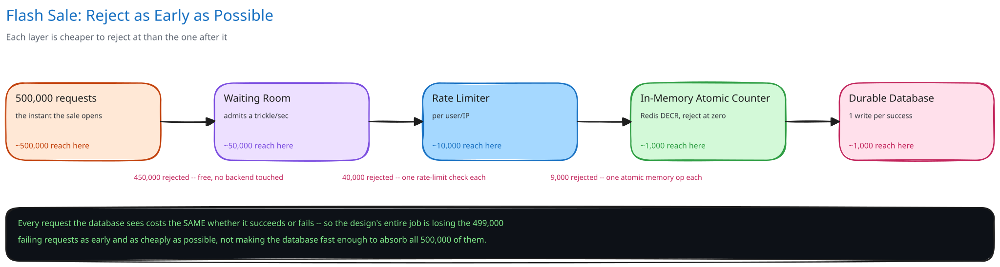

# Module 01 — Architecture & High-Level Design

## Monolith vs. microservices

Two seams here are worth pulling out on their own, and one deliberately isn't.

The **Waiting-Room Gate** is pulled out, for the same reason [Ticket Booking System](../ticket-booking-system/01-architecture-hld.md) pulls its own gate out: it exists purely to absorb a once-per-sale-event spike, has a completely different operational shape from the rest of the flow (always idle, then instantaneously saturated), and needs to be load-tested and scaled in total isolation from the claim-and-purchase logic behind it. At this system's ratio, the case for isolating it is sharper still — a ~500:1 contention ratio arriving in one instant is a more extreme spike than Ticket Booking's own ~5:1 ratio spread across a minute.

The **in-memory unit counter** is also pulled out — not into its own service, but onto its own infrastructure (a dedicated Redis instance or cluster), deliberately separate from any general-purpose application cache the rest of the platform shares. A flash sale's counter has to survive a burst that would evict or contend with unrelated cached data on a shared instance; isolating it means a popular product's flash sale can't degrade caching for the rest of the site, and vice versa.

The **Claim & Purchase Service**, by contrast, stays one service rather than being split into a "claim service" and a "purchase service." A hold and its eventual confirmed purchase are two states of one lifecycle, not two independent concerns — splitting them would mean two services need to agree on who owns a hold's validity at any given instant, the exact shared-ownership cost [Ticket Booking System](../ticket-booking-system/01-architecture-hld.md) already argues against paying without a real reason.

## Building Blocks

| Block | Role |
|---|---|
| Waiting-Room Gate | Admits a bounded number of sessions/sec into the claim flow; everyone else holds a queue position and polls it — identical mechanism to Ticket Booking System, reused as-is |
| Edge Rate Limiter | Per-user/IP token bucket ([Rate Limiting](../../hld-building-blocks/rate-limiting.md)) sitting behind the gate, stopping one script from consuming a disproportionate share of admitted slots |
| Claim & Purchase Service (stateless) | Orchestrates the atomic claim, the payment call, and the durable confirm write — owns the "exactly 1,000 units" business logic end-to-end |
| In-memory unit counter + hold store | The real gate on inventory: one atomic, Lua-scripted check-and-decrement per claim attempt ([Caching Strategies](../../hld-building-blocks/caching-strategies.md)); holds live here only, ephemerally |
| External Payment Processor | Charges the user holding a live claim; same synchronous, in-request placement as [Payments System](../payments-system/01-architecture-hld.md)'s processor call |
| `orders` table (durable DB) | The single source of truth for "who actually bought a unit" — written exactly once per confirmed purchase, ~1,000 rows for the entire event |
| `orders_outbox` | Durable record of "this order confirmed, send the receipt," written in the same transaction as the order |
| Notification Relay | Drains the outbox, delivers the confirmation email/SMS, retries independently of the purchase transaction |
| Sweeper | Releases expired, unpaid holds back to the in-memory counter — the release side of the concurrency mechanism, same role as Ticket Booking's sweeper |
| Bot/Abuse Layer | Proof-of-work or CAPTCHA at gate entry, plus per-account attempt limits — raises the cost of running many parallel bot sessions |

## Per-path walkthrough

**Admission (write)** — `Client → Waiting-Room Gate (admit or queue) → [if admitted] Edge Rate Limiter (per-user/IP check) → Claim & Purchase Service`. At any traffic level below the spike this system is built for, the gate is a no-op pass-through and wouldn't need to exist — same as Ticket Booking's.

**Claim (write)** — `Claim & Purchase Service → in-memory counter (Lua script: atomic check-and-decrement) → hold created (hold_id, expires_at) if the counter still had units, else immediate "sold out"`. This step touches no database at all. It's the layer that actually decides, definitively and cheaply, who among the admitted crowd gets a shot at a unit — everything before it only decided who got *here*.

**Payment and confirm (write)** — `Claim & Purchase Service (validate hold not expired) → External Payment Processor (charge) → orders table, atomic INSERT (status='confirmed') → orders_outbox (same transaction)`. This mirrors the [Payments System](../payments-system/01-architecture-hld.md)'s intent-then-act-then-record discipline, with one difference: the "intent" here isn't a database row, it's the in-memory hold — the database only ever learns about an attempt that already succeeded.

**Notification (async)** — `orders_outbox → Notification Relay → user (email/SMS)`. Fully decoupled from the purchase transaction, same as every other outbox in this guide.

**Release (async, out-of-band)** — `Sweeper → in-memory hold store (scan or lazy-check for expired holds) → atomic increment of the unit counter, delete the hold entry`. An abandoned or declined checkout gives its unit back to the pool for the next person still in the queue, rather than losing it for the rest of the sale.

## Trade-offs to make explicit

| Decision | Chosen | Alternative | Why |
|---|---|---|---|
| Where contention on the last unit is resolved | An in-memory, Lua-scripted atomic counter, checked before any database call | A single `UPDATE inventory SET count = count - 1 WHERE count > 0` row in the DB, the same mechanism [the e-commerce schema](../../database-design/ecommerce-schema-worked-example.md) uses | The DB row would serialize and pay a full lock-and-round-trip cost for ~499,000 requests that were always going to fail; the in-memory counter rejects the identical requests for a fraction of the cost — see "why the naive approach falls over" below |
| Admission control | A waiting room admitting a bounded rate/sec ahead of the counter | Let all 500,000 requests hit the rate limiter and counter directly | The counter alone protects inventory correctness, not the user experience or the service's own capacity to even accept a connection; a gate turns 500,000 unpredictable outcomes into a legible queue position, the same reasoning [Ticket Booking System](../ticket-booking-system/01-architecture-hld.md) gives for its own gate |
| Durable write timing | Write the `orders` row only once, at confirm, after payment succeeds | Write a `pending`/`reserved` row at hold time too, the way Ticket Booking's `seats` table does | A ticket-booking seat has a real, independent identity someone can look at on a map before it's held; a flash-sale unit is fungible — no one cares *which* unit they get — so there's nothing worth persisting before it's actually sold, and persisting it early would multiply DB writes back up toward the volume this design exists to avoid |
| Counter recovery after a crash | Rebuild the counter from `COUNT(confirmed orders)` in the durable DB | Trust the in-memory counter's last known value, or replicate it for failover | A crashed in-memory value has no audit trail behind it; the DB's confirmed-order count is correct by construction (it's only ever written on an actual success), so it's the only value safe to rebuild from |
| Bot mitigation | Proof-of-work/CAPTCHA at gate entry, plus per-account attempt limits | Rely on per-IP rate limiting alone | Per-IP limiting doesn't stop distributed bot traffic spread across many IPs; raising the cost of running many parallel sessions closes that gap without meaningfully slowing a genuine single buyer |

### Why the naive approach falls over

500,000 requests hitting one `UPDATE inventory SET count = count - 1 WHERE count > 0` row in the same few seconds all serialize on that row. There are only 1,000 units, so 499,000 of those requests are guaranteed to fail no matter how the system is built — but if all 500,000 reach the database, it spends its capacity processing 499,000 failures exactly as expensively as it processes 1,000 successes. The issue was never correctness — the `WHERE count > 0` guard is airtight, same as the e-commerce schema's version — it's that the database becomes the bottleneck for traffic that was never going to succeed anyway. The fix isn't a faster database; it's rejecting the same 499,000 requests one or more layers earlier, where rejecting them is cheaper.

## Load Handling

- **Peak-vs-average tolerance:** ~100,000 requests/sec at the front door for a handful of seconds, against near-zero the rest of the time — an extreme, once-per-sale-event spike rather than the kind of sustained peak-vs-average ratio [Payments System](../payments-system/01-architecture-hld.md) is built to absorb. This system spends nearly its entire life idle and has to survive a spike that looks nothing like its average.
- **Where backpressure kicks in first:** at the Waiting-Room Gate — before the rate limiter, before the counter, before the database. Each layer downstream sees a monotonically smaller number of requests than the layer before it, by design; the database, at the very bottom, sees only the ~1,000 that actually succeeded.
- **What gets shed under overload:** at the gate, nothing is dropped — every arrival gets a queue position, same as Ticket Booking's gate. At the in-memory counter, once it hits zero, every further attempt gets an immediate, cheap, definitive rejection — this genuinely is shedding, not queueing, because once the counter is at zero there is truly nothing left to wait for.
- **Autoscaling lag:** reactive autoscaling cannot ramp fast enough for a burst that goes from near-zero to ~100,000 requests/sec in under a second — unlike an organically growing spike, a flash sale's start time is known exactly in advance, so the gate and rate-limiter tiers are pre-provisioned (or pre-warmed) ahead of the announced time rather than left to scale reactively after the fact.
- **Load-test target:** simulate 500,000 requests arriving within a 5-second window against a 1,000-unit sale; confirm exactly 1,000 confirmed orders, zero oversells, and the durable database never sees more than a low-thousands write volume regardless of the 500,000-request front-door figure.

## Concurrent-User Handling

| Race | Mechanism | What the "loser" sees |
|---|---|---|
| Two admitted users' claim attempts race for one of the last remaining units | A Lua script executed atomically by Redis: check `remaining > 0` and decrement in the same single-threaded round trip — only as many claims succeed as the counter had left | An immediate `409 sold_out` — no lock, no queue, no database round trip |
| A user's hold expires while their payment is still processing | The confirm step re-checks the hold's expiry against the same store before writing to the database; an expired hold is rejected even if the processor later approves the charge, and the charge is refunded | "Hold expired" rather than a confirmed order for a unit that may already be released to someone else |
| The sweeper and a late-arriving payment both act on the same expired hold | Same discipline: confirm's write requires the hold to still exist in the store; if the sweeper already deleted it and released the unit, confirm's check fails | The late payment is treated as expired — refunded, not confirmed — regardless of which process noticed the expiry first |
| The process holding the in-memory counter crashes mid-burst | On recovery, the counter is rebuilt as `1,000 - COUNT(confirmed orders)` from the durable database, never trusted from its last known in-memory value | Any hold that existed only in the crashed instance's memory is gone; those users see "sold out" or can retry against the recomputed (possibly still-nonzero) counter — no unit is ever double-sold, because the database's confirmed count is the one value that survives the crash |

## Scaling & Reliability

- **Horizontal scaling:** the Waiting-Room Gate, Edge Rate Limiter, and Claim & Purchase Service are all stateless and scale by request rate, same as any stateless tier in this guide. The in-memory counter does **not** scale this way — see the callout below.
- **Circuit breaker:** the payment processor call is wrapped in a circuit breaker (cross-ref [Circuit Breakers & Retries](../../scalability-resilience/circuit-breakers-retries.md)); if the processor degrades mid-sale, the breaker trips and fails fast rather than holding claimed units hostage behind a slow, likely-doomed charge.
- **Retries:** only ever idempotent, with the same forwarded `idempotency_key` on every retried charge attempt — identical discipline to Payments System, for the identical reason.
- **Dead-letter queue:** an outbox row that fails to relay after repeated attempts moves to a dead-letter table rather than blocking every other confirmed order's receipt behind it.
- **Graceful degradation:** if the Notification Relay is down, confirmed orders are unaffected — the `orders` row and outbox entry are already durably committed; only the receipt email lags, and it drains once the relay recovers.
- **Multi-region:** not built here, and worth naming honestly rather than glossing over: the in-memory counter is a single hot key by construction, which makes it a single-writer bottleneck no matter how many regions the rest of the stack runs in. A genuinely multi-region flash sale would need to either pre-partition the 1,000 units across regions (accepting the fairness cost of a region-local allocation) or accept a single authoritative region for the counter and route all claim attempts there — a materially harder problem than this design takes on, and sharper than the equivalent gap in Ticket Booking System, whose `seats` table shards cleanly by `event_id`.

## What you'd revisit as this grows

- **The in-memory counter's own ceiling.** A single Redis key's throughput is very high but not infinite; if a future sale needed to sustain contention an order of magnitude past this one, even the counter could become the new bottleneck, and splitting a single number's atomicity across shards without losing correctness is a genuinely hard problem, not a mechanical scaling exercise.
- **Multiple simultaneous flash sales on the same platform.** This design assumes one hot product at a time; running several at once means the gate needs a per-sale admission budget, not one shared platform-wide rate, so a hot sale for product A can't starve a quieter sale for product B.
- **Per-account purchase limits beyond one unit.** Capping at, say, two units per account changes the claim step from a pure counter check into a counter check plus a per-account count — a small but real addition to the atomicity the Lua script has to provide (see Module 02's practice exercises).
- **Fairness beyond arrival order.** This design's queue position is purely first-come-first-served into the gate; it doesn't address whether that's actually the fairest allocation for a highly desirable, deliberately scarce product — a real product question, deliberately out of scope here.
