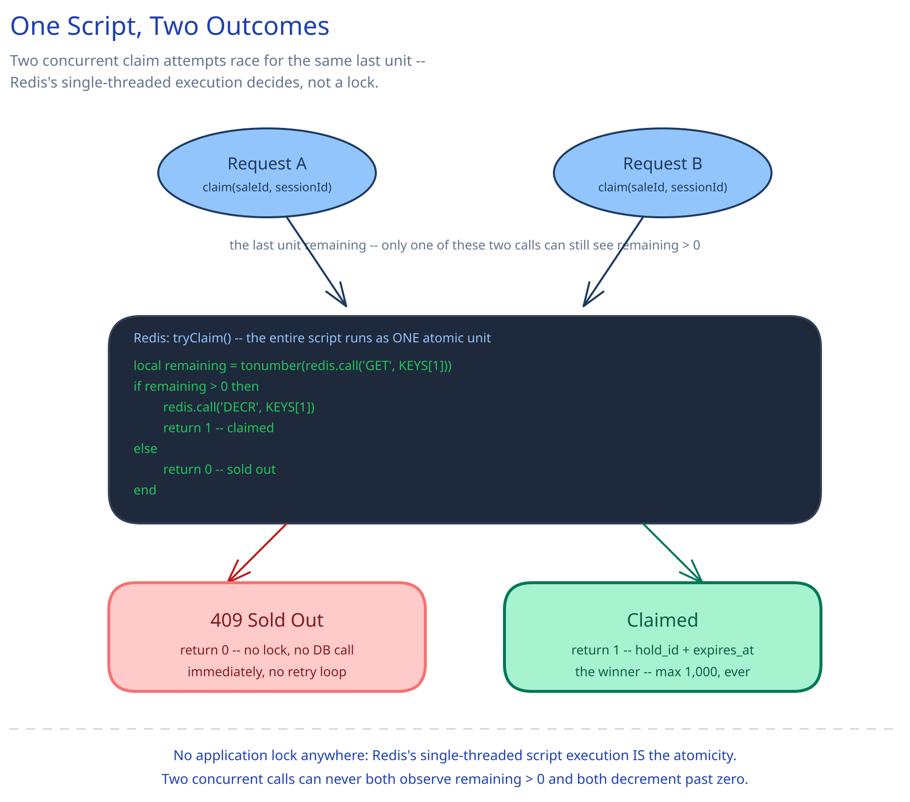

# Module 02 — Low-Level Design



A hold's lifecycle is a small, explicit state machine, matching this guide's convention elsewhere: `claimed → confirmed | expired`, both terminal, both one-way — a hold is never re-claimed, and `confirmed` never reverts. Unlike [Ticket Booking System](../ticket-booking-system/02-lld.md)'s `seats.status`, this state doesn't live in the database at all while it's live — it lives entirely in the in-memory store, and only the `confirmed` outcome ever gets written durably.

## Interfaces vs. implementations

- **`UnitCounterStore`** *(interface)* → **`RedisUnitCounterStore`** — `tryClaim(saleId, sessionId)` (the atomic Lua check-and-decrement, returning a `hold_id` + `expires_at` or `null`), `getHold(holdId)`, `release(holdId)` (the sweeper's atomic increment-back), `remaining(saleId)` (read-only, for the waiting room's ETA display).
- **`OrderRepository`** *(interface)* → **`SqlOrderRepository`** — `insert(saleId, userId, holdId, idempotencyKey, amount, status="confirmed")`, `countConfirmed(saleId)` (the reconciliation query that rebuilds the counter).
- **`PaymentGateway`** *(interface)* → **`StripeGateway`** — `charge(amount, paymentMethod, idempotencyKey)`, `refund(chargeId)`.
- **`OutboxWriter`** *(interface)* → **`SqlOutboxWriter`** — `enqueue(eventType, payload)`, called inside the same transaction as the order insert.
- **`AdmissionStrategy`** *(interface)* → **`TokenBucketAdmission`** — the same interface [Ticket Booking System](../ticket-booking-system/02-lld.md) defines for its own Waiting-Room Gate, reused as-is here.
- **`ClaimService`** — the orchestrator. Depends on all four storage/network interfaces, implements none of them itself.

## Core method: claiming a unit

```
ClaimService.claim(saleId, sessionId):
    hold = counterStore.tryClaim(saleId, sessionId)
    if hold is None:
        return HTTP_409("sold out")
    return { hold_id: hold.id, expires_at: hold.expires_at }
```

The entire mechanism lives in `RedisUnitCounterStore.tryClaim`'s Lua script, executed atomically by Redis in one round trip:

```lua
-- KEYS[1] = remaining-units counter key for this sale
local remaining = tonumber(redis.call('GET', KEYS[1]))
if remaining > 0 then
    redis.call('DECR', KEYS[1])
    return 1   -- claimed: caller creates a hold entry with a short TTL
else
    return 0   -- sold out
end
```

This single script is what makes "check remaining, then decrement" atomic without a database transaction or an application-level lock — Redis executes the whole script as one indivisible unit, so two concurrent claim attempts can never both observe `remaining > 0` and both decrement past zero. This is the same "push the atomicity requirement into the one system that can provide it for free" discipline [Ticket Booking System](../ticket-booking-system/02-lld.md)'s conditional `UPDATE` uses — the store is different (Redis, not the primary database) because the concurrency here (~100,000 attempts/sec) is orders of magnitude past what a database row can absorb without becoming the bottleneck itself, per Module 01's "why the naive approach falls over."

## Core method: confirming a purchase

```
ClaimService.confirm(holdId, idempotencyKey, paymentMethod):
    hold = counterStore.getHold(holdId)
    if hold is None or hold.expires_at < now():
        return HTTP_410("hold expired")        # never call the processor for a dead hold

    charge = paymentGateway.charge(hold.price_cents, paymentMethod, idempotencyKey)
    if charge.failed:
        return HTTP_402("payment declined")     # hold stays open until its own timeout; user can retry

    # single transaction: the FIRST and ONLY write this order ever makes to the durable DB
    with db.transaction():
        order = orderRepository.insert(hold.sale_id, hold.user_id, holdId,
                                        idempotencyKey, charge.amount, status="confirmed")
        outboxWriter.enqueue("order.confirmed", order)

    counterStore.markConsumed(holdId)            # delete the ephemeral hold; NOT released back
    return order
```

Notice what's absent: no write happens anywhere in `claim()`, and `confirm()`'s database write happens exactly once, only on success. A hold that's abandoned, declined, or simply never confirmed leaves **zero trace** in the durable database — it only ever shows up as a temporarily-decremented counter that the sweeper (below) eventually gives back. This is the concrete mechanism behind Module 01's claim that the database sees on the order of 1,000 writes regardless of how many of the 500,000 requests were ever in flight.

## Error cases worth designing for deliberately

- **Payment succeeds, but the order insert fails (crash, connection drop).** The charge already happened; no order row exists yet. Resolved the same way [Payments System](../payments-system/02-lld.md) resolves it: a reconciliation job queries the processor for any charge with no matching `order_id` past a threshold, and either completes the order or issues a refund — never left as a silent loss.
- **The hold expires in the gap between the client submitting payment and the server processing the charge.** Handled explicitly above — `confirm()`'s own re-check of `hold.expires_at` is the final word, not whatever `claim()` returned minutes earlier.
- **The in-memory store loses the hold-and-counter state mid-burst (a crash, a failover).** Any hold that existed only in the crashed instance's memory is simply gone — there's no reconciliation *for holds*, because holds were never meant to be durable. What does need reconciliation is the counter itself: on recovery, rebuild it as `total_units - orderRepository.countConfirmed(saleId)`, never trust its last known in-memory value. This is the concrete version of Module 01's crash-recovery row: the database's confirmed-order count is correct by construction (it's only ever written on an actual success), so it's the only safe source to recompute from.

## Concurrency at the code level

`counterStore.tryClaim` needs no in-process lock and no distributed lock either — the Lua script's single-threaded execution inside Redis is the entire atomicity mechanism, the same "the store itself provides it for free" pattern this guide applies everywhere two writers might race for the same resource ([Ticket Booking System](../ticket-booking-system/02-lld.md)'s conditional `UPDATE`, [Payments System](../payments-system/02-lld.md)'s conditional status transition, [Distributed Job Scheduler](../distributed-job-scheduler/02-lld.md)'s conditional claim). What's different here is *which* store gets to provide that guarantee: Ticket Booking's database can absorb its own concurrency (~1,667 attempts/sec against 20,000 rows) directly. This system's concurrency — ~100,000 requests/sec against a single logical counter — would turn the same database-row approach into the bottleneck Module 01 argues against, which is exactly why the atomicity point has to move to Redis instead of the primary database.

`orderRepository.insert`'s uniqueness on `idempotency_key` is the one place a genuine database-level guard is still needed, for the identical reason Payments System needs it: the read-then-decide step in a naive `confirm()` (check for an existing order, then insert) is not itself atomic in application code, so the safety net has to be the database's own unique constraint, not the `if` statement checking for it.

## Design patterns you just used, named

- **Repository pattern** — `UnitCounterStore` and `OrderRepository` hide storage (Redis and SQL respectively) behind method calls; `ClaimService` never issues a Lua script or SQL statement directly.
- **Strategy pattern** — `PaymentGateway` and `AdmissionStrategy` are both swappable behind an interface, identical in shape to Ticket Booking System's own use of the same two interfaces.
- **State pattern (via an explicit, ephemeral state, not a persisted enum)** — a hold's `claimed → confirmed | expired` lifecycle is enforced the same way this guide enforces every other lifecycle, with the twist that most of it never touches durable storage at all.
- **Transactional outbox** — `OutboxWriter` is this pattern by name, identical to Payments System's and Ticket Booking System's: durably queue the confirmation event in the same transaction as the state change it describes.

## Practice: extend it yourself

Before moving to Database Design, sketch (pseudocode is fine) how you'd add:

1. **A per-account limit of 2 units** — the Lua script currently only checks and decrements a single global counter. What second piece of state does `tryClaim` need to check atomically alongside `remaining > 0`, and does it still fit in one Redis round trip, or does enforcing "2 per account" force a second script or a compound key?
2. **Two flash sales for different products, opening at the same instant, sharing one Waiting-Room Gate.** Does the gate's admission budget need to become per-sale rather than platform-wide, and if a bot targets only the more popular of the two sales, does the shared gate design from Module 01 still protect the quieter one?

Neither has one clean answer — the point is noticing which existing interface (`UnitCounterStore`, or the gate's own `AdmissionStrategy`) is the natural home for the new behavior, before you've fully worked out what that behavior should do.
