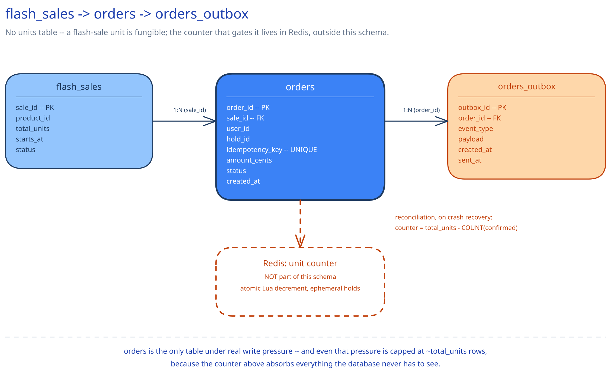

# Module 03 — Database Design & Scaling

## From entities to schema

Three entities, and one deliberate absence:

- **`flash_sales`** `(sale_id, product_id, total_units, starts_at, status)` — mostly static, defines how many units exist and when the counter opens.
- **`orders`** `(order_id, sale_id, user_id, hold_id, idempotency_key UNIQUE, amount_cents, status, created_at)` — the durable record of who actually bought a unit. Written exactly once, on confirm, and never before.
- **`orders_outbox`** `(outbox_id, order_id, event_type, payload, created_at, sent_at)` — the receipt-notification relay's work queue, same pattern as every other outbox in this guide.

**No `units`/`inventory` table with 1,000 individually addressable rows.** This is the sharpest schema difference from [Ticket Booking System](../ticket-booking-system/03-db-design.md), and it's worth naming explicitly rather than assuming it's an oversight. A seat has an identity a user picks off a map — row 12, seat B — so it needs its own row with its own `status`. A flash-sale unit is fungible: nobody cares *which* of the 1,000 units they get, only whether they got one at all. Materializing 1,000 individually-lockable rows to represent that would recreate exactly the row-contention problem Module 01's "why the naive approach falls over" argues against — the entire point of this design is that the concurrency mechanism is a single atomic counter, not 1,000 separately-racing rows.

## Why the counter itself doesn't live in this schema at all

The counter's whole reason to exist is absorbing contention at a rate — ~100,000 checks/sec — the relational database cannot sustain. Putting it in a DB table, even one with the tightest possible `WHERE count > 0` guard, would reintroduce the exact bottleneck this design exists to avoid. It lives in Redis, entirely outside this schema, and this schema's only job is to durably record the *outcome*: a confirmed order. That's why `orders` is the only table under any real write pressure in this whole design, and even that pressure is bounded to roughly `total_units` writes, ever, for a given sale — not a fraction of the request volume, a fraction of the *unit count*.

## Why `idempotency_key` gets a unique index, non-negotiably

Identical reasoning to [Payments System](../payments-system/03-db-design.md) and [Ticket Booking System](../ticket-booking-system/03-db-design.md): a network retry on a slow `confirm()` call (the client times out mid-payment and resubmits) must not create two order rows for one payment. The unique constraint on `idempotency_key` makes the second insert fail at the database level — no race window exists between "check if this key was already used" and "insert the row," the way there would with an application-level check-then-insert.

## Why `status` is a constrained enum, not a free string

`confirmed` is the only terminal state this table's `status` column ever needs to reach, and it's reached exactly once. A free-text column would let a bug write "confirmed" twice for the same order, or write it out of order relative to some other process's expectations. Modeling it as an enum with one legal, one-way transition — rather than trusting every caller to only ever write it once — is the same database-level enforcement [Payments System](../payments-system/03-db-design.md)'s `PaymentStatus` and [Ticket Booking System](../ticket-booking-system/03-db-design.md)'s seat `status` both use for their own lifecycles.

## Why strongly consistent and relational, not eventually consistent

This is money and inventory together — the same category [ACID vs BASE](../../database-design/acid-vs-base.md) names as the case for strong consistency, not the eventual-consistency trade this guide takes elsewhere (e.g. [Counting a Billion Likes](../../../like-counting-at-scale/00-overview.md)). A stale read of "did my order confirm" is a real customer-facing incident here, not a cosmetic delay — the relational model also buys the transactional guarantee the design leans on: the `orders` insert and the `orders_outbox` insert committing atomically in one transaction is what makes the outbox pattern safe at all.

## Indexes

- **`orders(idempotency_key)`** — **unique**, the concurrency-safety mechanism above; every confirm-path write checks it.
- **`orders(sale_id, status)`** — serves `countConfirmed(saleId)` directly, the exact query Module 02's reconciliation job runs to rebuild the in-memory counter after a crash. This index is the load-bearing one for crash recovery specifically, not just for reporting.
- **`orders(user_id, created_at)`** — a user's own order history, a low-urgency read that never competes with the reconciliation query above for the same index.
- **`orders_outbox(sent_at)`** where `sent_at IS NULL` — a partial index over the unsent subset, same pattern as the payments and ticket-booking outboxes, keeping the relay's poll query cheap regardless of how large the historical outbox grows.
- **`flash_sales(starts_at)`** — supports "which sales are opening soon," the query that drives pre-warming the gate and the counter ahead of a known start time (Module 01's Load Handling point about provisioning ahead of an announced time, not reactively).

## Consistency

- **`orders`:** must be strongly consistent — a read immediately after a confirm (the client's own order-status check right after paying) has to reflect the true, current state. This is a hard requirement, not a tunable trade-off, for the same reason Payments System treats its own status column the same way.
- **`orders_outbox`:** eventually consistent by design — a delayed receipt email is a UX lag, not a correctness problem, because the order itself is already durably confirmed before the outbox row is even written.
- **`flash_sales`:** eventually-consistent-tolerant for reads. A few milliseconds of staleness on `starts_at` or `status` doesn't matter, because the gate and the counter open based on their own systems' clocks and state, not a live read of this row on every single claim attempt — unlike `orders`, nothing here sits on the hot concurrency path.

## Scaling the schema

- **Sharding key, if this ever needs to shard:** `sale_id` — every hot query (`countConfirmed`, a sale's own order history) is naturally scoped to one sale at a time, the same reasoning Ticket Booking System gives for sharding by `event_id`.
- **But a single sale's own write volume never forces this question.** The entire point of Module 01's design is that no matter how much traffic one sale draws — 500,000 requests or 5 million — the database only ever sees on the order of `total_units` writes for it. Sharding only becomes a real conversation if **many** large flash sales run concurrently across the platform, each with its own few-thousand-row write burst at its own start time — not because any single sale threatens one shard's capacity.
- **Read replicas vs. sharding, once more:** replicas serve "my orders" and admin/reporting dashboards; sharding (by `sale_id`) isolates one sale's write burst from another's. At this system's actual per-sale write volume, a single well-indexed primary comfortably handles even several concurrent sales before sharding is genuinely needed — naming that honestly matters more than reflexively reaching for a shard key just because this guide's other high-traffic case studies do.

## Connecting it back

Every decision in this schema traces back to Module 00's central number: 500,000 requests against 1,000 units, with correctness on the 1,000 and cost-efficiency on the 499,000 both non-negotiable. That's why there's no per-unit inventory table — a fungible unit has no identity worth a row, and giving it one would reintroduce the row-contention problem the counter exists to solve. It's why `orders` is the only table under write pressure, and why that pressure is capped at `total_units` rather than scaling with request volume — the schema only ever learns about outcomes, never attempts. And it's why `orders(sale_id, status)` is indexed as carefully as it is: that index isn't just a reporting convenience, it's the exact query the reconciliation job runs to rebuild the in-memory counter's truth after a crash, which means a slow index there would widen the window in which the system's crash-recovery story is actually broken.
