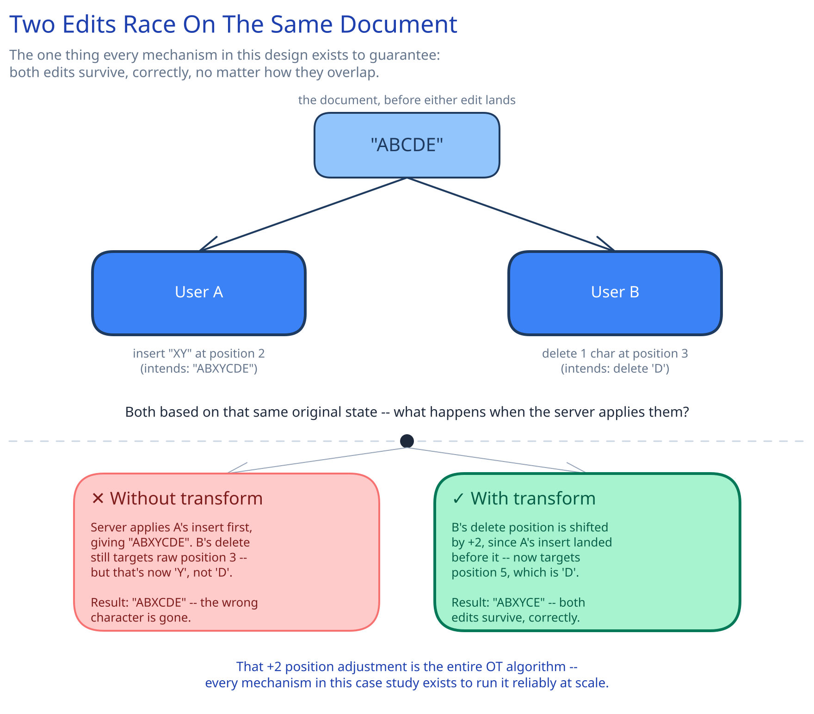

# Module 00 — Overview

## The feature, with no infrastructure in it yet

Two people open the same document and both start typing at the same instant, in the same paragraph. Neither one is "wrong" — both edits are legitimate, and both have to survive. That's the one sentence everything else in this module answers: **an edit can never be silently lost or silently overwritten by someone else's edit that happened to race it**, no matter how many people are editing at once or how close together their keystrokes land.

That bar is sharper than it looks. A naive "last write wins" system doesn't crash and doesn't error — it just quietly drops one person's work, and nobody finds out until they scroll back and it's gone.

## Requirements

**Functional:**
- Multiple users edit the *same* document at the same time, with every edit visible to everyone else near-instantly.
- No edit is ever silently lost or silently overwritten by a concurrent edit.
- A user who disconnects and reconnects catches back up without re-fetching the entire document.

**Non-functional** (stated as assumptions, interview-style):
- An edit should propagate to other active viewers within **~200ms**.
- A single "hot" document can have a few dozen simultaneous editors; the overwhelming majority of documents have exactly one.
- The document must never end up in a state no single user actually intended — every character present is traceable to some editor's actual keystroke.

## Capacity Estimation

Using this guide's [back-of-envelope method](../../foundations/back-of-envelope-estimation.md):

- **Active documents:** assume 5M documents are open for editing at any given moment, across all users — the vast majority single-editor, a small fraction "hot" (10+ concurrent editors).
- **Operations/sec:** an active editor produces roughly 1 keystroke-operation/sec while typing. At 5M open documents averaging ~1.5 concurrent editors each: **~7.5M operations/sec at peak typing intensity** — though real typing is bursty, not sustained, so a design built for this ceiling has comfortable headroom day-to-day.
- **Operation-log storage:** assume ~50 bytes/operation (type, position, character, author, sequence number). At 7.5M ops/sec sustained for an hour of peak collaborative activity: 7.5M × 3,600 × 50B ≈ **~1.3TB/hour** — which is exactly why the design below never keeps the *entire* history live; see Snapshotting in Architecture & HLD.
- **Concurrent WebSocket connections:** one per active editor. At 5M documents × ~1.5 average editors: **~7.5M concurrent connections** — the same stateful-connection scaling shape this guide's [Long Polling, WebSockets & SSE](../../scalability-resilience/long-polling-websockets-sse.md) page names explicitly.

## Approach Walkthrough

Neither client sends the whole document on every keystroke. Each edit is shipped as a tiny **operation** — `insert("x", at=5)`, `delete(at=3, len=1)` — to a server that holds the document's authoritative live state. When two operations arrive that raced each other, the server doesn't just apply them in arrival order: it **transforms** the later-arriving one against whatever it raced, so it still lands in the *semantically* correct place on a document that's since changed underneath it. That transform step is the entire trick; everything else in this module is infrastructure built to run it reliably at scale.

## API Surface

- `WS /documents/{id}/edit` — a persistent WebSocket connection for the editing session itself.
  - Client → server message: `{op: "insert"|"delete", at, content?, len?, base_seq}` — `base_seq` is the last server sequence number this client had seen, the anchor the transform is computed against.
  - Server → client message: `{op: ..., seq}` (the transformed, now-canonical operation) broadcast to every connected editor, including the one who sent it (so it learns its own operation's final, transformed position).
- `GET /documents/{id}/snapshot?since_seq=` — fetch the latest durable snapshot plus any operations after it, for a client that's reconnecting or opening the document for the first time.
- `WS` presence messages (`cursor_position`, `viewer_joined`) ride the same connection but are explicitly **not** written to the operation log — see Interviewer Q&A.
