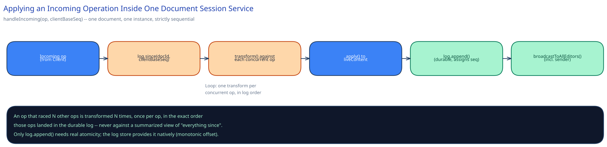

# Module 02 — Low-Level Design



## Interfaces vs. implementations

```
interface OperationTransformer {
  transform(incoming: Operation, against: Operation): Operation
}

class TextOTTransformer implements OperationTransformer { ... }

interface OperationLog {
  append(documentId, op: Operation): SequencedOperation
  since(documentId, seq: number): List<SequencedOperation>
}

class DurableOperationLog implements OperationLog { ... }

interface SnapshotStore {
  latestBefore(documentId, seq: number): Snapshot
  write(documentId, seq: number, content: string): void
}

class BlobSnapshotStore implements SnapshotStore { ... }
```

Splitting `OperationTransformer` out as its own interface is what makes OT-vs-CRDT (Module 01's Trade-offs) a swappable decision rather than one baked into the session service's control flow — the session service only ever calls `transform`, never inspects *how* the transform works.

## Core method: applying an incoming operation

```
class DocumentSession {
  documentId: string
  liveContent: string           // in-memory, this shard owns it
  headSeq: number
  transformer: OperationTransformer
  log: OperationLog

  function handleIncoming(op: Operation, clientBaseSeq: number) -> SequencedOperation:
    concurrentOps = log.since(documentId, clientBaseSeq)   // everything the client hasn't seen yet

    transformedOp = op
    for eachOp in concurrentOps:
      transformedOp = transformer.transform(transformedOp, eachOp)  // walk forward through the log

    liveContent = apply(liveContent, transformedOp)
    sequencedOp = log.append(documentId, transformedOp)    // assigns the real seq, durably
    headSeq = sequencedOp.seq

    broadcastToAllEditors(documentId, sequencedOp)          // includes the sender
    return sequencedOp
}
```

The loop is the whole algorithm: an operation that raced N other operations gets transformed N times, once against each, in the exact order those N operations actually landed in the log — never against a summarized or collapsed view of "everything that happened since."

## Error cases worth designing for deliberately

- **`clientBaseSeq` older than the oldest operation still in the fast log** (client was disconnected long enough that the log tail rotated out). Don't try to transform against a gap — force that client through the reconnect/snapshot path (Module 01) instead of a partial, silently-wrong transform.
- **Two operations from the *same* client arrive out of order** (a retry raced the original). De-duplicate by a client-assigned operation ID before transforming — transforming a duplicate against the log a second time would apply it twice.
- **The transform itself produces a nonsensical result** (e.g., a delete whose transformed position now falls outside the current document length, because upstream operations changed the document more than expected). Treat this as a bug to alert on, not something to paper over with a clamped index — a silently-clamped delete is exactly the kind of "no visible error, but wrong" failure this whole design exists to prevent.
- **The session service crashes mid-broadcast**, after appending to the log but before every client received it. Recovery relies on the log being the durable source of truth — a client that missed the broadcast simply reconnects and catches up via `since_seq`, so a broadcast is a delivery optimization, not the mechanism edits become durable.

## Concurrency at the code level

Everything inside `handleIncoming` runs against `liveContent` and `headSeq` that belong to exactly one Document Session Service instance, for exactly one document, processed one operation at a time in the order they're received — there is no cross-thread or cross-instance mutation of that state to guard against, because sticky routing (Module 01) already guarantees only one instance ever touches it. Within that single instance, incoming operations for a given document are processed strictly sequentially (a per-document queue, not a lock) — a lock would imply operations could otherwise run in parallel and race each other, but the whole point of the design is that they never get the chance to.

The one place real atomicity matters is `log.append` itself: it must assign sequence numbers that are strictly increasing and gapless *as observed by every reader*, which is a property the underlying durable log store provides natively (an append-only log with a monotonic offset), not something the session service re-implements.

## Design patterns you just used, named

- **Strategy** — `OperationTransformer` is swapped (text OT today, could be a CRDT-based merge tomorrow) without touching `DocumentSession`'s control flow.
- **Repository** — `OperationLog` and `SnapshotStore` hide their storage engines behind a narrow interface; `DocumentSession` never issues a raw query.
- **Memento** — a `Snapshot` is exactly the classic Memento pattern: an opaque, restorable capture of an object's internal state at a point in time, without exposing that state's internal structure to whoever asked for the snapshot.

## Practice: extend it yourself

1. **Add "undo" for a single editor.** An editor's undo has to skip over any operations *other* editors made in between, undoing only their own most recent change — sketch how you'd track "this editor's operations" separately from the shared log without breaking the transform's ordering guarantee.
2. **Add a per-paragraph lock mode** for teams that find OT's always-merge behavior confusing for large structural edits (e.g. reordering whole sections). Design the API so a user can explicitly claim a paragraph, and decide what happens to the transform pipeline for operations that arrive against a locked region.
