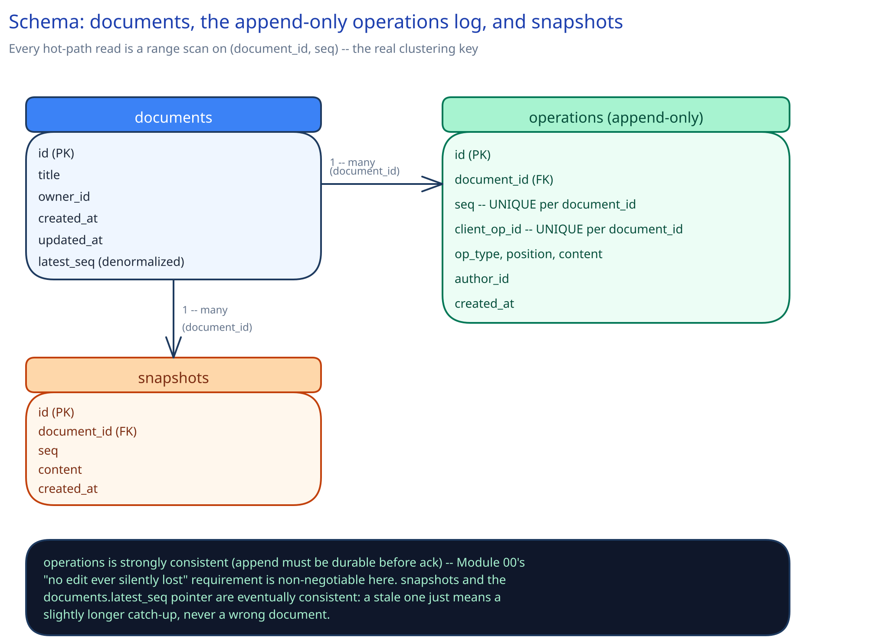

# Module 03 — Database Design & Scaling

## From entities to schema

- **`documents`** `(id, title, owner_id, created_at, updated_at, latest_seq)` — the document's own metadata; `latest_seq` is a denormalized pointer to the log, not a source of truth on its own.
- **`operations`** `(id, document_id, seq, client_op_id UNIQUE per document, op_type, position, content, author_id, created_at)` — append-only, never updated, never deleted; the actual source of truth for what the document contains.
- **`snapshots`** `(id, document_id, seq, content, created_at)` — one row per snapshot taken; only the latest row per document is read in the normal path, older ones kept for a bounded retention window.

## Why `(document_id, seq)` is the whole game, not just an index

Every read pattern in this system — "give me everything since `seq` N," "what's the latest snapshot at-or-before `seq` N" — is a range query on `seq`, scoped to one `document_id`. That's not incidental: it's the direct schema-level expression of Module 01's building block choice to shard the Document Session Service by `document_id` and process each document's operations strictly in order. If a query pattern ever needed operations *across* documents ordered globally, this schema would be wrong; it doesn't, because two different documents' edits never need to be compared against each other.

## Why `operations` is append-only and never updated, even for the transformed result

It would be tempting to store an operation, then rewrite it in place once transformed. Instead, the transform happens in the Document Session Service's memory (Module 02) and only the **final, already-transformed** operation is ever written to `operations` — meaning every row in this table, from the first read, is already in its correct, final, canonical form. An update-in-place model would require every reader to worry about a row being mid-transform; append-only removes that class of bug by construction, the same reasoning the ledger in [payments-system](../payments-system/03-db-design.md) uses for money movements.

## Why `client_op_id` gets a unique index scoped to `document_id`

This is the durable half of the de-duplication Module 02 names as an error case: a retried client operation must not apply twice even if the retry reaches the log after a crash-and-recover cycle where in-memory de-duplication state was lost. The database becoming the final backstop against duplicate application — not just an in-memory check — is exactly the same reasoning [payments-system](../payments-system/03-db-design.md) uses for `idempotency_key`.

## Indexes

- `operations(document_id, seq)` — **unique**, and the primary access path for every read in the system (catch-up, transform-walk, replay); this is effectively the table's natural clustering key.
- `operations(document_id, client_op_id)` — **unique**, the de-duplication backstop above.
- `snapshots(document_id, seq DESC)` — "the latest snapshot at-or-before seq N" is the query the reconnect path runs on every single reconnect; this index turns it into a bounded range scan instead of a full scan of every snapshot ever taken for that document.
- `documents(owner_id, updated_at)` — a user's "recently edited documents" list, a read pattern that exists independent of the live-editing path itself.

## Consistency

- **`operations`:** must be strongly consistent at write time — an append has to be durable and immediately visible to the next read (the very next operation's transform-walk depends on seeing every prior append) before the session service acknowledges it. This is non-negotiable given Module 00's "no edit is ever silently lost" requirement.
- **`snapshots`:** eventually consistent is fine — a snapshot lagging the true head by a few seconds only means a reconnecting client replays a few more operations than the theoretical minimum; it never produces a wrong document, only a slightly longer catch-up. This is the explicit trade Module 01's Trade-offs table names for snapshot frequency.
- **`documents`:** the `latest_seq` pointer and `updated_at` timestamp are eventually consistent, updated asynchronously from the hot write path — nothing in the live-editing correctness guarantee depends on this table being perfectly current, only on `operations` being correct.

## Scaling the schema

- **Sharding key: `document_id`.** Every hot query is already scoped to one document; sharding any other way (e.g., by `author_id`) would scatter a single document's operations across shards and turn the transform-walk's single-shard range scan into a distributed fan-out on every keystroke — exactly the mistake [payments-system](../payments-system/03-db-design.md) warns against for the ledger.
- **Read replicas vs. sharding:** replicas help the `documents(owner_id, updated_at)` "recent documents" list and any reporting-style query, but do nothing for the live-editing hot path, which is a single-document, low-latency, must-be-current read — that path scales by sharding `operations` and `snapshots`, not by adding replicas.
- **Retention on `operations`:** capacity estimation in Module 00 already flags the log's raw growth rate; a mature deployment archives operations older than the oldest *retained* snapshot to cold storage, since nothing in the live system ever reads behind the newest snapshot except an explicit "view full history" feature.

## Connecting it back

Module 00's one hard requirement — no edit is ever silently lost or overwritten — is why `operations` is append-only rather than mutated in place; that same requirement is why the transform (Module 02) always runs before a row is written, guaranteeing every row that lands is already final. The sharding-by-`document_id` decision made informally in Module 01's Building Blocks becomes concrete here as the actual clustering key on the table that matters most, and the snapshot table's relaxed consistency is the direct schema expression of the "snapshotting is a durability optimization, never a correctness mechanism" line Module 01 draws in its Load Handling section.
