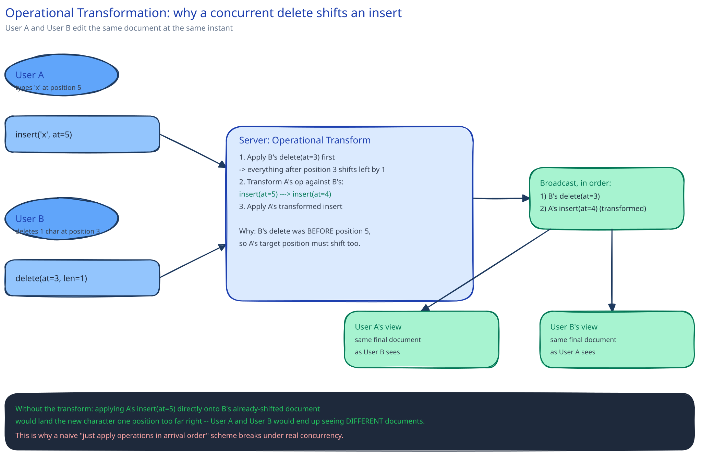

# Design Google Docs (Real-Time Collaborative Editing)

## Requirements

**Functional:** multiple users edit the *same* document at the same time; every user's edits appear for everyone else near-instantly; no user's edit is ever silently lost or silently overwritten by someone else's.

**Non-functional** (stated as assumptions, interview-style): an edit should propagate to other viewers within ~200ms; a single document can have dozens of simultaneous editors; the document must never end up in a state no single user actually intended.

## Why this isn't just this guide's chat system again

This guide's [Chat / Messaging System](../chat-messaging-system/README.md) case study looks similar on the surface — many clients, one server, near-real-time delivery — but chat messages are independent events that never conflict with each other; message #4812 doesn't care what message #4811 said. Two people editing the *same paragraph* of the *same document* at the *same instant* produce edits that directly collide at the character level: one person deletes the word another person is simultaneously typing into. Ordering the edits (which is all a chat system has to do) isn't enough — this needs an actual conflict-resolution algorithm.

## The core mechanism: Operational Transformation (or CRDTs)

Neither approach sends the whole document on every keystroke — both represent an edit as a small **operation** (`insert("x", at=5)`, `delete(at=3, len=1)`) and ship just that.

**Operational Transformation (OT)** transforms an incoming operation against whatever happened concurrently, so it still lands correctly on a document that's since changed underneath it. Concretely: user A types at position 5; at the same instant, user B deletes a character at position 3. B's delete shifts everything after it left by one — so A's operation can't just be applied as "insert at 5" anymore, or it lands one character off. The server transforms it into "insert at 4" *before* applying and broadcasting it. That transform step — rewriting one operation in light of another one it raced against — is the entire algorithm; the hard part in a real implementation is proving the transform is correct for every pair of operation types (insert-insert, insert-delete, delete-delete) and every possible order they might arrive in.

**CRDTs** (conflict-free replicated data types) solve the same problem a different way: design the data structure itself — usually giving every character a stable, globally-unique position identifier instead of a plain array index — so that applying a set of concurrent operations in *any* order converges to the same result, with no transform step at all. The trade-off: OT needs a central server to sequence and transform operations correctly (or a much harder peer-to-peer transform); CRDTs can merge peer-to-peer with no sequencer, at the cost of a heavier per-character data structure and, often, a document that never fully "compacts" back down to a plain string.

## Architecture, briefly

A **document session service** holds the authoritative in-memory state for every actively-edited document. Each active editor holds a [WebSocket connection](../../scalability-resilience/long-polling-websockets-sse.md) to it — this needs to be bidirectional and low-latency in a way polling can't match. Every applied operation is appended to a per-document **operation log**, in order; that log is both the conflict-resolution server's source of truth for "what happened, in what order" and the durability mechanism — a reconnecting client catches up by replaying every operation since the last one it saw, not by re-fetching the whole document. Because replaying a document's *entire* history from character one gets expensive as a document ages, the service periodically writes a full **snapshot** to durable storage, so replay only ever has to start from the most recent snapshot forward.

## Interviewer follow-ups

**What happens if an editor's connection drops mid-edit and they reconnect?**
They reconnect with the last operation-sequence-number they successfully applied, and the server replays everything in the log since that number — no full document re-fetch needed, just the delta they missed.

**How would you show other users' live cursor positions?**
Cursor position is a much cheaper, lossy, ephemeral signal — broadcast it over the same WebSocket as a separate message type, but don't write it to the operation log at all; losing a stale cursor update is invisible, unlike losing a character.

**Why can't you just use last-write-wins here, the way a simpler system might for a single field update?**
LWW only works when an entire record is the unit of update — the loser's whole write silently vanishes. A document is thousands of characters typed by many people; LWW at that granularity would mean one editor's entire set of concurrent keystrokes disappears whenever it happens to lose a timestamp race, which is exactly the "silently overwritten" outcome the requirements above rule out.

**Does the operation log grow forever?**
Only until the next snapshot — once a snapshot is durably written, the log entries before it are no longer needed to reconstruct current state and can be archived or dropped, the same trade this guide's [database replication](../../database-design/db-replication-failover.md) page makes between a full backup and its incremental logs.
