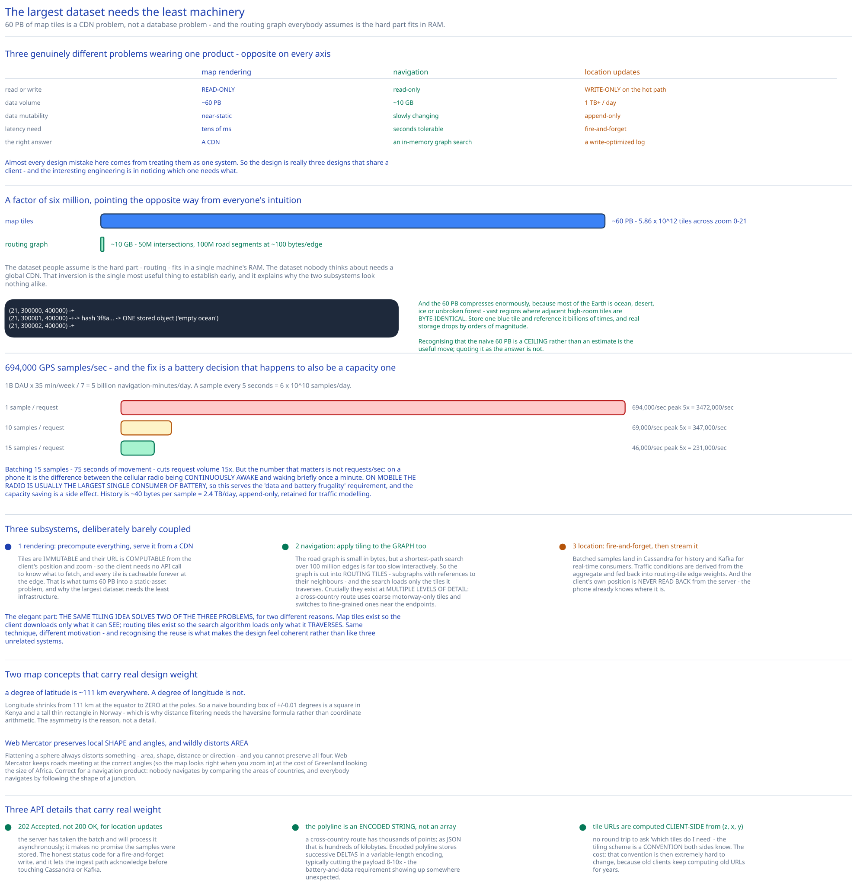

# Module 00 — Overview



## The feature, with no infrastructure in it yet

Three things, and the reason this is a hard system is that they are **three genuinely different problems wearing one product**:

1. **Show me a map.** Pan, zoom, render. A read-only view of a very large static dataset.
2. **Get me from A to B.** A shortest-path query over a road graph, weighted by current traffic.
3. **Where am I?** Continuous GPS updates from the client — which are simultaneously the *input* to traffic data and a colossal write workload.

Almost every design mistake here comes from treating them as one system. They have opposite characteristics on every axis:

| | Map rendering | Navigation | Location updates |
|---|---|---|---|
| Read or write | **Read-only** | Read-only | **Write-only** (on the hot path) |
| Data volume | **~60 PB** | ~10 GB | 1 TB+/day |
| Data mutability | Near-static | Slowly changing | Append-only |
| Latency need | Tens of ms | Seconds tolerable | Fire-and-forget |
| Right answer | **A CDN** | In-memory graph search | A write-optimized log |

So the design is really three designs that share a client, and the interesting engineering is in noticing that **the largest dataset needs the least machinery.** 60 PB of map tiles is a CDN problem, not a database problem — a conclusion that only becomes obvious once you notice the tiles are immutable and addressable by a computable key.

## Requirements

**Functional:**
- **Render the map** at any location and zoom level, on mobile and web.
- **Turn-by-turn navigation** between two points, by car, on foot, or by bike.
- **ETA**, accounting for current traffic conditions.
- **Geocoding** — resolve "1600 Amphitheatre Parkway" to coordinates, and the reverse.
- **Ingest location updates** from clients to build traffic data.
- **Adaptive rerouting** — if conditions change mid-journey, offer a better route.

Explicitly out of scope, to bound the problem: multi-stop optimization, business listings and reviews (that's the [proximity service](../proximity-service/00-overview.md)), and satellite imagery pipelines.

**Non-functional:**
- **Accuracy.** A wrong turn instruction is worse than a slow one. This is the requirement that ranks above latency, which is unusual and worth stating.
- **Smooth rendering.** Tiles must arrive before the user notices they're missing.
- **Data and battery frugality.** The dominant client is a phone, often on cellular, often navigating for an hour. This is a **first-class requirement**, not a nicety, and it drives two significant decisions ([vector tiles](./02-map-rendering.md#vector-tiles-versus-raster) and [batched location updates](./01-architecture-hld.md#per-path-walkthrough)).
- **Scale:** 1 billion DAU.
- **Availability:** 99.99% for rendering and navigation.

## Map concepts you need first

Interviewers use these without defining them, and two of them carry real design weight.

**Latitude and longitude.** Latitude is north–south (−90 to +90), longitude east–west (−180 to +180). Note the asymmetry that matters: **a degree of latitude is ~111 km everywhere, but a degree of longitude shrinks from 111 km at the equator to 0 at the poles.** So a naive "bounding box" of ±0.01 degrees is a square in Kenya and a tall thin rectangle in Norway — which is why distance filtering needs the [haversine formula](../../hld-building-blocks/geospatial-indexing.md#always-filter-by-true-distance) rather than coordinate arithmetic.

**Map projection.** Flattening a sphere onto a plane always distorts something — area, shape, distance, or direction; you cannot preserve all four. Google Maps uses **Web Mercator**, which preserves *local shape and angles* (so roads meet at the correct angles and the map looks right when you zoom in) at the cost of wildly distorting area at high latitudes — the reason Greenland looks the size of Africa. That trade is correct for a navigation product: nobody navigates by comparing the areas of countries, and everybody navigates by following the shape of a junction.

**Geocoding** turns an address into coordinates; **reverse geocoding** does the opposite. Implemented by interpolating along street-network data, plus a large corpus of known points.

**Tiling.** The world is cut into 256×256-pixel square tiles. **Zoom level 0 is a single tile containing the whole world**, and each level up quadruples the tile count. The client downloads only the handful of tiles covering its viewport at its zoom level.

**The road graph.** Intersections are nodes, road segments are edges, and edge weights are travel times. Routing is then a shortest-path problem, solved with a variant of **Dijkstra** or **A\*** (A\* being Dijkstra plus a heuristic that biases search toward the destination).

## Capacity Estimation

Method from [Back-of-the-Envelope Estimation](../../foundations/back-of-envelope-estimation.md).

**Map tile storage — the number that decides the rendering architecture**

Zoom level *z* has 4ᶻ tiles. Summing levels 0 through 21:

```
Σ 4ᶻ  for z = 0..21  ≈  5.86 × 10¹² tiles
```

At ~10 KB per tile that's **~60 PB**. Zoom 21 alone accounts for 4.4 trillion of those tiles.

Two observations follow immediately, and they're the whole rendering design:

- **This cannot live in a database and cannot live on the client.** It's a CDN-scale static asset problem.
- **It compresses enormously**, because most of the Earth is ocean, desert, ice or forest — vast regions where adjacent high-zoom tiles are *identical*. Deduplicating uniform tiles (storing one blue tile and referencing it billions of times) reduces the real footprint by orders of magnitude. Recognising that the naive 60 PB is a gross overestimate is the useful move; quoting it as the answer is not.

**The routing graph, by contrast, is tiny**

- ~50 million intersections, ~100 million road segments globally.
- At ~100 bytes per edge: **~10 GB.**

**10 GB versus 60 PB — a factor of six million.** The dataset people assume is the hard part (routing) fits in a single machine's RAM, and the dataset nobody thinks about (tiles) needs a global CDN. That inversion is the single most useful thing to establish early, and it explains why the two subsystems look nothing alike.

**Location updates (the write workload)**

- 1B DAU × 35 min/week ÷ 7 = **5 billion navigation-minutes/day.**
- A GPS sample every 5 seconds → 6 × 10¹⁰ samples/day = **~694,000 samples/sec.**

One HTTP request per sample would be 694k requests/sec, and — more importantly for a phone — 694k requests/sec of radio wake-ups across the fleet. So samples are **batched client-side**:

| Batching | Requests/sec | Peak (5×) |
|---|---|---|
| 1 sample/request | 694,000 | 3,472,000 |
| 10 samples/request | 69,000 | 347,000 |
| **15 samples/request** | **46,000** | **231,000** |

Batching 15 samples (75 seconds of movement) cuts request volume **15×** and, on a phone, is the difference between the cellular radio being continuously awake and waking briefly once a minute. **On mobile, the radio is usually the largest single consumer of battery**, so batching is a battery decision that happens to also be a capacity decision — and the requirement it serves is "data and battery frugality", not throughput.

**Location history storage**
- 6 × 10¹⁰ samples/day at ~40 bytes ≈ **2.4 TB/day**, append-only, retained for traffic modelling.

## Approach Walkthrough

Three subsystems, deliberately barely coupled.

**1. Rendering: precompute everything, serve it from a CDN.** Tiles are **immutable** and their URL is **computable from the client's position and zoom** — so the client needs no API call to know what to fetch, and every tile is cacheable forever at the edge. This turns the 60 PB problem into a static-asset problem, and it's why the largest dataset needs the least infrastructure. [Module 02](./02-map-rendering.md).

**2. Navigation: apply tiling to the graph too.** The road graph is small in bytes but a shortest-path search over 100 million edges is far too slow interactively. So the graph is cut into **routing tiles** — subgraphs with references to their neighbours — and the search loads only the tiles it actually traverses. Crucially, routing tiles exist at **multiple levels of detail**: a cross-country route uses coarse tiles containing only motorways, and switches to fine-grained tiles near the endpoints. [Module 03](./03-navigation.md).

**3. Location: fire-and-forget into a write-optimized store, then stream it.** Batched samples land in Cassandra for history and Kafka for real-time consumers. Traffic conditions are derived from the aggregate and fed back into routing-tile edge weights. The client's own position is never read back from the server — the phone knows where it is.

The elegant part is that **the same tiling idea solves two of the three problems**, for two different reasons: map tiles exist so the client downloads only what it can see, and routing tiles exist so the search algorithm loads only what it traverses. Same technique, different motivation, and recognising the reuse is what makes the design feel coherent rather than like three unrelated systems.

## API Surface

```
# Location updates — batched, fire-and-forget
POST /v1/locations
  { "locs": [ {lat, lng, ts, accuracy_m, speed_mps}, … ] }    # ~15 samples
  → 202 Accepted                                              ← accepted, not processed

# Navigation
GET /v1/nav?origin=1355+Market+St,SF&destination=Disneyland&mode=driving&avoid=tolls
  → 200 {
      "distance":  { "text": "382 mi",  "value": 614_000 },   # metres
      "duration":  { "text": "5 h 42 m","value": 20_520 },    # seconds
      "start_location": {"lat":…, "lng":…},
      "end_location":   {"lat":…, "lng":…},
      "polyline": { "points": "_fhcFjbhgVuAwDsCal…" },        # ENCODED, see below
      "steps": [ { "html_instructions": "Head <b>northeast</b> on <b>Brandon St</b>",
                   "distance": …, "duration": …, "polyline": … } ],
      "geocoded_waypoints": [ {"place_id": …, "types": […]} ]
    }

# Geocoding
GET /v1/geocode?address=1600+Amphitheatre+Parkway,+Mountain+View,+CA
  → 200 { "results": [ { "formatted_address": …, "geometry": { "location": {lat,lng},
           "location_type": "ROOFTOP", "viewport": {…} }, "place_id": …, "types": […] } ] }
GET /v1/geocode/reverse?lat=37.42&lng=-122.08

# Tiles — usually NOT an API call at all; the client computes this URL itself
GET https://tiles.cdn.example.com/{z}/{x}/{y}.mvt
```

Three details worth noticing:

**`202 Accepted`, not `200 OK`, for location updates.** The server has taken the batch and will process it asynchronously; it makes no promise that the samples were stored. That's the honest status code for a fire-and-forget write, and it lets the ingest path acknowledge before touching Cassandra or Kafka.

**The polyline is an encoded string, not an array of coordinates.** A cross-country route has thousands of points; as JSON that's hundreds of kilobytes. **Encoded polyline** stores successive deltas in a base64-ish variable-length encoding, typically cutting the payload by 8–10×. Directly serving the battery-and-data requirement, and a good example of it showing up somewhere unexpected.

**Tile URLs are computed client-side**, from `(zoom, x, y)`. No round trip to ask "which tiles do I need" — the tiling scheme is a *convention* both sides know. The trade-off, discussed in [Module 02](./02-map-rendering.md#why-the-client-computes-the-tile-url), is that this convention is then extremely hard to change, because old clients keep computing old URLs for years.

## Where this goes next

| Module | The question it answers |
|---|---|
| [01 · Architecture & HLD](./01-architecture-hld.md) | Three subsystems, three shapes — what are the boxes and why do they barely touch? |
| [02 · Map Rendering](./02-map-rendering.md) | **How do you serve 60 PB of tiles?** Tiling, zoom levels, vector versus raster, and the CDN. |
| [03 · Navigation & Routing](./03-navigation.md) | **How do you run shortest-path over 100M edges in under a second?** Routing tiles, hierarchy, A\*, ETA, and rerouting. |
| [04 · DB Design](./04-db-design.md) | Four stores for four data shapes, and why none of them is a general-purpose database. |
| [05 · Interviewer Q&A](./05-interviewer-qna.md) | The ten follow-ups this design invites. |
