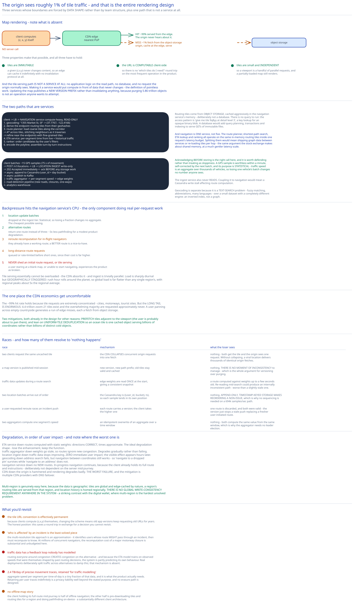

# Module 01 — Architecture & High-Level Design



## Monolith vs. microservices

Three services, and unusually the boundaries are forced by **data shape** rather than by team structure or deployment preference. [Module 00](./00-overview.md#the-feature-with-no-infrastructure-in-it-yet) laid out how different the three workloads are; here's why each difference is a seam.

**The tile-serving path is not a service at all.** Tiles are immutable static files with client-computable URLs, so the "architecture" is a CDN plus an object-storage origin. There is no application logic on the read path, no database, and no request the origin normally sees. Making this a service would put compute in front of data that never changes — the definition of pointless work.

**The navigation service is compute-heavy and read-only.** It loads routing tiles into memory and runs graph search. It scales on CPU, holds no durable state, and its working set (~10 GB of graph) fits on a node. Nothing about it resembles tile serving.

**The location ingest service is write-only and latency-insensitive.** It accepts batches, writes to Cassandra and Kafka, and returns `202`. It never reads. Coupling it to navigation would mean a Cassandra write stall affecting route computation.

**The geocoding service is separate** because it's a text-search problem — fuzzy matching, abbreviation handling, multiple languages — with a small dataset and a completely different engine (an inverted index, not a graph). Cross-ref [Search & Inverted Indexes](../../scalability-resilience/search-inverted-indexes.md).

What's deliberately **not** split: navigation is one service, not five. The route planner, shortest-path search, ETA lookup and ranking all operate on the same in-memory routing tiles within one request's latency budget. Splitting them would mean shipping graph data between services or re-loading tiles per hop — the same argument the [stock exchange](../stock-exchange/01-architecture-hld.md#monolith-vs-microservices) makes about shared memory, at a much gentler latency scale.

## Per-path walkthrough

**Map rendering path — note what's absent**

```
Client computes (z, x, y) from its own viewport and zoom     ← NO server call
   → GET https://tiles.cdn/{z}/{x}/{y}.mvt
   → CDN edge (PoP nearest the user)
        cache HIT (≈99%)  → served from the edge. The origin never hears about it.
        cache MISS        → fetch from object storage origin, cache at the edge, serve
   → client renders vector tiles locally (draws paths, applies its own style)
```

**The origin sees roughly 1% of tile traffic**, and that's the entire rendering design. Three properties make it possible, and all three have to hold:

- Tiles are **immutable** — a given `(z,x,y)` never changes content, so an edge can cache it indefinitely with no invalidation protocol.
- The URL is **computable client-side**, so there's no "which tiles do I need?" round trip.
- Tiles are **small and independent**, so a viewport is a handful of parallel requests and a partially-loaded map still renders.

Updating the map doesn't invalidate anything — it publishes a **new tile version** under a new path prefix (`/v42/{z}/{x}/{y}`), and clients pick it up on their next map-version fetch. Versioning rather than purging, exactly as [CDN](../../hld-building-blocks/cdn.md) argues generally: purging 5.86 trillion objects is not an operation anyone wants to attempt.

**Navigation path**

```
Client → LB → Navigation service
   1. Geocoding service: "1355 Market St, SF" → (37.7767, -122.4166)
   2. Determine the origin and destination routing tiles from their geohashes
   3. Route planner: load the coarse-level routing tiles along the corridor
        → shortest-path search (A*) across tiles, stitching neighbours as it traverses
        → refine near the endpoints using fine-grained tiles
   4. ETA service: predict travel time per segment from current + historical traffic (ML)
   5. Ranker: order candidate routes by the user's filters (avoid tolls, avoid motorways)
   6. Encode the polyline; assemble turn-by-turn instructions
   → 200 { route }
```

Routing tiles come from **object storage, cached aggressively in the navigation service's memory** — deliberately not a database. There's no query to run: the access pattern is "give me tile 9q8yy at detail level 3", which is a key lookup for an opaque binary blob. A database would add query planning, transactions and indexing to serve `GET`s of immutable files. Cross-ref [Object & Blob Storage](../../scalability-resilience/object-blob-storage.md).

**Location update path**

```
Client batches ~15 GPS samples (75 s of movement)
   → POST /v1/locations → LB → Location ingest service
        → 202 Accepted immediately            ← ack BEFORE any storage work
        → async: append to Cassandra (partitioned by user_id + day bucket)
        → async: publish to Kafka
             ├─ traffic aggregator → per-segment speed → routing tile edge weights
             ├─ road-detection pipeline (new roads, closures, one-way corrections)
             └─ analytics warehouse
```

**Acknowledging before storing is the right call here**, and it's worth defending rather than treating as sloppiness. A GPS sample is worthless within a minute, self-corrected by the next batch, and its purpose is *statistical* — traffic speed is an aggregate over thousands of vehicles, so losing one vehicle's batch changes no number anyone sees. This is the same self-correcting-data argument the [nearby friends](../nearby-friends/00-overview.md#what-dropped-points-are-acceptable-buys) design makes, and it's what permits `202` and fire-and-forget.

**Adaptive rerouting path**

```
Traffic aggregator detects an incident on routing tile r_7
   → look up which in-flight navigators' routes traverse r_7
   → recompute their routes; if materially better, push the alternative
   → client (WebSocket) receives the reroute offer
```

Finding "who is affected" is the interesting part and it's covered in [Module 03](./03-navigation.md#adaptive-rerouting).

## Building blocks

**CDN + object-storage origin** — 60 PB of immutable tiles. The CDN is doing the actual work; the origin is a cold backstop. Cross-ref [CDN](../../hld-building-blocks/cdn.md).

**Navigation service** — stateless, CPU-bound, with routing tiles cached in memory. Scales on request rate.

**Geocoding service** — an inverted index over street and place names, with fuzzy matching. Small dataset, read-mostly, heavily cached (the same addresses are searched repeatedly).

**Location ingest service** — stateless, write-only, returns `202`.

**ETA service** — an ML model predicting segment travel time from live speed, historical patterns by time-of-day and day-of-week, weather and events. Deliberately separate from the pathfinder: the *graph* changes rarely while the *weights* change constantly, so the model is retrained and redeployed on its own cadence.

**Traffic aggregator** — a Kafka stream consumer computing per-segment speeds and writing them where the ETA service and routing tiles can read them.

**Offline map-processing pipeline** — takes raw road data from many sources plus accumulated GPS traces and produces both map tiles and routing tiles. Runs on a batch cadence (hours to days). This is where most of the system's actual computation happens, entirely off the serving path.

**Cassandra** — location history. 2.4 TB/day, append-only, write-optimized.

**Kafka** — the fan-out from ingest to every downstream consumer. Cross-ref [Kafka & the Distributed Log](../../hld-building-blocks/kafka-distributed-log.md).

## Trade-offs to make explicit

| Decision | Chosen | Alternative | Why |
|---|---|---|---|
| Tile serving | **Precomputed static files on a CDN** | Render tiles on demand from vector data | Rendering per request puts compute in front of immutable data and destroys cacheability — every viewport becomes an origin hit. Precomputation moves the cost to a batch job that runs once per map version. |
| Tile URL resolution | **Computed client-side from (z,x,y)** | An API returning the tile URLs to fetch | Saves a round trip on every pan and zoom. Cost: the URL convention becomes near-permanent, since old clients keep computing old URLs for years. |
| Tile format | **Vector** | Raster (PNG) | 5–10× smaller, restyleable client-side, and scales smoothly between zoom levels. Costs client CPU and battery to render. [Module 02](./02-map-rendering.md#vector-tiles-versus-raster). |
| Map updates | **Publish a new version prefix** | Purge changed tiles at the edge | Purging across trillions of objects is impractical and slow. Versioning makes an update a publish, and rollback a pointer change. |
| Routing graph | **Hierarchical routing tiles** | One global in-memory graph | 10 GB fits in RAM, but A\* over 100M edges is far too slow interactively. Tiles bound the search to what it traverses; hierarchy bounds it further for long routes. [Module 03](./03-navigation.md). |
| Routing tile storage | **Object storage + in-memory cache** | A graph database | The access pattern is "fetch this immutable blob by key". A database would add query planning and transactions to serve file reads. |
| Location updates | **Batched (~15 samples), `202`, fire-and-forget** | One request per sample, acknowledged after storage | 15× fewer requests, and on a phone the radio is the dominant battery consumer — so batching serves the battery requirement first and the capacity requirement second. Samples are statistical and self-correcting, so loss is tolerable. |
| ETA | **A separate ML service** | Edge weights baked into the routing tiles | The graph changes rarely; the weights change constantly. Separating them lets the model retrain and redeploy without republishing tiles. |
| Reroute delivery | **WebSocket** | Mobile push notifications, or client polling | Push payloads are size-limited and unavailable on web; polling wastes radio wake-ups on a battery-constrained device. Cross-ref [Long Polling, WebSockets & SSE](../../scalability-resilience/long-polling-websockets-sse.md). |

## Load Handling

- **Peak-vs-average.** Sharply diurnal and geographically staggered — rush hour rolls around the planet, so global load is far flatter than any single region's. Regional peaks run ~5× the regional average. Tile traffic is absorbed by the CDN; navigation and ingest scale horizontally on stateless tiers.

- **Where backpressure kicks in first.** In the **navigation service's CPU**, because it's the only component doing real per-request computation. A long cross-country route loads many routing tiles and runs a large search. Tile serving essentially cannot be overloaded (the CDN absorbs it); ingest is trivially parallel.

- **What gets shed under overload**, in order:
  1. **Location update batches** — dropped at the ingest tier. They're statistical; losing a fraction changes no aggregate. Cheapest possible saving.
  2. **Alternative routes** — return one route instead of three. Cuts pathfinding work ~3× for a modest product degradation.
  3. **Reroute recomputation** for in-flight navigators — they have a working route already; a *better* route is a nice-to-have.
  4. **Long-distance route requests** get queued or rate-limited before short ones, since their cost is far higher.
  5. **Never shed:** an initial route request from a user who has none, and tile serving. A user staring at a blank map or unable to start navigating experiences the product as broken.

- **The cold-tile problem.** CDN economics depend on a ~99% hit rate, which holds because tile requests are extremely concentrated — cities, motorways, tourist sites. But the *long tail is enormous*: 4.4 trillion zoom-21 tiles exist and the overwhelming majority are requested approximately never. A user panning across empty countryside generates a run of edge misses, each a fetch from object storage. Mitigations: prefetch tiles adjacent to the viewport (the user is probably about to pan there), and use the uniform-tile deduplication from [Module 00](./00-overview.md#capacity-estimation) so an ocean tile is one cached object serving billions of coordinates rather than billions of distinct objects.

- **Autoscaling lag.** Navigation and ingest tiers autoscale in minutes, which comfortably tracks a rush hour that ramps over an hour. The offline pipeline isn't on the serving path at all. Nothing here has the "cannot autoscale" property that the [message queue's brokers](../distributed-message-queue/01-architecture-hld.md#load-handling) or the wallet's partitions do — a genuinely benign operational profile.

- **Load-test target.** Sustain 231,000 location batches/sec (peak, 15 samples each) plus 50,000 route requests/sec with p99 route latency under 1 second, while (a) confirming CDN hit rate stays above 95% under a synthetic pan across low-traffic regions, and (b) publishing a new map version mid-test and confirming zero elevated origin load (the version switch must not behave like a cache purge).

## Concurrent-User Handling

| Race | Mechanism | What the "loser" sees |
|---|---|---|
| Two clients request the same uncached tile simultaneously | The CDN **collapses** concurrent origin requests for one key into a single fetch, then serves both from the result. | Nothing — both get the tile, and the origin sees one request. Without request collapsing, a viral location could deliver thousands of identical origin fetches. |
| A map version is published while clients are mid-session | New version, new path prefix. Old tiles remain valid and cached. | Nothing. Clients continue on the old version and adopt the new one on their next version check. This is why versioning beats purging: **there is no moment of inconsistency to manage.** |
| Traffic data updates while a route is being computed | Edge weights are read once at the start of the search, giving a consistent snapshot for that computation. | A route computed against weights up to a few seconds old. Re-reading mid-search could produce an internally inconsistent path — worse than a slightly stale one. |
| Two location batches from one user arrive out of order | Cassandra's primary key is `(user_id, bucket), ts` — each sample is keyed by its own timestamp, so an out-of-order insert simply lands in the right position. | Nothing. **Append-only, timestamp-keyed storage makes reordering a non-issue**, which is why no sequencing is needed on a 694k samples/sec path. |
| A user requests a reroute while an incident-triggered reroute is being pushed | Each route carries a version; the client accepts the higher version and ignores the other. | One of the two routes is discarded. Both were valid, so either outcome is correct — the version just prevents a stale push from replacing a fresher user-initiated route. |
| Two traffic aggregators compute the same segment's speed | Segment speed is an idempotent overwrite (last write wins) of an aggregate over a time window. | Nothing — both compute the same value from the same window. This is why the aggregator needs no leader election. |

## Scaling & Reliability

- **Horizontal scaling.** Tiles scale by adding CDN capacity — a purchasing decision, not an engineering one. Navigation and ingest are stateless tiers. Cassandra scales linearly on `(user_id, bucket)`. The offline pipeline is a batch cluster.

- **Circuit breaker** around the ETA service. If it's unavailable, navigation **falls back to static edge weights** (speed limits and historical averages) rather than failing. The route is still correct; only the time estimate degrades. That's the ideal degradation shape: lose the enhancement, keep the function. Cross-ref [Circuit Breakers & Retries](../../scalability-resilience/circuit-breakers-retries.md).

- **Retries.** Tile fetches retry against a different edge. Route requests are idempotent (same inputs, same route) so they retry freely. Location batches are **never** retried by the server — the next batch supersedes them.

- **Graceful degradation**, in order of user impact:
  1. **ETA service down** → routes computed with static weights. Directions correct, times approximate.
  2. **Traffic aggregator down** → weights go stale; routes ignore new congestion. Degrades gradually rather than failing.
  3. **Location ingest down** → traffic data stops improving. **Zero immediate user impact** — the visible effect appears only after weights go stale, hours later.
  4. **Geocoding down** → address search fails, but navigation between coordinates still works. So "navigate to a dropped pin" survives while "navigate to an address" doesn't.
  5. **Navigation service down** → no new routes. In-progress navigation continues, because **the client already holds its full route and instructions.** Worth emphasising: the client is deliberately not dependent on the server mid-journey, which is also what makes offline navigation possible.
  6. **CDN down** → origin is hammered and rendering degrades badly. This is the worst failure, and the mitigation is multiple CDN providers with DNS failover. Cross-ref [DNS, Anycast & Global Traffic Management](../../hld-building-blocks/dns-global-traffic.md).

- **Multi-region.** Genuinely easy here, for the same reason as [nearby friends](../nearby-friends/03-db-design.md#scaling-the-schema): the data is geographic. Tiles are global and edge-cached by nature. Routing tiles for a region are served from that region. Location history is homed regionally. There is no global write consistency requirement anywhere in the system — a striking contrast with the [digital wallet](../digital-wallet/06-interviewer-qna.md), where multi-region is the hardest unsolved problem.

## What you'd revisit as this grows

- **The tile URL convention is effectively permanent.** Because clients compute `(z,x,y)` themselves, changing the scheme means old app versions keep requesting old URLs for years. [Module 02](./02-map-rendering.md#why-the-client-computes-the-tile-url) covers the hedge (a server-side URL-resolution API for clients that opt in), and the honest position is that this saves a round trip in exchange for a decision you cannot revisit.

- **Adaptive rerouting's "who is affected" lookup is the design's least-solved piece.** [Module 03](./03-navigation.md#adaptive-rerouting) presents the multi-resolution tile-set approach, and it's an approximation: it can identify users whose route *might* pass through an incident, then must recompute to know. At millions of concurrent navigators, the recomputation cost of a major motorway closure is substantial and unbudgeted here.

- **Traffic data has a feedback loop nobody has modelled.** Routing everyone around congestion creates congestion on the alternative — and because the ETA model is trained on observed speeds that were themselves shaped by past routing decisions, the system is partly predicting its own behaviour. Real deployments deliberately split traffic across alternatives to damp this, and that mechanism is absent here.

- **Location history is 2.4 TB/day of precise movement traces with a retention policy of "for traffic modelling".** Aggregate speed per segment per time-of-day is a tiny fraction of that data, and it's what the product actually needs. Retaining per-user traces indefinitely is a privacy liability well beyond the stated purpose, and there's no erasure path designed — the same gap the [nearby friends](../nearby-friends/03-db-design.md#what-youd-revisit-as-this-grows) case study has, at 2× the volume.

- **No offline-map story.** The client holding its full route mid-journey is half of offline navigation; the other half is pre-downloading tiles and routing tiles for a region, and doing pathfinding on-device. That's a substantially different client architecture and it isn't designed here.
