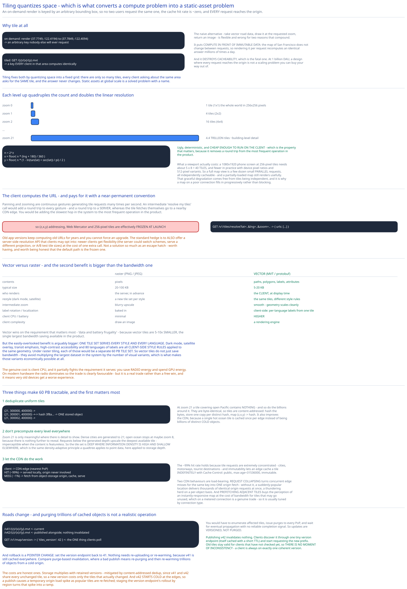

# Module 02 — Map Rendering



## Why tile at all

The naive alternative is to render the requested region on demand: take vector road data, draw it at the requested zoom, return an image. It's flexible, and it's wrong for two reasons that compound.

**It puts compute in front of immutable data.** The map of San Francisco doesn't change between requests, so rendering it per request means recomputing an identical answer millions of times a day.

**It destroys cacheability**, which is the fatal one. An on-demand render is keyed by an arbitrary bounding box — `(37.7749, -122.4194) to (37.7849, -122.4094)` — and no two users request exactly the same box. So the cache hit rate is approximately zero and **every request reaches the origin.** At 1 billion DAU that's not a scaling problem you can buy your way out of.

Tiling fixes both by **quantizing space into a fixed grid**. There are only so many tiles, every client asking about the same area asks for the *same tile*, and the answer never changes. That's what converts a compute problem into a static-asset problem — and static assets at global scale is a solved problem with a name: a CDN.

## The tiling scheme

```
Zoom 0:  1 tile        (1×1)          the whole world in 256×256 pixels
Zoom 1:  4 tiles       (2×2)
Zoom 2:  16 tiles      (4×4)
...
Zoom z:  4^z tiles     (2^z × 2^z)
Zoom 21: 4.4 trillion tiles           ~building-level detail
```

Each level up **quadruples** the count and doubles the linear resolution. A tile is addressed by `(z, x, y)` where `x` and `y` are its column and row at that zoom:

```
https://tiles.cdn.example.com/{z}/{x}/{y}.mvt
```

Converting a coordinate to a tile index under Web Mercator:

```
n = 2^z
x = floor( n × (lng + 180) / 360 )
y = floor( n × (1 − ln(tan(lat_rad) + sec(lat_rad)) / π) / 2 )
```

Ugly, deterministic, and **cheap enough to run on the client** — which is the property that matters.

**What a viewport actually costs.** A 1080×1920 phone screen at 256-pixel tiles needs about ⌈1080/256⌉ × ⌈1920/256⌉ = 5 × 8 = **40 tiles**, and fewer in practice because of device pixel ratios and 512-pixel tile variants. So a full map view is a few dozen small parallel requests, all independently cacheable, and a partially-loaded map still renders usefully. That graceful-degradation property comes free from tiles being independent, and it's why a map on a poor connection fills in progressively rather than blocking.

## Why the client computes the tile URL

The client knows its own viewport and zoom, so it can compute exactly which tiles it needs and fetch them directly. **No API call to ask "which tiles do I need?"**

That matters more than it sounds. Panning and zooming are continuous gestures generating tile requests many times per second. An intermediate "resolve my tiles" call would add a round trip to every gesture — and it would be a round trip to a *server*, whereas the tile fetches themselves go to a nearby CDN edge. You'd be adding the slowest hop in the system to the most frequent operation in the product.

**The cost is that the URL convention becomes near-permanent.** Old app versions keep computing old URLs for years, and you cannot force an upgrade. So `(z,x,y)` addressing, Web Mercator, and 256-pixel tiles are effectively frozen at launch.

The standard hedge is to *also* offer a server-side URL-resolution API that clients may opt into:

```
GET /v1/tiles/resolve?lat=…&lng=…&zoom=…  → { "urls": [ … ] }
```

Newer clients can use it and get flexibility (the server could switch schemes, serve a different projection, or A/B test tile sizes) at the cost of one extra call. It's not a solution so much as an escape hatch — worth having, and worth being honest that the default path is the frozen one.

## Vector tiles versus raster

A tile can carry either a rendered **image** or the **geometry** to render.

| | Raster (PNG/JPEG) | **Vector (MVT / protobuf)** |
|---|---|---|
| Contents | Pixels | Paths, polygons, labels, attributes |
| Typical size | 20–100 KB | **5–20 KB** |
| Who renders | The server, in advance | **The client, at display time** |
| Restyle (dark mode, satellite) | New tile set per style | **Same tiles, different style rules** |
| Intermediate zoom | Blurry upscale | **Smooth — geometry scales cleanly** |
| Label rotation / localization | Baked in | **Client-side, so per-language labels from one tile** |
| Client CPU / battery | Minimal | **Higher** |
| Client complexity | Draw an image | A rendering engine |

**Vector wins on the requirement that matters most.** [Module 00](./00-overview.md#requirements) makes "data and battery frugality" a first-class requirement, and vector tiles are **5–10× smaller** — the single largest bandwidth saving available in the product.

Then there's a benefit that's easy to overlook and is arguably bigger: **one tile set serves every style and every language.** Dark mode, satellite overlay, transit-emphasis, high-contrast accessibility, and 80 languages of labels are all *client-side style rules* applied to the same geometry. Under raster tiling, each of those would be a **separate 60 PB tile set.** Vector tiles don't just save bandwidth; they avoid multiplying the largest dataset in the system by the number of visual variants — which is what makes those variants economically possible at all.

The genuine cost is client CPU, and it partially fights the battery requirement it serves: you save radio energy and spend GPU energy. On modern hardware that trade is clearly favourable (the radio dominates), but it's a real trade rather than a free win, and it means very old devices get a worse experience.

## Serving 60 PB

[Module 00](./00-overview.md#capacity-estimation) computed ~5.86 trillion tiles across zoom 0–21, ~60 PB at 10 KB each. Three things make that tractable, and the first is the most important.

### Deduplicate uniform tiles

Most of the Earth is ocean, ice, desert or unbroken forest. At zoom 21, a tile covering open Pacific contains **nothing** — and so do the billions of tiles around it. They are byte-identical.

So tiles are content-addressed: hash the tile's bytes, store one copy per distinct hash, and map `(z,x,y) → hash`. One blue tile is referenced by billions of coordinates.

```
(21, 300000, 400000) ─┐
(21, 300001, 400000) ─┼─→ hash 3f8a… → ONE stored object ("empty ocean")
(21, 300002, 400000) ─┘
```

This reduces real storage by orders of magnitude, and it's why quoting 60 PB as *the answer* is a mistake — the naive figure is a ceiling, not an estimate. It also improves the CDN: a single hot ocean tile is cached once at each edge instead of being billions of distinct cold objects, which directly attacks the cold-tile problem in [Module 01](./01-architecture-hld.md#load-handling).

### Don't precompute every level everywhere

Zoom 21 is only meaningful where there's detail to show. Dense cities are generated to zoom 21; open ocean stops at maybe zoom 8, because there is nothing further to reveal. Requests below the generated depth are served by upscaling the deepest available tile — imperceptible when the content is featureless.

So the tile set is **deep where information density is high and shallow elsewhere**, which is the same density-adaptive principle a [quadtree](../../hld-building-blocks/geospatial-indexing.md#option-3-quadtree) applies to point data, here applied to storage depth.

### Let the CDN do the work

```
Client → CDN edge (nearest PoP)
   HIT  (≈99%) → served locally, origin never involved
   MISS ( ≈1%) → fetch from object-storage origin, cache at the edge, serve
```

The ~99% hit rate holds because tile requests are extremely concentrated — cities, motorways, tourist destinations. Combined with immutability, an edge can cache a tile **indefinitely** with `Cache-Control: public, max-age=31536000, immutable`.

Two CDN behaviours are load-bearing:

- **Request collapsing.** Concurrent edge misses for the same key become **one** origin fetch. Without it, a suddenly-popular location would deliver thousands of identical origin requests simultaneously — a thundering herd on a per-object basis.
- **Prefetching adjacent tiles.** The client requests the tiles just outside its viewport, because a panning user is about to need them. Costs bandwidth for tiles that may go unused; buys the perception of an instantly-responsive map. On a metered connection this is a genuine trade, which is why it's usually tuned by connection type.

Cross-ref [CDN](../../hld-building-blocks/cdn.md).

## Updating the map without purging

Roads change. A tile's content must change — but tiles are cached indefinitely at thousands of edges, and **purging is not a realistic operation** at trillions of objects: you'd need to enumerate affected tiles, issue purges to every PoP, and wait for eventual propagation, with no reliable completion signal.

So updates are **versioned, not purged**:

```
/v41/{z}/{x}/{y}.mvt        ← current
/v42/{z}/{x}/{y}.mvt        ← published alongside; nothing invalidated

GET /v1/map/version → { "tiles_version": 42 }     ← the ONE thing clients poll
```

Publishing v42 invalidates nothing. Clients discover it via a single tiny version endpoint (itself cached with a short TTL) and start requesting the new prefix. Old tiles remain valid for clients that haven't checked yet, so **there is no moment of inconsistency** — a client is always on exactly one coherent version.

Rollback is a pointer change: set the version endpoint back to 41. Nothing needs to be re-uploaded or re-warmed, because v41 is still cached everywhere. That's a genuinely valuable operational property — compare purge-based invalidation, where a bad publish means re-purging and then re-warming trillions of objects from a cold origin.

The costs are honest ones: **storage multiplies with retained versions** (mitigated by content-addressed dedup — v41 and v42 share every unchanged tile, so a new version costs only the tiles that actually changed), and **v42 starts cold at the edges**, so a publish causes a temporary origin load spike as popular tiles are re-fetched. Staged rollout of the version endpoint by region turns that spike into a ramp.

This is the same versioning-over-invalidation argument [CDN](../../hld-building-blocks/cdn.md) makes generally and the [cache invalidation](../../../cache-invalidation/00-overview.md) deep dive works through in detail; map tiles are close to the strongest case for it, because purging is not merely inefficient here but operationally infeasible.

## Practice: extend it yourself

1. **Design the tile-generation pipeline.** Raw road data changes for a region; you must regenerate affected tiles across all zoom levels. Work out: how you determine which `(z,x,y)` tiles a changed road segment touches (at every zoom level), how content-addressed deduplication lets you skip re-uploading unchanged tiles, and how you decide whether a change is worth publishing a new global version for versus batching it with others. Then estimate the origin load spike when the version flips, and design the staged rollout that flattens it.
2. **Add a satellite-imagery layer.** Satellite tiles are raster (you cannot vectorize a photograph), much larger (~100 KB), and updated on a per-region schedule as new imagery arrives. Work out what breaks about the single-global-version scheme when different regions update independently, whether satellite tiles should share the road tiles' version namespace or have their own, and how a client composites a raster base layer with vector road overlays while keeping both independently cacheable.
