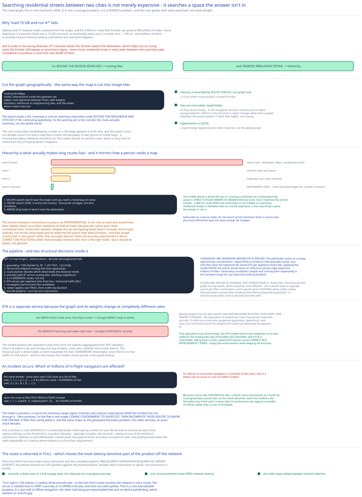

# Module 03 — Navigation & Routing



## The problem isn't size, it's search

[Module 00](./00-overview.md#capacity-estimation) found the road graph is **~10 GB** — 50M intersections, 100M edges. That fits in one machine's RAM, which makes the naive plan tempting: load the whole graph, run A\*, done.

It fails on **search cost**, not storage. Dijkstra and A\* expand nodes outward from the origin, and for a 600 km route that frontier can grow to millions of nodes. Every expansion is a pointer-chase into a 10 GB structure — so essentially every one is a cache miss, ~100 ns, and millions of them is seconds of pure memory-latency stall before any real work.

And it scales badly in the wrong direction: **cost grows with the geographic area searched, not with route length.** A\*'s heuristic biases the frontier toward the destination, which helps, but on a long route the frontier still sweeps an enormous region — every minor residential street in every town between here and there gets considered, to produce a route that uses none of them.

So the two techniques below attack exactly that: **bound the region searched**, and **remove irrelevant detail from the search**.

## Routing tiles

Cut the graph geographically, the same way the map is cut into image tiles ([Module 02](./02-map-rendering.md#why-tile-at-all)):

```
Routing tile 9q8yy:
   nodes:    intersections inside this geohash cell
   edges:    road segments between them, with weights
   boundary: references to neighbouring tiles, and the nodes where roads cross out
```

The search loads a tile, traverses it, and when it reaches a boundary node it **fetches the neighbouring tile and stitches it in**, continuing seamlessly. So the working set is the corridor the route actually traverses, not the whole world.

Three properties fall out:

- **Memory is bounded by route length**, not by graph size. A 10 km urban route touches a handful of tiles.
- **Tiles are immutable, keyed blobs**, so they cache trivially — in the navigation service's memory, and in object storage behind it. Same reasoning as map tiles, which is why [Module 01](./01-architecture-hld.md#per-path-walkthrough) uses object storage rather than a graph database: the access pattern is "fetch blob 9q8yy", not a query.
- **Regeneration is local.** A road change re-generates the tiles it touches, not the global graph.

The cost is boundary bookkeeping: a node on a tile edge appears in both tiles, and the search must not double-count it or lose a road that crosses the boundary. That's a real source of subtle bugs — a missing boundary reference manifests as "the router refuses to use this road", which is very hard to notice and very annoying when it happens.

## Hierarchy is what actually makes long routes fast

Routing tiles alone aren't enough. A 600 km route still traverses hundreds of fine-grained tiles, each dense with residential streets that no long-distance route would ever use.

The fix is **multiple levels of detail**, and it mirrors how a person reads a map:

```
Level 0 (finest):  every road — driveways, alleys, residential streets
Level 1:           arterial roads and above
Level 2:           highways and major arterials
Level 3 (coarsest): motorways only — a few thousand edges for a whole continent
```

A long route is then computed in three phases:

```
1. Escape:  search level 0 near the origin until you reach a motorway on-ramp
2. Cruise:  search LEVEL 3 across the country — tiny graph, thousands of edges not millions
3. Arrive:  drop back to level 0 near the destination
```

**The middle phase is where the win is.** Crossing a continent on a motorway-only graph is a search over thousands of edges instead of tens of millions — three to four orders of magnitude less work. And it matches the correct answer: a 600 km route *does* use motorways in the middle, so searching residential streets in between wasn't merely expensive, it was **searching a space the answer isn't in.**

This is the same idea as the [message queue's sparse index](../distributed-message-queue/02-storage-engine.md#the-sparse-index): don't index (or search) at full resolution when a coarse pass plus local refinement gets the same answer far cheaper.

The honest limitation: hierarchical routing is an **approximation**. It can miss a route that would have been slightly faster via a clever sequence of arterial roads, because the coarse pass never considered them. Production systems mitigate this by overlapping levels (level 3 includes some major arterials, not strictly motorways) and by widening the search near junctions between levels — and they accept that the returned route is "very good" rather than provably optimal. Given the accuracy requirement is about *correct instructions* rather than *provably minimal time*, that's the right trade, but it should be stated rather than glossed.

## The navigation pipeline

```
GET /v1/nav?origin=…&destination=…&mode=driving&avoid=tolls

1. Geocoding service     "1355 Market St, SF" → (37.7767, -122.4166)
                          → derive the origin/destination routing tiles from geohashes
2. Route planner         orchestrates; decides which detail levels to use for this distance
3. Shortest-path service A* across routing tiles, stitching neighbours as it traverses
                          → produces 2-3 CANDIDATE routes, not one
4. ETA service           per-segment travel time from live + historical traffic (ML)
                          → re-weights and re-scores the candidates
5. Ranker                applies user filters (avoid tolls / motorways / ferries),
                          then orders by predicted duration
6. Encode                polyline + turn-by-turn instructions
```

Two structural decisions in there.

**Candidates are generated before ETA is applied.** The pathfinder works on a cheap approximate cost (distance ÷ speed limit) to produce a few plausible routes, and only then does the expensive ML-based ETA get applied to those few. Applying the model *inside* the search would mean an inference call per edge expansion — millions of them. Generating candidates cheaply and scoring them expensively is the standard shape for any expensive-ranking problem, and it's exactly what the [search engine](../search-engine/00-overview.md) case study does with retrieval-then-ranking.

**Filters are applied at ranking, not during search.** "Avoid tolls" *could* prune the graph during search, which would be more efficient — but it would mean a separate search per filter combination, and it would return nothing when a filter makes the destination unreachable. Ranking-time filtering lets the system degrade gracefully: "no toll-free route exists; here's the best one with tolls."

## ETA is a separate service on purpose

The pathfinder needs edge weights. The obvious design bakes them into the routing tiles. That's wrong, and the reason is a clean separation of change rates:

```
The GRAPH   (which roads exist, how they connect)  changes RARELY   — days/weeks
The WEIGHTS (how long each takes right now)        change CONSTANTLY — seconds
```

Baking weights into tiles would mean **republishing routing tiles every time traffic changed** — the equivalent of re-publishing a map version every few seconds. So tiles carry static properties (geometry, speed limit, road class, turn restrictions) and **live weights are looked up separately** by segment id.

That separation buys three things: the ETA model retrains and redeploys on its own cadence; the routing tiles stay immutable and cacheable; and if ETA is unavailable, [Module 01](./01-architecture-hld.md#scaling-reliability)'s fallback to static speed limits leaves routes **correct but approximately timed** — losing the enhancement while keeping the function.

The model itself predicts per-segment travel time from live speeds (aggregated from GPS samples), historical patterns by time-of-day and day-of-week, road class, weather, and known events. Historical data is what makes a route requested for 8am tomorrow meaningful, since there's no live traffic for the future — a point worth making, because it's the reason the model can't just be a live-speed lookup.

## Adaptive rerouting

An incident occurs on a road segment. Which of millions of in-flight navigators are affected?

The naive answer is to store each user's full route as a list of tiles and scan for the affected one:

```
user_1: r_1, r_2, r_3, …, r_k          # a 600 km route = hundreds of tiles
user_2: r_4, r_6, r_9, …, r_n
```

At millions of concurrent navigators × hundreds of tiles each, that's a billion-row structure to scan on every incident.

**The trick is to store the route at multiple resolutions instead.** Because coarse tiles *contain* fine tiles, a user's whole route can be summarized as a small set of progressively coarser tiles:

```
user_1: r_1, super(r_1), super(super(r_1)), …    # a handful of entries, not hundreds
```

Now the check is: **does the incident's tile fall within any of the user's coarse tiles?** A containment test against a handful of entries rather than a scan of hundreds.

The trade is precision. A coarse tile covering a large region will match users whose route passes *near* the incident but not through it — false positives. So the flow is two-stage: **coarse containment to shortlist candidates, then recompute their routes to know for certain.** That's a filter-then-verify pattern, and it's the same shape as the [geospatial boundary problem](../../hld-building-blocks/geospatial-indexing.md#the-boundary-problem): the index narrows, then an exact check decides.

And a reroute is only *offered* if it's materially better. Interrupting a driver to save 40 seconds is a worse product than saying nothing, so the threshold is a product decision (typically minutes, not seconds) sitting on top of the technical mechanism.

**Delivery** is over WebSocket. Mobile push has payload limits and doesn't exist on web; polling would wake the radio repeatedly on a device where [Module 00](./00-overview.md#requirements) makes battery a first-class requirement. SSE would work for this one-directional case, but WebSocket's bidirectionality is useful for the same connection to carry the client's own updates. Cross-ref [Long Polling, WebSockets & SSE](../../scalability-resilience/long-polling-websockets-sse.md).

## Why the client holds the whole route

The route is returned in full — every step, every instruction, the complete polyline — and this is deliberate.

Once the client has it, **mid-journey navigation requires no server contact.** The phone matches its GPS position against the stored polyline, decides which instruction to speak, and announces it locally. So:

- A tunnel, a dead zone, or a full navigation-service outage doesn't interrupt an in-progress journey ([Module 01](./01-architecture-hld.md#scaling-reliability)).
- Turn announcements have **zero network latency**, which matters because "turn right in 100 metres" is useless 3 seconds late.
- The radio stays asleep between location batches.

The server is needed only to *start* a journey or to *offer* a reroute, and both are interruptible. That's a rare and valuable property: the most latency-sensitive part of the product (the actual turn instruction) has been moved entirely off the network.

It's also half of offline navigation — the other half being pre-downloaded tiles and on-device pathfinding, which [Module 01](./01-architecture-hld.md#what-youd-revisit-as-this-grows) names as an unbuilt gap.

## Practice: extend it yourself

1. **Design the level-transition logic.** Given an origin and destination, decide which detail level to use for the cruise phase and where exactly to switch levels. Work out: what distance threshold justifies each level, how you find the "entry point" from level 0 to level 3 (searching level 0 outward until you hit a motorway can itself be expensive in a city far from one), and construct a concrete case where hierarchical routing returns a measurably worse route than a full level-0 search — then decide whether you'd accept it.
2. **Handle a major motorway closure.** An incident closes a motorway carrying 50,000 in-flight navigators. Work out the coarse-containment shortlist size, the cost of recomputing 50,000 routes, and the second-order problem: every reroute sends traffic onto the same alternative, which the ETA model will observe as newly congested — potentially rerouting everyone again. Design the damping mechanism (splitting reroutes across alternatives, or rate-limiting reroute offers) and state what it costs in individual optimality. [Module 01](./01-architecture-hld.md#what-youd-revisit-as-this-grows) flags this feedback loop as unmodelled.
