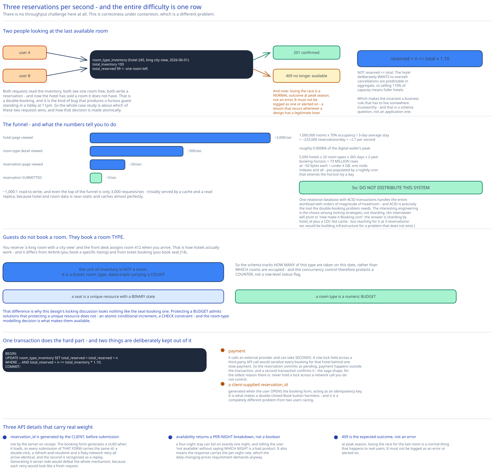

# Module 00 — Overview



## The feature, with no infrastructure in it yet

Browse hotels, look at a room type, pick some dates, pay, get a confirmation. Later, maybe cancel.

The volume is startlingly low — [Capacity Estimation](#capacity-estimation) works out to about **3 reservations per second** — and that's what makes this an interesting design problem rather than a boring one. **There is no throughput challenge here at all.** The entire difficulty is a single race condition:

> Two people are looking at the last available room. Both click "book". Both requests read the inventory, both see one room free, both write a reservation. Now the hotel has sold a room it doesn't have.

That's a double-booking, and it's the kind of bug that generates a furious guest standing in a lobby at 11pm. So this case study is really about **correctness under concurrency at low volume**, which is a genuinely different problem from the high-throughput designs elsewhere in this guide — and it means the answer is a careful choice among three locking strategies rather than a distributed architecture.

There's a second wrinkle that makes it more subtle than a straightforward "don't oversell" problem: **the hotel deliberately wants to oversell.** Cancellations are predictable in aggregate, so selling 110% of capacity means fuller hotels. So the invariant isn't `reserved <= total` — it's `reserved <= total × 1.10`, which is a business rule that has to live somewhere trustworthy.

## Requirements

**Functional:**
- Show a hotel page and a room-type page with availability for a date range.
- **Reserve** rooms of a given *type* for a date range, paid in full at booking.
- **Cancel** a reservation.
- An **admin panel** for staff to manage hotels, rooms and rates.
- **Support deliberate overbooking** — up to 110% of capacity.
- Room **prices change daily** — the rate for a Tuesday in June is not the rate for the Saturday.

**Non-functional:**
- **Scale:** a chain of 5,000 hotels, 1 million rooms total.
- **High concurrency:** peak season means many users converging on the same popular hotel and dates. The *aggregate* rate is low; the *contention* on a single hot row is the problem.
- **Correctness over latency:** a reservation taking two seconds is fine. A double-booking is not. This ordering is explicit and it licenses several decisions later — most importantly, it's why a lock-based approach is even on the table.
- **Availability:** 99.9%. Browsing must survive; booking may briefly fail.

## The requirement that changes the data model

Interviewers reliably probe this, and it's easy to get wrong in a way that quietly breaks everything downstream.

**Guests do not book a specific room. They book a room *type*.**

You reserve "a king room with a city view" and the front desk assigns room 412 when you arrive. That's how hotels actually work, and it differs from how Airbnb works (where you book a specific listing) and from how [ticket booking](../ticket-booking-system/00-overview.md) works (where you book seat J14).

The consequence is significant: the unit of inventory is **not a room**, it's a **(hotel, room type, date) triple with a count**. So the schema tracks *how many of this type are taken on this date* rather than *which rooms are occupied*, and the concurrency control protects a **counter**, not a row-level status flag.

That's why this design's locking discussion looks different from the seat-booking one: a seat is a unique resource with a binary state, and a room type is a numeric budget. Protecting a budget admits solutions (an atomic conditional increment, a `CHECK` constraint) that protecting a unique resource does not.

## Capacity Estimation

Method from [Back-of-the-Envelope Estimation](../../foundations/back-of-envelope-estimation.md).

**Reservations**
- 1,000,000 rooms × 70% occupancy ÷ 3-day average stay = **~233,000 reservations/day**
- ÷ 86,400 = **~2.7 reservations/sec.**

Under three per second. For context, that's roughly **0.0008%** of the [digital wallet's](../digital-wallet/00-overview.md) peak. A single modest database handles this without noticing.

**Read traffic, via the funnel**

Reservations are the bottom of a funnel, and the layers above are where the actual request volume lives. Assuming ~10% conversion at each step:

| Step | Rate |
|---|---|
| Reservation submitted | ~3/sec |
| Reservation page viewed | ~30/sec |
| Room-type detail viewed | ~300/sec |
| Hotel page viewed | ~3,000/sec |

So the system is **~1,000:1 read-to-write**, and even the top of the funnel is only 3,000 requests/sec — trivially served by a cache and a read replica. Hotel and room data is near-static, so it caches almost perfectly.

**Inventory table size**

The central table has one row per (hotel, room type, date):

```
5,000 hotels × 20 room types × 365 days × 2 years booking horizon = 73 million rows
```

**73 million rows.** At ~50 bytes each that's under 4 GB — comfortably a single node, indexes and all. Rows are pre-populated by a nightly cron job that extends the horizon by a day.

**What the numbers tell you to do.** Everything above says: **do not distribute this system.** One relational database with ACID transactions handles the entire workload with orders of magnitude of headroom, and ACID is precisely the tool the double-booking problem needs. The interesting engineering is [Module 02](./02-concurrency.md)'s choice among locking strategies, not sharding.

The one honest caveat: an interviewer will often pivot to "now make it Booking.com, 1,000× the traffic." [Module 03](./03-db-design.md#scaling-the-schema) handles that, and the answer is sharding by `hotel_id` plus a CDC-fed cache — but reaching for it at 3 reservations/sec would be building infrastructure to solve a problem that doesn't exist.

## Approach Walkthrough

**One relational database, and let it do the hard part.**

Availability is a single indexed range scan over `room_type_inventory`. A reservation is a **single transaction** that checks the count and increments it atomically. The double-booking race is solved by pushing the atomicity requirement into the one component that can actually enforce it — the same principle that recurs throughout this guide, and here the component is a plain `UPDATE`.

The overbooking allowance rides along inside the same check: instead of `reserved + n <= total`, the condition is `reserved + n <= total × 1.10`. One expression, evaluated atomically, encoding a business rule.

Two things sit outside that transaction:

- **Payment**, because it calls an external provider and can take seconds. A row lock held across a third-party API call would serialize every booking for that hotel behind one slow payment. So the reservation commits as `pending`, payment happens outside the transaction, and a second transaction confirms it — the [saga](../../hld-building-blocks/distributed-transactions-saga.md) shape, for the reason [Optimistic vs Pessimistic Concurrency Control](../../database-design/optimistic-vs-pessimistic-locking.md) gives: never hold a lock across a network call you don't control.
- **A client-supplied `reservation_id`**, generated when the user opens the booking form, acting as an **idempotency key**. It's what makes a double-clicked "Book" button harmless, and it's a different problem from two users racing — [Module 02](./02-concurrency.md#two-different-races) separates them.

## API Surface

```
# Hotel & room (read-heavy, aggressively cached)
GET    /v1/hotels/{id}
GET    /v1/hotels/{id}/room-types/{typeId}
GET    /v1/hotels/{id}/availability?room_type_id=&start=2026-06-01&end=2026-06-04
       → { "available": true, "nights": [ {date, available_count, rate_minor} ] }

# Admin (staff only, behind a VPN / internal gateway)
POST   /v1/hotels                       PUT /v1/hotels/{id}       DELETE /v1/hotels/{id}
POST   /v1/hotels/{id}/rooms            PUT  /v1/hotels/{id}/rooms/{roomId}
PUT    /v1/hotels/{id}/rates            { room_type_id, date, rate_minor }

# Reservations
POST   /v1/reservations
  {
    "reservation_id": "13422445-...",     # CLIENT-generated, the idempotency key
    "hotel_id":     "245",
    "room_type_id": "12354673389",
    "room_count":   3,
    "start_date":   "2026-06-01",
    "end_date":     "2026-06-04",
    "guest":        { … }
  }
  → 201 { reservation_id, status: "confirmed", total_minor, currency }
  → 200 { … }   replay of the same reservation_id — returns the original result
  → 409 the requested dates are no longer available
  → 402 payment failed
  → 422 invalid date range (end <= start, or beyond the booking horizon)

GET    /v1/reservations                 → the current user's history
GET    /v1/reservations/{id}
DELETE /v1/reservations/{id}            → 204, and inventory is released
```

Three API details worth noticing:

**`reservation_id` is generated by the client, before submission.** Not by the server on receipt. The booking form generates a UUID when it loads, so every submission of *that form* carries the same id. A double-click, a browser refresh-and-resubmit, or a flaky-network retry all arrive with an identical id and the second one is recognised as a replay. Generating it server-side would defeat the whole mechanism, because each retry would look like a fresh request.

**Availability returns a per-night breakdown**, not a single boolean. A four-night stay can fail on exactly one night, and telling the user "not available" without saying *which night* is a bad product. It also means the response carries the per-night rate, which the daily-changing-prices requirement demands.

**`409` for "no longer available" is the expected outcome, not an error.** At peak season, losing the race for the last room is a normal thing that happens to real users. It must not be logged as an error or alerted on — a lesson that recurs whenever a design has a legitimate loser.

## Where this goes next

| Module | The question it answers |
|---|---|
| [01 · Architecture & HLD](./01-architecture-hld.md) | What are the boxes, and why is this deliberately *not* a distributed system? |
| [02 · Concurrency & Double Booking](./02-concurrency.md) | **Two users, one room. Pessimistic, optimistic, or a database constraint?** With the reasoning for each. |
| [03 · DB Design](./03-db-design.md) | The inventory model, why it's a counter rather than a room, and how it scales if it has to. |
| [04 · Interviewer Q&A](./04-interviewer-qna.md) | The ten follow-ups this design invites. |
