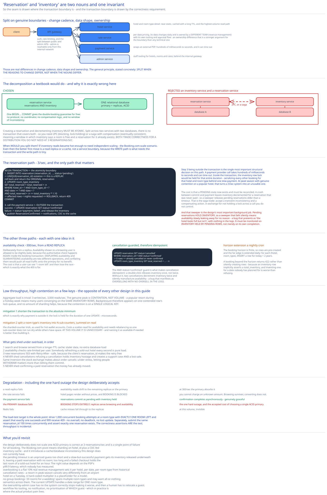

# Module 01 — Architecture & High-Level Design



## Monolith vs. microservices

This design makes a deliberate compromise that interviewers like to attack, and the attack is worth welcoming because the answer is the interesting part.

**Services are split** — hotel service, rate service, reservation service, payment service, admin service — on genuine boundaries. Hotel and room data is near-static and cached hard. Rates change daily and are owned by a revenue-management team. Payment talks to external providers. Those are real differences in change cadence, data shape and ownership.

**But the reservation service and the inventory it mutates stay in ONE service, sharing ONE database.**

A textbook microservice decomposition would separate them — an inventory service owning availability, a reservation service owning bookings. That's exactly what you must not do here, and the reason is the whole point of the design:

> Creating a reservation and decrementing inventory **must be atomic.** Split across two services with two databases, there is no transaction that covers both. You'd need [2PC](../digital-wallet/02-distributed-transactions.md#option-1-two-phase-commit) (blocking, lock-holding) or a [saga](../../hld-building-blocks/distributed-transactions-saga.md) with compensation (eventually consistent — meaning a window in which inventory says a room is free and a reservation for it already exists). **Both of those trade correctness for a distribution you don't need at 3 reservations/sec.**

So the seam is drawn where the transaction boundary is, and the transaction boundary is drawn by the correctness requirement. Keeping them together means one `BEGIN … COMMIT` gives the double-booking guarantee for free, with no protocol, no coordinator, no compensation logic, and no window of inconsistency.

**When would you split them?** If inventory reads became so hot that they needed independent scaling — which is the Booking.com-scale scenario in [Module 03](./03-db-design.md#scaling-the-schema). Even then the better first move is a read replica or a cache, not a service boundary, because the *write* path is what needs the transaction and the write path is tiny.

This is the general principle stated concretely: **split when the reasons to change differ, not when the nouns differ.** "Reservation" and "inventory" are two nouns and one invariant.

## Per-path walkthrough

**Availability check (read, ~300/sec)**

```
Client → CDN (static assets) → API gateway → Hotel service
   → Redis cache: hotel + room-type detail (near-static, long TTL)
   → Reservation service → read replica:
        SELECT date, total_inventory, total_reserved
          FROM room_type_inventory
         WHERE hotel_id = ? AND room_type_id = ?
           AND date >= ? AND date < ?
   → per-night availability, joined with rates from the rate service
```

Served from a **replica**, deliberately. Availability shown to a browsing user is allowed to be slightly stale — because the authoritative check happens again inside the booking transaction. **Displaying availability and guaranteeing availability are two different operations**, and conflating them would push all read traffic onto the primary for no benefit. The cost is that a user can see "1 room left" and then lose the race, which is exactly what the `409` in [Module 00](./00-overview.md#api-surface) is for.

**Reservation (write, ~3/sec — the path that matters)**

```
Client → API gateway (auth, rate limit) → Reservation service

  BEGIN TRANSACTION                                    ← the atomicity boundary
    1. INSERT INTO reservation (reservation_id, …, status='pending')
         → UNIQUE(reservation_id) violation ⇒ this is a REPLAY; roll back, return the original
    2. UPDATE room_type_inventory
          SET total_reserved = total_reserved + :n
        WHERE hotel_id = ? AND room_type_id = ?
          AND date >= ? AND date < ?
          AND total_reserved + :n <= total_inventory * 1.10     ← the rule, evaluated atomically
         → if affected rows < nights requested ⇒ some night is full ⇒ ROLLBACK, return 409
  COMMIT

  3. Call the payment service (OUTSIDE the transaction — see below)
       success → UPDATE reservation SET status='confirmed'
       failure → UPDATE reservation SET status='payment_failed'
                 UPDATE room_type_inventory SET total_reserved = total_reserved - :n
  4. Publish ReservationConfirmed → notifications, CDC to the inventory cache
```

**Step 3 being outside the transaction is the single most important structural decision on this path.** A payment provider call takes hundreds of milliseconds to seconds and can time out. If it were inside the transaction, the inventory row lock would be held for that entire duration — serializing every other booking for that hotel and room type behind one slow payment. At peak season with genuine contention on a popular hotel, that turns a 3/sec system into an unusable one.

The cost of moving it out is that a **`pending` state now exists and must be reconciled.** A crash between commit and payment leaves inventory decremented for a reservation that was never paid — so a sweeper releases `pending` reservations older than a timeout. That's the [saga](../../hld-building-blocks/distributed-transactions-saga.md) trade: you accept a transient inconsistency and a compensating action, in exchange for not holding a lock across a call you don't control. Cross-ref [Optimistic vs Pessimistic Concurrency Control](../../database-design/optimistic-vs-pessimistic-locking.md), which makes this exact point about payment providers.

**Cancellation**

```
BEGIN
  UPDATE reservation SET status='cancelled' WHERE reservation_id=? AND status='confirmed'
    → 0 rows ⇒ already cancelled or never confirmed ⇒ idempotent no-op
  UPDATE room_type_inventory SET total_reserved = total_reserved - :n WHERE …
COMMIT
→ refund via the payment service (outside the transaction, same reasoning)
```

The `AND status='confirmed'` guard makes cancellation idempotent: a double-click releases inventory once, not twice. Without it, two cancellations would decrement inventory twice and silently create phantom availability — a bug that manifests as overselling with no oversell in the logs.

**Inventory horizon extension (nightly cron)**

```
For each (hotel, room_type): INSERT a row for (today + 2 years)
```

The booking horizon is finite, so rows are pre-created and the far edge is extended daily. A booking beyond the horizon returns `422` rather than silently creating rows — because an inventory row implicitly asserts a `total_inventory`, and inventing one for a date nobody has planned for is worse than refusing.

## Building blocks

**CDN** — hotel images and static assets, which dominate page weight. Cross-ref [CDN](../../hld-building-blocks/cdn.md).

**API gateway** — auth, rate limiting, and the split between public and internal (admin) APIs. Admin endpoints are reachable only from an internal network. Cross-ref [API Gateway](../../hld-building-blocks/api-gateway.md).

**Hotel service** — hotel and room-type detail. Near-static, cached with a long TTL, and the highest-volume read path.

**Rate service** — per-date pricing. Its data changes daily and is *owned by a different team* (revenue management) with its own tooling and approval flow. That ownership difference is a stronger argument for the service boundary than any technical one.

**Reservation service** — reservations **and** inventory, sharing one database. The transaction boundary.

**Payment service** — wraps an external PSP. Cross-ref the [payments system](../payments-system/00-overview.md) case study for what's behind it.

**Relational database (MySQL/Postgres)** — primary plus replicas. Chosen for ACID, which is the actual product requirement here. Cross-ref [ACID vs BASE](../../database-design/acid-vs-base.md).

**Redis cache** — hotel/room detail with a long TTL, and (at larger scale) an inventory cache fed by CDC. See [Module 03](./03-db-design.md#scaling-the-schema).

**Inter-service communication** via gRPC — internal, typed, low-overhead. Cross-ref [REST vs RPC vs GraphQL](../../foundations/rest-vs-rpc-vs-graphql.md).

## Trade-offs to make explicit

| Decision | Chosen | Alternative | Why |
|---|---|---|---|
| Reservation + inventory | **One service, one database, one transaction** | Separate services, coordinated by saga or 2PC | Atomicity is the product requirement. Splitting means either blocking 2PC or an eventual-consistency window where inventory and reservations disagree — trading correctness for a distribution that 3 reservations/sec doesn't need. |
| Database | **Relational, ACID** | NoSQL | NoSQL is optimized for write throughput, and there is no write throughput problem. What there *is* is a need for multi-row atomic transactions and constraints. Requirements point at the tool. |
| Inventory unit | **A counter per (hotel, room type, date)** | A status flag per physical room | Guests book a *type*, not a room ([Module 00](./00-overview.md#the-requirement-that-changes-the-data-model)). Protecting a numeric budget admits cheaper solutions than protecting a unique resource. |
| Payment | **Outside the transaction; `pending` → `confirmed`** | Inside, so it's atomic with the booking | A lock held across a multi-second third-party call serializes every booking for that hotel. Cost: a `pending` state and a reconciliation sweeper. |
| Availability reads | **From a read replica, slightly stale** | From the primary, always fresh | Displaying availability and *guaranteeing* it are different operations; the authoritative check happens again in the transaction. Cost: a visible-then-lost race, which is what `409` communicates. |
| Overbooking | **Encoded in the atomic `WHERE` clause** | Enforced in application code after a read | An application-side check is a check-then-act race. Putting `total_reserved + n <= total_inventory * 1.10` in the `WHERE` clause makes the business rule and the atomicity the same expression. |
| Idempotency | **Client-generated `reservation_id`** | Server-generated id | A server-generated id makes every retry look like a new request, defeating the mechanism. The id must be minted before the first attempt. |
| Cancellation | **Guarded by `AND status='confirmed'`** | Unconditional status update | Without the guard, a double-cancel decrements inventory twice and silently manufactures availability — overselling with no oversell in the logs. |

## Load Handling

- **Peak-vs-average.** Aggregate load is trivial (3 writes/sec, 3,000 reads/sec). The genuine peak is **contention, not volume**: a popular resort during a holiday week means many users converging on the *same inventory rows*. So the load profile is "low throughput, high contention on a few keys" — the opposite of most systems in this guide, and it's exactly the condition under which [pessimistic locking becomes competitive](./02-concurrency.md#choosing).

- **Where backpressure kicks in first.** On the **contended inventory row's lock queue**, for a single hotel and date range. Everything else has orders of magnitude of headroom. Under optimistic locking the same pressure appears as a **rollback storm** rather than a queue, which is the crux of [Module 02](./02-concurrency.md)'s comparison.

- **What gets shed under overload**, in order:
  1. **Search and browse** results served from a longer-TTL cache — staler data, no extra database load.
  2. **Availability checks** rate-limited per user. Somebody refreshing a sold-out hotel every second is generating pure load.
  3. **New reservations** get `503` with `Retry-After`, which is safe because the client's `reservation_id` makes the retry free.
  4. **Never shed:** cancellations. A user trying to cancel must always succeed — refusing a cancellation holds inventory hostage and creates a support case *and* a lost sale. Same inversion the [stock exchange](../stock-exchange/01-architecture-hld.md#load-handling) makes about order cancels: under stress, letting people *withdraw* matters more than letting them commit.
  5. **Never shed:** confirming a reservation whose payment already succeeded. The money has moved.

- **The hot-row problem.** Every booking for one hotel, one room type, one date hits **one row**. That row's lock is a serialization point, and no amount of sharding helps because the contention is *on a single logical key*. Two mitigations, both with costs:
  - **Shorten the transaction to the absolute minimum** — which is exactly why payment is outside it. The lock is held for the duration of one `UPDATE`, microseconds.
  - **Split a room type's inventory into N sub-counters** summed on read, the sharded-counter trick from [like counting at scale](../../../like-counting-at-scale/00-overview.md) and the [wallet's hot accounts](../digital-wallet/01-architecture-hld.md#load-handling). Costs a scatter-read for availability and needs rebalancing so one sub-counter doesn't run dry while others have space. **At this volume it's unnecessary**, and naming it as available-if-needed is better than building it.

- **Autoscaling.** All services are stateless and scale in minutes. The database doesn't need to. Genuinely benign.

- **Load-test target.** Drive 1,000 concurrent booking attempts at a room type with **exactly 1 room remaining** and assert that **exactly one succeeds** and 999 receive `409` — no oversell, no deadlock, no lost update. Separately: submit the same `reservation_id` 100 times concurrently and assert exactly one reservation exists. The correctness assertions are the test; throughput is incidental.

## Concurrent-User Handling

| Race | Mechanism | What the "loser" sees |
|---|---|---|
| Two users book the last room of a type | The atomic `UPDATE … WHERE total_reserved + n <= total_inventory * 1.10`. The second update matches **zero rows** because the first already incremented. | `409` — no longer available. A normal user-facing outcome, not an error to alert on. |
| One user double-clicks "Book" | `UNIQUE(reservation_id)`. The second `INSERT` violates it, and the handler returns the **original** result. | The identical `201` and the same reservation. One booking, one charge. |
| A multi-night stay where one night is full | The `UPDATE` spans a date range; **affected rows < nights requested** means at least one night failed, so the whole transaction rolls back. | `409` with the specific unavailable night, which is why availability returns a per-night breakdown ([Module 00](./00-overview.md#api-surface)). |
| A cancellation races a booking for the same row | Both are single-row atomic updates on the inventory counter, serialized by the database. | Both succeed. Order doesn't matter — increment and decrement commute, so the final count is correct either way. **This is the payoff of modelling inventory as a counter rather than a set of room states.** |
| A double-click on "Cancel" | `AND status='confirmed'` guard. The second update matches zero rows. | Idempotent no-op. Inventory is released exactly once. |
| Payment succeeds but the confirmation write fails | The reservation stays `pending` with inventory held. A reconciliation job queries the PSP for `pending` reservations past their timeout and either confirms or refunds. | A brief `pending` status, resolved by reconciliation. This is the cost of moving payment outside the transaction, and it's why the sweeper is load-bearing rather than housekeeping. |
| An admin reduces `total_inventory` below `total_reserved` (a room goes out of service) | Allowed — existing reservations are honoured, and the row is now legitimately oversold beyond the policy. New bookings are blocked because the `WHERE` clause fails. | Staff must relocate a guest. **The system's job is to stop making it worse, not to retroactively cancel a confirmed booking.** |

## Scaling & Reliability

- **Horizontal scaling.** Services are stateless. The database doesn't need scaling at this volume; the path if it did is [Module 03](./03-db-design.md#scaling-the-schema) — shard on `hotel_id`, because every query filters on it.

- **Circuit breaker** around the payment service. When it trips, reservations still commit as `pending` and the user is told payment is being processed — degrading to an asynchronous confirmation rather than failing the booking. Cross-ref [Circuit Breakers & Retries](../../scalability-resilience/circuit-breakers-retries.md).

- **Retries.** Reservation submissions are retried by the *client* under the same `reservation_id`, which is what makes them safe. Availability reads retry against another replica.

- **The `pending` reconciliation sweeper** is the design's most important background job, and it deserves that emphasis. `pending` reservations hold inventory, so a sweeper that fails silently means availability slowly leaking away for no reason — the kind of bug that presents as "the hotel looks full but isn't" with nothing in the logs. It must be monitored on **inventory held by `pending` rows**, not merely on its own completion.

- **Graceful degradation:**
  1. **A read replica fails** → availability reads shift to remaining replicas or the primary. At 300/sec the primary can absorb it.
  2. **The rate service fails** → hotel pages render without prices, and **booking is blocked** (you cannot charge an unknown amount). Browsing survives, converting doesn't.
  3. **The payment service fails** → reservations commit as `pending` with inventory held; confirmation completes asynchronously. Genuinely graceful.
  4. **The primary database fails** → **booking stops entirely.** Replicas serve browsing and availability. This is the one hard outage, and it's the accepted cost of choosing a single ACID primary over a distributed store — the design took correctness over availability deliberately.
  5. **Redis fails** → cache misses fall through to replicas. At this volume, invisible.

- **Multi-region.** Home each hotel's data in the region nearest it, which works well because a hotel's inventory is naturally partitioned by geography and **no transaction ever spans two hotels.** Cross-region reads for browsing are served from replicas. This is one of the easy multi-region cases, for the same reason as [Google Maps](../google-maps/04-db-design.md#scaling-the-schema): the data partitions along a geographic axis with no global invariant.

## What you'd revisit as this grows

- **The design deliberately doesn't scale, and would need real work to.** One ACID primary is correct at 3 reservations/sec and is a single point of failure for all booking. The Booking.com pivot ([Module 03](./03-db-design.md#scaling-the-schema)) means sharding on `hotel_id` plus a CDC-fed inventory cache, and it introduces cache/database inconsistency that this design currently doesn't have.

- **The `pending` timeout is an unpriced guess.** Too short and a slow-but-successful payment gets its inventory released underneath it, leaving a paid reservation with no room. Too long and a failed checkout holds the last room of a sold-out hotel for an hour. The right value depends on the PSP's p99.9 latency, which nobody has measured here.

- **Overbooking is a flat 10% with no intelligence.** Real revenue management sets it per hotel, per date, per room type, from historical cancellation rates — a resort in peak season cancels very differently from an airport hotel on a Tuesday. A single hard-coded multiplier is a placeholder for a model.

- **No group bookings.** "20 rooms for a wedding" spans multiple room types and may want all-or-nothing semantics across them. The current `UPDATE` handles a range of dates for *one* room type; a multi-type atomic booking is a wider transaction with more contention, and it isn't designed.

- **The oversold-by-admin case has no workflow.** [Module 01](#concurrent-user-handling) notes the system correctly stops making it worse, and then a human has to relocate a guest. There's no tooling, no notification, and no prioritisation of *which* guest gets relocated — which in practice is where the actual product pain lives.
