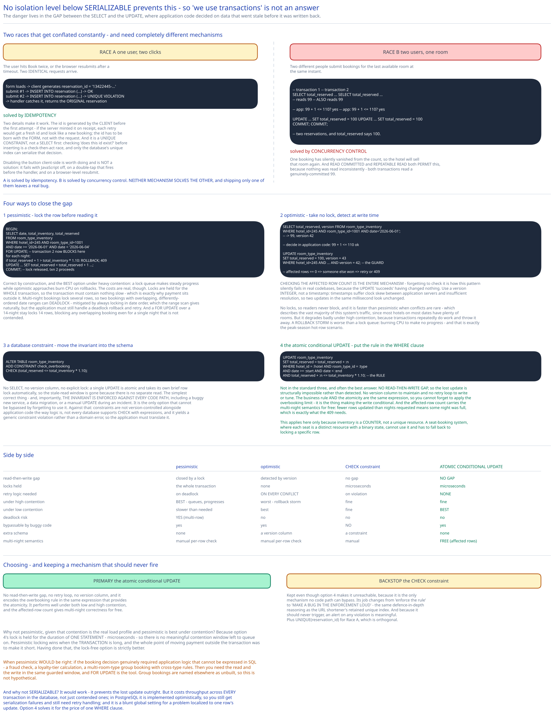

# Module 02 — Concurrency & Double Booking



This is the module the whole case study exists for. The general treatment is [Optimistic vs Pessimistic Concurrency Control](../../database-design/optimistic-vs-pessimistic-locking.md); this is the hotel-specific argument, with the overbooking rule and the actual SQL.

## Two different races

They get conflated constantly, and they need completely different mechanisms.

**Race A — one user, two clicks.** The user hits "Book" twice, or the browser resubmits after a timeout. Two identical requests arrive.

**Race B — two users, one room.** Two different people submit bookings for the last available room at the same instant.

**A is solved by idempotency. B is solved by concurrency control.** Neither mechanism solves the other, and shipping only one of them leaves a real bug.

### Race A: the idempotency key

```
Booking form loads  →  client generates reservation_id = "13422445-..."
Submit #1  →  INSERT INTO reservation (reservation_id, ...) → OK
Submit #2  →  INSERT INTO reservation (reservation_id, ...) → UNIQUE VIOLATION
              → handler catches it, returns the ORIGINAL reservation
```

The `UNIQUE(reservation_id)` constraint is the entire mechanism, and two details make it work:

**The id is generated by the client, before the first attempt.** If the server minted it on receipt, each retry would get a fresh id and look like a new booking. The id has to be born with the *form*, not with the request.

**A unique constraint, not a `SELECT` first.** Checking "does this id exist?" before inserting is a check-then-act race: two concurrent submissions can both see it absent and both insert. Only the database's unique index can serialize that decision. Cross-ref [Idempotency Keys](../../scalability-resilience/idempotency-keys.md).

Disabling the button client-side is worth doing and is **not** a solution — it fails with JavaScript disabled, on a double-tap that fires before the handler, and on a browser-level resubmit.

## Race B: the lost update

Here is the bug, in full:

```sql
-- Transaction 1                             -- Transaction 2
SELECT total_reserved                        SELECT total_reserved
  FROM room_type_inventory                     FROM room_type_inventory
 WHERE hotel_id=245 AND room_type_id=1001     WHERE hotel_id=245 AND room_type_id=1001
   AND date='2026-06-01';   -- reads 99          AND date='2026-06-01';   -- also reads 99

-- app: 99 + 1 <= 110? yes, available       -- app: 99 + 1 <= 110? yes, available

UPDATE room_type_inventory                   UPDATE room_type_inventory
   SET total_reserved = 100                     SET total_reserved = 100
 WHERE hotel_id=245 AND …;                    WHERE hotel_id=245 AND …;
COMMIT;                                      COMMIT;
```

Two reservations, and `total_reserved` says **100**. One booking has silently vanished from the count, so the hotel will sell that room again.

**The critical thing to understand: no isolation level below `SERIALIZABLE` prevents this.** `READ COMMITTED` and `REPEATABLE READ` both permit it, because nothing was read inconsistently — both transactions read a genuinely-committed 99. The danger lives in the **gap between the `SELECT` and the `UPDATE`**, where application code made a decision on data that went stale before it was written back.

So "we use transactions" is not an answer, and neither is "we use `REPEATABLE READ`". This trips up a lot of people, and it's the most valuable single fact in this module.

## Option 1 — Pessimistic locking

Lock the row before reading it, so nobody else can read it until you commit.

```sql
BEGIN;
  SELECT date, total_inventory, total_reserved
    FROM room_type_inventory
   WHERE hotel_id=245 AND room_type_id=1001
     AND date >= '2026-06-01' AND date < '2026-06-04'
   FOR UPDATE;                        -- ← transaction 2 now BLOCKS here

  -- application logic, with a guarantee nobody else can interleave
  for each night:
      if total_reserved + 1 > total_inventory * 1.10:  ROLLBACK; return 409

  UPDATE room_type_inventory SET total_reserved = total_reserved + 1
   WHERE hotel_id=245 AND room_type_id=1001
     AND date >= '2026-06-01' AND date < '2026-06-04';
COMMIT;                              -- ← lock released, transaction 2 proceeds
```

**Pros:** conceptually simple, correct by construction, and **the best option under heavy contention** — a lock queue makes steady progress while optimistic approaches burn CPU on rollbacks.

**Cons, and they're real:**

- **Locks are held for the whole transaction.** So the transaction must contain nothing slow — which is precisely why [Module 01](./01-architecture-hld.md#per-path-walkthrough) puts payment outside it. A payment call inside this block would hold the lock for seconds and serialize every booking for that hotel behind it.
- **Deadlocks.** A multi-night booking locks several rows, and two bookings with overlapping-but-differently-ordered date ranges can deadlock. Mitigated by always locking in a deterministic order (`ORDER BY date`) — which the `date >=` range scan gives naturally — but application code must still handle a deadlock rollback and retry.
- **A range lock can be broad.** `FOR UPDATE` over a 14-night stay locks 14 rows, blocking any overlapping booking even for a single night that isn't contended.

## Option 2 — Optimistic locking

Take no lock. Detect at write time whether the world changed.

```sql
-- 1. Read, including the version
SELECT total_reserved, version FROM room_type_inventory
 WHERE hotel_id=245 AND room_type_id=1001 AND date='2026-06-01';
-- → 99, version 42

-- 2. Decide in application code
--    99 + 1 <= 110 ✓

-- 3. Write, conditional on the version being unchanged
UPDATE room_type_inventory
   SET total_reserved = 100, version = 43
 WHERE hotel_id=245 AND room_type_id=1001 AND date='2026-06-01'
   AND version = 42;                    -- ← the guard

-- affected rows == 0 ⇒ someone else won ⇒ re-read and retry, or return 409
```

**Checking the affected row count is the entire mechanism.** Forgetting to check it is how this pattern silently fails in real codebases — the `UPDATE` "succeeds" having changed nothing.

Use a **version integer, not a timestamp**: timestamps suffer clock skew between application servers and insufficient resolution (two updates in the same millisecond look unchanged).

**Pros:** no locks, so readers never block; faster than pessimistic when conflicts are rare — which describes the vast majority of this system's traffic, since most hotels on most dates have plenty of rooms.

**Cons:** performance degrades badly under high contention, because transactions repeatedly do work and throw it away. A **rollback storm** is worse than a lock queue: burning CPU to make no progress. And that's exactly the peak-season hot-row scenario from [Module 01](./01-architecture-hld.md#load-handling).

## Option 3 — A database constraint

Move the invariant into the schema, so it cannot be violated by any code path.

```sql
ALTER TABLE room_type_inventory
  ADD CONSTRAINT check_overbooking
  CHECK (total_reserved <= total_inventory * 1.10);
```

```sql
BEGIN;
  UPDATE room_type_inventory
     SET total_reserved = total_reserved + 1
   WHERE hotel_id=245 AND room_type_id=1001
     AND date >= '2026-06-01' AND date < '2026-06-04';
  -- If this pushes any row past the limit, the CONSTRAINT rejects it
  -- → transaction aborts → return 409
COMMIT;
```

**No `SELECT`, no version column, no explicit lock.** A single `UPDATE` is atomic and takes its own brief row lock automatically; the stale-read window is gone because there is no separate read.

**Pros:** the simplest correct thing, and — importantly — **the invariant is enforced against every code path**, including a buggy new service, a data migration, or a manual `UPDATE` during an incident. It's the only option that can't be bypassed by forgetting to use it.

**Cons:** constraints aren't version-controlled alongside application code the way logic is; not every database supports `CHECK` with expressions; and it gives a generic constraint violation rather than a domain-specific error, so the application must translate it.

## Option 4 — the atomic conditional update

Not in the standard three, and often the best answer: put the rule in the `WHERE` clause.

```sql
UPDATE room_type_inventory
   SET total_reserved = total_reserved + :n
 WHERE hotel_id = :hotel AND room_type_id = :type
   AND date >= :start AND date < :end
   AND total_reserved + :n <= total_inventory * 1.10;    -- ← the business rule, atomically

-- affected_rows < nights_requested  ⇒  at least one night is full  ⇒  ROLLBACK, 409
```

This is what [Module 01](./01-architecture-hld.md#per-path-walkthrough) actually uses, and it's worth seeing why it's better than all three above rather than merely different:

- **No read-then-write gap**, so the lost update is structurally impossible rather than detected.
- **No version column** to maintain, and no retry loop to write or tune.
- **The business rule and the atomicity are the same expression** — you cannot forget to apply the overbooking limit, because it's the thing making the write conditional.
- **The affected-row count carries the multi-night semantics for free**: fewer rows updated than nights requested means some night was full, which is exactly the information the `409` needs.

This is the "make it one atomic statement" option from [Optimistic vs Pessimistic Concurrency Control](../../database-design/optimistic-vs-pessimistic-locking.md#the-option-people-skip-make-it-one-atomic-statement), and it applies here because **inventory is a counter, not a unique resource** — the room-*type* modelling decision from [Module 00](./00-overview.md#the-requirement-that-changes-the-data-model) is what makes it available. A seat-booking system, where each seat is a distinct resource with a binary state, cannot use this and has to fall back to locking a specific row.

## Comparison

| | Pessimistic | Optimistic | `CHECK` constraint | **Atomic conditional `UPDATE`** |
|---|---|---|---|---|
| Read-then-write gap | Closed by a lock | Detected by version | No gap | **No gap** |
| Locks held | For the whole transaction | None | Microseconds | **Microseconds** |
| Retry logic needed | On deadlock | **On every conflict** | On violation | **None** |
| Under high contention | **Best** — queues and progresses | Worst — rollback storm | Fine | **Fine** |
| Under low contention | Slower than needed | **Best** | Fine | **Best** |
| Deadlock risk | **Yes** (multi-row) | No | No | No |
| Bypassable by buggy code | Yes | Yes | **No** | Yes |
| Extra schema | None | `version` column | Constraint | None |
| Multi-night semantics | Manual per-row check | Manual per-row check | Manual | **Free (affected-row count)** |

## Choosing

**Primary mechanism: the atomic conditional `UPDATE`** (option 4). It has no read-then-write gap, no retry loop, no version column, and it encodes the overbooking rule in the same expression that provides the atomicity. It performs well under both low and high contention, and the affected-row count gives multi-night correctness for free.

**Backstop: the `CHECK` constraint** (option 3). Kept even though option 4 makes it unreachable, because it's the only mechanism no code path can bypass. Its job changes from "enforce the rule" to "make a bug in the enforcement loud" — the same defence-in-depth reasoning the [URL shortener](../url-shortener/02-short-code-generation.md#b4-keep-the-unique-index-anyway) uses for retaining a unique index it believes can never fire. And because it should never trigger, an alert on any violation is meaningful.

**Plus `UNIQUE(reservation_id)`** for Race A, which is an orthogonal problem.

**Why not pessimistic**, given [Module 01](./01-architecture-hld.md#load-handling) says contention is the real load profile and pessimistic is best under contention? Because option 4's lock is held for the duration of one statement — microseconds — so there is no meaningful contention window left to queue on. Pessimistic locking wins when the *transaction* is long, and the whole point of moving payment outside the transaction was to make it short. Having done that, the lock-free option is strictly better.

**When pessimistic would be right:** if the booking decision genuinely required application logic that can't be expressed in SQL — a fraud check, a loyalty-tier calculation, a multi-room-type group booking with cross-type rules. Then you need the read and the write in the same guarded window, and `FOR UPDATE` is the tool. That's a real scenario ([Module 01](./01-architecture-hld.md#what-youd-revisit-as-this-grows) names group bookings as unbuilt), so this isn't a hypothetical.

## Why not `SERIALIZABLE`?

It would work. `SERIALIZABLE` isolation prevents the lost update outright.

But: it costs throughput across **every** transaction in the database, not just contended ones; in PostgreSQL it's implemented optimistically, so you still get serialization failures and still need retry handling; and it's a blunt global setting to fix a problem localized to one row's update.

Option 4 solves it for the price of one `WHERE` clause. Reaching for `SERIALIZABLE` here is using a database-wide setting to fix a one-statement problem.

## Practice: extend it yourself

1. **Design a group booking** — 20 rooms across 3 room types, all-or-nothing. The single-statement approach doesn't extend, because you need three conditional updates that must all succeed together. Work out: whether one transaction with three `UPDATE`s and three affected-row checks is sufficient, what the deadlock risk is when two group bookings request the same three types in different orders, and what the lock-ordering rule must be. Then decide whether this pushes you to `FOR UPDATE` after all.
2. **Make overbooking dynamic.** Replace the flat 1.10 with a per-(hotel, room type, date) multiplier from a revenue model. Work out where that value lives so the atomic `UPDATE` can still reference it in one statement (a column on the inventory row? a join? a stored function?), what happens to the `CHECK` constraint when the multiplier is a moving target, and how you'd change the multiplier for a date that already has bookings against the old one.
