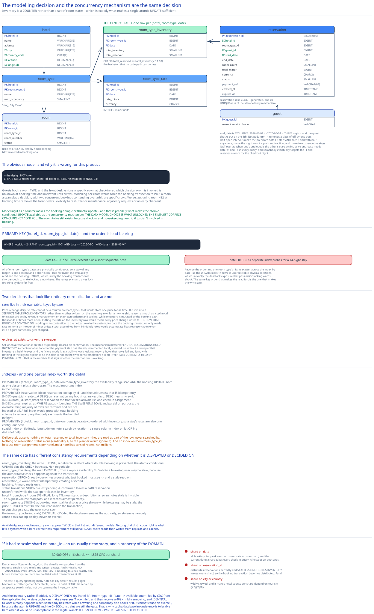

# Module 03 — Database Design



## From entities to schema

```sql
CREATE TABLE hotel (
    hotel_id       BIGINT       NOT NULL,
    name           VARCHAR(255) NOT NULL,
    address        VARCHAR(512) NOT NULL,
    city           VARCHAR(128) NOT NULL,
    country_code   CHAR(2)      NOT NULL,
    latitude       DECIMAL(9,6) NOT NULL,
    longitude      DECIMAL(9,6) NOT NULL,
    PRIMARY KEY (hotel_id)
);

CREATE TABLE room_type (
    hotel_id       BIGINT       NOT NULL,
    room_type_id   BIGINT       NOT NULL,
    name           VARCHAR(128) NOT NULL,       -- 'King, City View'
    max_occupancy  SMALLINT     NOT NULL,
    PRIMARY KEY (hotel_id, room_type_id)
);

-- Physical rooms. Used at CHECK-IN, not at booking time.
CREATE TABLE room (
    hotel_id       BIGINT       NOT NULL,
    room_id        BIGINT       NOT NULL,
    room_type_id   BIGINT       NOT NULL,
    room_number    VARCHAR(16)  NOT NULL,
    status         SMALLINT     NOT NULL,       -- available | out_of_service
    PRIMARY KEY (hotel_id, room_id)
);

-- ══════ THE CENTRAL TABLE. One row per (hotel, room type, date). ══════
CREATE TABLE room_type_inventory (
    hotel_id        BIGINT   NOT NULL,
    room_type_id    BIGINT   NOT NULL,
    date            DATE     NOT NULL,
    total_inventory SMALLINT NOT NULL,          -- sellable rooms of this type on this date
    total_reserved  SMALLINT NOT NULL DEFAULT 0,
    PRIMARY KEY (hotel_id, room_type_id, date),
    CONSTRAINT check_overbooking
        CHECK (total_reserved <= total_inventory * 1.10)     -- the backstop (Module 02)
);

-- Prices change daily, so the rate is per (type, date) — NOT an attribute of room_type.
CREATE TABLE room_type_rate (
    hotel_id       BIGINT   NOT NULL,
    room_type_id   BIGINT   NOT NULL,
    date           DATE     NOT NULL,
    rate_minor     BIGINT   NOT NULL,           -- INTEGER minor units
    currency       CHAR(3)  NOT NULL,
    PRIMARY KEY (hotel_id, room_type_id, date)
);

CREATE TABLE reservation (
    reservation_id  BINARY(16)   NOT NULL,      -- CLIENT-generated (Module 02)
    hotel_id        BIGINT       NOT NULL,
    room_type_id    BIGINT       NOT NULL,
    guest_id        BIGINT       NOT NULL,
    start_date      DATE         NOT NULL,
    end_date        DATE         NOT NULL,      -- EXCLUSIVE: checkout day
    room_count      SMALLINT     NOT NULL,
    total_minor     BIGINT       NOT NULL,
    currency        CHAR(3)      NOT NULL,
    status          SMALLINT     NOT NULL,      -- pending|confirmed|cancelled|payment_failed
    payment_ref     VARCHAR(64)  NULL,
    created_at      TIMESTAMP    NOT NULL,
    expires_at      TIMESTAMP    NULL,          -- set while pending; drives the sweeper
    PRIMARY KEY (reservation_id)                -- UNIQUE ⇒ idempotency
);

CREATE TABLE guest (
    guest_id  BIGINT NOT NULL, name VARCHAR(255), email VARCHAR(255), phone VARCHAR(32),
    PRIMARY KEY (guest_id)
);
```

### Why inventory is a counter, not a set of room states

The obvious model is a status per physical room per night:

```sql
-- The design NOT taken
CREATE TABLE room_night (hotel_id, room_id, date, reservation_id NULL, PRIMARY KEY (…));
```

It's wrong for this product, and the reason traces straight back to [Module 00](./00-overview.md#the-requirement-that-changes-the-data-model): **guests book a room *type*, and the front desk assigns a specific room at check-in.** So which physical room is involved is unknown at booking time and irrelevant until arrival.

Modelling it per-room would force the booking transaction to *pick* a room — meaning it must find an available one, which is a scan plus a decision, and two concurrent bookings would contend over specific rows arbitrarily. Worse, assigning room 412 at booking time removes the front desk's flexibility to reshuffle for maintenance, adjacency requests, or an early checkout.

Modelling it as a **counter** makes the booking a single arithmetic update, and — as [Module 02](./02-concurrency.md#option-4-the-atomic-conditional-update) shows — that's precisely what makes the atomic conditional `UPDATE` available as the concurrency mechanism. **The data model choice is what unlocked the simplest correct concurrency control**, which is the clearest example in this case study of modelling and mechanism being the same decision.

The `room` table still exists, because check-in needs it and housekeeping needs it. It just isn't involved in booking.

### Why the primary key is `(hotel_id, room_type_id, date)`

Clustered in that order, and the order is load-bearing.

Every real query filters on `hotel_id` and `room_type_id` and then spans a **date range**:

```sql
WHERE hotel_id = 245 AND room_type_id = 1001 AND date >= '2026-06-01' AND date < '2026-06-04'
```

With `date` **last** in the key, all of one room type's dates are physically contiguous, so a stay of any length is **one B-tree descent plus a short sequential scan.** That's true for both the availability read and the booking `UPDATE`, which is why the booking transaction is short enough to make locking a non-issue.

Reverse the order to `(date, hotel_id, room_type_id)` and one room type's nights scatter across the index by date — so a 14-night stay becomes 14 separate index probes, and the `UPDATE` locks 14 rows in unpredictable physical locations, which is exactly the deadlock exposure [Module 02](./02-concurrency.md#option-1-pessimistic-locking) warns about. The range scan also gives lock ordering by date for free.

Cross-ref [Database Indexing](../../database-design/database-indexing.md).

### Why `end_date` is exclusive

`start_date = 2026-06-01`, `end_date = 2026-06-04` means **three nights** — the 1st, 2nd and 3rd — and the guest checks out on the 4th.

This isn't pedantry; it removes a real class of off-by-one bug. Half-open intervals make the range predicate `date >= start AND date < end` with no `-1` anywhere, they make nights-count a plain subtraction (`end - start`), and they make two consecutive stays *not* overlap when one's `end_date` equals the other's `start_date`. An inclusive `end_date` would need `date <= end - 1` in every query, and someone will eventually forget the `-1` and reserve a room for the checkout night.

### Why rates are a separate table keyed by date

The requirement is that a room's price changes daily, so `rate` cannot be a column on `room_type` — that would store one price for all time.

It's also a **separate table from inventory** rather than another column on the inventory row, for an ownership reason as much as a technical one: rates are set by revenue management on their own cadence and tooling, and inventory is mutated by the booking path thousands of times more often. Putting the rate on the inventory row would mean every price change writes to the row that bookings contend on — adding write contention to the hottest row in the system for data the booking transaction only *reads*.

`rate_minor` is an **integer** of minor units, for the same reason as the [digital wallet](../digital-wallet/05-db-design.md#why-amount-minor-is-an-integer): floating point cannot represent decimal prices exactly, and a total assembled from 14 nightly rates accumulates representation error into a figure someone gets charged.

### Why `expires_at` exists

Set when a reservation is created as `pending`, cleared on confirmation. It drives the sweeper that [Module 01](./01-architecture-hld.md#scaling-reliability) calls the design's most important background job.

The mechanism matters: `pending` reservations **hold inventory**. A checkout abandoned at the payment step has already incremented `total_reserved`, so without a sweeper that inventory is held forever. The failure mode is availability slowly leaking away — a hotel that looks full and isn't, with nothing in the logs to explain it.

So the alert isn't on the sweeper's completion; it's on **inventory currently held by `pending` rows**. That's the number that tells you whether the mechanism is working.

## Indexes

| Index | Serves |
|---|---|
| `PRIMARY KEY (hotel_id, room_type_id, date)` on `room_type_inventory` — clustered | The availability range scan *and* the booking `UPDATE`, both as one descent plus a short scan. The single most important index in the design. |
| `PRIMARY KEY (reservation_id)` on `reservation` | Lookup by id, **and the uniqueness that provides idempotency** ([Module 02](./02-concurrency.md#race-a-the-idempotency-key)). |
| `INDEX (guest_id, created_at DESC)` on `reservation` | "My bookings, newest first" — the guest's account page. `DESC` in the index means no sort. |
| `INDEX (hotel_id, start_date)` on `reservation` | The front desk's arrivals list for a date, and the check-in room-assignment flow. |
| `INDEX (status, expires_at) WHERE status = 'pending'` on `reservation` | **The sweeper's scan.** Partial, so the overwhelming majority of rows (terminal reservations) aren't indexed — otherwise this index would grow with total booking volume to serve a query that only ever wants the handful in flight. |
| `PRIMARY KEY (hotel_id, room_type_id, date)` on `room_type_rate` | Rate lookup, co-ordered with inventory so a stay's rates are also one contiguous scan. |
| `PRIMARY KEY (hotel_id, room_id)` on `room` | Check-in room assignment. |
| `INDEX (city, country_code)` / spatial index on `(latitude, longitude)` on `hotel` | Search by location. A single-column index on lat *or* lng doesn't help; see [Geospatial Indexing](../../hld-building-blocks/geospatial-indexing.md). |

**Deliberately absent:** nothing on `total_reserved` or `total_inventory` — they're read as part of the row, never searched by. Nothing on `reservation.status` alone (cardinality 4, so the planner would ignore it). And no index on `room.room_type_id`, because room assignment is per-hotel and a hotel has tens of rooms, not millions.

## Consistency

| Data | Model | Why |
|---|---|---|
| `room_type_inventory` (the write) | **Strong, serializable in effect** | This is where double-booking is prevented. The atomic conditional `UPDATE` plus the `CHECK` backstop makes the invariant unviolatable. Non-negotiable. |
| `room_type_inventory` (the display read) | **Eventual — from a replica** | Availability *shown* to a browsing user may be stale, because the authoritative check happens again inside the transaction. **Displaying availability and guaranteeing it are two different operations.** Conflating them would put all read traffic on the primary for no correctness benefit. |
| `reservation` | **Strong, read-your-writes** | A guest who just booked must see their booking. And a stale read on `reservation_id` would defeat idempotency, creating a second booking. Primary reads only. |
| `reservation.status` transitions | **Strong** | `pending → confirmed` must not be lost, or a paid reservation sits unconfirmed while the sweeper releases its inventory. |
| `hotel`, `room_type`, `room` | **Eventual, long TTL** | Near-static. A room-type description a few minutes stale is invisible. This is the highest-volume read path and it caches almost perfectly. |
| `room_type_rate` | **Strong at booking, eventual for display** | A price shown while browsing may be stale; the price *charged* must be the one read inside the transaction. Otherwise you charge a rate the user never saw, or honour one you no longer offer. |
| Inventory cache (at scale) | **Eventual, CDC-fed** | See below — the database remains the authority, so cache staleness can only cause a misleading display, never an oversell. |

**The pattern worth naming:** the *same* data has different consistency requirements depending on whether it's being **displayed** or **decided on**. Availability, rates, and inventory each appear twice in that table with different models. Getting this distinction right is what lets a system with a hard correctness requirement still serve 1,000× more reads than writes from replicas and caches.

## Scaling the schema

At 3 reservations/sec and 73 million inventory rows (~4 GB), **none of this is needed.** [Module 00](./00-overview.md#capacity-estimation) is explicit that one database has orders of magnitude of headroom. This section is the answer to the standard interview pivot — *"now make it Booking.com, 1,000× the traffic"* — and the honest framing is that reaching for it prematurely would be building infrastructure for a problem that doesn't exist.

**Shard on `hotel_id`.**

Every query filters on `hotel_id`, so the shard is computable from the request: **single-shard reads and writes, always.** And critically, **no transaction ever spans two hotels** — a booking touches exactly one hotel's inventory — so there are no distributed transactions at all. That's an unusually clean sharding story, and it's a property of the domain rather than of the design.

```
30,000 QPS ÷ 16 shards ≈ 1,875 QPS per shard   — comfortable for a single MySQL cluster
```

Why the alternatives fail:
- **Shard on `date`** → all bookings for peak season concentrate on one shard, and the current date's shard takes every check-in query. A hotspot on both axes.
- **Shard on `reservation_id`** → distributes reservations perfectly and scatters *inventory* for one hotel across every shard, so the booking transaction becomes distributed. Fatal.
- **Shard on `city` or `country`** → wildly skewed, and it makes hotel counts per shard depend on tourism geography.

The cost: a query spanning multiple hotels (a search results page for a city) becomes a scatter-gather. Acceptable, because hotel *search* is served by a separate search index (with the spatial index above), not by scanning the inventory table.

**Add an inventory cache, fed by CDC.**

```
Redis:  key = {hotel_id}_{room_type_id}_{date}   value = available_count   TTL = past dates expire
Fed by: Debezium/CDC from the database's replication log → Redis
```

Cross-ref [The Transactional Outbox & Change Data Capture](../../hld-building-blocks/transactional-outbox-cdc.md).

The essential property: **the cache is for display only; the database remains the authority.** So a stale cache can cause a user to see "1 room left" and then receive a `409` — mildly annoying, and *identical* to what already happens when someone hesitates while browsing and someone else books first. It **cannot** cause an oversell, because the atomic `UPDATE` and the `CHECK` constraint are still the gate. That's why cache/database inconsistency is tolerable here when it would be unacceptable in the [digital wallet](../digital-wallet/05-db-design.md#consistency): the cache never participates in the decision.

**Archive old reservations.** Keep current and future reservations plus a rolling window of history in the operational store; move the rest to cold storage. Reservation volume grows forever while the *useful* set is bounded by the booking horizon, so without archival the table grows without limit to serve queries nobody makes.

## Connecting it back

**"No double-booking, ever"** (Module 00) → keep reservation and inventory in one service sharing one database, so one transaction covers both (Module 01) → resolved by an atomic conditional `UPDATE` with the overbooking rule in the `WHERE` clause, plus a `CHECK` backstop (Module 02) → surfacing here as **inventory being a counter rather than a set of room states**, which is what makes a single arithmetic update sufficient. The modelling decision and the concurrency mechanism are the same decision.

**"Guests book a room type, not a room"** (Module 00) → the unit of inventory is `(hotel, room type, date)` with a count → surfacing here as `room_type_inventory` being the central table while `room` exists only for check-in, and as the `room_night` per-room model being explicitly rejected.

**"Deliberate 10% overbooking"** (Module 00) → the rule lives inside the atomic condition rather than in application code, so it can't be forgotten (Module 02) → surfacing here as `CHECK (total_reserved <= total_inventory * 1.10)` — enforced against every code path including a future service, a migration, or a manual `UPDATE` during an incident.

**"Prices change daily"** (Module 00) → rates are per-date and read inside the booking transaction (Module 01) → surfacing here as a separate `room_type_rate` table keyed `(hotel_id, room_type_id, date)`, deliberately *not* a column on the inventory row, so price changes don't write to the row bookings contend on.

**"Correctness over latency"** (Module 00) → payment moved outside the transaction to keep the lock window microseconds long (Module 01) → which creates a `pending` state → surfacing here as `expires_at` plus a **partial index** on `(status, expires_at) WHERE status='pending'`, so the sweeper's scan stays cheap as booking volume grows.

## What you'd revisit as this grows

- **`total_inventory` as `SMALLINT` caps a room type at 32,767 rooms**, which is fine for hotels and would break for a different product using the same schema (a stadium, a parking operator). Cheap to widen now, expensive later.

- **The overbooking multiplier is hard-coded in a constraint.** [Module 02](./02-concurrency.md#practice-extend-it-yourself) sets making it dynamic as an exercise, and it's genuinely awkward: a per-(hotel, type, date) multiplier can't live in a static `CHECK`, so the backstop would have to become a trigger or move into the atomic `UPDATE` alone — losing the defence-in-depth property that was the reason for keeping it.

- **No multi-room-type reservation.** A `reservation` row references exactly one `room_type_id`, so "2 kings and a twin for a family" is three separate reservations with no all-or-nothing guarantee. Fixing it means a `reservation_line` child table and a transaction spanning several inventory rows across types — more contention, and a lock-ordering rule to avoid deadlock.

- **`total_inventory` can be reduced below `total_reserved`** by an admin taking rooms out of service, leaving a legitimately oversold row. [Module 01](./01-architecture-hld.md#concurrent-user-handling) notes the system correctly stops making it worse; the schema records no *who and why*, and there's no workflow for choosing which guest gets relocated. That's where the real operational pain lives and it's unmodelled.

- **Rate history isn't retained.** `room_type_rate` holds the current price for a date; an update overwrites it. So "what price was this room advertised at last Tuesday?" is unanswerable — which matters for disputes and for revenue analysis. The reservation stores what was *charged*, which covers the dispute case for booked stays only.
