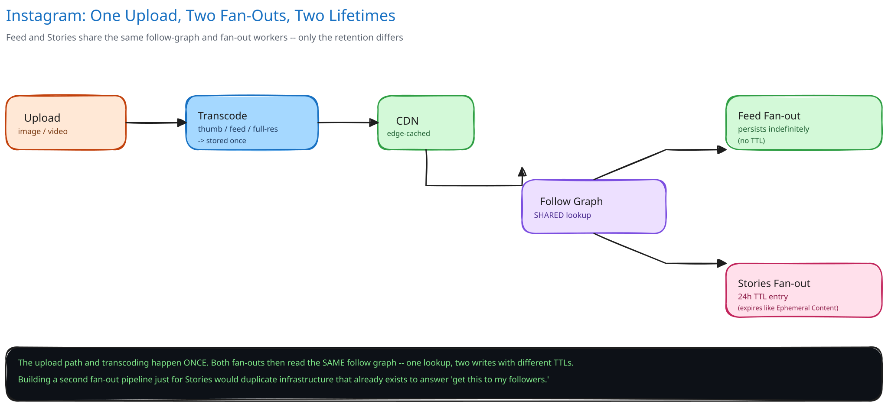

# Module 01 — Architecture & High-Level Design

## Monolith vs. microservices

Post Service, Feed Service, and the two fan-out workers are split into separate deployables, but the split line is drawn by *load shape*, not by a generic "microservices are good" default. Post Service handles bursty, low-volume writes (thousands/sec). Feed Service handles the dominant read load (hundreds of thousands/sec) and needs to scale independently and far more aggressively — bundling them into one deployable would mean over-provisioning the write path just to keep up with read traffic, or throttling reads to protect writes. The fan-out workers are pulled out for a different reason entirely: they're pure Kafka consumers with no request/response contract at all, and their throughput needs to scale with follower-graph fan-out volume (~173,000 writes/sec, see Capacity Estimation), which has nothing to do with how many posts/sec are being created.

What's deliberately **not** split further: likes and comments are folded into existing services rather than getting their own microservice each, because their write pattern (a single row, keyed by an id already in hand) doesn't create a scaling or ownership conflict with anything else running in Post Service.

## Building Blocks

| Block | Role |
|---|---|
| API Gateway / LB | Routes writes to Post Service, reads to Feed Service |
| Post Service | Accepts post/story metadata, writes the post row, publishes `post-created` |
| Kafka (`post-created`) | Single event, two independent consumer groups — transcode and fan-out never block each other |
| Media Worker | Transcodes into thumbnail/feed/full-res variants (cross-ref [Video Streaming Service](../video-streaming-service/00-overview.md) for the same idea applied continuously to video bitrates) |
| Object Storage (S3) + CDN | Durable media storage and edge-cached delivery (cross-ref [CDN](../../hld-building-blocks/cdn.md)) |
| Fan-out Worker | Reads the follow graph, applies the fan-out strategy (Architecture-level Strategy pattern, detailed in LLD), writes feed_store/story_store entries |
| Core DB (MySQL, sharded) | Users, posts, follows — the system of record |
| Feed Store (Redis + Cassandra) | Pre-computed, persistent per-user feed entries |
| Story Store (Redis, 24h TTL) | Same shape as feed_store, expires automatically |
| Feed Service | Hybrid read path: reads feed_store, merges in celebrity posts live from Core DB |

## Per-path walkthrough

**Write path (post creation):** `Client → API Gateway → Post Service → Core DB (write post row) + Kafka publish (post-created)`. The post row write and the event publish need to both survive a crash without contradicting each other — the same durable-intent-before-async-side-effects pattern this guide's [payments case study](../payments-system/00-overview.md) uses, applied here to "the post exists" rather than "the charge happened."

**Media path (async):** `Kafka → Media Worker → Object Storage (write transcoded variants) → CDN`. Fully decoupled from fan-out — a slow transcode never delays a follower seeing the post, because fan-out writes reference the *original* upload URL immediately (see the interviewer Q&A for what the poster themself sees mid-transcode).

**Fan-out path (async):** `Kafka → Fan-out Worker → Core DB (read follow graph) → Feed Store (persist) and/or Story Store (24h TTL)`. Both stores are written from the exact same follow-graph lookup — one lookup, two writes with different retention, never two separate follow-graph queries.

**Read path:** `Client → API Gateway → Feed Service → Feed Store (pre-computed entries) + Core DB (celebrity posts, read live) → merge by timestamp → response`.

## Trade-offs to make explicit

| Decision | Chosen | Alternative | Why |
|---|---|---|---|
| Fan-out strategy | Hybrid: fan-out-on-write for normal accounts, fan-out-on-read for accounts above a follower threshold | Fan-out-on-write for everyone | A single celebrity post would trigger tens of millions of feed_store writes in seconds — the write side would need to absorb a spike no capacity plan can smooth, for a tiny fraction of accounts |
| Feed/story infrastructure | One shared follow-graph lookup and fan-out worker pool, differing only by TTL on the written entry | Two separate pipelines, one per content type | Both problems are identical at the infrastructure level ("get this to my followers"); a second pipeline would duplicate the exact mechanism the first one already solves |
| Media availability during transcode | Serve the original uploaded resolution immediately; swap in transcoded variants when ready | Block the post from appearing until transcoding finishes | High-resolution video transcoding can take longer than the video itself; blocking would turn "post now" into an unpredictable wait for every follower, not just the poster |
| Story expiry | TTL on the store entry itself (Redis `EXPIRE`) | A scheduled cleanup job that deletes expired rows | No batch job to run, tune, or fall behind on — the store guarantees the row is gone, not "eventually gone" |
| Follow-graph storage | MySQL, sharded, keyed `(followee_id, follower_id)` | A dedicated graph database | The only query this system needs against the follow graph is "list all followers of X" — a well-indexed relational table answers that in one partition read; a graph database's traversal strengths (multi-hop queries) are never exercised here |

## Load Handling

- **Peak-vs-average tolerance:** average fan-out load (~173,000 writes/sec) already assumes typical posts; the real risk isn't average traffic but a single large-follower-count post landing in the fan-out-on-write path by mistake — which is exactly what the celebrity threshold exists to prevent structurally, not by hoping traffic stays smooth.
- **Where backpressure kicks in first:** at the Kafka consumer level. If Fan-out Workers fall behind, `post-created` messages queue in Kafka rather than being dropped or blocking Post Service — a slow fan-out never slows down accepting new posts.
- **What gets shed under overload:** nothing in the write path is dropped; feed freshness degrades gracefully instead — a follower's feed_store entry simply arrives a bit later than the few-seconds target, which is a delay, not data loss. On the read path, if Feed Store is briefly unreachable, Feed Service falls back to celebrity-style live-read-and-merge for everyone temporarily, trading latency for availability rather than serving an error.
- **Autoscaling lag:** Fan-out Workers and Media Workers scale on consumer-group lag (a 1-3 minute horizon, typical for a queue-depth-triggered autoscaler); Kafka's own retention absorbs the gap between a burst arriving and workers scaling up to meet it.
- **Load-test target:** sustain a burst of 50,000 posts/sec from accounts just under the celebrity threshold (worst case for fan-out volume without triggering the hybrid read path) and confirm p99 fan-out completion stays under 10 seconds with zero dropped `post-created` events.

## Concurrent-User Handling

| Race | Mechanism | What the "loser" sees |
|---|---|---|
| Two users like the same post at the same instant | Sharded counter increment (cross-ref [Counting a Billion Likes](../../../like-counting-at-scale/00-overview.md)) — both increments land, atomically, on independent shards | Both users see their own like register instantly; the aggregate count converges within the counter's own flush interval, never lost |
| A user follows an account the instant that account posts | The Fan-out Worker's follower-list read and the new follow's write are independent operations with no shared lock; whichever the worker reads first wins for *this* post | The new follower may miss exactly this one post in their precomputed feed, but sees every post after — never a duplicate, never a corrupted feed |
| A user views their own just-uploaded post before transcoding finishes | No lock needed — Post Service always has the original URL available synchronously; the transcoded URL is a later, independent write to the same post row | The poster sees their own post immediately at original resolution, not an error or a blank card |
| A user deletes a post while it's mid-fan-out | The delete sets the post row's status; Feed Service silently skips any feed_store entry whose `post_id` no longer resolves to a live post, the same lazy-cleanup approach this guide's [News Feed System](../news-feed-system/04-interviewer-qna.md) uses | Followers who already received the fan-out entry simply don't see the post rendered — no explicit fan-out cancellation needed |

## Scaling & Reliability

- **Horizontal scaling:** Feed Service, Media Worker, and Fan-out Worker are all stateless and scale independently by request/consumer-lag volume; Core DB scales by adding shards (cross-ref [Data Partitioning & Sharding](../../hld-building-blocks/data-partitioning-sharding.md)).
- **Circuit breaker:** Feed Service wraps its Core DB celebrity-merge lookup in a circuit breaker (cross-ref [Circuit Breakers & Retries](../../scalability-resilience/circuit-breakers-retries.md)) — if Core DB is degraded, celebrity posts are temporarily omitted from the merge rather than the whole feed request failing.
- **Retries:** Fan-out Worker retries a failed feed_store write with backoff; because the write is an idempotent upsert keyed by `(user_id, post_id)`, a retry after a partial failure is always safe.
- **Dead-letter queue:** a `post-created` message that repeatedly fails fan-out (a malformed payload, a Core DB row that vanished mid-processing) moves to a dead-letter topic rather than blocking every other post queued behind it.
- **Graceful degradation:** if Feed Store is entirely unreachable, Feed Service degrades to fetching each followed account's recent posts directly from Core DB (the same mechanism already used for celebrities) — slower, but not down.
- **Multi-region:** not built here — named as a real gap below rather than glossed over.

## What you'd revisit as this grows

- **Dynamic celebrity threshold.** A fixed follower-count cutoff is simple but arbitrary; a mature system would detect a post's *actual* fan-out cost trending upward in real time (a rapidly-growing account) and shift strategy before the threshold is crossed, not after.
- **Feed ranking beyond recency.** This module assumes feed_store entries are read back roughly in insertion order; real ranking (predicted engagement, not chronology) is a service layered on top of fan-out, not a change to it — see the interviewer Q&A.
- **Cross-region replication for feed_store.** A follower and the account they follow can be in different regions; this design doesn't address keeping fan-out latency low across a region boundary.
- **Per-follower feed customization at fan-out time** (muted accounts, "close friends" story lists) is skipped here — every follower gets an identical fan-out entry, with any filtering left to Feed Service at read time.
