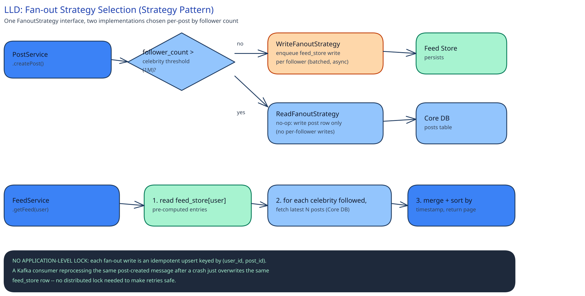

# Module 02 — Low-Level Design



## Interfaces vs. implementations

```
interface FanoutStrategy {
  execute(post: Post): void
}

class WriteFanoutStrategy implements FanoutStrategy {
  // enqueues a feed_store upsert for every follower — used below the celebrity threshold
}

class ReadFanoutStrategy implements FanoutStrategy {
  // no-op: the post row itself is enough; Feed Service merges it in at read time
}

interface FeedAssembler {
  getFeed(userId: string, cursor: string): FeedPage
}
```

`FanoutStrategy` is selected once per post, by `PostService`, based on the author's `follower_count` at post time — not re-evaluated per follower. `FeedAssembler` has exactly one implementation in this design (no need for an interface with a single implementation elsewhere in this guide, but it's named here because Module 01's "what you'd revisit" ranking-service gap would plug in as a second implementation without changing `FeedService`'s own code).

## Core method: `PostService.createPost`

```
function createPost(authorId, mediaId, caption):
    author = UserRepository.get(authorId)
    post = PostRepository.insert(authorId, mediaId, caption)   // durable first
    strategy = author.followerCount > CELEBRITY_THRESHOLD
        ? ReadFanoutStrategy
        : WriteFanoutStrategy
    EventBus.publish("post-created", { postId: post.id, authorId, strategy })
    return post
```

## Core method: `FeedService.getFeed`

```
function getFeed(userId, cursor):
    precomputed = FeedStoreRepository.getPage(userId, cursor)       // fan-out-on-write entries
    celebrities = FollowRepository.getCelebritiesFollowed(userId)    // small list, cacheable
    live = celebrities.flatMap(c => PostRepository.getRecent(c.id, since=cursor.timestamp))
    return merge(precomputed, live).sortByTimestampDesc().paginate()
```

## Error cases worth designing for deliberately

- **`author` has zero followers.** `WriteFanoutStrategy.execute` iterates an empty follower list — not an error, just zero work; the post still exists and is retrievable directly by its author.
- **A follower is deleted mid-fan-out.** The fan-out write targets a `user_id` that no longer resolves. Rather than failing the whole batch, the individual write is skipped and logged — one vanished follower doesn't block fan-out to the rest.
- **`FeedStoreRepository.getPage` times out.** `FeedService` catches this specifically and falls back to the celebrity-style live-read path for the *entire* request (see Module 01's Load Handling) rather than surfacing a 500 for what's usually a transient store hiccup.
- **The same `post-created` event is delivered twice** (Kafka's at-least-once delivery). `WriteFanoutStrategy.execute` re-running is harmless — see Concurrency below.

## Concurrency at the code level

No application-level lock guards the fan-out write, the like counter, or the follow-graph read — each relies on a guarantee already provided by the store underneath it:

- **Fan-out writes** are upserts keyed by `(user_id, post_id)`. Reprocessing the same `post-created` event after a crash overwrites the same row with the same values — never a duplicate feed entry.
- **Like/unlike** goes through the sharded counter this guide's [Counting a Billion Likes](../../../like-counting-at-scale/02-lld.md) case study already designs the concurrency for — not re-derived here.
- **The follow-graph read during fan-out** doesn't need a lock against a concurrent follow/unfollow; it's a point-in-time read, and Module 01's Concurrent-User Handling table already covers what the "loser" of that race sees (a missed post, not a corrupted one).

## Design patterns you just used, named

- **Strategy** — `FanoutStrategy`, swapped per-post by follower count.
- **Repository** — `PostRepository`, `UserRepository`, `FeedStoreRepository`, `FollowRepository` isolate `FeedService` and `PostService` from knowing whether a given store is MySQL, Redis, or Cassandra.
- **Outbox** (implicit in `createPost`) — the post row write and the `post-created` publish need the same durable-intent-first ordering this guide's [payments case study](../payments-system/02-lld.md) names explicitly; the same pattern, applied to "the post exists" instead of "the charge happened."

## Practice: extend it yourself

1. **Add a `mute` feature** (a follower stops seeing a specific followed account's posts without unfollowing them). Where does the filter belong — at fan-out time (skip the write) or at read time (skip in `getFeed`)? Justify your answer using this module's celebrity-threshold reasoning about *where* a decision's cost is paid.
2. **A story gets a "highlight" feature** (a user can pin a story past its 24h TTL). Sketch how `story_items`' schema and `ReadFanoutStrategy`/`WriteFanoutStrategy` split would need to change — can this reuse the existing TTL mechanism, or does it need a genuinely separate table?
