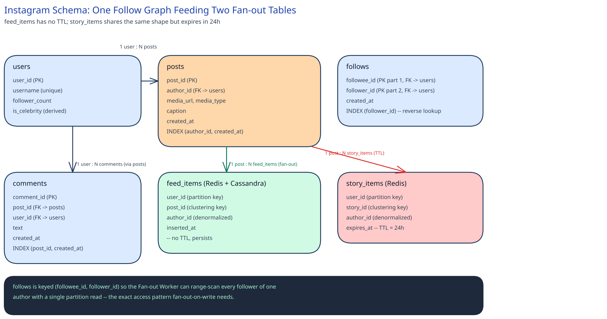

# Module 03 — Database Design

## From entities to schema

**`users`** — `user_id (PK)`, `username (unique)`, `follower_count`, `is_celebrity (derived)`.

**`posts`** — `post_id (PK)`, `author_id (FK → users)`, `media_url`, `media_type`, `caption`, `created_at`.

**`follows`** — `followee_id (PK part 1, FK → users)`, `follower_id (PK part 2, FK → users)`, `created_at`.

**`comments`** — `comment_id (PK)`, `post_id (FK → posts)`, `user_id (FK → users)`, `text`, `created_at`.

**`feed_items`** (Redis + Cassandra) — `user_id (partition key)`, `post_id (clustering key)`, `author_id (denormalized)`, `inserted_at`. No TTL.

**`story_items`** (Redis) — same shape as `feed_items`, plus `expires_at` (TTL = 24h).

## Why `follows` is keyed `(followee_id, follower_id)`, not the reverse

The single query this entire fan-out mechanism depends on is "list every follower of account X" — that's exactly what the Fan-out Worker runs for every post. Keying the table `(followee_id, follower_id)` makes that query a single-partition range scan. Keying it the other way around (`follower_id` first) would optimize "who does X follow" instead — a real query (used by the celebrity live-merge path), but a far less frequent and lower-volume one, which is why it gets a secondary index instead of the primary key.

## Why `feed_items` and `story_items` are the same shape

Both tables exist to answer the identical question — "what should user X see, and where did it come from" — for content with different lifetimes. Giving them the same partition/clustering key shape means the Fan-out Worker's write logic doesn't fork into two implementations; only the TTL differs. This is the schema-level expression of the "one fan-out mechanism, two retention policies" decision made in Module 01.

## Why `author_id` is denormalized onto `feed_items` and `story_items`

Rendering a feed page needs the author's username and avatar for every item. Without `author_id` (and, in a real system, a small denormalized author-summary blob) sitting directly on the fan-out row, every feed page render would need a join or a second round-trip per item back to `users` — at ~115,000 reads/sec, that's the difference between one store lookup and one-plus-N.

## Indexes

- `posts (author_id, created_at)` — serves "list an account's own posts, most recent first" (profile pages) and is what `ReadFanoutStrategy`'s live-merge path scans for celebrity accounts.
- `follows (follower_id)` — serves "who does X follow," used to build the celebrity-merge candidate list in `FeedService.getFeed`.
- `comments (post_id, created_at)` — serves "show a post's comments, in order."
- `feed_items` partitioned by `user_id` — every read is "get user X's feed," never a cross-user scan, so the partition key alone is the whole access pattern.

## Consistency

- **`users`, `posts`, `follows`, `comments`** need strong consistency — a post's own existence, or a follow relationship, can't be allowed to flicker between replicas mid-read, since the entire fan-out mechanism depends on reading a consistent follower list exactly once per post.
- **`feed_items`, `story_items`** are explicitly eventually consistent — a fan-out write landing a few seconds late (Module 01's Load Handling) is an accepted, named trade-off, not a bug. A follower's feed catching up moments after a friend posts is invisible in practice; the alternative (blocking the post until every follower's entry is written) would make posting itself as slow as the slowest fan-out.
- **Like counts** are eventually consistent by design, the same trade-off this guide's [Counting a Billion Likes](../../../like-counting-at-scale/00-overview.md) case study makes explicit.

## Scaling the schema

`users`, `posts`, `follows`, and `comments` are all sharded by a key derived from `user_id` (specifically: `posts` and `comments` shard by `author_id`/`post_id → author_id`, keeping one account's data on one shard so profile-page reads stay single-shard). `feed_items` and `story_items` are partitioned by `user_id` directly, for the same reason — read amplification (one query, one partition) matters more here than write locality. Read replicas are added independently on top of sharding for `users` and `posts` specifically, since profile-page and post-detail reads vastly outnumber writes to those tables; `feed_items` doesn't need read replicas in the same way, because Redis/Cassandra's own partition-level replication already serves that role.

## Connecting it back

The requirement "a follower sees a new post within seconds" (Module 00) is why fan-out is asynchronous but bounded (Module 01's Load Handling), which is why `FanoutStrategy` (Module 02) branches into a write-heavy and a no-op implementation rather than one fixed behavior — and that branch is only possible because the schema keys `follows` by `followee_id` first, turning "who needs to know about this post" into a single-partition read instead of a scan. Every layer of this design traces back to that one indexing decision.
