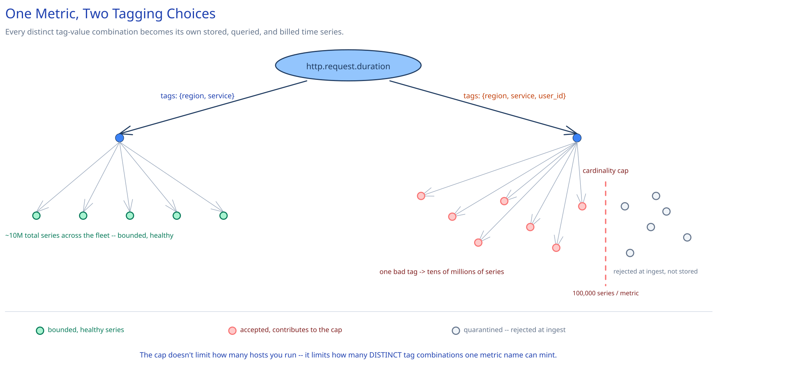

# Module 00 — Overview

## The feature, with no infrastructure in it yet

An engineer wants one question answered continuously, for every one of a few thousand hosts and services: is this healthy right now, and page someone the moment it isn't. Every host in the fleet is already emitting a steady drizzle of small facts — CPU is at 62%, this endpoint just took 340ms, this queue has 12 items in it — dozens to hundreds of them, every ten seconds, forever. None of these facts is interesting alone. What's interesting is the shape of millions of them over time: is p99 latency for the checkout service climbing, is memory on this one host leaking, did the error rate for this endpoint jump right after the last deploy.

That's a fundamentally different write path from anything else in this guide: not "a user did a thing, record it," but a continuous, ambient firehose of tiny structured facts from every machine you operate, whether or not anyone is looking at a dashboard right now. Cross-ref this guide's own building-block explainer, [Logs, Metrics & Distributed Tracing](../../scalability-resilience/logs-metrics-tracing.md), for what a metric *is* and how it differs from a log or a trace — this module is the full system design of the platform that actually stores, queries, and alerts on that signal at fleet scale.

The one hard constraint that makes this an interesting design problem isn't the write volume — it's what a metric's own *tags* do to that volume. A metric point is really `(name, {tag: value, ...}, timestamp, value)` — say `http.request.duration` tagged with `host`, `region`, `endpoint`, `status_code`. Every distinct combination of tag values is its own separate time series that has to be stored and queried independently. Pick tags whose value space is small and bounded (region, environment) and one metric name stays a few dozen series. Pick a tag whose value space grows without bound (a raw customer ID, a container ID that churns every deploy) and that same one metric name can silently become millions of series overnight — this is **cardinality explosion**, and unlike a raw-throughput problem, more servers don't fix it: it degrades storage cost, ingestion cost, and every query that ever touches that metric, all at once, for every team sharing the platform.

## Requirements

**Functional:**
- Collect numeric metrics (counters, gauges, histograms/timers) pushed from a fleet of hosts and services, each tagged with dimensions like host, region, service, and endpoint.
- Store the resulting time series with a retention policy: full resolution for a recent window, progressively coarser rollups for older data.
- Answer ad hoc and dashboard queries: aggregate a metric across matching tag combinations over a time range (e.g. "p99 latency for `checkout-service`, last 6 hours, grouped by region").
- Continuously evaluate alerting rules (threshold and anomaly-based) against live data and fire notifications when a rule breaches, without flapping on noise.

**Non-functional** (stated as assumptions, interview-style):
- 50,000 hosts, each emitting ~200 distinct metrics every 10 seconds.
- A metric point should be queryable within seconds of being emitted, but losing an occasional point under extreme overload is an acceptable, explicit trade — unlike this guide's [payments case study](../payments-system/00-overview.md), a metrics platform is observability infrastructure, not the system of record.
- An alert on a real incident should fire within about a minute of the breach; alert rules must not flap on brief, noisy blips.
- Cardinality per metric name must stay bounded — a single badly-tagged metric must never be able to degrade every other metric sharing the platform.

## Capacity Estimation

Using this guide's [back-of-envelope method](../../foundations/back-of-envelope-estimation.md):

- **Ingestion rate:** 50,000 hosts x 200 metrics / 10s interval = **1,000,000 points/sec average** — comparable in shape to this guide's [Ad Click Aggregation](../ad-click-aggregation/00-overview.md) pipeline, a firehose of small, independent writes rather than a handful of large ones.
- **Wire size:** a self-describing point (metric name, a handful of tag key/value pairs, an 8-byte timestamp, an 8-byte value) runs **~150 bytes** uncompressed. At 1M points/sec that's **~150MB/sec** hitting the intake tier — the number that justifies buffering ingestion behind a queue rather than writing every point straight into storage.
- **Active series, well-tagged baseline:** if every metric is tagged only by dimensions that scale with the fleet itself (host, region, a handful of services) — none tagged by anything that grows unboundedly — cardinality stays close to 50,000 hosts x 200 metrics = **~10 million active time series**, a large but *bounded* number.
- **Active series, one bad tag:** one metric additionally tagged by something like a raw `user_id` or an ephemeral `container_id` can, by itself, mint a new series per distinct value — easily tens of millions of series from that *one* metric name alone, dwarfing the other 10 million combined. This is why cardinality gets an explicit, enforced limit later in this module rather than being left to "just don't do that."
- **Raw storage, naive:** storing every point as a self-describing ~150-byte row for a 15-day raw retention window: 1M/sec x 86,400 x 15 x 150 bytes ≈ **~195 petabytes**. Clearly untenable — this is the number that rules out a generic row-per-point store outright (see Architecture & HLD).
- **Raw storage, purpose-built TSDB:** the same 15 days of points, compressed the way a real time-series engine compresses them (delta-of-delta timestamps + XOR'd values, detailed in Architecture & HLD) — roughly **1.5 bytes/point** in steady state — comes to 1M/sec x 86,400 x 15 x 1.5 bytes ≈ **~1.9 terabytes**. The gap between 195PB and 1.9TB, five orders of magnitude, is the entire reason this system needs a purpose-built storage engine rather than a generic database.

## Approach Walkthrough

Before any boxes: an agent on each host batches its own metric points locally and pushes them, on a short interval, to an intake tier that buffers the firehose in a queue before anything durable happens — decoupling how fast hosts *emit* from how fast the storage engine can *absorb*. Every point that passes an ingest-time cardinality check gets resolved to a series identity (its metric name plus its exact tag set) and appended, compressed, to that series' own time-ordered storage. A background job continuously downsamples data past its raw-resolution window into coarser rollups, trading resolution for storage as data ages. Queries and alert evaluations both read from this same storage — a dashboard query is just a bigger, slower version of the same read an alert rule runs every tick.

## API Surface

- Metric submission (agent → intake, fire-and-forget, batched): `POST /api/v2/series {series: [{metric: "http.request.duration", tags: ["service:checkout", "region:us-east", "endpoint:/pay"], type: "histogram", points: [[1725000000, 0.34], ...]}]}`.
- Query: `POST /api/v1/query {query: "p99:http.request.duration{service:checkout} by {region}", from, to}` → `{series: [{tags: {region: "us-east"}, pointlist: [[ts, value], ...]}, ...]}`.
- Monitor (alert rule): `POST /api/v1/monitors {name, query, threshold, eval_window, notify_channels}` → `{monitor_id}`; `GET /api/v1/monitors/{id}/status` → current state (`OK`/`WARN`/`ALERT`).
- Dashboard: `GET /api/v1/dashboards/{id}` → widget definitions, each just a stored query the Dashboard Service replays against the Query Engine.
