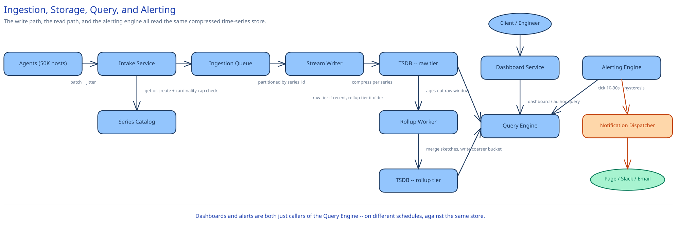

# Module 01 — Architecture & High-Level Design

## Monolith vs. microservices

The platform splits into at least four operationally distinct pieces — an always-on ingest path, a storage/compaction engine, a read/query path, and an alerting engine — and is never folded into one service, for a reason that's about failure isolation, not team boundaries. Ingestion has to keep absorbing the fleet's firehose whether or not anyone is looking at a dashboard; the query path is bursty and read-heavy, driven by however many engineers happen to have a dashboard open; and the Alerting Engine carries the platform's one non-negotiable requirement — it must keep evaluating rules and paging on-call even if the dashboard UI, or the ad hoc query path, is degraded or overloaded. Folding alerting into the same service as ad hoc dashboard queries would mean a burst of expensive, slow interactive queries from one engineer's dashboard could starve the alert-evaluation loop that's supposed to catch the very incident that dashboard is being opened to diagnose.

There's a second, independent reason the seam holds: ingestion's scaling axis is write throughput (partition count, fleet size), while the query path's scaling axis is however many distinct time ranges and tag combinations engineers ask about at once. Provisioning one service for both means over-provisioning whichever axis isn't currently the bottleneck — the same reasoning [Ad Click Aggregation](../ad-click-aggregation/01-architecture-hld.md) uses to keep its ingestion pipeline separate from ad-serving.

## Building Blocks

| Block | Role |
|---|---|
| **Agent** (per host/service) | Locally aggregates a host's own metric points over the flush interval, tags them with host/service metadata, batches and pushes to the Intake Service — jittered per-agent so 50,000 hosts don't all flush on the same clock tick |
| **Intake Service** (stateless) | Validates payload shape, runs the cardinality guard against the Series Catalog, publishes accepted points to the Ingestion Queue |
| **Ingestion Queue** (partitioned log, cross-ref [Kafka & the Distributed Log](../../hld-building-blocks/kafka-distributed-log.md)) | Buffers the firehose, partitioned by series ID hash — decouples the agents' push rate from how fast the Stream Writer can compress and durably store |
| **Series Catalog** | Maps `(metric_name, tag_set)` → `series_id`, the get-or-create that gives every unique tag combination a stable identity; also the enforcement point for the per-metric cardinality cap and the tag-value inverted index the Query Engine resolves filters against |
| **Stream Writer** | Consumes the queue, groups points by series ID, applies delta-of-delta/XOR compression per series, appends to the TSDB's raw tier |
| **TSDB — raw tier** | Columnar, per-series compressed storage at native resolution, retained for a short window |
| **Rollup Worker** | Periodically aggregates raw points past their retention window into coarser (1-minute, 1-hour) buckets, including mergeable percentile sketches for histogram metrics, then expires the raw data it just rolled up |
| **TSDB — rollup tier** | Coarser-resolution, far smaller storage, retained for months rather than days |
| **Query Engine** | Resolves a query's tag filter to matching series IDs via the catalog, picks raw vs. rollup tier by requested range, reads and aggregates across matching series |
| **Alerting Engine** | Runs each active monitor's query on its own evaluation tick, tracks per-monitor state with hysteresis, hands breaches to the Notification Dispatcher |
| **Dashboard Service** | Stores dashboard/widget definitions, replays each widget's query against the Query Engine, caches recently-run query results |

## Per-path walkthrough

**Write path** — `Agent (batch, jittered flush) → Intake Service (validate, cardinality guard against Series Catalog) → Ingestion Queue (partitioned by series_id) → Stream Writer (group by series, compress) → TSDB raw tier`. Nothing on this path waits for a query or a dashboard — an agent's push is fire-and-forget the same way [Ad Click Aggregation](../ad-click-aggregation/01-architecture-hld.md)'s tracking beacon is.

**Downsampling path (async)** — `TSDB raw tier (window past raw retention) → Rollup Worker (aggregate to 1m/1h buckets, merge percentile sketches) → TSDB rollup tier → raw data for that window expired`. This is the step that converts a short window of expensive, fine-grained data into a durable, cheap, coarser one — and it only happens once per series per window, driven by the raw tier's own retention boundary rather than an ad hoc batch job.

**Query/dashboard path (read)** — `Dashboard Service (cache check) → Query Engine (resolve tag filter → series IDs via catalog, pick raw or rollup tier) → TSDB (read matching series) → aggregate across series → Dashboard Service (cache result, render)`. Deliberately never touches the Ingestion Queue or the Stream Writer — a slow or backed-up write path never adds latency to a query in flight.

**Alerting path (async, parallel consumer of the same data)** — `Alerting Engine (tick timer per monitor) → Query Engine (same read path dashboards use, against a short recent window) → threshold/anomaly classification with hysteresis → Notification Dispatcher (page/Slack/email, deduplicated per monitor)`. Structurally the same read as a dashboard widget, just run on a fixed schedule instead of on demand — worth noticing, since it means the Alerting Engine needs no bespoke read path of its own.

## Trade-offs to make explicit

| Decision | Chosen | Alternative | Why |
|---|---|---|---|
| Delivery model | Agent push, StatsD/Datadog-agent style, batched on a jittered interval | Pull/scrape, Prometheus style | A fleet where hosts and containers churn constantly (autoscaling, deploys) means a puller has to continuously rediscover what to scrape; push means every host is responsible for its own delivery and the server never needs a live target list. The trade: push puts backpressure and retry logic on every agent instead of centralizing it in one scraper |
| Series storage format | Purpose-built columnar TSDB: delta-of-delta timestamps + XOR'd values per series | Generic row-per-point store (relational or document) | The capacity math in Module 00 is the whole argument: ~195PB naive vs. ~1.9TB compressed for the same 15 days of raw data — a generic store can't exploit that one series' timestamps arrive on a roughly fixed cadence and its values change slowly between points |
| Cardinality control | Hard per-metric-name cap enforced atomically at series creation (Series Catalog) | No limit — let storage scale to whatever cardinality shows up | An unbounded design means one bad deploy (a tag carrying a raw user ID or request ID) can mint millions of new series overnight, degrading storage cost and every OTHER metric's query latency on the same shard — the same "one tenant, everyone pays" failure mode [Data Partitioning & Sharding](../../hld-building-blocks/data-partitioning-sharding.md) warns about for a hot shard |
| Downsampling | Precompute progressively coarser rollups (1m, then 1h) as data ages past its raw window | Keep only raw data and aggregate everything at query time | A dashboard query spanning a year at 10-second raw resolution would touch billions of points per series interactively; nobody needs 10-second resolution on six-month-old data, so paying the aggregation cost once, at rollup time, instead of on every query is the only way queries over old data stay fast |
| Alert evaluation | Evaluate against a small, frequently-refreshed aggregate window scoped to each monitor's own query | Re-evaluate every rule on every raw point as it arrives | Evaluating on every raw point scales with (active monitors x ingest rate), unbounded on both axes; a hybrid where each monitor pulls its own short window every 10-30 seconds bounds evaluation cost to (active monitors x tick rate) instead, at the cost of a small, bounded detection delay this system's requirements already accept |

## Load Handling

- **Peak-vs-average tolerance:** mass deploys or an incident spiking many hosts' error/latency metrics at once looks like [Ad Click Aggregation](../ad-click-aggregation/01-architecture-hld.md)'s traffic spike — an ordinary horizontal-scaling problem for the stateless Intake Service and Stream Writer tiers, more partition consumers, same per-point logic.
- **Where backpressure kicks in first:** at the agent's own local buffer if the Intake Service is unreachable, then at the Ingestion Queue if Stream Writers fall behind — a growing queue depth, not a dropped point, is the first visible sign of trouble (cross-ref [Backpressure, Load Shedding & Bulkheads](../../scalability-resilience/backpressure-load-shedding.md)).
- **What gets shed under overload:** an agent whose local buffer fills because the Intake Service is down for an extended stretch drops its *oldest* buffered points rather than blocking the host process it's instrumenting — an explicit, named lossy behavior this system accepts (per Module 00's non-functional requirements) that a payments or job-scheduler pipeline in this guide never would.
- **Autoscaling lag:** Intake Service and Stream Writer tiers autoscale on the usual 1-3 minute horizon; the Ingestion Queue absorbs the gap, the same role it plays in [Ad Click Aggregation](../ad-click-aggregation/01-architecture-hld.md).
- **Load-test target:** sustain 1M points/sec ingestion for 10 minutes with p99 point-to-queryable latency under 30 seconds and zero data loss inside the queue's retention window — agent-side drops during a sustained, multi-minute Intake Service outage are the one accepted exception, per the point above.

## Concurrent-User Handling

| Race | Mechanism | What the "loser" sees |
|---|---|---|
| Two writes land for the exact same `(series_id, timestamp)` (an agent restart double-reporting one flush interval) | Metric-type-specific merge at write time: a gauge overwrite is last-write-wins by arrival order, a counter/histogram is summed/merged — never a silent duplicate | For a gauge, whichever write lands second simply becomes the stored value; for a counter, both increments are correctly reflected in a single summed point |
| Two Intake Service instances both see a brand-new `(metric_name, tag_set)` combination at the same instant | Series Catalog's `getOrCreateSeriesId` is an atomic get-or-create against a unique constraint on the tag-set hash — the same discipline this guide's [payments case study](../payments-system/00-overview.md) uses for `idempotency_key` | The losing insert fails the constraint and its caller receives the winner's already-created `series_id`, never a second series minted for the same tag combination |
| A dashboard query reads a window the Rollup Worker is mid-aggregating | The rollup is only visible once fully computed and marked finalized, matching [Ad Click Aggregation](../ad-click-aggregation/01-architecture-hld.md)'s watermark-finalization discipline | The query transparently falls back to the raw tier (if still in its retention window) or returns the prior, already-finalized rollup — never a half-computed aggregate |
| A monitor's evaluation tick fires while a burst of new points for its query is still landing | The evaluator reads against a consistent snapshot of "what's queryable as of now"; anything arriving after the snapshot is picked up by the next tick | The evaluation isn't wrong, just current-as-of-its-own-tick — the next tick, 10-30 seconds later, incorporates whatever landed since |

## Scaling & Reliability

- **Horizontal scaling:** the Intake Service and Stream Writer scale by adding partition consumers up to the Ingestion Queue's partition count; the TSDB itself shards by `series_id` hash (see Database Design) so both write throughput and total storage scale with shard count.
- **Circuit breaker:** an agent's push to the Intake Service is wrapped in backoff/circuit-breaking (cross-ref [Circuit Breakers & Retries](../../scalability-resilience/circuit-breakers-retries.md)) so a struggling Intake Service doesn't get hammered by every one of 50,000 retrying agents at once.
- **Retries:** agent-to-Intake retries are safe to duplicate blindly, because points are naturally idempotent at the storage layer (the same merge mechanism as the concurrency table above) — no idempotency key needs to be invented for this path the way [payments](../payments-system/00-overview.md) requires one.
- **Dead-letter / quarantine:** a malformed point, or a tag combination that would breach a metric's cardinality cap, is routed to a quarantine log with the reason attached, rather than silently dropped or allowed through — the same "make the rejection visible, not silent" instinct as [Ad Click Aggregation](../ad-click-aggregation/02-lld.md)'s late-arrival correction path.
- **Graceful degradation:** if the Rollup Worker falls behind, queries against older windows simply cost more (falling back to scanning raw data slightly longer before it's expired) rather than becoming wrong; if the Alerting Engine's own read path lags, a monitor whose data hasn't updated within its expected interval fires its own built-in "no data" alert (a dead-man's switch) rather than silently going quiet.
- **Multi-region:** not built here — named as a real gap below rather than glossed over.

## What you'd revisit as this grows

- **Multi-region metrics federation.** A single-region platform is a blind spot for the very outage it exists to detect if that region goes down; a mature version ingests per-region and federates queries/rollups centrally.
- **Per-tenant, not global, cardinality limits.** A single global cap either starves a legitimately high-cardinality team or is set loose enough to let one bad team hurt everyone; a mature system tracks and enforces cardinality budgets per team/service, not one constant for the whole platform.
- **Anomaly-detection alerting beyond static thresholds.** This design's Alerting Engine is deliberately pluggable between threshold and anomaly evaluators (see LLD), but a production anomaly detector — seasonal baselines, sudden-change detection — is a genuinely separate, harder problem scoped out here.
- **Exemplars linking a metric spike back to specific traces.** Cross-ref [Logs, Metrics & Distributed Tracing](../../scalability-resilience/logs-metrics-tracing.md)'s point that a metric tells you *that* something's wrong and a trace tells you *where* — wiring a metric spike directly to the trace IDs sampled during it is a real, valuable extension not built here.
