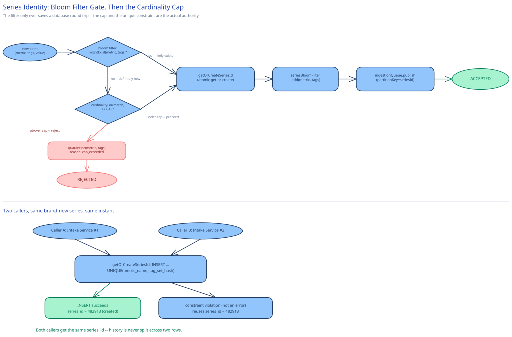

# Module 02 — Low-Level Design



## Interfaces vs. implementations

- **`SeriesCatalog`** *(interface)* → **`ShardedSeriesCatalog`** — `getOrCreateSeriesId(metricName, tagSet)` (atomic get-or-create), `resolveMatching(metricName, tagFilter)` (the inverted-index lookup the Query Engine runs), `cardinalityFor(metricName)`.
- **`TimeSeriesStore`** *(interface)* → **`ColumnarTSDBStore`** — `appendCompressed(seriesId, points[])`, `readRange(seriesId, from, to, resolution)`.
- **`Downsampler`** *(interface)* → **`RollupWorker`** — `rollup(seriesId, window, aggFn)`, writing a mergeable sketch for histogram-type series rather than a single number.
- **`AlertEvaluator`** *(interface)* → **`ThresholdAlertEvaluator`** / **`AnomalyAlertEvaluator`** — `evaluate(monitor) -> {state, value}`. Every monitor is bound to one evaluator implementation without the orchestrator caring which.
- **`QueryEngine`** — the orchestrator combining `SeriesCatalog` and `TimeSeriesStore`; both dashboard queries and alert evaluations run through it.
- **`NotificationDispatcher`** — `notify(monitorId, state, channel)`.

## Series identity resolution, with a bloom filter in front of the expensive path

At 1M points/sec, the overwhelming majority of points belong to a series that already exists — a host reporting its own CPU usage every 10 seconds is the same series every single time. `getOrCreateSeriesId` is a database round-trip; paying it for every point would be paying an expensive check for an answer that's "yes, already exists" 99%+ of the time. A bloom filter of every known `(metric_name, tag_set)` combination (cross-ref [Bloom Filters](../../scalability-resilience/bloom-filters.md)) sits in front of it exactly the way this guide's URL shortener uses one in front of a database lookup: a "definitely not seen before" answer is trusted for free, and only a "maybe" — which includes every genuinely new combination, plus a small, tunable false-positive rate — falls through to the real check.

```
IntakeService.ingest(metricName, tagSet, timestamp, value, metricType):
    if not seriesBloomFilter.mightExist(metricName, tagSet):
        # near-certainly a brand-new series -- this is the one expensive path
        if seriesCatalog.cardinalityFor(metricName) >= CARDINALITY_CAP:
            quarantine(metricName, tagSet, reason="cardinality_cap_exceeded")
            return REJECTED

    seriesId = seriesCatalog.getOrCreateSeriesId(metricName, tagSet)   # atomic get-or-create
    seriesBloomFilter.add(metricName, tagSet)
    ingestionQueue.publish(partitionKey=seriesId, {seriesId, timestamp, value, metricType})
    return ACCEPTED
```

The filter never causes a false *rejection* — a "no" is always correct, per [Bloom Filters](../../scalability-resilience/bloom-filters.md)' own guarantee — so the cardinality check and the catalog itself remain the actual source of truth; the filter only ever saves work on the common path, exactly the role this guide assigns it everywhere else it appears.

## Stream write and query execution

```
StreamWriter.onBatch(points):
    for seriesId, pts in groupBySeriesId(points):
        pts.sort(by timestamp)
        tsdbStore.appendCompressed(seriesId, pts)   # delta-of-delta ts + XOR value, per series
```

```
QueryEngine.execute(query):
    seriesIds = seriesCatalog.resolveMatching(query.metric, query.tagFilter)   # inverted-index lookup
    resolution = pickResolution(query.from, query.to)   # raw tier if inside raw retention, else rollup tier
    perSeries = [tsdbStore.readRange(id, query.from, query.to, resolution) for id in seriesIds]
    grouped = groupByTag(perSeries, query.groupByTags)
    return { group: mergeAndReduce(seriesList, query.aggFn) for group, seriesList in grouped }
    # aggFn = "p99" merges each matching series' per-bucket sketch, THEN takes the percentile --
    # never averages already-computed percentiles together (see Database Design)
```

```
AlertEvaluator.tick(monitor):
    window = queryEngine.execute(monitor.query, from=now - monitor.evalWindow, to=now)
    value = reduce(window, monitor.aggFn)
    candidateState = classify(value, monitor.thresholds)
    if candidateState == monitor.lastState:
        monitor.pendingStreak = 0
    else:
        monitor.pendingStreak += 1
        if monitor.pendingStreak >= monitor.requiredConsecutiveTicks:   # hysteresis
            monitor.lastState = candidateState
            monitor.pendingStreak = 0
            notificationDispatcher.notify(monitor.id, candidateState)
```

The `pendingStreak` counter is the entire flap-prevention mechanism: a metric bouncing across a threshold for one noisy tick doesn't flip the monitor's state or page anyone — only `requiredConsecutiveTicks` in a row does. This is the same state-machine discipline this guide applies to `PaymentStatus` and a scheduled job's lifecycle, just tuned here for noise tolerance rather than transactional correctness.

## Error cases worth designing for deliberately

- **Cardinality cap tripped mid-stream** (a deploy adds a tag that wasn't there yesterday): new combinations beyond the cap are quarantined, with the reason recorded, rather than accepted and left to silently degrade every other query against that metric.
- **A point arrives for a window whose raw data has already been rolled up and expired:** applied as an explicit, bounded correction to the rollup rather than silently rewriting already-finalized history — the same instinct as [Ad Click Aggregation](../ad-click-aggregation/02-lld.md)'s late-arrival correction path, just applied to a rollup instead of a billing window.
- **A query spans the raw/rollup boundary** (part of the requested range is still raw, part has already been rolled up): the Query Engine stitches both tiers transparently rather than erroring or silently truncating the range at the boundary.

## Concurrency at the code level

`getOrCreateSeriesId` needs no application-level lock, for the same reason payments' `updateStatus` doesn't: correctness comes from the database's own unique constraint on the tag-set hash, not from an `if`-check in application code that many concurrent Intake Service instances could race past. `appendCompressed` for one series needs no lock either, but for a different reason — partitioning the Ingestion Queue by `series_id` hash means every point for one series always routes to the same partition and the same Stream Writer consumer, so there's structurally only ever one writer touching a given series' compressed block at a time, the same "no two writers, no lock needed" reasoning this guide's [distributed job scheduler](../distributed-job-scheduler/02-lld.md) gets from per-shard leader ownership.

The one place a real ordering guarantee matters: rollup finalization must only ever move forward. A naive implementation that finalizes strictly on wall-clock time can regress if a batch of slightly-late raw points arrives out of order within the grace period — the fix is the identical `max(...)`-based watermark discipline [Ad Click Aggregation](../ad-click-aggregation/02-lld.md)'s `advanceWatermark` uses, applied here to rollup windows instead of billing windows.

## Design patterns you just used, named

- **Repository pattern** — `SeriesCatalog` and `TimeSeriesStore` hide storage behind method calls; `QueryEngine` never issues raw storage calls itself.
- **Strategy pattern** — `AlertEvaluator` is a strategy: `ThresholdAlertEvaluator` and a future `AnomalyAlertEvaluator` are interchangeable behind one interface, and a monitor's choice of which to use is a strategy-selection decision, not a rewrite of the orchestrator.
- **State pattern (via an explicit enum, not a class hierarchy)** — a monitor's `OK → WARN → ALERT` states, gated by the hysteresis counter, are the same named-states-with-enforced-transitions discipline this guide applies to `PaymentStatus`.
- **Bloom filter as a cost-avoidance layer**, named explicitly per [Bloom Filters](../../scalability-resilience/bloom-filters.md) — a cheap, probabilistic "definitely not seen" check placed in front of an expensive, authoritative one, never used as the authority itself.

## Practice: extend it yourself

Before moving to Database Design, sketch (pseudocode is fine) how you'd add:

1. **An anomaly-detection `AlertEvaluator`** that compares the current value against a seasonal baseline (e.g., "same hour, same day of week, over the last four weeks") instead of a fixed threshold. Which interface does it implement, and what extra storage — beyond what `ThresholdAlertEvaluator` needs — does a baseline model require? Does computing that baseline belong inside the evaluator's own `evaluate()` call, or as a separate background job that keeps the baseline warm?
2. **Per-tenant cardinality budgets** instead of one global `CARDINALITY_CAP`. Does `getOrCreateSeriesId`'s signature need to change to know which tenant a point belongs to? And when a tenant's budget is lowered after the fact and they're already over it — does only *new* series creation stop, or do their oldest, least-queried existing series get evicted to get back under budget?

Neither has one clean answer — the point is noticing that the interfaces already drawn (`AlertEvaluator`, `SeriesCatalog`) make it obvious which component *should* own each new piece of behavior, even before you've fully worked out what that behavior does.
