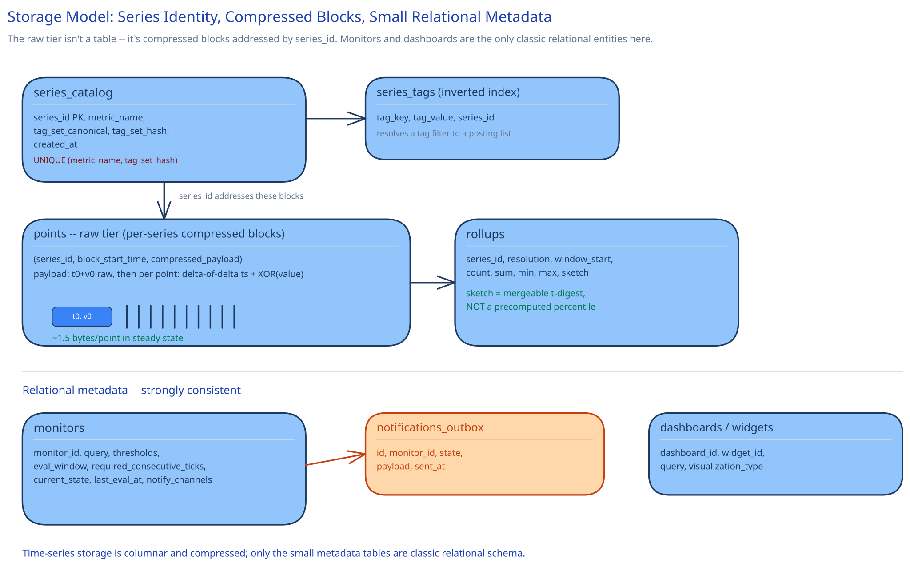

# Module 03 — Database Design & Scaling

## From entities to schema

This schema looks different from a typical relational ER diagram on purpose — a time-series engine's actual storage isn't relational, and pretending it is would misrepresent how the hard problem in this module actually gets solved.

- **`series_catalog`** `(series_id PK, metric_name, tag_set_canonical, tag_set_hash, created_at)`, **unique** `(metric_name, tag_set_hash)` — the identity table; every point's very first stop is resolving into a `series_id` here.
- **`series_tags`** (an inverted index, not a normal foreign-key table) `(tag_key, tag_value, series_id)` — supports "every series where `service=checkout`" without scanning `series_catalog` row by row.
- **`points`** (the TSDB's actual raw tier, conceptually) `(series_id, block_start_time, compressed_payload)` — stored as compressed per-series blocks, never one row per point. `compressed_payload` holds a Gorilla-style encoding: the block's first point stored raw (a full timestamp and a full 64-bit value), every subsequent point stored as a delta-of-delta of its timestamp against the prior two points, and an XOR of its value against the previous value. One block typically spans about two hours of one series' raw points.
- **`rollups`** `(series_id, resolution [1m|1h], window_start, count, sum, min, max, sketch)` — `sketch` is a mergeable percentile structure (a t-digest, concretely) for histogram/timer metrics, not a single pre-computed percentile number.
- **`monitors`** `(monitor_id, query, thresholds, eval_window, required_consecutive_ticks, current_state, last_eval_at, notify_channels)` — small, relational, standard CRUD.
- **`dashboards` / `dashboard_widgets`** `(dashboard_id, widget_id, query, visualization_type)` — same shape, small and relational.
- **`notifications_outbox`** `(id, monitor_id, state, payload, sent_at)` — the same transactional-outbox pattern this guide's [payments](../payments-system/03-db-design.md) and [distributed job scheduler](../distributed-job-scheduler/03-db-design.md) case studies use for anything that must be durably queued before being delivered asynchronously: a state transition and the outbox row that announces it commit together, and a relay delivers the notification independently.

## Why the raw tier is compressed per-series blocks, not one row per point

At 1M points/sec, a generic row-per-point table pays a fixed per-row cost — a row header, a B-tree index entry (cross-ref [Database Indexing](../../database-design/database-indexing.md)) — that dwarfs the 16 bytes an actual `(timestamp, value)` pair needs. Module 00's capacity math already showed the gap this creates: ~195PB naive vs. ~1.9TB compressed for the same 15 days. Delta-of-delta timestamp encoding works because points from one series arrive on a roughly fixed cadence (every ~10 seconds) — the *delta of the delta* between consecutive timestamps is usually zero or a tiny number, encodable in a couple of bits instead of a fresh 8-byte integer every time. XOR-based value encoding exploits the same idea from the other side: most consecutive readings from one series (CPU%, latency) are close to their neighbor, so XORing consecutive 64-bit values leaves mostly leading and trailing zero bits, and only the handful of bits that actually changed need to be stored. This is the same technique Facebook's Gorilla paper and Prometheus's own on-disk format both use, and it's the reason a purpose-built TSDB, not a generic store, is the only viable engine at this ingest volume.

## Why `series_catalog` gets a unique constraint on `(metric_name, tag_set_hash)`, non-negotiably

Same reasoning as this guide's [payments case study](../payments-system/03-db-design.md) puts on `idempotency_key`: two Intake Service instances racing to register the exact same brand-new tag combination is a real interleaving in application code (both check "does this exist" and both see "no" before either inserts), and it stops being a possible outcome once the unique constraint exists — the second insert fails cleanly, and the caller reuses the first insert's `series_id`. Without this constraint, the same logical time series could end up split across two different `series_id`s, silently fragmenting its own history across both — a query for that metric and those tags would only ever see half its data, with no error to indicate why.

## Why histograms need a mergeable sketch in `rollups`, not a stored percentile number

A p99 computed from one hour's points and a p99 computed from the next hour's points cannot be averaged together to get the p99 across both hours — percentiles don't compose that way; the p99 of two p99s is not the true p99 of the combined data. A t-digest (or similar mergeable sketch) sidesteps this by being a compact summary of the *distribution*, not a single derived number, so two sketches can be merged commutatively and a percentile computed correctly from the merged result at query time. This is the concrete mechanism behind a query like "p99 latency across 200 hosts running `checkout-service`" actually being correct, rather than a statistically meaningless average of 200 hosts' individual p99s.

## Indexes

- `series_catalog(metric_name, tag_set_hash)` — **unique**, the concurrency-safety mechanism above.
- `series_tags(tag_key, tag_value)` — the inverted index the Query Engine's tag-filter resolution runs against constantly (cross-ref [Search & Inverted Indexes](../../scalability-resilience/search-inverted-indexes.md) — resolving `service:checkout` to a posting list of `series_id`s is structurally identical to resolving a search term to a list of documents).
- `points(series_id, block_start_time)` — the TSDB's own primary access path: "this series' blocks in this time range" is a direct, sorted lookup, never a scan across unrelated series.
- `rollups(series_id, resolution, window_start)` — composite, matching the Query Engine's dominant range-scan-per-series-per-resolution pattern, the same leftmost-prefix reasoning [Database Indexing](../../database-design/database-indexing.md) applies to `click_events(url_id, occurred_at)`.
- `monitors(current_state, last_eval_at)` — the Alerting Engine's own "which monitors are due for their next tick" scan, the same shape as the [distributed job scheduler](../distributed-job-scheduler/03-db-design.md)'s `(shard, status, next_run_time)` index.

## Consistency

- **`series_catalog`:** must be strongly consistent — a duplicate `series_id` for the same tag combination silently fragments that metric's history, which is a correctness bug, not a staleness question.
- **`points` (raw tier):** eventually consistent by design — a point becomes visible for querying within a bounded, small delay after ingestion (the queue-and-batch write path in Module 01), and a dashboard reading a metric a few seconds stale is an explicitly accepted trade per Module 00's non-functional requirements, unlike payments' hard read-your-own-write guarantee.
- **`rollups`:** eventually consistent, and intentionally delayed — the same flavor as [Ad Click Aggregation](../ad-click-aggregation/03-db-design.md)'s aggregate store: a rollup only becomes visible once its input window is fully finalized, which is what makes the number correct, not just fast.
- **`monitors` / `dashboards`:** strongly consistent, small relational tables — a user editing an alert threshold or adding a dashboard widget expects it to take effect on the very next evaluation tick or page load, not eventually.

## Scaling the schema

- **Shard `points` and `rollups` by `series_id` hash, not by time range.** A time-range shard key would concentrate every single current write onto whichever shard owns "now" — the exact hot-shard failure mode [Data Partitioning & Sharding](../../hld-building-blocks/data-partitioning-sharding.md) describes for a monotonically increasing key. Hashing by `series_id` spreads both ingest writes and total storage evenly instead.
- **The cardinality cap matters twice because of this shard key.** It bounds not just total storage, but how many shards a single multi-series query (a "group by region" spanning many hosts) has to fan out to and merge — an unbounded-cardinality metric wouldn't just cost more to store, it would make every query against it slower too.
- **`series_catalog` and `series_tags` scale independently, and far more slowly, than `points`/`rollups`** (roughly 10M series vs. well over a trillion raw points over the same 15-day window) — the same "the fast-growing table gets its own scaling story" reasoning as this guide's [payments ledger](../payments-system/03-db-design.md) growing 2:1 against `payment_intents`.
- **Read replicas vs. sharding, again:** replicas help when many engineers read the *same* recent dashboards concurrently — a genuinely common pattern during an incident, when everyone opens the same one — while sharding solves total ingest write throughput and storage size as the fleet grows. Reaching for one when the other is the actual bottleneck is the mistake to avoid, the same distinction this guide draws in every other case study's DB design.

## Connecting it back

Trace it end to end: Module 00's "cardinality must stay bounded" requirement is why `series_catalog` enforces a cap at the exact moment a new `series_id` would be minted, atomically, the same discipline as an idempotency key; that same requirement is why sharding `points` by `series_id` rather than by time matters twice over — for even write distribution, and for bounding how far a query has to fan out; and the unstated-but-implicit "p99 must actually mean p99" requirement of monitoring real service health is why `rollups` stores a mergeable sketch instead of a number. Nothing in this schema is arbitrary — every table, index, and encoding choice traces back to either the cardinality constraint or the compression math from Module 00.
