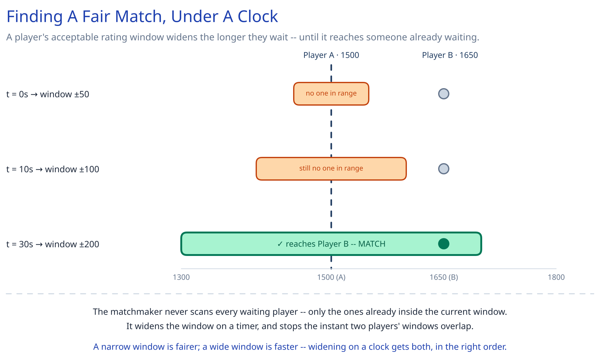

# Module 00 — Overview

## The feature, with no infrastructure in it yet

A player taps "Find Match." Two clocks start at once, and they're solving two different problems. The first clock is a search: somewhere in a pool of other waiting players is someone of comparable skill, and the system has to find them without making the player wait forever. The second clock only starts once the first one ends: two players now share one live chess board, and every move either of them makes has to reach the other side fast enough to feel like a real game, validated by an authority neither player controls, so that a modified client can't invent an illegal move or a false result.

That's the one hard constraint that makes this an interesting design problem: **it's genuinely two systems, not one.** Matchmaking is a queueing/search problem — bounded wait time, fair-enough pairing, and it's over in seconds. The live game session is a real-time, stateful problem — one authoritative board, held somewhere, for as long as the game lasts, that both players' connections have to keep reaching. Collapsing them into a single architecture (as if "find an opponent" and "hold a live game" were the same kind of workload) is the mistake this design deliberately avoids.

## Requirements

**Functional:**
- A player requests a match for a given time control (blitz, rapid, classical); the system finds an opponent of comparable skill rating.
- Once matched, both players play a live game — moves exchanged in real time, each one validated as legal by the server against the current board, never trusted from either client.
- A game's outcome updates both players' ratings; the completed game (full move history) is durably persisted for replay and spectating.
- A player whose connection drops mid-game can reconnect and resume from the current board state, rather than instantly losing.

**Non-functional** (stated as assumptions, interview-style):
- 5M daily active players, averaging 3 games/day.
- Matchmaking wait time: median under 5 seconds, p99 under 30 seconds — the widening-window mechanism below exists specifically to hold that p99.
- Move round-trip: a legal move must reach the opponent in well under a second (comparable to this guide's [WebSocket](../../scalability-resilience/long-polling-websockets-sse.md) latency bar for chat) — this is a live game, not a turn-based app users expect to poll.
- A move must **never** be accepted if it's illegal, out-of-turn, or submitted by the wrong player — even from a deliberately modified client. This is the same never-trust-the-client principle this guide's payments case study applies to money, applied here to game state.
- A disconnect must not be an instant forfeit; there has to be a bounded grace period before the game is scored as abandoned.

## Capacity Estimation

Using this guide's [back-of-envelope method](../../foundations/back-of-envelope-estimation.md):

- **Games/day:** 5M DAU × 3 games/day = 15M games/day.
- **Game-starts/sec:** 15M / 86,400 ≈ 174/sec average. At a 3x peak factor (evenings, weekends): **~520/sec peak**.
- **Matchmaking pool depth (Little's Law):** pool depth ≈ arrival rate × average wait time ≈ 520/sec × 5s (the median wait target) ≈ **~2,600 players waiting at any instant, at peak** — deliberately small. The pool isn't the part of this system that has to hold enormous state; the live-game tier is.
- **Concurrent live games (Little's Law again):** with an average game lasting ~8 minutes (480s): 520/sec × 480s ≈ **~250,000 concurrent games at peak**, meaning **~500,000 concurrent WebSocket connections** held by the game-server fleet just for active play — this is the number that actually sizes that tier, an order of magnitude past the matchmaking pool.
- **Move-message volume:** an average game has ~40 ply (half-moves) exchanged over its life; across 250,000 concurrent games that's roughly 250,000 × 40 / 480s ≈ **~20,800 move messages/sec at peak** — the real-time throughput number the game-server fleet has to sustain.
- **Move-history storage:** 15M games/day × ~40 moves/game × ~20 bytes/move (a compact move notation, a clock reading, a timestamp) ≈ **~12GB/day** — tiny compared to a chat system's payload, because a chess move is a few bytes, not a message body.
- **Rating table:** 5M players × ~50 bytes (id, rating, games played) ≈ **~250MB** — small enough that it's not the storage problem either; serving "top rated players" is the same problem this guide's [Real-Time Leaderboard](../real-time-leaderboard/00-overview.md) case study already solves in depth, and this design reuses that solution rather than re-deriving it.

## Approach Walkthrough

Before any boxes: this design treats matchmaking and the live game session as two subsystems connected by a single handoff, not one system. Matchmaking holds waiting players in a pool bucketed by rating, and — because a narrow rating window finds a fairer match but takes longer, while a wide window matches fast but poorly — the acceptable window **widens the longer a player waits** (±50 rating points at the start, ±100 after 10 seconds, ±200 after 30 seconds, and so on) until it overlaps someone else's window and a match forms. The moment a match forms, matchmaking's job is done: it hands both players off to a game-server instance and never touches them again. From then on, that ONE instance holds the authoritative board for that game — every move from either player is validated there before being broadcast to the other side and persisted — which means both players' connections have to be routed, deliberately, to the same instance for the life of the game, a genuine exception to this guide's default of stateless services behind a load balancer.

## API Surface

- `POST /matchmaking/queue {player_id, time_control}` → `{queue_ticket_id}` — enters the rating-bucketed pool for that time control.
- `DELETE /matchmaking/queue/{ticket_id}` — cancels an in-progress search.
- `match.found` (server push, once matched): `{game_id, opponent, color, game_server}` — the event that ends the search and tells the client which instance to open a game connection to.

Realtime, over the WebSocket connection to the assigned game-server instance:
- `move.submit` (client → server): `{game_id, client_seq, from, to, promotion?}` — `client_seq` doubles as the idempotency key for a retried submit.
- `move.applied` (server → both clients): `{game_id, move, board_fen, turn, clocks}`.
- `move.rejected` (server → submitter only): `{game_id, reason}`.
- `game.resign` / `game.offer_draw` (client → server).
- `game.ended` (server → both clients): `{game_id, result, reason, rating_delta}`.

Non-realtime, over REST:
- `GET /games/{game_id}/moves?cursor=&limit=` → paginated move history, for replay and spectating.
- `GET /players/{id}/rating` → current rating (cross-ref [Real-Time Leaderboard](../real-time-leaderboard/00-overview.md) for how a "top players" query is served fast at scale).
