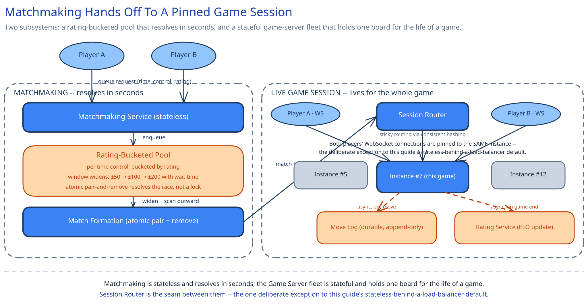

# Module 01 — Architecture & High-Level Design

## Monolith vs. microservices

Matchmaking and the live game session are pulled apart into two separate services, not just two modules in one process, because they have fundamentally different scaling shapes and deploy risk profiles. Matchmaking is a bursty, short-lived, largely stateless queueing workload — a waiting ticket resolves and disappears within seconds. The Game Server tier is the opposite: long-lived and genuinely **stateful**, holding one game's authoritative board in memory for the entire game, the same kind of stateful-connection-tier problem this guide's [chat-messaging-system](../chat-messaging-system/01-architecture-hld.md) names for its Connection Gateway. Bundling both into one service means a Matchmaking Service deploy — a low-risk, frequent change — would risk disrupting every in-progress game on the same process, and vice versa; splitting them means a bad matchmaking deploy can't drop a single live move.

If your chess app is small enough that a few hundred concurrent games and a handful of waiting players fit comfortably in one process's memory, this split isn't buying anything yet — say so rather than defaulting to two services because it looks more serious.

## Building blocks

| Block | Role |
|---|---|
| **Matchmaking Service** (stateless) | Accepts queue requests; tracks each waiting player's rating and wait-start time; runs the widening-window search |
| **Rating-Bucketed Pool** (in-memory, per time control) | The actual search structure — waiting players indexed by rating, so "find someone within ±R of me" is a narrow bucket scan, never a full scan of every waiting player |
| **Match Formation** | Atomically pairs two players whose windows overlap, removes both from the pool, allocates a `game_id` |
| **Session Router** (sticky routing) | Assigns a newly-formed match to ONE Game Server instance, and re-locates a reconnecting player back to that same instance — the mechanism behind the deliberate stateful exception below |
| **Game Server fleet** (stateful) | Each instance holds the authoritative board (a chess engine's legal-move validator) in memory for every game it currently owns |
| **Move Log** (durable, append-only) | Every validated move, persisted asynchronously, independent of the in-memory board — the record that survives an instance crash |
| **Rating Service** | Applies the ELO update once a game ends; the read side of "what's my rating" and "who's top-ranked" reuses [Real-Time Leaderboard](../real-time-leaderboard/01-architecture-hld.md)'s sorted-set approach rather than re-deriving it here |
| **Reconnection Handler** | Starts an abandonment countdown on disconnect; on reconnect, re-pins the player to the owning instance (or a recovering one replaying the Move Log) |

## Per-path walkthrough

**Matchmaking path** — `Client → LB → Matchmaking Service (enqueue into the rating-bucketed pool for this time control, record wait-start) → periodic scan widens the window as wait time grows → Match Formation (atomic pair-and-remove) → Session Router (assign a Game Server instance) → match.found pushed to both clients`. Nothing on this path is stateful past the pool itself, and the pool's entries live for single-digit seconds — this is why it can stay in-memory rather than durable (see Database Design).

**Live-move path** — `Player's client → the ONE Game Server instance holding this game_id → validate (right player's turn? legal per chess rules?) → apply to the in-memory board → broadcast move.applied to BOTH players' sockets, both pinned to this same instance → async append to Move Log`. The validation step is the one non-negotiable gate: the server, never either client, decides what's legal.

**Reconnection path** — `Player's client disconnects → Game Server keeps the authoritative board in memory and starts an abandonment timer → client reconnects → Session Router re-locates the owning instance (or, if that instance itself died, a new one that first replays the Move Log to rebuild board_state) → client receives the current board and resumes`. The game is never held only in an ephemeral, no-persistence handler — that's exactly what the Move Log exists to prevent.

**Game-end / rating-update path (async)** — `Game Server reaches a terminal state (checkmate, resignation, draw, timeout, or an abandonment timer expiring) → Rating Service applies the ELO update to both players → Move Log finalized → the "top rated" read path picks up the new rating (cross-ref Real-Time Leaderboard)`.

## Trade-offs to make explicit

| Decision | Chosen | Alternative | Why |
|---|---|---|---|
| Matchmaking search structure | Rating-bucketed pool, scanned outward from a player's own rating | Full scan of every waiting player, checking each for a compatible rating | A full scan is O(waiting players) per match attempt; a bucketed structure turns "find someone within ±R" into a narrow range scan — the same reasoning this guide's [Database Indexing](../../database-design/database-indexing.md) gives for matching a structure to the query that actually runs constantly |
| Acceptable-rating window | Starts narrow (±50), widens with wait time (±100 at 10s, ±200 at 30s, wider still past that) | A single fixed window for every player, always | A fixed narrow window strands a player in a thin population (off-peak hours, an extreme rating) with no bound on wait time; a fixed wide window gives everyone a fast but low-quality match even when a close one is available. Widening over time gives the good match when the pool supports it, and only sacrifices fairness when the alternative is an unacceptable wait |
| Game-session routing | Sticky routing — both players pinned to the one Game Server instance that owns the game | Stateless game-servers behind a normal load balancer, board state read/written from a shared external store on every move | Round-tripping to a shared store on every single move adds latency to the one path that most needs to feel instant; this is a deliberate, named exception to this guide's stateless-behind-LB default (cross-ref [Long Polling, WebSockets & SSE](../../scalability-resilience/long-polling-websockets-sse.md) for why a stateful connection tier routes differently, and [Consistent Hashing](../../hld-building-blocks/consistent-hashing.md) for the routing mechanism itself) |
| Move validation authority | The server validates every move against chess rules before applying or broadcasting it | Trust the client's own legality check; the server just relays | A modified client could submit an illegal move or claim a false result; the server is the only party neither player controls, so it's the only party that can be trusted to decide what's legal — the same never-trust-the-client stance this guide's [payments case study](../payments-system/00-overview.md) takes with money |
| Move persistence | Append-only Move Log, written asynchronously per move, separate from the in-memory board | Only the in-memory board, no separate durable record | The in-memory board is the fast path for the next legality check, not a store that survives a crash; a separate durable log is what makes replay, spectating, and recovering a crashed instance's in-flight games possible — the same "the in-memory structure is not the only copy" reasoning [Real-Time Leaderboard](../real-time-leaderboard/01-architecture-hld.md) applies to its sorted set |

## Load Handling

- **Peak-vs-average tolerance:** Matchmaking Service is stateless and scales horizontally by request rate like any tier in this guide. The Game Server fleet's scaling unit is different — instances scale by **concurrent games held**, not requests/sec, the same distinction [chat-messaging-system](../chat-messaging-system/01-architecture-hld.md) draws between connection count and request rate for its gateway tier.
- **Where backpressure kicks in first:** the widening window IS matchmaking's backpressure valve — under a thin population (an off-peak hour, an extreme rating), the window keeps widening until it finds someone, rather than the search blocking or timing out with no path forward. On the game-server side, an instance approaching its held-games capacity simply stops accepting new assignments from Session Router; a new match lands on a different instance rather than queuing behind an already-saturated one.
- **What gets shed under overload:** never a move on the live-move path — an in-progress game must never have its move exchange dropped. What genuinely can degrade under pressure: match quality (the widen schedule can be forced faster under a queue backlog) and non-critical enrichment (spectator fan-out, analytics events) — never move validation itself.
- **Autoscaling lag:** Matchmaking Service reacts on the familiar 1-3 minute horizon. The Game Server fleet has a subtlety the guide's usual stateless tiers don't: a newly-started instance can accept brand-new matches immediately, but it can't absorb load from games already pinned to other instances — so a spike in *concurrent live games* (as opposed to a spike in new-match demand) has to be absorbed by pre-provisioned headroom, not by autoscaling reacting in time.
- **Load-test target:** sustain 1,000 match formations/sec against a pool of 50,000 concurrently-waiting players for 10 minutes, confirming p99 wait time stays under the widened-window bound (30s) and zero player is ever matched outside their currently-acceptable window; separately, sustain 300,000 concurrent live games with p99 move round-trip under 200ms and zero dropped move.

## Concurrent-User Handling

| Race | Mechanism | What the "loser" sees |
|---|---|---|
| Two overlapping pairings could both claim the same waiting player at once (A's widened window overlaps both B and C simultaneously) | Match Formation claims a candidate pair with an atomic conditional remove-both-from-pool — the same discipline this guide's [distributed job scheduler](../distributed-job-scheduler/01-architecture-hld.md) uses for its atomic claim | The losing pairing attempt simply finds its candidate already gone and moves on to scan the next compatible candidate — no error, no stuck ticket |
| Both players submit a move at "the same time" (only one can legally be to-move) | The Game Server checks the board's own `turn` field as part of move validation, before legality is even checked | The out-of-turn submitter gets `move.rejected {reason: "not your turn"}` — never a move silently applied out of order |
| A player disconnects right as a move they just sent is still in flight, then reconnects | The move's `client_seq` is an idempotency key (the same pattern this guide's [chat-messaging-system](../chat-messaging-system/02-lld.md) uses for `client_msg_id`); a retried submit-after-reconnect for an already-applied move is a safe no-op | The reconnecting client sees the game's true current state, including whether its own in-flight move actually landed — never a duplicate move |
| A game reaches checkmate at the exact instant its abandonment timer (for an earlier, now-irrelevant disconnect) also fires | The game's terminal-state guard (Module 02) rejects any further transition once a result is recorded | The abandonment timer's forfeit attempt is a no-op against an already-finished game; the real result — the checkmate — stands |

## Scaling & Reliability

- **Horizontal scaling:** Matchmaking Service scales like any stateless tier. The Game Server fleet scales by adding instances, each capped at some max concurrent games held in memory; Session Router (cross-ref [Consistent Hashing](../../hld-building-blocks/consistent-hashing.md)) is what lets that fleet grow without reshuffling which instance owns which in-flight game.
- **Circuit breaker:** doesn't apply to move validation itself (nothing external is called on that path), but the Move Log append and the Rating Service update are both wrapped the way this guide treats any downstream write that shouldn't block a hot path (cross-ref [Circuit Breakers & Retries](../../scalability-resilience/circuit-breakers-retries.md)) — an outage in either delays persistence or rating updates, never the live move exchange.
- **Retries:** a client's move resubmission is safe because of the `client_seq` idempotency above; a Move Log append retries against the same durable offset, never re-validating or re-applying the move itself.
- **Dead-letter queue:** a Move Log append or rating-update event that fails repeatedly (a malformed payload, a store outage) lands in a DLQ rather than blocking a Game Server instance's in-memory processing for every OTHER game it's holding.
- **Graceful degradation:** if the Move Log store is down, a live game keeps running entirely off the in-memory authoritative board — moves keep validating and broadcasting normally; only persistence (and therefore spectating/replay of the very latest moves) lags until the store recovers, the same "the live path's correctness never depends on the durability side-channel being healthy" pattern this guide's [payments case study](../payments-system/01-architecture-hld.md) uses for its ledger.
- **Multi-region:** not built here — named as a real gap below.

## What you'd revisit as this grows

- **Multi-region game sessions.** A player in one region matched with a player in another needs either a single-region-owns-the-game rule (adds latency for the distant player) or a genuinely harder cross-region real-time relay — this design doesn't take that on.
- **Anti-cheat beyond illegal-move rejection.** The authoritative server already prevents an illegal move from ever being accepted, but says nothing about a human quietly consulting a chess engine to choose an otherwise-perfectly-legal move — a statistical, out-of-band detection problem layered on top, deliberately out of scope here.
- **Spectator fan-out at scale.** A single high-profile game (a titled player, a tournament final) watched by thousands is structurally the same fan-out problem this guide's [chat-messaging-system](../chat-messaging-system/00-overview.md) names for very large group chats — this design's "one instance holds this game" model doesn't take on that scale.
- **Cold-start ratings for brand-new players.** This design assumes every queued player already has a stable rating; a first-several-games player needs a provisional rating and a different matching strategy (a wider initial window, a bigger K-factor), worth naming as a gap rather than pretending every player starts mid-career.
