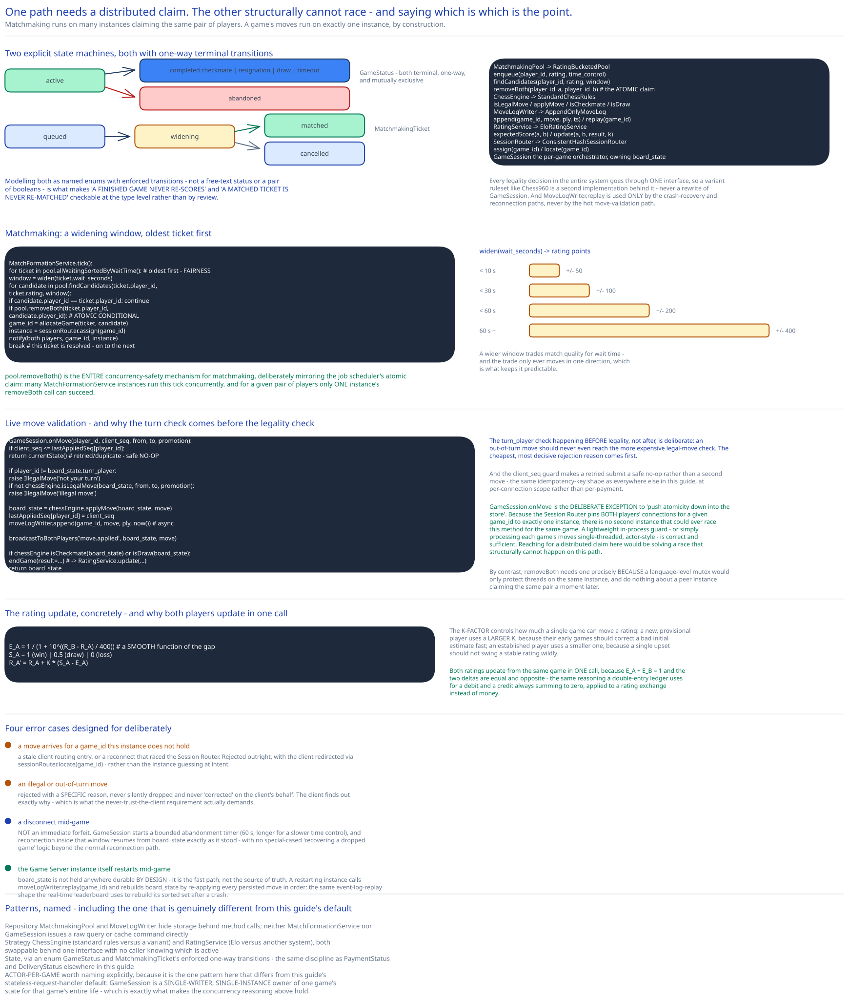

# Module 02 — Low-Level Design



**`GameStatus`**, as an explicit state machine, matching this guide's convention elsewhere: `active → completed(checkmate | resignation | draw | timeout) | abandoned`, both terminal transitions one-way and mutually exclusive. **`MatchmakingTicket`** is its own small state machine: `queued → widening → matched | cancelled`. Modeling both as named enums with enforced transitions — not a free-text status or a pair of booleans — is what makes "a finished game never re-scores" and "a matched ticket is never re-matched" checkable at the type level.

## Interfaces vs. implementations

- **`MatchmakingPool`** *(interface)* → **`RatingBucketedPool`** — `enqueue(player_id, rating, time_control)`, `findCandidates(player_id, rating, window)` (the narrow bucket scan a widened window actually runs), `removeBoth(player_id_a, player_id_b)` (the atomic conditional claim that resolves a match).
- **`ChessEngine`** *(interface)* → **`StandardChessRules`** — `isLegalMove(board_state, from, to, promotion) -> bool`, `applyMove(board_state, move) -> board_state`, `isCheckmate(board_state)` / `isDraw(board_state) -> bool`. Every legality decision in the entire system goes through this one interface; a variant ruleset (Chess960) is a second implementation behind it, never a rewrite of `GameSession`.
- **`MoveLogWriter`** *(interface)* → **`AppendOnlyMoveLog`** — `append(game_id, move, ply_number, timestamp)`, `replay(game_id) -> [moves]` — used only by the crash-recovery/reconnection path, never by the hot move-validation path.
- **`RatingService`** *(interface)* → **`EloRatingService`** — `expectedScore(ratingA, ratingB) -> float`, `update(ratingA, ratingB, result, k) -> (newRatingA, newRatingB)`.
- **`SessionRouter`** *(interface)* → **`ConsistentHashSessionRouter`** — `assign(game_id) -> instance`, `locate(game_id) -> instance | null` (used on reconnect).
- **`GameSession`** — the per-game orchestrator living inside one Game Server instance; holds the in-memory `board_state` and depends on `ChessEngine`, `MoveLogWriter`, and `RatingService`, implementing none of their storage or rules logic itself.

## Matchmaking: the widening-window search

```
MatchFormationService.tick():
    for ticket in pool.allWaitingSortedByWaitTime():        # oldest first -- fairness
        window = widen(ticket.wait_seconds)
        for candidate in pool.findCandidates(ticket.player_id, ticket.rating, window):
            if candidate.player_id == ticket.player_id:
                continue
            if pool.removeBoth(ticket.player_id, candidate.player_id):   # atomic conditional
                game_id = allocateGame(ticket, candidate)
                instance = sessionRouter.assign(game_id)
                notify(ticket.player_id, candidate.player_id, game_id, instance)
                break        # this ticket is resolved -- move on to the next waiting ticket

widen(wait_seconds):
    if wait_seconds < 10:  return 50
    if wait_seconds < 30:  return 100
    if wait_seconds < 60:  return 200
    return 400
```

`pool.removeBoth(...)` is the entire concurrency-safety mechanism for matchmaking, deliberately mirroring [distributed job scheduler](../distributed-job-scheduler/02-lld.md)'s atomic claim: many `MatchFormationService` instances can run this tick concurrently, and only one's `removeBoth` call for a given pair of players can actually succeed.

## Live move validation

```
GameSession.onMove(player_id, client_seq, from, to, promotion):
    if client_seq <= lastAppliedSeq[player_id]:
        return currentState()                              # retried/duplicate submit -- safe no-op

    if player_id != board_state.turn_player:
        raise IllegalMove("not your turn")
    if not chessEngine.isLegalMove(board_state, from, to, promotion):
        raise IllegalMove("illegal move")

    board_state = chessEngine.applyMove(board_state, Move(from, to, promotion))
    lastAppliedSeq[player_id] = client_seq
    moveLogWriter.append(game_id, move, ply_number=moveCount(), timestamp=now())   # async

    broadcastToBothPlayers("move.applied", board_state, move)

    if chessEngine.isCheckmate(board_state) or chessEngine.isDraw(board_state):
        endGame(result=...)                                 # -> RatingService.update(...)

    return board_state
```

The `turn_player` check happening *before* legality, not after, is deliberate: an out-of-turn move should never even reach the (more expensive) legal-move check — the cheapest, most decisive rejection reason comes first.

## The ELO update, concretely

`RatingService.update` implements the standard rating-update shape, not a novel one: given a game between rating `R_A` and `R_B`, the **expected score** for A is `E_A = 1 / (1 + 10^((R_B - R_A) / 400))` — a smooth function of the rating gap, not a lookup table. After the game, A's actual score `S_A` is `1` (win), `0.5` (draw), or `0` (loss), and the new rating is `R_A' = R_A + K * (S_A - E_A)`. The **K-factor** controls how much a single game can move a rating — a new, provisional player typically uses a larger K (a new player's early games should correct a bad initial estimate fast), while an established player uses a smaller K (a single upset shouldn't swing a stable rating wildly). Both players' ratings update from the same game in one call, since `E_A + E_B = 1` and the two deltas are equal and opposite — the same reasoning this guide's double-entry ledger uses for a debit and a credit always summing to zero, applied to a rating exchange instead of money.

## Error cases worth designing for deliberately

- **A move arrives for a `game_id` this instance doesn't actually hold** (a stale client routing entry, or a reconnect that raced Session Router): rejected outright, with the client redirected via `sessionRouter.locate(game_id)` rather than the instance guessing at intent.
- **Illegal move or out-of-turn move:** rejected with a specific reason, never silently dropped and never "corrected" on the client's behalf — the client finds out exactly why, per Module 00's never-trust-the-client requirement.
- **Disconnect mid-game:** not an immediate forfeit. `GameSession` starts a bounded abandonment timer (e.g. 60 seconds, longer for a slower time control) on disconnect; reconnection within that window resumes from `board_state` exactly as it stood, with no special-cased "recovering a dropped game" logic beyond the normal reconnection path.
- **The Game Server instance itself restarts mid-game:** `board_state` isn't held anywhere durable by design (it's the fast path, not the source of truth) — a restarting instance calls `moveLogWriter.replay(game_id)` and rebuilds `board_state` by re-applying every persisted move in order, the same event-log-replay shape this guide's [Real-Time Leaderboard](../real-time-leaderboard/02-lld.md) uses to rebuild its sorted set after a crash.

## Concurrency at the code level

`pool.removeBoth(...)` needs no in-process lock, and this is worth stating explicitly: `MatchFormationService` runs on many horizontally-scaled instances, so a language-level mutex would only protect threads on the *same* instance — it would do nothing about a peer instance claiming the same pair a moment later. Correctness comes entirely from the pool's own atomic conditional remove, the same discipline this guide applies everywhere two writers might race for the same resource: push the atomicity requirement down into the one system that can actually provide it for free.

`GameSession.onMove` is the deliberate exception to that refrain, and it's worth naming explicitly rather than glossing over: because Session Router pins **both** players' connections for a given `game_id` to exactly one instance, there is no second instance that could ever race this method for the same game. A lightweight in-process guard (or simply processing each game's moves single-threaded, actor-style) is correct and sufficient here — reaching for a distributed claim the way `pool.removeBoth` needs one would be solving a race that structurally can't happen on this path.

## Design patterns you just used, named

- **Repository pattern** — `MatchmakingPool` and `MoveLogWriter` hide storage behind method calls; neither `MatchFormationService` nor `GameSession` issues a raw query or cache command directly.
- **Strategy pattern** — `ChessEngine` (standard rules vs. a variant ruleset) and `RatingService` (Elo vs. a different rating system) are both swappable behind one interface, with no caller needing to know which implementation is active.
- **State pattern (via an explicit enum, not a class hierarchy)** — `GameStatus` and `MatchmakingTicket`'s enforced one-way transitions are the same state-machine discipline this guide applies to [Payments](../payments-system/02-lld.md)'s `PaymentStatus` and [Chat/Messaging](../chat-messaging-system/02-lld.md)'s `DeliveryStatus`.
- **Actor-per-game** — worth naming explicitly, since it's the one pattern in this module that's genuinely different from the rest of this guide's stateless-request-handler default: `GameSession` is a single-writer, single-instance owner of one game's state for the game's entire life, which is exactly what makes the concurrency reasoning above hold.

## Practice: extend it yourself

Before moving to Database Design, sketch (pseudocode is fine) how you'd add:

1. **A provisional-rating cold start** — a brand-new player's first 20 games use a much larger K-factor and a wider initial matchmaking window (since a bad early match matters less than a fast one). Which component owns "is this player still provisional" — `RatingService`, `MatchmakingPool`, or a new field on the player record itself — and does `widen()` need to take the player's provisional status as an input, not just their wait time?
2. **Spectators on a popular game** — a titled player's game draws a thousand read-only watchers. Do they connect to the SAME `GameSession` instance the two players are pinned to, and if so, what does that do to the "one instance holds this game" capacity assumption from Module 01 once a single game's audience outgrows what the instance was sized for?

Neither has one clean answer — the point is noticing which interface (`RatingService`, `MatchmakingPool`, or a genuinely new fan-out path) is the natural home for each new behavior, before you've fully worked out what that behavior should do.
