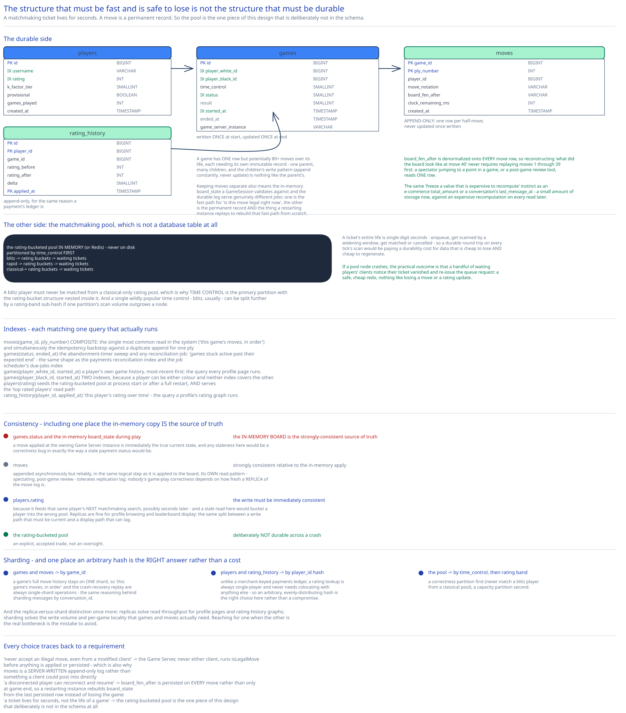

# Module 03 — Database Design & Scaling

## From entities to schema

- **`players`** `(id, username, rating, k_factor_tier, provisional, games_played, created_at)` — the durable rating record, and the same shape [Real-Time Leaderboard](../real-time-leaderboard/03-db-design.md)'s `players` would need to serve a "top rated" query.
- **`games`** `(id, player_white_id, player_black_id, time_control, status, result, started_at, ended_at, game_server_instance)` — one row per game, the durable record of "this game happened, here's how it ended."
- **`moves`** `(game_id, ply_number, player_id, move_notation, board_fen_after, clock_remaining_ms, created_at)` — append-only, one row per half-move; never updated once written.
- **`rating_history`** `(id, player_id, game_id, rating_before, rating_after, delta, applied_at)` — the audit trail behind every rating change, append-only for the same reason a payment's ledger is.

## Why the matchmaking pool isn't a database table at all

**The rating-bucketed pool lives entirely in memory (or a fast in-memory store like Redis), never in the durable relational schema above.** A matchmaking ticket's entire life is single-digit seconds — enqueue, get scanned by a widening window, get matched or cancelled — and a durable round-trip on every tick's scan would be paying a durability cost for data that's cheap to lose and cheap to regenerate. If a pool node crashes, the practical outcome is that a handful of waiting players' clients notice their ticket vanished and re-issue the queue request — a safe, cheap redo, nothing like losing a move or a rating update. This is the exact same reasoning [Real-Time Leaderboard](../real-time-leaderboard/01-architecture-hld.md) uses for keeping its sorted set in memory: the structure that needs to be fast and is safe to lose doesn't need to be the same structure that's durable.

## Why `moves` is a separate, append-only table, not columns on `games`

A game has one row, but potentially 80+ moves over its life, each needing its own immutable record — the same reasoning [chat-messaging-system](../chat-messaging-system/03-db-design.md) gives for keeping `delivery_receipts` separate from `messages`: one parent, many children, and the children's own write pattern (append constantly, never update) is nothing like the parent's (write once at start, update once at end). Keeping `moves` separate also means the in-memory `board_state` a `GameSession` validates against and the durable `moves` log serve genuinely different jobs — one is the fast path for "is this move legal right now," the other is the permanent record and the thing a restarting instance replays to rebuild that fast path from scratch.

## Why `board_fen_after` is denormalized onto every move row

Storing the full board position after each move — not just the move itself — means reconstructing "what did the board look like at move 40" never requires replaying moves 1 through 39 first; a spectator jumping to a specific point in a game, or a post-game review tool, reads one row. This is the same "freeze a value that's expensive to recompute" instinct as this guide's [e-commerce schema](../../database-design/ecommerce-schema-worked-example.md)'s `total_amount` or [chat-messaging-system](../chat-messaging-system/03-db-design.md)'s `conversations.last_message_at` — paying a small amount of storage now to avoid an expensive recomputation on every read later.

## Indexes

- `moves(game_id, ply_number)` — **composite**, the single most common read pattern in the system ("this game's moves, in order") and the idempotency backstop against a duplicate append for the same ply.
- `games(status, ended_at)` — the abandonment-timer sweep and any reconciliation job's query is exactly "games stuck `active` past their expected end" — the same shape as this guide's [payments](../payments-system/03-db-design.md) reconciliation index and [distributed job scheduler](../distributed-job-scheduler/03-db-design.md)'s due-jobs index.
- `games(player_white_id, started_at)` and `games(player_black_id, started_at)` — a player's own game history, sorted most-recent-first, the query every profile page runs.
- `players(rating)` — supports both seeding the rating-bucketed pool at process start (or after a full restart) and the "top rated players" leaderboard read path (cross-ref [Real-Time Leaderboard](../real-time-leaderboard/03-db-design.md), which owns the actual serving mechanism for that query).
- `rating_history(player_id, applied_at)` — "this player's rating over time," the query a profile's rating graph runs.

## Consistency

- **`games.status` and the in-memory `board_state` during play:** the in-memory board IS the strongly-consistent source of truth while a game is active — a move applied at the owning Game Server instance is immediately the true current state, and any staleness here would be a correctness bug the same way a stale `payment_intents.status` would be.
- **`moves`:** strongly consistent relative to the in-memory apply — a move is appended (asynchronously, but reliably) in the same logical step as it's applied to the board, matching [Real-Time Leaderboard](../real-time-leaderboard/03-db-design.md)'s event log. Its own read pattern (spectating, post-game review) can tolerate a little replication lag; nobody's game-play correctness depends on how fresh a *replica* of the move log is.
- **`players.rating`:** the write must be immediately consistent, because it feeds that same player's *next* matchmaking search, possibly seconds later — a stale rating read here could bucket a player into the wrong pool. Read replicas are fine for profile browsing and leaderboard display, the same split this guide draws everywhere between a write path that must be current and a display path that can lag.
- **The rating-bucketed pool:** deliberately **not** durable across a crash the way `games`/`moves` are — see above. This is an explicit, accepted trade, not an oversight.

## Scaling the schema

- **`games` and `moves` shard by `game_id`** — a game's full move history stays on one shard, so "this game's moves, in order" and the crash-recovery replay (Module 02) are always single-shard operations, the same reasoning [chat-messaging-system](../chat-messaging-system/03-db-design.md) gives for sharding `messages` by `conversation_id`.
- **`players` and `rating_history` shard by `player_id` hash** — unlike payments' `merchant_id`-keyed ledger, a rating lookup is always single-player and never needs to be colocated with anything else, so an arbitrary, evenly-distributing hash is the right choice here rather than a cost.
- **The matchmaking pool partitions by `time_control` first** — a blitz player must never be matched from a classical-only rating pool, so time control is the primary partition, with the rating-bucket structure nested inside each one. A single wildly popular time control (blitz, usually) can be split further by rating-band sub-hash if one partition's scan volume outgrows a single node, the same further-sharding move [Real-Time Leaderboard](../real-time-leaderboard/03-db-design.md) makes for one oversized leaderboard.
- **Read replicas vs. sharding, again:** replicas solve read throughput for profile pages and rating history graphs; sharding solves the write volume and per-game locality that `games`/`moves` actually need. Reaching for one when the other is the real bottleneck is the mistake to avoid, the same distinction this guide draws in every case study's DB design.

## Connecting it back

Look at all three modules together: Module 00's "never accept an illegal move, even from a modified client" is why the Game Server — never either client — runs `ChessEngine.isLegalMove` before anything is applied or persisted, and that same stance is why `moves` is a server-written, append-only log rather than something a client could post into directly. The requirement that a disconnected player can reconnect and resume is why `board_fen_after` is persisted on every single move rather than only at game end — a restarting Game Server instance rebuilds `board_state` from the last persisted row instead of losing the game outright. And the fact that a matchmaking ticket lives for seconds, not the life of a game, is exactly why the rating-bucketed pool is the one piece of this whole design that deliberately isn't in this schema at all. Nothing here is arbitrary — every table, index, and sharding choice traces back to a requirement Module 00 opened with.
