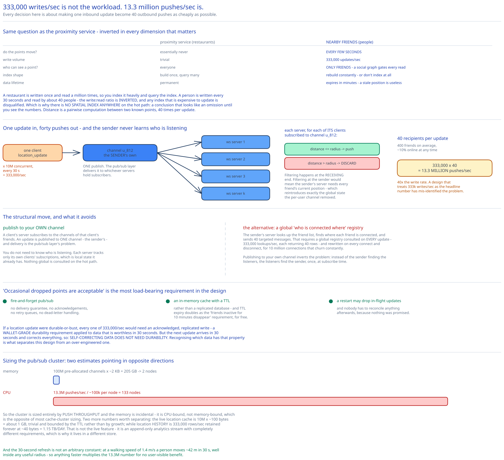

# Module 00 — Overview



## The feature, with no infrastructure in it yet

Open the app and see which of your friends are near you right now, with a distance and a "last updated" timestamp. The list refreshes every few seconds as people move.

The [proximity service](../proximity-service/00-overview.md) case study answers a superficially similar question — "what's near me" — and the difference between the two is the entire design problem:

| | Proximity service (restaurants) | **Nearby friends (people)** |
|---|---|---|
| Do the points move? | Essentially never | **Every few seconds** |
| Write volume | Trivial | **333,000 updates/sec** |
| Who can see a point? | Everyone | **Only friends** — a social graph gates every read |
| Index shape | Build once, query many | **Rebuild constantly, or don't index at all** |
| Data lifetime | Permanent | **Expires in minutes** — a stale position is useless |

A restaurant's location is written once and read a million times, so you index it heavily and query the index. A person's location is written every 30 seconds and read by ~40 people, so **the write:read ratio is inverted**, and any index expensive to update is disqualified. That single inversion is why this design uses no spatial index at all on the hot path — a conclusion that looks like an omission until you see the numbers.

## Requirements

**Functional:**
- See friends within a configurable radius (default 5 miles), each with distance and a location timestamp.
- The list updates every few seconds.
- Friends inactive for more than 10 minutes disappear from the feature.
- Location history is retained (for analytics and ML), separately from the live feature.

**Non-functional:**
- **Scale:** 1 billion users; 10% use the feature (100M DAU); 10% of those concurrent (10M).
- **Latency:** a friend's movement should surface within seconds. This is a *soft* real-time requirement — nobody notices 3 seconds versus 1.
- **Reliability:** occasional dropped location points are **acceptable**. This is the requirement that unlocks the design, and it deserves to be stated as a positive choice rather than a caveat — see below.
- **Consistency:** eventual. A few seconds of disagreement between replicas about where someone is has no user-visible consequence, because the underlying datum is stale by then anyway.
- **Privacy:** location is visible only to friends, and only to friends who are themselves sharing.

## What "dropped points are acceptable" buys

Worth pausing on, because it's the most load-bearing requirement in the design and it's easy to skim past.

If a location update were durable-or-bust, every one of 333,000 updates/sec would need an acknowledged, replicated write before the client could move on. That's a wallet-grade durability requirement ([digital wallet](../digital-wallet/00-overview.md)) applied to data that is **worthless in 30 seconds**.

Because a drop is tolerable:

- The fan-out path can use **fire-and-forget pub/sub** with no delivery guarantee, no acknowledgements, and no retry queues.
- The live location store can be **an in-memory cache with a TTL** rather than a replicated database — and TTL expiry doubles as the "inactive friends disappear" requirement, for free.
- A rebalance or a server restart can **drop in-flight updates** without anyone needing to reconcile anything.

The next update arrives in 30 seconds and corrects everything. **Self-correcting data doesn't need durability**, and recognising which data has that property is what separates this design from an over-engineered one.

## Capacity Estimation

Method from [Back-of-the-Envelope Estimation](../../foundations/back-of-envelope-estimation.md).

**Location updates (writes)**
- 10M concurrent users, refreshing every **30 seconds** — chosen because human walking speed makes anything faster pointless: at 1.4 m/s a person moves ~42 m in 30 s, well inside any useful radius.
- 10,000,000 ÷ 30 = **333,000 location updates/sec.**

**Fan-out (the number that dominates everything)**
- Average 400 friends; ~10% online at any time → **40 recipients per update.**
- 333,000 × 40 = **13.3 million pushes/sec.**

That's the design's real workload, and it's **40× the write rate.** Every architectural decision from here is about making one inbound update become 40 outbound pushes as cheaply as possible. A design that treats 333k writes/sec as the headline number has mis-identified the problem.

**Pub/sub infrastructure**
- Assume one Redis node sustains ~100,000 pushes/sec. 13.3M ÷ 100k = **~133 nodes**, and they're **CPU-bound on push volume, not memory-bound.**
- Channel memory: 100M pre-allocated channels at ~2 KB ≈ **205 GB** — about two 100 GB nodes' worth.

Those two numbers point in opposite directions, which is the interesting finding: **memory needs 2 nodes, CPU needs 133.** So the cluster is sized entirely by push throughput, and the memory is incidental. Cross-ref [Message Queues & Pub/Sub](../../hld-building-blocks/message-queues-pubsub.md).

**Location history (a separate, much heavier problem)**
- 333,000 writes/sec, permanently retained, at ~40 bytes/row → **1.15 TB/day.**
- This is *not* the live feature. It's an append-only analytics stream with completely different requirements (durable, write-heavy, never read on the hot path), which is why [Module 03](./03-db-design.md) puts it in a different store from the live cache.

**Cache memory for live locations**
- 10M concurrent × ~100 bytes (user id, lat, lng, timestamp, plus overhead) ≈ **1 GB.** Trivial, and bounded by the TTL rather than by growth.

## Approach Walkthrough

Peer-to-peer is the obvious first thought and it's wrong for mobile: maintaining direct connections to 40 peers over flaky cellular links, with battery and NAT-traversal constraints, is worse in every dimension. So the backend acts as a **fan-out relay**.

The design is three ideas:

**1. A persistent WebSocket per client**, terminated on a stateful server. Location updates flow up it and friends' updates flow down it. HTTP polling would mean 10M clients polling every few seconds — the same total request volume with none of the push latency benefit, plus far worse battery life. Cross-ref [Long Polling, WebSockets & SSE](../../scalability-resilience/long-polling-websockets-sse.md).

**2. One pub/sub channel per user, and subscription follows friendship.** When a client connects, its WebSocket server subscribes to the channels of all its friends. A location update is published to *one* channel — the sender's own — and the pub/sub layer delivers it to whichever servers hold subscribers.

   This is the key structural move, and it's worth seeing what it avoids. The alternative is for the sender's server to look up the friend list, find where each friend is connected, and send 40 targeted messages. That requires a global "who is connected where" registry consulted on every update — 333,000 registry lookups/sec, each returning 40 rows, and a registry that must be updated on every connect and disconnect. **Publishing to your own channel inverts the problem: you don't need to know who's listening.** Each server tracks only its own clients' subscriptions, which is local state it already has.

**3. Filter by distance at the receiving end, not the sending end.** The channel carries the raw position to all subscribed servers; each server discards updates for friend pairs beyond the radius before touching the socket. Filtering at the sender would mean the sender's server needs every friend's current position — reintroducing exactly the global state the channel design removed.

There is **no spatial index anywhere in this path.** Distance is computed pairwise between two known points, 40 times per update. That's the direct consequence of the write:read inversion at the top: with only 40 recipients, a pairwise check is cheaper than maintaining an index that would have to be updated 333,000 times a second. [Module 04](./04-interviewer-qna.md) covers when that stops being true.

## API Surface

WebSocket messages (the hot path):

```
→  { "type": "location_update", "lat": 37.7749, "lng": -122.4194, "ts": 1735689600 }
←  { "type": "friend_location", "user_id": "u_812", "lat": …, "lng": …,
     "distance_m": 1240, "ts": 1735689598 }
←  { "type": "subscribe",   "user_id": "u_930" }   # a friend came online — start tracking
←  { "type": "unsubscribe", "user_id": "u_930" }   # a friend went offline — stop
←  { "type": "init", "friends": [ {user_id, lat, lng, distance_m, ts}, … ] }
```

HTTP (everything else — friends, profile, settings, history):

```
GET    /v1/friends                      → the friend list
POST   /v1/friends/{id}
DELETE /v1/friends/{id}
PUT    /v1/settings/location-sharing    { enabled, radius_m }
GET    /v1/location-history?from=&to=   → from the history store, never the live cache
```

Three API details worth noticing:

**`ts` comes from the client and is echoed back.** The UI shows "updated 4s ago", and that number must reflect when the *position was measured*, not when the server processed it. Under fire-and-forget delivery those can differ by seconds, and showing the server's time would silently claim more freshness than exists.

**`subscribe`/`unsubscribe` are server→client messages.** The server tells the client which friends to render, because the server knows who came online. It's a deliberate inversion of the usual direction and it keeps the client from having to poll for presence.

**`init` exists because a fresh connection has no history.** A newly connected client would otherwise see nothing until each friend's next 30-second update. So on connect the server reads all friends' current positions from the cache and sends them at once — the one place in the design that does a bulk read.

## Where this goes next

| Module | The question it answers |
|---|---|
| [01 · Architecture & HLD](./01-architecture-hld.md) | What are the boxes, and how does 1 update become 40 pushes 333,000 times a second? |
| [02 · LLD](./02-lld.md) | Interfaces, the subscription lifecycle, and what needs a lock (almost nothing). |
| [03 · DB Design](./03-db-design.md) | Why the live cache and the history store are different systems with different guarantees. |
| [04 · Interviewer Q&A](./04-interviewer-qna.md) | The ten follow-ups this design invites. |
