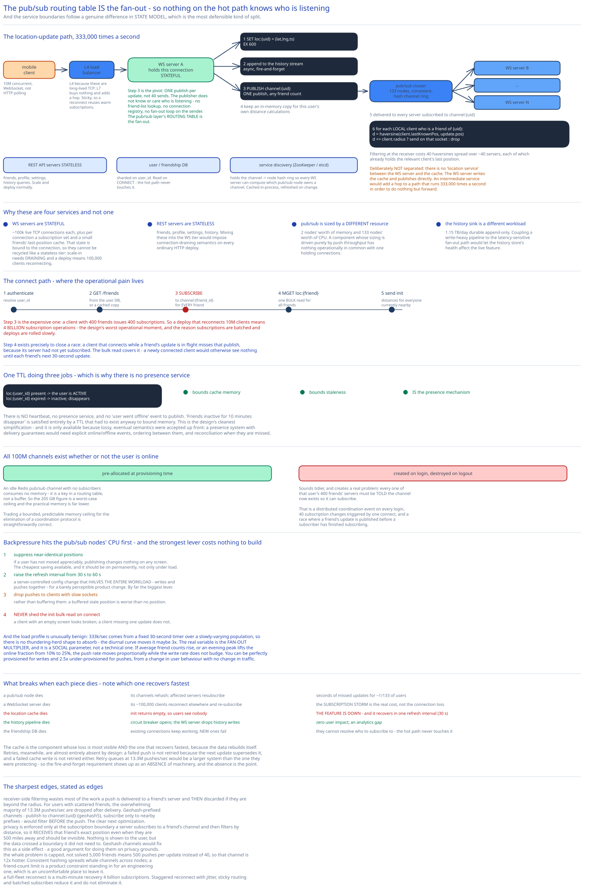

# Module 01 — Architecture & High-Level Design



## Monolith vs. microservices

The split here follows a genuine difference in *state model*, which is the most defensible kind of service boundary.

**WebSocket servers are stateful and must be separate.** Each holds ~100,000 live TCP connections plus, per connection, the set of channels it has subscribed to and a small cache of friends' last positions. That state is bound to the connection, so these servers cannot be freely recycled the way a stateless tier can — scale-in requires **draining**, and a deploy means 100,000 clients reconnecting. Mixing that into a general API tier would impose connection-draining semantics on every ordinary HTTP deploy.

**REST API servers are stateless and separate.** Friends, profile, settings, history queries. They scale and deploy normally.

**The pub/sub cluster is separate** because it's sized by an entirely different resource: [Module 00](./00-overview.md#capacity-estimation) showed it needs **2 nodes' worth of memory and 133 nodes' worth of CPU.** A component whose sizing is driven purely by push throughput has nothing operationally in common with one holding connections or one serving HTTP.

**The location-history sink is separate** because it's a 1.15 TB/day append-only analytics stream, and coupling a durable write-heavy pipeline to the latency-sensitive fan-out path would mean the history store's health affects the live feature.

What is deliberately **not** separated: there's no "location service" between the WebSocket server and the cache. The WebSocket server writes the cache and publishes directly. An intermediate service would add a hop to a path that runs 333,000 times a second to do nothing but forward.

## Per-path walkthrough

**Location update path (the hot path, 333k/sec)**

```
Mobile client ──WebSocket──▶ Load balancer ──▶ WS server (the one holding this connection)
   1. write to the location cache:  SET loc:{user_id} = (lat,lng,ts)  EX 600
   2. append to the history stream (async, fire-and-forget)
   3. PUBLISH to channel:{user_id}  ← ONE publish, regardless of friend count
   4. keep an in-memory copy for this user's own distance calculations

Pub/sub cluster
   5. delivers to every WS server subscribed to channel:{user_id}

Each subscribed WS server
   6. for each local client who is a friend of {user_id}:
        distance = haversine(client.lastKnownPos, update.pos)
        if distance <= client.radius:  send over that client's WebSocket
      else drop silently
```

**Step 3 is the design's pivot.** One `PUBLISH` per update, not 40 sends. The publisher does not know or care who is listening — no friend-list lookup, no connection registry, no fan-out loop on the sender's server. The pub/sub layer's routing table *is* the fan-out.

Compare the alternative, which is what most first drafts do:

```
WS server → look up friend list (400 entries)
          → look up "which server is each friend connected to?"   ← A GLOBAL REGISTRY
          → send 40 targeted messages
```

That registry would take **333,000 lookups/sec, each returning up to 400 rows**, and it must be updated on every connect and disconnect across 10M clients. It's a global, hot, constantly-churning index — and publishing to your own channel eliminates it entirely, because each server needs to know only its *own* clients' subscriptions, which is local state it already has.

**Step 6 filters at the receiver, deliberately.** Filtering at the sender would require the sender's server to know all 40 friends' current positions — which reintroduces the global state the channel design just removed. Receiver-side filtering costs 40 haversine computations spread across ~40 different servers, each of which already holds the relevant client's last position.

**Client initialization path**

```
Client connects → WS server
   1. authenticate; resolve user_id
   2. GET /friends (from the user DB, or a cached copy)
   3. SUBSCRIBE to channel:{friend_id} for every friend        ← the expensive step
   4. MGET loc:{friend_id} for all friends — one bulk read
   5. compute distances, send an `init` message with everyone currently nearby
```

Step 3 is where connection churn hurts: a client with 400 friends issues 400 subscriptions. At scale, a deploy that reconnects 10M clients means **4 billion subscription operations**. This is the design's worst operational moment, and it's why [Module 02](./02-lld.md#subscription-lifecycle) batches subscriptions and why deploys are rolled slowly.

**Presence path**

```
Cache TTL of 600s IS the presence mechanism.
   loc:{user_id} present  → the user is active
   loc:{user_id} expired   → inactive; disappears from friends' lists automatically
```

There is **no heartbeat, no presence service, and no "user went offline" event to publish.** The requirement "friends inactive for 10 minutes disappear" is satisfied entirely by a TTL that would exist anyway to bound cache memory. When a friend's `loc:` key expires, the next `init` or refresh simply doesn't include them.

This is the design's cleanest simplification, and it's only available because [Module 00](./00-overview.md#what-dropped-points-are-acceptable-buys) accepted eventual, lossy semantics — a presence system with delivery guarantees would need explicit online/offline events, ordering between them, and reconciliation when they're missed.

**History path (off the hot path)**

```
WS server → Kafka (partitioned by user_id) → Cassandra
                                           → analytics warehouse
```

Asynchronous and fire-and-forget from the WebSocket server's perspective. If Kafka is unavailable, the live feature is unaffected and history has a gap — the correct priority ordering.

## Building blocks

**Load balancer** — L4 for WebSocket connections (long-lived TCP; L7 termination buys nothing and adds a hop), with sticky routing so a reconnect prefers its previous server and can reuse warm subscriptions. Cross-ref [Load Balancing](../../hld-building-blocks/load-balancing.md).

**WebSocket servers** — stateful; ~100,000 connections each, so **~100 servers** for 10M concurrent clients. Hold per-connection subscription sets and a small last-known-position cache.

**REST API servers** — stateless; friends, settings, profile, history queries.

**Location cache (Redis)** — `loc:{user_id} → (lat, lng, ts)` with a 600s TTL. ~1 GB total. The TTL is simultaneously memory bound, staleness bound, and presence mechanism.

**Pub/sub cluster (Redis)** — 100M pre-allocated channels across ~133 nodes, distributed by consistent hashing. Cross-ref [Consistent Hashing](../../hld-building-blocks/consistent-hashing.md).

**Service discovery (ZooKeeper/etcd)** — holds the **channel→node hash ring**, so every WebSocket server can compute which pub/sub node owns a given channel. Cached in-process; refreshed on change. Cross-ref [Service Discovery](../../scalability-resilience/service-discovery.md).

**User/friendship database** — sharded on `user_id`. Read on connect, not on the hot path.

**Kafka + Cassandra** — the history pipeline. Cassandra because it's write-optimized (LSM-based) and the workload is 333k appends/sec with almost no reads.

## Why channels are pre-allocated

All 100M users get a channel at provisioning time, whether or not they're online.

The naive alternative — create a channel when a user comes online, destroy it when they leave — sounds tidier and creates a real problem: **every one of that user's 400 friends' servers must be told the channel now exists** so they can subscribe. That's a distributed coordination event on every login, 40 subscription changes triggered by one connect, and a race where a friend's update is published before a subscriber has finished subscribing.

Pre-allocation costs almost nothing because **an idle Redis pub/sub channel with no subscribers consumes no memory** — it's a key in a routing table, not a buffer. So the 205 GB estimate from [Module 00](./00-overview.md#capacity-estimation) is a worst-case ceiling, and the practical memory is far lower. Trading a bounded, predictable memory ceiling for the elimination of a coordination protocol is straightforwardly correct.

## Trade-offs to make explicit

| Decision | Chosen | Alternative | Why |
|---|---|---|---|
| Fan-out mechanism | **Publish to the sender's own channel** | Sender looks up friends' connections and sends directly | A direct send needs a global "who's connected where" registry: 333k lookups/sec × 400 rows, churning on every connect. Publishing to your own channel means no publisher needs to know its audience. |
| Distance filtering | **At the receiving server** | At the sending server | Sender-side filtering requires the sender to know all friends' positions — reintroducing exactly the global state the channel design removes. |
| Transport | **WebSocket** | HTTP polling every 3s | Polling 10M clients gives the same request volume with worse latency and far worse battery life. Cross-ref [Long Polling, WebSockets & SSE](../../scalability-resilience/long-polling-websockets-sse.md). |
| Live location store | **In-memory cache with TTL** | A replicated database | The data is worthless in 30 seconds and self-corrects. TTL simultaneously bounds memory, bounds staleness, and *is* the presence mechanism. |
| Presence | **Cache TTL expiry** | Heartbeats + a presence service + online/offline events | The TTL already exists for memory reasons; reusing it removes an entire subsystem. Only possible because lossy semantics are acceptable. |
| Delivery guarantee | **Fire-and-forget** | At-least-once with acks and retries | Guarantees on data that expires in 30 seconds would cost 13.3M acknowledgements/sec to protect information that self-corrects. |
| Channel allocation | **Pre-allocated for all 100M users** | Created on login, destroyed on logout | On-demand creation means telling 400 friends' servers that a channel now exists, on every login — a coordination protocol, plus a subscribe/publish race. Idle channels cost no memory. |
| Spatial index | **None on the hot path** | Geohash or quadtree over live positions | With 40 recipients per update, 40 pairwise haversines beat maintaining an index updated 333,000 times/sec. Cross-ref [Geospatial Indexing](../../hld-building-blocks/geospatial-indexing.md). |
| History store | **Cassandra, via Kafka** | The same store as live locations | 1.15 TB/day durable append-only has nothing in common with a 1 GB expiring cache. Different shape, different engine. |

## Load Handling

- **Peak-vs-average.** Updates are **remarkably steady** — 333k/sec is driven by a fixed 30-second timer across a slowly-varying concurrent population, so there's no thundering-herd shape to absorb. The diurnal curve moves the concurrent count by maybe 3×, and that's it. This is an unusually benign load profile and it's worth noticing, because it means capacity planning is about the *fan-out multiplier*, not about spikes.

- **The real variable is the fan-out multiplier**, and it's a *social* parameter rather than a technical one. 40 recipients per update assumes 400 friends at 10% online. If either number shifts — a viral growth phase raising average friend counts, or an evening peak raising the online fraction to 25% — the push rate moves proportionally while the *write* rate doesn't budge. **You can be perfectly provisioned for writes and 2.5× under-provisioned for pushes**, from a change in user behaviour with no change in traffic volume.

- **Where backpressure kicks in first.** At the **pub/sub nodes' CPU.** They're the component sized by the 13.3M pushes/sec, and a hot node (one owning several high-degree users' channels) saturates before anything else. Second in line is a WebSocket server's outbound socket buffers if a client's connection is slow.

- **What gets shed under overload**, in order:
  1. **Location updates from the least-recently-moved users.** If someone hasn't moved appreciably since their last update, publishing it changes nothing on any screen. Client-side suppression of near-identical positions is the cheapest available saving and it should be on permanently, not just under load.
  2. **Increase the refresh interval** from 30s to 60s, pushed as a server-controlled config. This **halves the entire workload** — writes and pushes together — with a barely perceptible product change. It's by far the most powerful lever available and it costs nothing to build.
  3. **Drop pushes to clients with slow sockets** rather than buffering them. A buffered stale position is worse than no position.
  4. **Never shed:** the `init` bulk read on connect. A client with an empty screen looks broken; a client missing one update doesn't.

- **The whale problem.** A user with 5,000 friends generates 500 pushes per update instead of 40, so their channel is 12× hotter. The mitigation is a cap on friend count (the standard product answer — Facebook's 5,000 limit is partly an engineering artefact), plus consistent hashing to spread whale channels across nodes so no single node owns several. It's mitigated rather than solved, and it's the same hot-key shape as [the wallet's merchant accounts](../digital-wallet/01-architecture-hld.md#load-handling).

- **Autoscaling lag.** REST servers scale in minutes. **WebSocket servers scale badly**: adding one helps only new connections, and removing one forces its clients to reconnect and re-subscribe (400 subscriptions each). So scale-in is deliberately slow, using a **drain** state in the load balancer that stops new connections long before the server is removed.

- **Load-test target.** Sustain 333k updates/sec producing 13.3M pushes/sec with p99 end-to-end under 2 seconds, while (a) killing a pub/sub node and confirming resubscription completes within seconds with bounded update loss, (b) reconnecting 1M clients simultaneously to measure the subscription storm, and (c) running a 5,000-friend whale to confirm its channel's node stays under budget.

## Concurrent-User Handling

| Race | Mechanism | What the "loser" sees |
|---|---|---|
| Two location updates from one user arrive out of order | Every update carries a client `ts`; receivers **discard any update older than the last one seen** for that friend. | The stale update is dropped. Note that ordering is *not* enforced by the transport — it's resolved at the receiver by timestamp, which is much cheaper than an ordered channel. |
| A friend is added while both users are online | The client is told to `subscribe` to the new friend's channel; the WS server issues the subscription. | Until the subscription completes, the new friend simply isn't visible. Bounded by one round trip, and self-correcting on the next update. |
| A user connects while a friend's update is in flight | The update is published to a channel this server hasn't subscribed to yet, so it's missed. | The `init` bulk read covers it — the client gets the friend's cached position immediately. **The bulk read on connect exists precisely to close this race.** |
| A pub/sub node is removed and its channels rehash | Consistent hashing moves ~1/n of channels; affected WS servers resubscribe on the new node. | Updates published during the move are lost. Explicitly accepted — the next update in ≤30s corrects it, which is why the reliability requirement was written the way it was. |
| Two WS servers both hold a connection for one user (reconnect race) | The user's old connection is closed by the server on detecting a newer session for the same user id, using a session token comparison. | The stale connection is terminated. Without this, the user's own updates would publish twice and their client would receive duplicates. |
| A client's cached "last known position" for a friend is stale when a new update arrives | Distance is computed from the **incoming** update's position, not the cached one; the cache is then overwritten. | Nothing. The cache exists only so a client that *stops* receiving updates can still render a friend at their last position with an honest timestamp. |

## Scaling & Reliability

- **Horizontal scaling.** WebSocket servers scale by connection count (~100k each). Pub/sub nodes scale by push throughput — and note this is the axis that grows with the *social graph*, not with user count. The location cache is sharded and trivially small. The history pipeline scales as an ordinary Kafka/Cassandra deployment.

- **Consistent hashing for the channel ring**, so adding or removing a pub/sub node relocates ~1/n of channels rather than remapping all 100M. Without it, a single node addition would trigger a full resubscription storm across every WebSocket server — 4 billion operations. Cross-ref [Consistent Hashing](../../hld-building-blocks/consistent-hashing.md).

- **Circuit breaker** around the history sink. If Kafka is unwell, the WS server drops history writes and keeps the live path running. Cross-ref [Circuit Breakers & Retries](../../scalability-resilience/circuit-breakers-retries.md).

- **Retries: almost none, deliberately.** A failed push is not retried — the next update supersedes it. A failed cache write is not retried. This is the fire-and-forget requirement showing up as an *absence* of machinery, and the absence is the point: retry queues at 13.3M pushes/sec would be a larger system than the one they'd be protecting.

- **Graceful degradation:**
  1. **A pub/sub node dies** → its channels rehash; affected servers resubscribe. Seconds of missed updates for ~1/133 of users.
  2. **A WebSocket server dies** → its ~100,000 clients reconnect (to a different server) and re-subscribe. The subscription storm is the real cost, not the connection loss.
  3. **The location cache dies** → live positions are lost, so `init` returns empty and users see nobody. **The feature is effectively down**, and it recovers within one refresh interval (30s) as updates repopulate it. Worth naming plainly: this is the component whose loss is most visible, and it recovers fastest, because the data rebuilds itself.
  4. **The history pipeline dies** → zero user impact; an analytics gap.
  5. **The friendship database dies** → existing connections keep working (subscriptions are already established); **new connections fail**, because they can't resolve who to subscribe to. A nice property: the hot path doesn't touch this database at all.

- **Multi-region.** Route users to their nearest region, and place a user's channel in their **home region** — which works because nearby friends are, definitionally, usually in the same region. Cross-region friendships need channel subscription across regions, adding inter-region latency to a soft-real-time path where 200ms is genuinely fine. This is one of the few designs in this guide where multi-region is *easy*, precisely because the data is geographic and disposable.

## What you'd revisit as this grows

- **The subscription storm on mass reconnection is the design's sharpest edge.** 10M clients × 400 friends = 4 billion subscriptions if everyone reconnects at once — after a load-balancer failure, a bad deploy, or a mobile carrier outage. Mitigations (staggered reconnect with jitter, sticky routing, batched subscribe) reduce it and don't eliminate it, and the honest answer is that a full-fleet reconnect is a multi-minute recovery.

- **Receiver-side filtering wastes most of the work.** A push is delivered to a friend's server and *then* discarded if they're beyond the radius. For users with geographically scattered friends, the overwhelming majority of the 13.3M pushes/sec are dropped after delivery. **Geohash-prefixed channels** — publish to `channel:{user_id}:{geohash5}` and let subscribers subscribe only to prefixes near themselves — would filter before the push, cutting fan-out substantially. It's the clear next optimization and it isn't built here.

- **No "nearby strangers" capability.** The design is entirely friend-graph based. Supporting "someone interesting is nearby" needs geohash-based channels that anyone in a cell subscribes to — a genuinely different fan-out topology, and one that raises privacy questions the friend-gated design avoids by construction.

- **The whale problem is capped, not solved.** A friend-count limit is a product constraint standing in for an engineering one, which is a slightly uncomfortable place to leave it.

- **Privacy is enforced at the subscription boundary only.** A server subscribes to a friend's channel and then filters by distance — meaning **the subscribing server receives the friend's exact position even when they're 500 miles away and should be invisible.** Nothing is shown to the user, but the data crossed a boundary it didn't need to cross. Geohash-prefixed channels would fix this as a side effect, which is a good argument for doing them on privacy grounds rather than only for efficiency.
