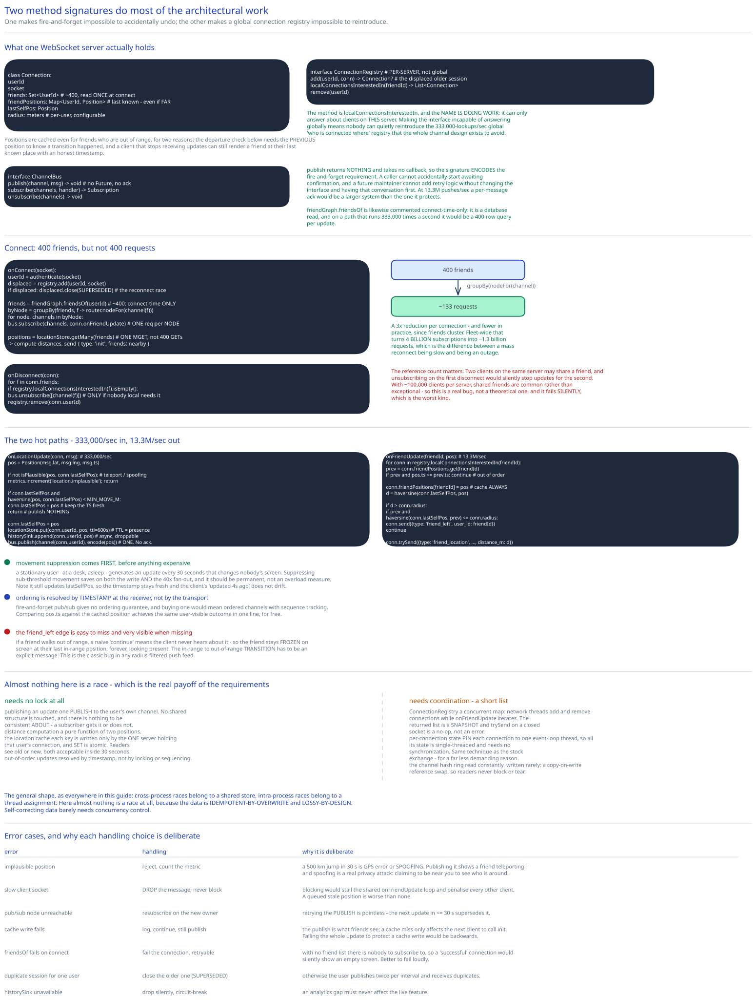

# Module 02 — Low-Level Design



## Interfaces vs. implementations

```
interface LocationStore                          # the live cache
    put(userId, pos: Position, ttl: Duration) -> void
    get(userId) -> Position?
    getMany(userIds: List<UserId>) -> Map<UserId, Position>   # the init bulk read

interface ChannelBus                             # pub/sub, deliberately narrow
    publish(channel: ChannelId, msg: bytes) -> void           # fire-and-forget, no ack
    subscribe(channels: List<ChannelId>, handler) -> Subscription
    unsubscribe(channels: List<ChannelId>) -> void

interface ChannelRouter                          # which pub/sub node owns a channel
    nodeFor(channel: ChannelId) -> NodeAddress   # consistent hashing; served from a cached ring
    onRingChange(handler) -> void

interface FriendGraph
    friendsOf(userId) -> List<UserId>            # read on connect, NOT on the hot path
    areFriends(a, b) -> bool                     # local cache lookup

interface HistorySink
    append(userId, pos: Position) -> void        # async, droppable

interface ConnectionRegistry                     # PER-SERVER, deliberately not global
    add(userId, conn: Connection) -> Connection?  # returns a displaced older connection
    localConnectionsInterestedIn(friendId) -> List<Connection>
    remove(userId) -> void
```

Two interface decisions carry the design.

**`ChannelBus.publish` returns nothing and takes no callback.** There is no `Future`, no ack, no delivery receipt — the signature *encodes* the fire-and-forget requirement from [Module 00](./00-overview.md#what-dropped-points-are-acceptable-buys). A caller cannot accidentally start awaiting confirmation, and a future maintainer cannot add retry logic without changing the interface and having that conversation. At 13.3M pushes/sec a per-message ack would be a larger system than the one it protects.

**`ConnectionRegistry` is explicitly per-server, not global.** The method is `localConnectionsInterestedIn`, and the name is doing work: it can only answer about clients on *this* server. That's the code-level expression of [Module 01](./01-architecture-hld.md#per-path-walkthrough)'s central argument — a global "who is connected where" registry would need 333,000 lookups/sec against constantly-churning state, and the channel design exists to avoid it. Making the interface incapable of answering globally means nobody can quietly reintroduce the lookup.

`FriendGraph.friendsOf` is likewise commented as connect-time only. It's a database read; putting it on a path that runs 333,000 times a second would be a 400-row query per update.

## Subscription lifecycle

This is where the operational cost lives, so it's worth the detail.

```
onConnect(socket):
    userId = authenticate(socket)                    # reject early if invalid

    # Displace any older session for the same user (the reconnect race, Module 01)
    displaced = registry.add(userId, socket)
    if displaced: displaced.close(reason = SUPERSEDED)

    friends = friendGraph.friendsOf(userId)          # ~400; one DB/cache read
    conn.friends = set(friends)

    # 1. Subscribe to friends' channels — BATCHED BY OWNING NODE
    byNode = groupBy(friends, f -> router.nodeFor(channel(f)))
    for node, channels in byNode:
        bus.subscribe(channels, conn.onFriendUpdate)  # ONE request per node, not per channel

    # 2. Bulk-read current positions — ONE round trip, not 400
    positions = locationStore.getMany(friends)

    # 3. Send the initial view
    nearby = []
    for f, pos in positions:
        if pos is null: continue                      # TTL expired => inactive => invisible
        d = haversine(conn.lastSelfPos, pos)
        conn.friendPositions[f] = pos                 # cache for later re-render
        if d <= conn.radius: nearby.append({f, pos, d})
    socket.send({type: "init", friends: nearby})
```

**Batching by owning node is the whole game.** Naively, 400 friends means 400 `SUBSCRIBE` calls. Grouped by which pub/sub node owns each channel, 400 friends spread over 133 nodes becomes **~133 requests** — and in practice fewer, since friends cluster. That's a 3× reduction per connection, and it's the difference between a mass reconnect being slow and being an outage: [Module 01](./01-architecture-hld.md#what-youd-revisit-as-this-grows) notes 10M clients × 400 friends is 4 billion subscriptions, and batching is what makes that ~1.3 billion requests instead.

Similarly, `getMany` is one `MGET` rather than 400 `GET`s.

```
onDisconnect(conn):
    # Unsubscribe ONLY from channels no other local client needs
    for f in conn.friends:
        if registry.localConnectionsInterestedIn(f).isEmpty():
            bus.unsubscribe([channel(f)])
    registry.remove(conn.userId)
```

**The reference-count check matters.** Two clients on the same server may share a friend; unsubscribing on the first disconnect would silently stop updates for the second. Since servers hold ~100,000 clients each, shared friends are common rather than exceptional, so this is a real bug rather than a theoretical one — and it fails *silently*, which is the worst kind.

## Pseudocode: the two hot paths

```
onLocationUpdate(conn, msg):                          # 333,000/sec, fleet-wide
    pos = Position(msg.lat, msg.lng, msg.ts)

    if not isPlausible(pos, conn.lastSelfPos):        # teleport / spoofing check
        metrics.increment("location.implausible"); return

    # Suppress near-identical positions — the cheapest saving available (Module 01)
    if conn.lastSelfPos and haversine(pos, conn.lastSelfPos) < MIN_MOVE_M:
        conn.lastSelfPos = pos                        # keep the timestamp fresh
        return                                        # but publish NOTHING

    conn.lastSelfPos = pos
    locationStore.put(conn.userId, pos, ttl = 600s)   # TTL = presence, Module 01
    historySink.append(conn.userId, pos)              # async, droppable
    bus.publish(channel(conn.userId), encode(pos))    # ONE publish. No ack.


onFriendUpdate(friendId, pos):                        # 13.3M/sec, fleet-wide
    for conn in registry.localConnectionsInterestedIn(friendId):
        prev = conn.friendPositions.get(friendId)
        if prev and pos.ts <= prev.ts:
            continue                                  # out-of-order: discard by timestamp

        conn.friendPositions[friendId] = pos          # always cache, even if far away

        d = haversine(conn.lastSelfPos, pos)
        if d > conn.radius:
            if prev and haversine(conn.lastSelfPos, prev) <= conn.radius:
                conn.send({type: "friend_left", user_id: friendId})   # ← the departure edge
            continue

        conn.trySend({type: "friend_location", user_id: friendId,
                      lat: pos.lat, lng: pos.lng, distance_m: d, ts: pos.ts})
```

Four details worth pulling out:

**Movement suppression is checked before anything else expensive.** A stationary user — sitting at a desk, asleep — generates an update every 30 seconds that changes nobody's screen. Suppressing sub-threshold movement is pure saving on both the write and the 40× fan-out, and [Module 01](./01-architecture-hld.md#load-handling) argues it should be permanent rather than an overload measure. Note it still updates `lastSelfPos` so the *timestamp* stays fresh, otherwise the client's "updated 4s ago" would drift.

**Ordering is resolved by timestamp at the receiver, not by the transport.** Fire-and-forget pub/sub gives no ordering guarantee, and buying one would mean ordered channels with sequence tracking. Comparing `pos.ts` against the cached position is a one-line check that achieves the same user-visible outcome for free.

**The `friend_left` edge is easy to miss and very visible when missing.** If a friend walks out of range, the naive `continue` means the client never hears about it — so the friend stays frozen on screen at their last in-range position, forever, looking present. The transition from in-range to out-of-range has to be an explicit message. This is the classic bug in any radius-filtered push feed.

**Positions are cached even when the friend is out of range.** Two reasons: the departure check above needs the previous position to know a transition occurred, and a client that stops receiving updates can still render a friend at their last known place with an honest timestamp.

## Error cases worth designing for deliberately

| Error | Handling | Why it's deliberate |
|---|---|---|
| **Implausible position** (a 500 km jump in 30s) | Reject, count the metric | Either GPS error or spoofing. Publishing it would show a friend teleporting, and spoofing is a genuine privacy attack — someone claiming to be near you to see who's around. |
| **Slow client socket** (send buffer full) | **Drop the message**, never block or buffer | Blocking would stall the shared `onFriendUpdate` loop and penalise every other client. A queued stale position is worse than none. |
| **Pub/sub node unreachable** | Resubscribe on the new owner after the ring updates; accept the gap | Retrying the *publish* is pointless — the next update in ≤30s supersedes it. |
| **Cache write fails** | Log and continue; still publish | The publish is what friends see. A cache miss only affects the *next* client to call `init`. Failing the whole update to protect a cache write would be backwards. |
| **`friendsOf` fails on connect** | Fail the connection with a retryable error | Without the friend list there's nobody to subscribe to, so a "successful" connection would silently show an empty screen. Better to fail loudly. |
| **Duplicate session for one user** | Close the older connection (`SUPERSEDED`) | Otherwise the user publishes twice per interval and receives duplicates. |
| **`historySink` unavailable** | Drop silently, circuit-break | An analytics gap must never affect the live feature. |

## Concurrency at the code level

**What needs no lock:**

- **Publishing a location update.** One `PUBLISH` to the user's own channel. No shared structure is touched, and no reader coordination is needed because there's nothing to be consistent *about* — a subscriber either gets it or doesn't.
- **Distance computation.** A pure function of two positions.
- **The location cache.** Each key is written only by the one server holding that user's connection, and `SET` is atomic. Concurrent readers see either the old or new value, both of which are acceptable within a 30-second staleness window.
- **Out-of-order updates.** Resolved by timestamp comparison, not by locking or sequencing.

**What needs coordination, and it's a short list:**

- **`ConnectionRegistry`** — a concurrent map, since network threads add and remove connections while `onFriendUpdate` iterates `localConnectionsInterestedIn`. The iteration must tolerate a connection closing mid-loop, so the returned list is a snapshot and `trySend` on a closed socket is a no-op rather than an error.
- **Per-connection `friendPositions`** — written by whichever thread handles a friend's update. Simplest correct answer is to **pin each connection to one event-loop thread**, so all its state is single-threaded and needs no synchronization at all. Same technique as the [stock exchange](../stock-exchange/03-latency-determinism.md#one-thread-pinned-to-one-core), for a much less demanding reason: not latency, just avoiding locks on a 13.3M/sec path.
- **The channel hash ring** — read constantly, written rarely. A copy-on-write reference swap means readers never block and never see a torn ring.

The general shape, as everywhere in this guide: cross-process races belong to a shared store, intra-process races belong to a thread assignment. Here **almost nothing is a race at all**, because the data is idempotent-by-overwrite and lossy-by-design. That's the real payoff of the requirements in [Module 00](./00-overview.md#what-dropped-points-are-acceptable-buys) — self-correcting data barely needs concurrency control.

## Design patterns you just used, named

- **Publish–Subscribe** — the core fan-out. Publishers don't know their subscribers, which is precisely what removes the global connection registry.
- **Observer with reference counting** — the subscribe/unsubscribe lifecycle, with the count preventing one client's disconnect from cutting off another's updates.
- **Repository** — `LocationStore`, `FriendGraph` hide Redis and the sharded user DB.
- **Strategy** — `ChannelRouter`'s consistent hashing is swappable (a static ring, a rendezvous hash, a range map) without touching subscription logic.
- **Circuit Breaker** — around `HistorySink`.
- **Cache-aside with TTL-as-semantics** — the TTL isn't just eviction, it *is* the presence signal. Worth naming because reusing an eviction policy as a domain rule is the design's cleverest simplification.

## Practice: extend it yourself

1. **Add geohash-prefixed channels** to filter before the push rather than after. Publish to `channel:{user_id}:{geohash5}` and have subscribers subscribe only to prefixes near themselves. Work out: how many prefixes a subscriber must track to avoid the [boundary problem](../../hld-building-blocks/geospatial-indexing.md#the-boundary-problem), what happens to the subscription set as a user *moves* across a cell boundary (they must resubscribe mid-session — how do you avoid a gap?), and quantify the fan-out reduction for a user whose friends are geographically scattered. Then note the privacy benefit [Module 01](./01-architecture-hld.md#what-youd-revisit-as-this-grows) identifies.
2. **Design the staggered reconnect** for a full-fleet WebSocket restart. 10M clients reconnecting simultaneously means ~1.3 billion batched subscription requests. Specify the client's backoff-with-jitter policy, the server-side admission control that rejects connections above a rate rather than accepting them slowly, and the metric that tells you whether the storm is draining or compounding — then estimate total recovery time.
