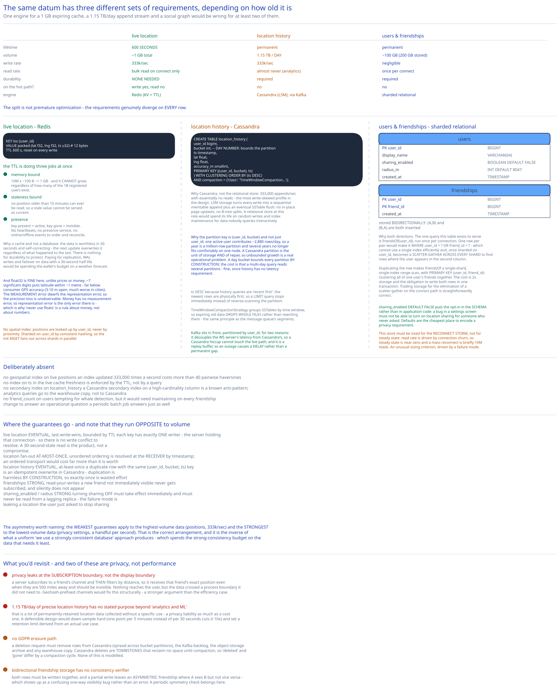

# Module 03 — Database Design



## Three stores, three lifetimes

The organising observation: **the same datum — a person's position — has three completely different sets of requirements depending on how old it is.**

| | Live location | Location history | Users & friendships |
|---|---|---|---|
| **Lifetime** | **600 seconds** | Permanent | Permanent |
| **Volume** | ~1 GB total | **1.15 TB/day** | ~100 GB |
| **Write rate** | 333k/sec | 333k/sec | negligible |
| **Read rate** | Bulk read on connect only | Almost never (analytics) | Once per connect |
| **Durability** | **None needed** | Required | Required |
| **On the hot path?** | Write yes, read no | No | **No** |
| **Engine** | Redis (KV + TTL) | Cassandra (LSM), via Kafka | Sharded relational |

Putting all three in one store would mean choosing one engine for a 1 GB expiring cache, a 1.15 TB/day append stream, and a social graph — and being wrong for at least two of them. The split isn't premature optimization; the requirements genuinely diverge on every row.

## Live location: Redis

```
KEY    loc:{user_id}
VALUE  packed (lat: float32, lng: float32, ts: uint32)     # 12 bytes
TTL    600 seconds, reset on every write
```

**Why a key-value cache and not a database.** The data is worthless in 30 seconds and **self-correcting** — the next update overwrites it regardless of what happened to the last one. [Module 00](./00-overview.md#what-dropped-points-are-acceptable-buys) established that dropped points are acceptable, so there is nothing for durability to protect. Paying for replication, WAL writes and failover on data with a 30-second half-life would be spending the wallet's budget on a weather forecast.

**The TTL is doing three jobs at once**, and this is the schema's best feature:

1. **Memory bound.** Only active users occupy space — 10M × ~100 bytes with overhead ≈ **1 GB**, and it cannot grow, regardless of how many of the 1 billion registered users exist.
2. **Staleness bound.** No position older than 10 minutes can ever be read, so a stale value can't be served as current.
3. **Presence.** "Friends inactive for 10 minutes disappear" is implemented entirely by key expiry — key present means active, key gone means invisible. [Module 01](./01-architecture-hld.md#per-path-walkthrough) shows this removes the need for heartbeats, a presence service, and online/offline events with their ordering and reconciliation problems.

Reusing an eviction policy as a domain rule is the design's cleanest simplification, and it's only available because the semantics were allowed to be lossy.

**Why floats are fine here**, unlike prices in the [stock exchange](../stock-exchange/05-db-design.md#the-event-stream) or amounts in the [digital wallet](../digital-wallet/05-db-design.md#why-amount-minor-is-an-integer). A `float32` gives ~7 significant digits, so latitude to ~1 metre — far below consumer GPS accuracy (3–10 m in the open, much worse in cities). The measurement error dwarfs the representation error, so precision loss is unobservable. **Money has no measurement error, so representation error is the only error there is** — that's the whole distinction, and it's why "never use floats" is a rule about money rather than about numbers.

**No spatial index on this store.** Positions are looked up by `user_id`, never by proximity ([Module 00](./00-overview.md#approach-walkthrough)): with 40 recipients per update, 40 pairwise haversines beat maintaining a geospatial index updated 333,000 times a second. Cross-ref [Geospatial Indexing](../../hld-building-blocks/geospatial-indexing.md), which makes exactly this point about rapidly-moving objects.

**Sharded on `user_id`** via consistent hashing — one round trip per key group, and the `MGET` for `init` fans out across shards in parallel.

## Location history: Cassandra

```sql
CREATE TABLE location_history (
    user_id     bigint,
    bucket      int,          -- day number, to bound partition size
    ts          timestamp,
    lat         float,
    lng         float,
    accuracy_m  smallint,
    PRIMARY KEY ((user_id, bucket), ts)
) WITH CLUSTERING ORDER BY (ts DESC)
  AND compaction = { 'class': 'TimeWindowCompactionStrategy' };
```

**Why Cassandra and not the relational store.** The workload is 333,000 appends/sec with essentially no reads — the most write-skewed profile in this design. Cassandra's LSM-tree storage turns every write into a sequential memtable append plus an eventual SSTable flush, so there are no in-place page updates and no B-tree splits. A relational store at this rate would spend its life on random writes and index maintenance for data nobody queries interactively. Cross-ref [SQL vs NoSQL](../../database-design/sql-vs-nosql.md).

**Why the partition key is `(user_id, bucket)` and not just `user_id`.** This is the important detail. With `user_id` alone, one user's partition grows forever — 333k/sec fleet-wide means one active user contributes ~2,880 rows/day, so a year is a million-row partition and several years is a partition that no longer fits comfortably on one node. Cassandra partitions are the unit of storage *and* of repair, so an unbounded partition is a real operational problem.

Adding a `bucket` (day number) **bounds every partition by construction**. The cost is that a multi-day query must read multiple partitions — fine, because history queries are analytics with no latency requirement.

**Why `ts` is the clustering key, descending.** History queries are "recent first", so descending clustering order means the newest rows are physically first in the partition and a `LIMIT` query stops immediately. Ascending order would require a reverse scan of the whole partition.

**`TimeWindowCompactionStrategy`** groups SSTables by time window, so expiring old data drops whole SSTables rather than rewriting them — the same "delete a file, not a row" principle the [message queue's segments](../distributed-message-queue/02-storage-engine.md#segments-and-why-the-log-isnt-one-file) rely on.

**Kafka sits in front**, partitioned by `user_id`. Two reasons: it decouples the WebSocket server's latency from Cassandra's write latency (a Cassandra hiccup must not touch the live path), and it gives a replay buffer so a Cassandra outage causes a delay rather than a permanent gap. Cross-ref [Kafka & the Distributed Log](../../hld-building-blocks/kafka-distributed-log.md).

## Users and friendships: sharded relational

```sql
CREATE TABLE users (
    user_id           BIGINT       NOT NULL,
    display_name      VARCHAR(64)  NOT NULL,
    sharing_enabled   BOOLEAN      NOT NULL DEFAULT FALSE,   -- opt-in, see below
    radius_m          INT          NOT NULL DEFAULT 8047,    -- 5 miles
    created_at        TIMESTAMP    NOT NULL,
    PRIMARY KEY (user_id)
);

CREATE TABLE friendships (
    user_id     BIGINT NOT NULL,
    friend_id   BIGINT NOT NULL,
    created_at  TIMESTAMP NOT NULL,
    PRIMARY KEY (user_id, friend_id)
);
-- Stored BIDIRECTIONALLY: (A,B) and (B,A) are both inserted.
```

**Why friendships are stored in both directions.** The single query this table exists to serve is `friendsOf(user_id)`, run once per connection. Storing one row per pair would make that query `WHERE user_id = ? OR friend_id = ?` — which cannot use a single index efficiently and, once the table is sharded on `user_id`, becomes a **scatter-gather across every shard** to find rows where the user appears in the second column.

Duplicating the row makes `friendsOf` a **single-shard, single-index range scan**: `WHERE user_id = ?`, with `PRIMARY KEY (user_id, friend_id)` clustering all of one user's friends together. The cost is 2× storage (~200 GB instead of 100 GB) and the obligation to write both rows in one transaction. Trading storage for the elimination of a scatter-gather on the connect path is straightforwardly correct — and it's the same denormalize-to-co-locate move the [object storage](../object-storage-s3/04-db-design.md#why-object-parts-carries-a-redundant-bucket-id) schema makes.

**`sharing_enabled` defaults to `FALSE`.** Location sharing is opt-in, and the default belongs in the schema rather than in application code — a bug in a settings screen must not be able to turn on location sharing for someone who never asked. Defaults are the cheapest place to encode a privacy requirement.

**Sharded on `user_id`.** Every access names a user; `friendsOf` is single-shard because of the bidirectional storage.

## Indexes

| Index | Serves |
|---|---|
| `loc:{user_id}` (Redis key) | The `init` bulk read (`MGET`), and the per-update write. |
| `PRIMARY KEY ((user_id, bucket), ts DESC)` on `location_history` | "This user's recent positions" as one partition scan, newest first, with bounded partition size. |
| `PRIMARY KEY (user_id)` on `users` | Settings and profile lookup on connect. |
| `PRIMARY KEY (user_id, friend_id)` on `friendships` — clustered | `friendsOf` as a single-shard range scan. The reason for bidirectional storage. |

**Deliberately absent:**

- **No geospatial index on live locations.** Covered above — updates would dominate.
- **No index on `ts` in the live cache.** Freshness is enforced by TTL, not by query.
- **No secondary index on `location_history`.** Cassandra secondary indexes on a high-cardinality column are a known anti-pattern; analytics queries go to the warehouse copy, not to Cassandra.
- **No `friend_count` denormalization on `users`.** Tempting for whale detection ([Module 01](./01-architecture-hld.md#load-handling)), but it would need maintaining on every friendship change to serve an operational question that a periodic batch job answers just as well.

## Consistency

| Data | Model | Why |
|---|---|---|
| Live location | **Eventual; last-write-wins, bounded by TTL** | Each key has exactly one writer (the server holding that user's connection), so there's no write conflict to resolve. Readers seeing a value up to 30s stale is inherent to the product, not a compromise. |
| Location fan-out | **At-most-once, unordered** | Fire-and-forget pub/sub. Ordering is resolved at the *receiver* by timestamp comparison ([Module 02](./02-lld.md#pseudocode-the-two-hot-paths)) rather than by an ordered transport, which would cost far more than it's worth. |
| Location history | **Eventual, at-least-once** | Kafka gives at-least-once; a duplicate row with the same `(user_id, bucket, ts)` primary key is an idempotent overwrite in Cassandra. So duplication is harmless *by construction*, which is why at-least-once is sufficient and exactly-once would be wasted effort. |
| Friendships | **Strong, read-your-writes** | Adding a friend must be immediately visible, or the new friend never gets subscribed and silently doesn't appear. Read from the primary on connect. |
| `sharing_enabled` / `radius_m` | **Strong** | A privacy setting. Turning sharing *off* must take effect immediately and must never be read from a lagging replica — the failure mode is leaking a location the user just asked to stop sharing. |

**The asymmetry worth naming:** the weakest guarantees apply to the highest-volume data (positions, 333k/sec) and the strongest to the lowest-volume data (privacy settings, a handful per second). That's the correct arrangement and it's the inverse of what a uniform "we use a strongly consistent database" approach would produce — which would spend the strong-consistency budget on the data that needs it least.

## Scaling the schema

**Live cache — sharded on `user_id`, sized by concurrency not by user base.** 1 GB total, growing only with *concurrent* users. Adding shards is trivial (consistent hashing) and losing one loses ≤1/n of live positions, which repopulate within 30 seconds. This is the one store in this guide whose failure recovery requires no action at all: the data rebuilds itself.

**History — Cassandra scales linearly on `(user_id, bucket)`.** The partition key includes a high-cardinality user id, so writes distribute evenly with no hotspot. Retention (say 90 days hot, then to object storage — cross-ref the [object storage](../object-storage-s3/00-overview.md) case study) is a TTL plus TWCS, so expiry drops SSTables rather than rewriting them.

**Users/friendships — sharded on `user_id`**, read once per connect. The connect-path read rate is driven by *connection churn*, not by traffic: steady state is near-zero reads, and a mass reconnect ([Module 01](./01-architecture-hld.md#what-youd-revisit-as-this-grows)) briefly makes it 10M reads. So this store must be sized for the reconnect storm rather than for steady state — an unusual sizing criterion worth stating, since it's driven by a failure mode rather than by normal load. Read replicas plus an in-process friend-list cache on the WebSocket servers absorb it.

**The multi-region shape is unusually easy here.** Home a user's data — cache key, channel, history — in their nearest region, which works because nearby friends are, definitionally, usually in the same region. Cross-region friendships need cross-region channel subscription, adding ~150ms to a soft-real-time path where that is genuinely fine. Compare the [digital wallet](../digital-wallet/06-interviewer-qna.md), where multi-region is the hardest unsolved problem — the difference is entirely that this data is disposable and geographic.

## Connecting it back

**"Occasional dropped points are acceptable"** (Module 00) → fire-and-forget pub/sub with no acks, and a live store needing no durability (Module 01) → so `ChannelBus.publish` returns nothing, encoding the guarantee in the type (Module 02) → surfacing here as **Redis with a TTL rather than a replicated database**, and as at-most-once being the *chosen* consistency model rather than a limitation.

**"333k updates/sec, 13.3M pushes/sec"** (Module 00) → one publish to the sender's own channel, with distance filtered at the receiver (Module 01) → so `ConnectionRegistry` is deliberately per-server and cannot answer globally (Module 02) → surfacing here as **no geospatial index on live positions** (an index updated 333k/sec costs more than 40 pairwise haversines) and as history going to an LSM store through Kafka so a slow disk can never touch the live path.

**"Friends inactive for 10 minutes disappear"** (Module 00) → no presence service at all; TTL expiry is the mechanism (Module 01) → surfacing here as `TTL 600 seconds` doing triple duty: memory bound, staleness bound, and presence signal.

**"Location is visible only to friends"** (Module 00) → subscription follows friendship, so a server only receives channels its clients are entitled to (Module 01) → surfacing here as **bidirectional `friendships` storage** (making the entitlement check a single-shard read on the connect path) and `sharing_enabled DEFAULT FALSE` (encoding opt-in where application bugs can't reach it).

## What you'd revisit as this grows

- **Privacy leaks at the subscription boundary, not the display boundary.** A server subscribes to a friend's channel and *then* filters by distance — so it receives a friend's exact position even when they're 500 miles away and should be invisible. Nothing reaches the user, but the data crossed a process boundary it didn't need to. **Geohash-prefixed channels** would fix this structurally, and that's a stronger argument for building them than the efficiency case in [Module 01](./01-architecture-hld.md#what-youd-revisit-as-this-grows).

- **1.15 TB/day of history has no stated purpose beyond "analytics and ML".** That's a lot of permanently-retained precise location data collected without a specific use, which is a privacy liability as much as a cost one. A defensible design would down-sample aggressively (one point per 5 minutes rather than per 30 seconds cuts it 10×) and set a real retention limit derived from an actual use case.

- **No GDPR erasure path.** A deletion request must remove a user's rows from Cassandra (spread across `bucket` partitions), their Kafka backlog, the object-storage archive, and any warehouse copy. Cassandra deletes are tombstones that don't reclaim space until compaction, so "deleted" and "gone" differ by a compaction cycle. None of this is modelled.

- **`friendsOf` on connect is a reconnect-storm amplifier.** Sizing a database for a failure mode rather than steady state is the right call and an uncomfortable one; a more robust design would let clients cache their friend list and present it on reconnect, with the server validating rather than fetching.

- **Bidirectional friendship storage has no consistency verifier.** Both rows must be written together, and a partial write leaves an asymmetric friendship where A sees B but not vice versa — which manifests as a confusing one-way visibility bug rather than an error. A periodic symmetry check belongs in the design and isn't here.
