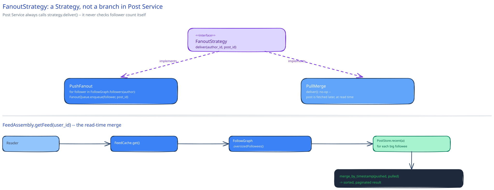

# Module 02 — Low-Level Design



## Interfaces vs. implementations

- **`FanoutStrategy`** *(interface)* → **`PushFanout`** and **`PullMerge`** — the follower-count threshold decides which implementation `Post Service` calls for a given author; `Post Service` itself never branches on follower count directly, it just asks the strategy to handle delivery.
- **`FeedCacheRepository`** *(interface)* → **`RedisFeedCacheRepository`** — `addPost(user_id, post_id)` (the idempotent set-add), `getPage(user_id, cursor, limit)`.
- **`FollowGraphRepository`** *(interface)* → **`SqlFollowGraphRepository`** — `followers(author_id)` (a snapshot read used by fan-out), `oversizedFollowees(user_id)` (cached, not recomputed live, feeding `PullMerge`).
- **`PostRepository`** *(interface)* → **`SqlPostRepository`** — `append(author_id, body)`, `recent(author_id, limit)` (used directly by `PullMerge`).
- **`FeedAssembly`** — the read-time orchestrator. Depends on `FeedCacheRepository`, `FollowGraphRepository`, and `PostRepository`; implements no storage itself, only the merge.

## Pseudocode for the decision and both paths

```
PostService.publish(author_id, body):
    post_id = postRepo.append(author_id, body)
    strategy = PushFanout if followGraphRepo.followerCount(author_id) < THRESHOLD else PullMerge
    strategy.deliver(author_id, post_id)
    return post_id

PushFanout.deliver(author_id, post_id):
    for follower_id in followGraphRepo.followers(author_id):     # snapshot read
        FanoutQueue.enqueue(follower_id, post_id)                # idempotent job (see below)

PullMerge.deliver(author_id, post_id):
    pass                                                          # no work at write time, by design

FeedAssembly.getFeed(user_id, cursor):
    pushed = feedCacheRepo.getPage(user_id, cursor)                # fan-out-on-write followees
    big_followees = followGraphRepo.oversizedFollowees(user_id)    # cached, not recomputed live
    pulled = [postRepo.recent(a) for a in big_followees]
    return merge_by_timestamp(pushed, pulled)[cursor:cursor+PAGE_SIZE]
```

Concurrency note: a fan-out job must be safe to run twice (a worker crash mid-job and its retry both attempt the same delivery) — `FanoutQueue.enqueue` writes are made idempotent the same way this guide's [idempotency keys](../../scalability-resilience/idempotency-keys.md) page describes: the feed cache write is a set-add (`SADD`-style), where adding the same `post_id` twice is a no-op, not a duplicate entry, so a retried job costs nothing beyond the wasted call.

## Concurrency at the code level

`FeedCacheRepository.addPost` needs no in-process lock, and this generalizes the point already made above: hundreds of fan-out workers can be appending to thousands of different users' feed caches simultaneously with zero coordination between them, because each `user_id`'s cache entry is an entirely independent piece of state — no worker's write to one user's feed cache has any relationship to another worker's write to a different user's cache. This is what makes the fan-out worker pool trivially horizontally scalable: there's no shared mutable state between workers to protect in the first place, only many independent single-key writes.

`FeedAssembly.getFeed` needs no lock either, for a different reason: it only ever *reads* (`feedCacheRepo.getPage`, `postRepo.recent`) and merges the results in memory — there's nothing being mutated during assembly for a lock to protect. The one place correctness actually depends on ordering — two posts from the same author landing in different followers' caches at different times — is handled not by coordinating the writers, but by never trusting write order in the first place: assembly re-derives the correct order from each post's own timestamp, every time, regardless of what order the underlying writes happened to land in.

## Design patterns you just used, named

- **Strategy pattern** — `FanoutStrategy` is the textbook case: `PushFanout` and `PullMerge` are interchangeable behind one interface, selected by a runtime property (follower count) rather than a compile-time choice.
- **Repository pattern** — `FeedCacheRepository`, `FollowGraphRepository`, and `PostRepository` all hide their storage engine behind method calls; `FeedAssembly` and `PostService` never issue a query directly against Redis or the relational store.
- **Facade / orchestrator** — `FeedAssembly.getFeed` is a thin orchestrator over three independent repositories, matching this guide's [payments case study](../payments-system/02-lld.md)'s `OrchestrationService`: it composes calls to interfaces, and implements no storage logic of its own.

## Practice: extend it yourself

Before moving to Database Design, sketch (pseudocode is fine) how you'd add:

1. **Muting an account without unfollowing them** — the muted account's posts should disappear from the muter's feed, but the muter still follows them (so a fan-out job for that author still fires). Does this belong in `FanoutStrategy` (skip delivering to muters) or in `FeedAssembly` (filter muted authors out at read time)? What's the cost difference between the two choices at 10M followers?
2. **A chronological/ranked toggle the user can switch at will** — the same underlying candidate posts, sorted two different ways depending on a per-user preference. Which existing interface's method signature has to change to support this, and which one doesn't need to change at all?

Neither has one clean answer — the point is noticing which interface boundary naturally absorbs each new requirement, and which would require reaching across a boundary that was supposed to keep these concerns separate.
