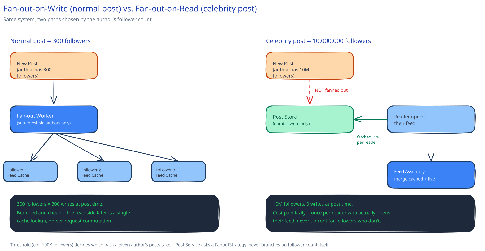
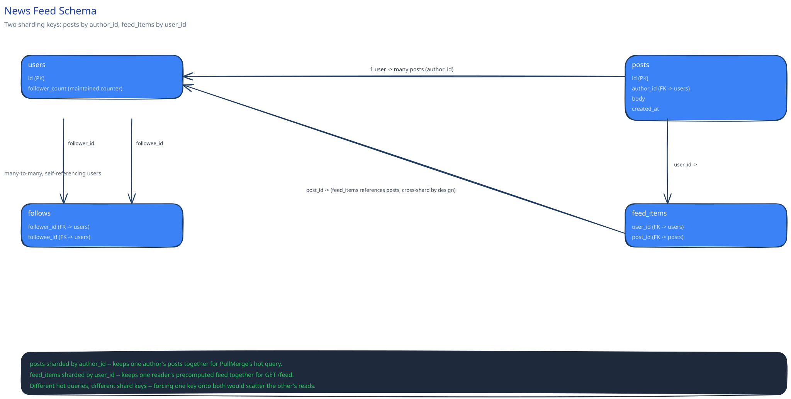

# Design a News Feed System

## Requirements

**Functional:**
- Follow / unfollow another account.
- Post a text or image update.
- View a feed of posts from accounts you follow, newest activity first.
- Like and comment counts visible on each post.

**Non-functional** (stated as assumptions, interview-style):
- 300M DAU, average user follows 300 accounts.
- A small fraction of accounts are "celebrities" with 10M+ followers — this is the case that drives most of this design.
- Feed-load latency target: p99 under 300ms.
- A post doesn't need to appear in every follower's feed instantly — a few seconds of lag is fine; it does need to appear *eventually*, for everyone, without a fan-out job silently dropping a follower.

That fraction of celebrity accounts is small in count but not in consequence: a single post from one of them is the single most expensive event this system handles, and the entire high-level design below exists mainly to keep that one event from being as expensive as it looks at first glance.

## Capacity Estimation

Using this guide's [back-of-envelope method](../../foundations/back-of-envelope-estimation.md):

- **Posts/day:** assume 10% of DAU posts once/day → 30M posts/day.
- **Posts/sec, average:** 30M / 86,400 ≈ 350/sec. Posting itself is never the bottleneck here.
- **Feed-reads/sec:** assume every DAU opens their feed 5x/day → 1.5B reads/day ≈ 17,000/sec average, **~50,000/sec at peak** (3x). Reads outnumber writes by roughly **50:1** — the number that decides almost everything below, the same way a 100:1 read:write ratio decided this guide's [URL Shortener](../url-shortener/README.md) HLD.
- **Storage/day:** ~2KB/post (text + metadata, images stored separately per [Object / Blob Storage](../../scalability-resilience/object-blob-storage.md)) × 30M ≈ 60GB/day of post metadata — small. The number that actually matters is the next one.
- **The celebrity fan-out number:** one post from a 10M-follower account, fanned out to every follower's feed at write time, is **10M individual writes for one post**. Compare that to a normal user's post — 300 average followers — and the three-order-of-magnitude gap between "normal post" and "celebrity post" is the entire reason this design can't use one uniform strategy for both.

## Approach Walkthrough

Before any boxes: opening the feed should feel instant — reading a small, already-assembled list, not computing anything on the spot. Posting should feel instant too, from the poster's point of view, even though follower delivery can trail behind by a couple of seconds. Reconciling "reads must be cheap" with "one post can have 10 million followers" is the one real design problem here; everything below is infrastructure built to make both true without either bankrupting the other.

## API Surface

- `POST /posts` — `{ author_id, body, media_url? }` → `{ post_id, created_at }`.
- `GET /feed?cursor=&limit=` — a page of the caller's assembled feed, newest first.
- `POST /users/{id}/follow` / `DELETE /users/{id}/follow` — follow/unfollow.
- `POST /posts/{id}/like` — increments a denormalized like counter (see Database Design).

## High-Level Design



**The central decision: fan-out-on-write vs. fan-out-on-read.**

- **Fan-out-on-write (push).** At post time, write the new post's ID into every follower's precomputed feed (a per-user list in a fast store, e.g. Redis). Reads are then trivial — just read your own precomputed list. The cost lands entirely on the write path, and it lands *per follower*: a celebrity's 10M followers means 10M writes for one post, most of them for followers who won't open the app for hours, if today at all.
- **Fan-out-on-read (pull).** Do nothing at post time. At read time, query the recent posts of everyone the requesting user follows (up to 300 people) and merge them on the spot. No wasted writes for followers who never look — but every single feed load now pays the cost of 300 queries and a merge, and at 50,000 reads/sec that's the expensive path instead.

**The hybrid that real systems use:** pick the path *per author*, by follower count. Below a threshold (e.g. 100K followers), fan-out-on-write — the write cost is bounded and reads stay cheap. Above the threshold, skip fan-out entirely; a celebrity's posts are instead fetched at read time and merged into the requester's precomputed feed for just that slice. A feed read becomes "read my precomputed list, then merge in any posts from accounts I follow that were too big to fan out" — cheap in the common case, and the one expensive celebrity post is now paid for lazily, once per reader who actually asks, not 10 million times upfront.

**Building blocks:**
- **Post Service** — accepts a new post, writes it durably, and decides (by the author's follower count) whether to enqueue a fan-out job or do nothing further.
- **Fan-out worker pool** — consumes fan-out jobs (cross-ref [Message Queues & Pub/Sub](../../hld-building-blocks/message-queues-pubsub.md)), writes the new post ID into each follower's feed cache. Only ever handles sub-threshold authors, which is what keeps its job small and boundable.
- **Feed Cache** — a per-user precomputed list of recent post IDs (Redis), the thing `GET /feed` reads from directly for the fan-out-on-write portion.
- **Feed Assembly / merge step** — at read time, reads the requester's Feed Cache, checks which of their followees are over-threshold, fetches those authors' recent posts directly, and merges both into one ranked page.
- **Feed Ranking** — chronological by default; an engagement-weighted ranking is a real refinement most production feeds add, but doesn't change anything about the fan-out decision above, so it's out of scope for the boxes here.

**Load Handling.** The design's whole point is that a viral celebrity post should barely register as a load event on the write path, since it never gets fanned out — the read-time merge absorbs it instead, spread across however many followers actually open the app, not all at once. The fan-out worker pool itself is sized for the sub-threshold case only, so its load-test target is framed around volume of *authors*, not follower count: sustain 5,000 fan-out jobs/sec (5,000 sub-threshold posts/sec, each averaging a few hundred followers) without the pool's queue depth growing unboundedly — cross-ref [Backpressure, Load Shedding & Bulkheads](../../scalability-resilience/backpressure-load-shedding.md) for what happens if it falls behind anyway (shed the oldest, least-time-sensitive fan-out jobs first, never the read path).

**Concurrent-User Handling.** Three races, named explicitly:
1. **A user unfollows someone while that person's post is mid-fan-out.** Resolved by treating the follower list read at fan-out time as a snapshot, not a live constraint: if the unfollow lands after the snapshot was taken, that one post may still briefly appear in the (now ex-)follower's feed — a harmless, temporary staleness, not a correctness bug, and cheaper than locking the follower list during every fan-out job.
2. **Two posts from the same author landing in different followers' feeds out of order** (fan-out workers processing in parallel, no guaranteed completion order). Resolved by the feed being sorted by the post's own creation timestamp/ID at *read* time, not by insertion order into the feed cache — the cache is an unordered set of post IDs per user; ordering is applied once, at assembly, from data that's authoritative regardless of which worker got there first.
3. **A like-count read racing a concurrent like-count write.** Resolved by treating the displayed count as [BASE](../../database-design/acid-vs-base.md), not ACID: an eventually-consistent, cached counter that a reader might see a few writes behind, in exchange for never blocking a feed read on a lock held by a concurrent like — cross-ref this guide's [Counting a Billion Likes](../../like-counting-at-scale/00-overview.md) deep dive, which is this exact problem at full depth.

## Low-Level Design


**`FanoutStrategy`** *(interface)* → **`PushFanout`** and **`PullMerge`** — the follower-count threshold decides which implementation `Post Service` calls for a given author; `Post Service` itself never branches on follower count directly, it just asks the strategy to handle delivery.

Pseudocode for the decision and both paths:
```
PostService.publish(author_id, body):
    post_id = PostStore.append(author_id, body)
    strategy = PushFanout if FollowerCount(author_id) < THRESHOLD else PullMerge
    strategy.deliver(author_id, post_id)
    return post_id

PushFanout.deliver(author_id, post_id):
    for follower_id in FollowGraph.followers(author_id):     # snapshot read
        FanoutQueue.enqueue(follower_id, post_id)             # idempotent job (see below)

PullMerge.deliver(author_id, post_id):
    pass                                                       # no work at write time, by design

FeedAssembly.getFeed(user_id, cursor):
    pushed = FeedCache.get(user_id, cursor)                   # fan-out-on-write followees
    big_followees = FollowGraph.oversizedFollowees(user_id)    # cached, not recomputed live
    pulled = [PostStore.recent(a) for a in big_followees]
    return merge_by_timestamp(pushed, pulled)[cursor:cursor+PAGE_SIZE]
```

Concurrency note: a fan-out job must be safe to run twice (a worker crash mid-job and its retry both attempt the same delivery) — `FanoutQueue.enqueue` writes are made idempotent the same way this guide's [idempotency keys](../../scalability-resilience/idempotency-keys.md) page describes: the feed cache write is a set-add (`SADD`-style), where adding the same `post_id` twice is a no-op, not a duplicate entry, so a retried job costs nothing beyond the wasted call.

## Database Design & Scaling



**Entities:** `users` (id, follower_count — kept current, see denormalization below), `posts` (id, author_id, body, created_at), `follows` (follower_id, followee_id — the many-to-many join table), `feed_items` (user_id, post_id — the materialized fan-out-on-write output for sub-threshold authors).

**Two different sharding keys for two different tables, deliberately.** `posts` is sharded by `author_id`, so one author's own posts stay together — this guide's [sharding page](../../hld-building-blocks/data-partitioning-sharding.md) picks a shard key by asking "what does the busiest query actually filter by," and the busiest query against `posts` is "this author's recent posts," used constantly by `PullMerge` above. `feed_items`, by contrast, is sharded by `user_id` — its only real query is "this reader's precomputed feed," so keeping one reader's feed items together is what matters there, not which author wrote them. Sharding both by the same key would make one of those two queries fan out across shards for no benefit.

**Indexes:** `follows(follower_id)` (assembling "who does this user follow" on every feed read) and `follows(followee_id)` (computing follower counts, and the fan-out job's own "who follows this author" lookup) — both directions are hot, so both get an index rather than picking one. `posts(author_id, created_at)` for `PullMerge`'s "this author's recent posts" query.

**Denormalization:** `users.follower_count` is a maintained counter, not a live `COUNT(*)` over `follows` — it's read on every single post (to decide `PushFanout` vs. `PullMerge`) and would be one of the hottest queries in the whole system if computed live, the same "freeze a number that's expensive to recompute" call this guide's [e-commerce schema](../../database-design/ecommerce-schema-worked-example.md) makes for `total_amount`.

## Interviewer Q&A

**What happens when two requests hit the same resource at the same instant — specifically, a user's follower count being read (to pick a fan-out strategy) at the exact moment they cross the threshold from a new follower?**
Momentary inconsistency is harmless here: the maintained `follower_count` counter might read as either just-under or just-over the threshold depending on ordering, so the post either fans out or doesn't — a one-time, one-post ambiguity around the threshold, not a repeating bug, and cheap enough to tolerate rather than lock around.

**What happens when traffic spikes 10x for an hour (a major world event)?**
Reads dominate (50:1), so `GET /feed` traffic is what spikes hardest — Feed Assembly and Feed Cache are both stateless/horizontally scalable, so they absorb it directly; the actual risk is a spike in *posting* from many normal accounts simultaneously reacting to the event, which spikes fan-out jobs — the worker pool's queue is bounded and sheds oldest-first under [backpressure](../../scalability-resilience/backpressure-load-shedding.md) rather than growing unboundedly, trading slightly delayed fan-out for a queue that never falls over.

**Why not just always use fan-out-on-read and skip the complexity of a threshold?**
Because 300 average followees × 50,000 reads/sec means every feed load would pay for merging up to 300 authors' recent posts, live, every time — fan-out-on-write exists specifically to make the overwhelmingly common case (a normal-sized account posting) cheap to read, at the cost of a bounded number of writes that's fine for that case.

**Why not always use fan-out-on-write and just skip celebrity posts entirely if it's too expensive?**
Skipping is not an option — a celebrity's followers still need to see the post; the choice is only WHEN the work happens: 10M writes at post time (expensive, upfront, mostly wasted on followers who won't look soon) vs. a per-reader merge cost paid lazily, only for followers who actually open their feed.

**How would you rank a feed by engagement instead of strictly reverse-chronological?**
That's a scoring function applied at the Feed Assembly merge step — instead of `merge_by_timestamp`, sort candidates by a score combining recency and predicted engagement; it doesn't change the fan-out decision above at all, since ranking only touches how already-gathered candidates are ordered, not how they were gathered.

**Would you shard the `follows` table by `follower_id` or `followee_id`?**
Neither alone covers both hot queries — "who do I follow" (by `follower_id`) and "who follows this author" (by `followee_id`, needed for fan-out and for `follower_count`) run equally often; a common real answer is storing the edge twice, once per access pattern, rather than picking one sharding key and forcing the other query to scatter-gather.

**What happens to a user's feed the moment they follow someone new?**
Nothing retroactive happens to their Feed Cache — a newly-followed account's *past* posts don't backfill into the cache; the next feed read's merge step picks them up going forward (and, if the new followee is over-threshold, `PullMerge` naturally includes their recent posts on the very next read regardless).

**Is `feed_items` ever pruned?**
Yes — it only needs to hold enough recent post IDs to serve pagination a few pages deep; a background job trims each user's list to, say, the most recent 1,000 entries, since anything older is vanishingly unlikely to be paged to and would otherwise grow unboundedly for a long-lived account.
