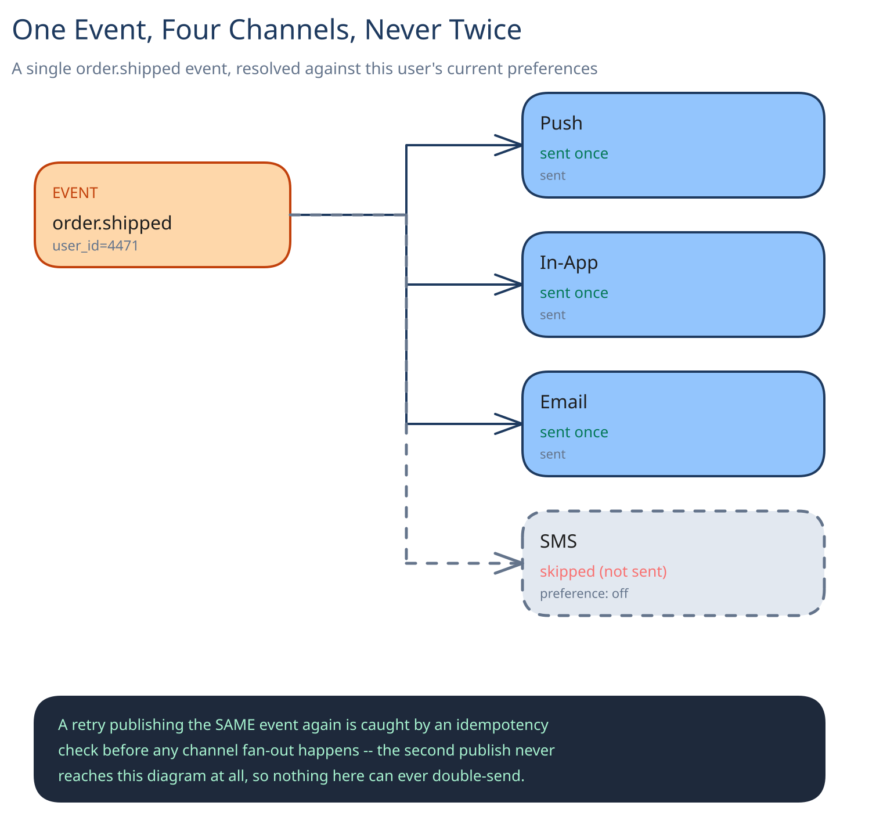

# Module 00 — Overview

## The feature, with no infrastructure in it yet

An order ships. A password gets reset. A friend likes a photo. Every one of those is *one event*, but the user who cares about it might need to hear about it on their phone, in their inbox, by text, and inside the app itself — on whichever of those they've actually left switched on, and never more than once per event even if a retry fires twice. That's the whole feature: **one event in, the right channels out, exactly once per channel, respecting a preference the user set weeks ago.**

The interesting constraint isn't any single channel — sending a push notification is a solved problem this guide already covers in [Push Notifications: One Event, Millions of Phones](../../../push-notifications-fanout/00-overview.md). It's that a *real* notification system has to make that same one-event-in decision correctly across four independently-flaky channels at once, without four separate places for the preference check or the dedup logic to drift out of sync with each other.

## Requirements

**Functional:**
- Any internal service (orders, security, social) publishes one event; the system delivers it across whichever of push, email, SMS, and in-app apply for that user and category.
- Per-user, per-category, per-channel preferences are enforced — a user can turn off "someone liked your post" on email while keeping it on for push.
- The same event never produces two notifications on the same channel, even if the triggering service retries its publish.

**Non-functional** (stated as assumptions, interview-style):
- ~100M notifications/day, across all channels combined.
- Push and in-app should land within a few seconds of the triggering event; email and SMS are acceptable within a couple of minutes, since both already queue through a third-party provider.
- A triggering service's retry must never cause a duplicate send — this is the one requirement every other decision below is shaped around.

## Capacity Estimation

Using this guide's [back-of-envelope method](../../foundations/back-of-envelope-estimation.md):

- **Events/sec, average:** 100M / 86,400 ≈ 1,160/sec. At a 5x peak factor (a broadcast-style event — a major incident notice, a platform-wide announcement): **~5,800/sec peak**.
- **Channel-sends/sec:** most notifications fan out to roughly 2 enabled channels on average (push + in-app is the common pair) → **~2,300/sec average, ~11,600/sec peak** actual sends across all channel workers combined — this, not the event rate, is the number the channel-worker tier is sized against.
- **Storage/day:** a notification row is small (~300 bytes: source, user, category, payload reference, timestamps) — 100M × 300B ≈ 30GB/day. The delivery-tracking table grows faster, one row per (notification, channel) sent: at the 2-channel average, **~200M delivery rows/day**.
- **Preference reads:** every single notification triggers a preference lookup, while preferences themselves change rarely — a read:write ratio steep enough that this is a caching problem (see [Caching Strategies](../../hld-building-blocks/caching-strategies.md)) before it's a database-scaling problem.

## Approach Walkthrough

Before any boxes: every triggering service publishes to **one place**, not four. That single ingestion point resolves the user's current preferences, decides which channels apply, and only then hands off to channel-specific workers — each of which owns exactly one provider integration and nothing else. Centralizing the *decision* while keeping the *delivery* mechanics separate per channel is the shape of the entire design: one place to get dedup and preference logic right, N independent places for a specific provider to be slow or flaky without that spreading to the others.

## API Surface

- `POST /notifications {source_service, idempotency_key, user_id, category, payload}` → `{notification_id, channels_dispatched}`. `idempotency_key` is scoped per `source_service` and **required** — the same pattern this guide uses everywhere a retry could duplicate a real-world effect (see [Idempotency Keys](../../scalability-resilience/idempotency-keys.md)).
- `GET /users/{id}/notifications?cursor=` → paginated in-app notification list, backed by the delivery-tracking store.
- `PUT /users/{id}/preferences {category, channel, enabled}` → updates one toggle; read back by the preference resolver at the *next* fan-out, not pushed to anything already in flight.
- Outbound, per channel: the push/email/SMS provider's own send API, called by that channel's worker — never called directly by a triggering service.
