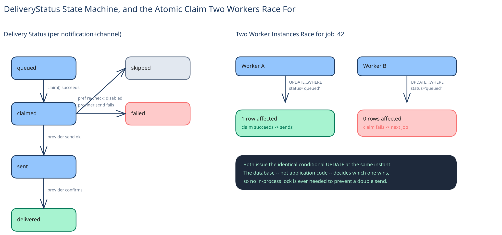

# Module 02 — Low-Level Design



**`DeliveryStatus`**, as an explicit state machine, matching this guide's convention elsewhere: `queued → sent → delivered | failed`, one row per `(notification, channel)`. Modeling it as an enum with enforced transitions — not a free-text column — is what makes "never send twice" checkable at the database level instead of trusted to every caller.

## Interfaces vs. implementations

- **`NotificationRepository`** *(interface)* → **`SqlNotificationRepository`** — `findByIdempotencyKey(source, key)`, `insert(...)`.
- **`PreferenceResolver`** *(interface)* → **`CachedPreferenceResolver`** — `resolveChannels(user_id, category)`, backed by a cache in front of the preferences table (see Database Design), since this is read hundreds of times more often than it's written.
- **`ChannelSender`** *(interface)* → **`PushSender`** / **`EmailSender`** / **`SmsSender`** / **`InAppSender`** — `send(notification, recipient) -> {ok, provider_ref}`. Every provider becomes one implementation behind this single interface; adding a fifth channel later means writing one new class, not touching the other four.
- **`DeliveryTracker`** *(interface)* → **`SqlDeliveryTracker`** — `claim(job_id)` (the atomic claim), `recordOutcome(job_id, status, provider_ref)`.

## Pseudocode for ingest and fan-out

```
IngestionService.publish(source_service, idempotency_key, user_id, category, payload):
    existing = notifRepo.findByIdempotencyKey(source_service, idempotency_key)
    if existing is not None:
        return existing                                        # duplicate publish, already handled

    notification = notifRepo.insert(source_service, idempotency_key, user_id, category, payload)
                                                                 # ^ unique constraint is the real guard, see Database Design

    channels = preferenceResolver.resolveChannels(user_id, category)
    for channel in channels:
        deliveryTracker.enqueueJob(notification.id, channel)     # one queued row per enabled channel

    return notification

ChannelWorker.processJob(job_id, channel):
    claimed = deliveryTracker.claim(job_id)                       # UPDATE ... WHERE status='queued'
    if not claimed:
        return                                                    # another worker instance already has it

    if not preferenceResolver.isEnabled(claimed.user_id, claimed.category, channel):
        deliveryTracker.recordOutcome(job_id, status="skipped")   # re-checked here, not trusted from ingestion
        return

    result = channelSenders[channel].send(claimed.notification, claimed.recipient)
    deliveryTracker.recordOutcome(job_id, status="sent" if result.ok else "failed", provider_ref=result.provider_ref)
```

## Error cases worth designing for deliberately

- **Duplicate publish (idempotency-key collision):** `findByIdempotencyKey` returning a hit is the expected, correct outcome for a retry — returning the existing notification rather than re-running fan-out is what makes `publish()` safe to call more than once.
- **Preference resolver unavailable at fan-out time:** per Module 01's Load Handling, this isn't one answer for every category — the worker's fallback branches on whether the category is transactional (send anyway) or not (skip and let the retry queue pick it up once the resolver recovers).

## Concurrency at the code level

`deliveryTracker.claim(job_id)` needs no in-process lock, and it's worth saying why explicitly: channel workers run as many horizontally-scaled instances, so a language-level mutex would only stop two threads on the *same* instance from double-claiming — it does nothing about a second instance doing the exact same read a moment later. The atomic conditional update (`WHERE status = 'queued'`) is what actually provides the guarantee, the same pattern this guide uses everywhere two writers might reach for the same row: push the atomicity down into the one system that can give it to you for free.

The one place application code *does* have to be careful, not just the database: `notifRepo.findByIdempotencyKey(...)` followed by `insert(...)` in `publish()` is two separate calls, not one atomic operation — two concurrent identical publishes can both see "no existing row" before either inserts. That's exactly why the real safety net is the unique constraint on `(source_service, idempotency_key)`, not the `if` check above it; the `if` is an optimization that skips unnecessary fan-out work in the common case, the constraint is what's actually load-bearing.

## Design patterns you just used, named

- **Repository pattern** — `NotificationRepository` and `DeliveryTracker` hide storage behind method calls; nothing above them issues SQL directly.
- **Strategy pattern** — `ChannelSender` is a strategy: `PushSender`, `EmailSender`, `SmsSender`, and `InAppSender` are interchangeable behind one interface, and "which channels apply" (the preference resolver's job) is a selection decision over that same interface, not four different code paths.
- **State pattern (via an explicit enum)** — `DeliveryStatus`'s enforced transitions are this guide's usual state-machine discipline: a lifecycle is named states with legal moves between them, never a boolean or free-text field.

## Practice: extend it yourself

Before moving to Database Design, sketch how you'd add:

1. **Quiet hours** — don't push between 10pm and 8am the recipient's local time, but still record the notification and let it appear in the in-app list immediately. Which component owns that check — the Preference Resolver, or the `PushSender` specifically — and why might that answer differ from where the per-category on/off toggle lives?
2. **A fifth channel (WhatsApp)** — trace exactly which existing files change and which don't. If your answer touches `IngestionService` or `PreferenceResolver`, that's a sign the interface boundary isn't doing its job yet.

Neither has one clean answer — the point is noticing the interfaces already drawn make it obvious which component *should* own each new piece of behavior, even before you've fully worked out what that behavior is.
