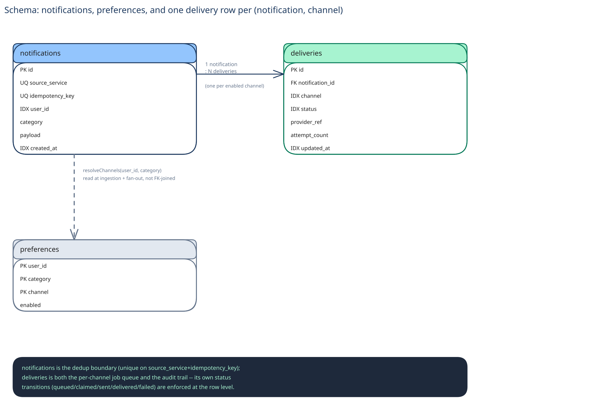

# Module 03 — Database Design & Scaling

## From entities to schema

Three entities fall out of the requirements directly:

- **`notifications`** `(id, source_service, idempotency_key, user_id, category, payload, created_at)` — one row per triggering event, the dedup boundary.
- **`preferences`** `(user_id, category, channel, enabled)`, composite primary key on `(user_id, category, channel)` — small, read constantly, written almost never.
- **`deliveries`** `(id, notification_id, channel, status, provider_ref, attempt_count, created_at, updated_at)` — one row per `(notification, channel)`, the job queue and the audit trail in one table.

## Why `(source_service, idempotency_key)` gets a unique index, non-negotiably

Exactly the same reasoning this guide's [Payments System](../payments-system/03-db-design.md) gives for its own idempotency key: the unique constraint is the actual concurrency-safety mechanism, not a nice-to-have on top of the application's `if existing is not None` check. Two concurrent identical publishes can both pass that check before either inserts — the constraint is what turns "possible in application code" into "impossible at the database."

## Why `deliveries.status` is a constrained enum with enforced transitions

A free-text status column lets any code path write any value, including "sent" written twice for the same row. Modeling the transition as a conditional update (`UPDATE deliveries SET status='claimed' WHERE status='queued'`) means a second worker's claim attempt is a silent no-op — zero rows affected — instead of a duplicate send. This is the database-level enforcement of the same claim discipline Module 02's LLD names explicitly.

## Why preferences is cached, not queried live on every fan-out

Module 00's capacity math is the whole argument: ~100M preference reads/day against a table that's written only when a user flips a toggle, which happens on the order of a few times per user, ever. That read:write ratio is steep enough that this is squarely a [Caching Strategies](../../hld-building-blocks/caching-strategies.md) problem — cache-aside, with a short TTL, is enough to keep the fan-out path fast without querying `preferences` on every single notification.

## Indexes

- `notifications(source_service, idempotency_key)` — **unique**, the concurrency-safety mechanism above; every publish checks it first.
- `notifications(user_id, created_at)` — the in-app read path's access pattern, a user's own notifications in recency order.
- `deliveries(notification_id)` — fan-out and status lookups for one notification's channels.
- `deliveries(status, updated_at)` where `status IN ('queued', 'failed')` (a partial index) — the retry sweep's query is exactly "jobs stuck queued or failed past their retry window"; a partial index over just that subset stays small as the historical table grows into the billions of rows.

## Consistency

- **`notifications`:** strongly consistent at write time — the unique-constraint check has to see a true, current answer, or the dedup guarantee this entire design exists for stops holding.
- **`preferences`:** the cache in front of it is allowed to be a little stale, by design (see Module 01's Trade-offs — the fan-out worker re-checks at send time specifically because ingestion-time preference state can already be out of date).
- **`deliveries`:** strongly consistent for the claim itself (that's what prevents a duplicate send); the `attempt_count`/`updated_at` bookkeeping around it can lag slightly without changing whether a notification actually went out.

## Scaling the schema

- **Sharding, once volume demands it:** by `user_id` on both `notifications` and `deliveries` — keeps one user's full notification history on one shard, matching the in-app read path's actual access pattern (cross-ref [Data Partitioning & Sharding](../../hld-building-blocks/data-partitioning-sharding.md)'s point that the shard key has to match the query that runs constantly, not a desire for even distribution). `preferences` shards the same way for the same reason — a user's own preferences are always looked up together.
- **`deliveries` outgrows `notifications` by roughly the average channel fan-out factor** (Module 00's ~2x), the same "the child table grows faster and may need its own scaling story" pattern this guide's other case studies hit.
- **Read replicas vs. sharding:** replicas solve the in-app read path's throughput; sharding solves total write volume and data size as the user base grows. Reaching for one when the other is the actual bottleneck is the mistake to avoid — the same distinction every DB design module in this guide draws.

## Connecting it back

Trace it top to bottom: Module 00's "never send the same event twice on the same channel" is why `(source_service, idempotency_key)` is a unique index here, not an application-level check; Module 01's decision to re-check preferences at fan-out time, not ingestion time, is why `deliveries` exists as its own claimable job table instead of preferences being read once and cached inline with the notification; and the enforced `status` transitions are what make Module 02's claim-based concurrency actually safe to run on many worker instances at once. Nothing here is arbitrary — every constraint traces back to a decision made in an earlier module.
